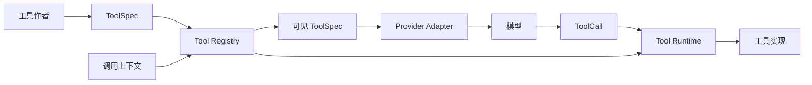
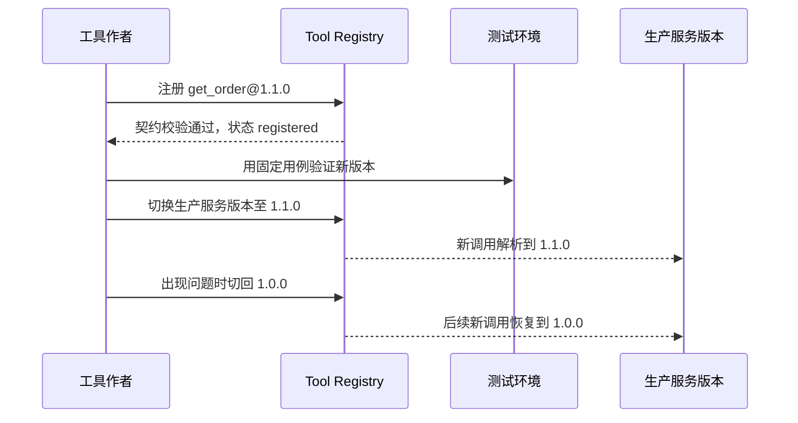

# 第 3 课：实现 Tool Registry

> 章节导航：[第二章：Function Calling、Tool Runtime 与 MCP](./index.md)  
> 上一课：[第 2 课：定义统一 Tool Schema](./lesson-02-unified-tool-schema.md)<br>
> 下一课：[第 4 课：建立 Tool Runtime 执行链](./lesson-04-tool-runtime-execution.md)

## 一、你将完成什么

第 2 课已经为每个工具定义了完整的 `ToolSpec`。但如果代码仍然这样组织：

```python
if call.name == "get_order":
    ...
elif call.name == "cancel_order":
    ...
```

系统就无法稳定回答几个基本问题：当前到底有哪些工具可用？`get_order` 应解析到哪个版本？某个工具发生事故时如何立即停止暴露？不同租户、环境和权限的用户看到的候选工具是否相同？

这一课实现 Tool Registry。它是 Tool Runtime 的**控制面**，管理工具的注册、版本、发布状态和可见性；第 4 课的 Runtime 则是**数据面**，负责对一次具体调用校验、鉴权、执行和标准化结果。

完成后，你会得到：

1. 基于 `name@version` 的不可覆盖注册；
2. 显式的服务版本切换、禁用与退役能力；
3. 根据环境、租户和声明权限过滤模型可见工具；
4. 将内部完整 `ToolSpec` 投影为 Provider 所需的工具定义；
5. 不依赖真实模型或工具实现的 Registry 合同测试。

本课只做粗粒度的能力发现。它不判断某位用户是否能读取某个具体订单，不执行工具，也不把“模型没看到工具”当作唯一安全边界。

## 二、Registry 在架构中的位置

Tool Registry 不是函数列表，也不是模型 API 的 `tools` 字段缓存。它保存的是“哪份工具契约在什么条件下可被新调用解析”的受控事实。



这张图包含两个很容易混淆的方向：

- **发现方向**：Registry 根据调用上下文筛选工具，再经 Provider Adapter 交给模型；
- **执行方向**：模型只提出工具名和参数，Runtime 重新解析工具，并在执行前重复做必要的安全检查。

模型看到 `cancel_order`，不等于它已被授权执行。反过来，模型看不到工具也不保证工具无法被伪造调用。因此，发现过滤是减少错误选择、降低 Prompt 成本和避免无关能力暴露；Runtime 的校验与授权仍是最终执行边界。

### 2.1 控制面与数据面的职责

| 组件 | 负责 | 不负责 |
| --- | --- | --- |
| `ToolSpec` | 工具契约：输入、输出、风险、错误、策略 | 工具是否正在服务 |
| Tool Registry | 注册、版本、发布状态、候选工具过滤 | 真实业务执行、资源级权限判断 |
| Provider Adapter | 将候选工具映射为厂商请求格式 | 决定工具是否可用 |
| Tool Runtime | 解析调用、参数校验、身份透传、授权、执行、结果标准化 | 维护工具目录 |
| 审批与审计 | 确认决策、可追踪记录 | 决定模型候选集 |

把 Registry 直接做成“收到调用就执行”的大对象，会导致发布状态、Provider 协议、授权和业务实现缠在一起。保持控制面和数据面分离，才能独立地禁用工具、回滚版本和验证调用链。

## 三、确定 Registry 的数据模型

一个工具在 Registry 中至少有四层身份：

```text
能力名          get_order
契约版本        1.0.0
注册记录        get_order@1.0.0
服务版本        当前新调用默认解析到的版本
```

同一个名称可以保留多个已注册版本，但对于模型可见的一个名称，在任一环境中只能有一个服务版本。否则模型只会返回 `get_order`，Runtime 却无法知道应该执行 `1.0.0` 还是 `2.0.0`。

### 3.1 注册状态与服务状态

课程使用以下状态：

| 状态 | 可以按精确版本查询 | 可成为服务版本 | 出现在模型候选集 | 适用场景 |
| --- | --- | --- | --- | --- |
| `registered` | 是 | 是 | 否 | 新版本已校验，尚未发布 |
| `serving` | 是 | 是 | 是 | 当前对新调用生效 |
| `disabled` | 是 | 否 | 否 | 事故熔断、临时下线 |
| `retired` | 是，仅审计或回放 | 否 | 否 | 永久停止新调用 |

`serving` 是由 Registry 的服务版本指针派生出的状态，不应让两个版本同时处于 `serving`。`disabled` 不是删除记录：保留工具定义和状态变化，才能解释某次调用为什么失败、何时被恢复。

### 3.2 调用上下文只包含粗粒度条件

为发现阶段定义最小上下文：

```python
from dataclasses import dataclass


@dataclass(frozen=True)
class ToolDiscoveryContext:
    actor_id: str
    tenant_id: str
    environment: str
    permissions: frozenset[str]
```

`environment` 用于隔离开发、预发、生产工具；`tenant_id` 用于控制某个集成是否对租户开放；`permissions` 用于排除明显不可能执行的能力。不要把数据库连接、访问令牌、订单 ID 或整个 HTTP Request 放进 Registry 上下文。

订单是否属于当前用户、路径是否位于工作区、单次金额是否在额度内，都依赖具体参数和业务状态，必须留给 Runtime 的执行前授权。第 7–8 课会实现这条边界。

## 四、实现内存版 Tool Registry

先实现进程内 Registry，验证行为和接口。生产系统可以把注册记录存入数据库、配置中心或声明式部署清单，但不应因为后端介质不同改变本课的契约。

在 `apps/api/app/tools/registry.py` 中创建以下实现。它使用 `(name, version)` 作为不可变主键，并使用独立的服务版本指针控制新调用解析结果。

```python
from __future__ import annotations

from dataclasses import dataclass, replace
from enum import StrEnum
from threading import RLock

from app.tools.contracts import ToolSpec
from app.tools.validation import ToolContractError, check_tool_spec


class ToolStatus(StrEnum):
    REGISTERED = "registered"
    DISABLED = "disabled"
    RETIRED = "retired"


class ToolRegistryError(Exception):
    pass


class ToolAlreadyRegistered(ToolRegistryError):
    pass


class ToolNotAvailable(ToolRegistryError):
    """对调用方隐藏不存在、禁用和不可见的具体区别。"""


@dataclass(frozen=True)
class ToolDiscoveryContext:
    actor_id: str
    tenant_id: str
    environment: str
    permissions: frozenset[str]


@dataclass(frozen=True)
class ToolAvailability:
    environments: frozenset[str]
    tenant_ids: frozenset[str] | None = None

    def allows(self, context: ToolDiscoveryContext) -> bool:
        if context.environment not in self.environments:
            return False
        return self.tenant_ids is None or context.tenant_id in self.tenant_ids


@dataclass(frozen=True)
class ToolRegistration:
    spec: ToolSpec
    availability: ToolAvailability
    status: ToolStatus = ToolStatus.REGISTERED

    @property
    def key(self) -> tuple[str, str]:
        return self.spec.name, self.spec.version


class ToolRegistry:
    def __init__(self) -> None:
        self._registrations: dict[tuple[str, str], ToolRegistration] = {}
        self._serving_versions: dict[str, str] = {}
        self._lock = RLock()

    def register(self, registration: ToolRegistration) -> None:
        try:
            check_tool_spec(registration.spec)
        except ToolContractError as error:
            raise ToolRegistryError(error.code) from error

        if not registration.availability.environments:
            raise ToolRegistryError("tool_requires_at_least_one_environment")

        with self._lock:
            if registration.key in self._registrations:
                raise ToolAlreadyRegistered(
                    f"tool already registered: {registration.spec.name}@{registration.spec.version}"
                )
            self._registrations[registration.key] = registration

    def set_serving_version(self, *, name: str, version: str) -> None:
        key = (name, version)
        with self._lock:
            registration = self._registrations.get(key)
            if registration is None:
                raise ToolNotAvailable("tool version is not registered")
            if registration.status is not ToolStatus.REGISTERED:
                raise ToolRegistryError("only registered tools can serve new calls")
            self._serving_versions[name] = version

    def disable(self, *, name: str, version: str) -> None:
        key = (name, version)
        with self._lock:
            registration = self._require_registration(key)
            self._registrations[key] = replace(
                registration,
                status=ToolStatus.DISABLED,
            )
            if self._serving_versions.get(name) == version:
                del self._serving_versions[name]

    def enable(self, *, name: str, version: str) -> None:
        key = (name, version)
        with self._lock:
            registration = self._require_registration(key)
            if registration.status is ToolStatus.RETIRED:
                raise ToolRegistryError("retired tools cannot be enabled")
            if registration.status is not ToolStatus.DISABLED:
                raise ToolRegistryError("only disabled tools can be enabled")
            self._registrations[key] = replace(
                registration,
                status=ToolStatus.REGISTERED,
            )

    def retire(self, *, name: str, version: str) -> None:
        key = (name, version)
        with self._lock:
            if self._serving_versions.get(name) == version:
                raise ToolRegistryError("stop serving a tool before retiring it")
            registration = self._require_registration(key)
            self._registrations[key] = replace(
                registration,
                status=ToolStatus.RETIRED,
            )

    def discover(self, context: ToolDiscoveryContext) -> tuple[ToolSpec, ...]:
        with self._lock:
            result = []
            for name, version in self._serving_versions.items():
                registration = self._registrations[(name, version)]
                if self._is_visible(registration, context):
                    result.append(registration.spec)
            return tuple(sorted(result, key=lambda spec: spec.name))

    def resolve_for_call(
        self,
        *,
        name: str,
        context: ToolDiscoveryContext,
    ) -> ToolSpec:
        with self._lock:
            version = self._serving_versions.get(name)
            if version is None:
                raise ToolNotAvailable("tool is not available")
            registration = self._registrations[(name, version)]
            if not self._is_visible(registration, context):
                raise ToolNotAvailable("tool is not available")
            return registration.spec

    def get_exact(self, *, name: str, version: str) -> ToolRegistration:
        """仅用于管理、审计与回放；不能作为新调用的解析入口。"""
        with self._lock:
            return self._require_registration((name, version))

    def _require_registration(self, key: tuple[str, str]) -> ToolRegistration:
        registration = self._registrations.get(key)
        if registration is None:
            raise ToolNotAvailable("tool version is not registered")
        return registration

    @staticmethod
    def _is_visible(
        registration: ToolRegistration,
        context: ToolDiscoveryContext,
    ) -> bool:
        return (
            registration.status is ToolStatus.REGISTERED
            and registration.availability.allows(context)
            and set(registration.spec.security.required_permissions)
            <= context.permissions
        )
```

### 4.1 为什么注册后不自动发布

`register()` 只证明契约可被解析和校验，不代表它已经准备好承接真实调用。将注册与 `set_serving_version()` 分开，才能完成这些操作：

1. 先注册并审查 `get_order@1.1.0`；
2. 在测试环境或指定租户完成验证；
3. 原子地把新调用从 `1.0.0` 切换到 `1.1.0`；
4. 发现问题时将服务版本切回 `1.0.0`，而不是修改已发布契约。

同样地，`disable()` 会移除服务版本指针，阻止后续解析，但不会删除历史注册记录。`enable()` 只恢复为 `registered`，不会自动重启服务；管理者必须再次显式设置服务版本。正在运行的调用如何取消、超时和回收，属于第 14、15 课的执行语义，不应由 Registry 偷偷终止。

### 4.2 为什么不允许覆盖已有 `name@version`

如果 `get_order@1.0.0` 可以被悄悄覆盖，历史 Trace 中记录的版本便失去意义：同一版本号在今天和昨天可能返回不同结构。修复契约错误应发布新版本；紧急下线应禁用旧版本；真正的记录更正要有单独且受审计的管理流程。

本地开发若确实需要反复加载定义，应新建 Registry 实例或使用测试夹具，不要加入 `force=True` 绕过生产约束。

## 五、将 Registry 结果投影给模型

第 2 课已经定义了只暴露名称、描述和输入 Schema 的投影函数。调用模型之前，先从 Registry 获取候选工具：

```python
from typing import Any

from app.tools.contracts import ToolSpec
from app.tools.registry import ToolDiscoveryContext, ToolRegistry


def to_model_tool(spec: ToolSpec) -> dict[str, Any]:
    return {
        "type": "function",
        "function": {
            "name": spec.name,
            "description": spec.description,
            "parameters": spec.input_schema,
        },
    }


def model_tools_for(
    registry: ToolRegistry,
    context: ToolDiscoveryContext,
) -> list[dict[str, Any]]:
    return [to_model_tool(spec) for spec in registry.discover(context)]
```

例如，具有 `orders:read` 权限的生产租户用户可看到 `get_order`；没有 `orders:write` 权限的用户看不到 `cancel_order`。`ToolSecurityPolicy`、超时、错误暴露策略、内部版本和租户规则都不应直接放进 Provider 请求。

模型返回 `ToolCall` 后，Runtime 仍必须使用同一个 `ToolDiscoveryContext` 或其可信派生上下文调用 `resolve_for_call()`。不能把模型回传的参数作为 Registry 的上下文，更不能信任它重新声称的用户权限。

### 5.1 空工具列表是有效状态

`discover()` 返回空元组不是错误。它可能意味着：当前任务无需工具、用户权限不足、环境未启用集成，或系统正在熔断全部工具。

Provider Adapter 要能在没有工具定义时正常发起纯文本请求；业务层也要区分“模型可直接回答”和“任务必须依赖外部能力却无可用工具”。后者应在产品层给出明确提示，不能强制模型从空列表里编造调用。

### 5.2 工具发现与直接调用必须使用相同规则

常见漏洞是：模型调用路径经过 `discover()`，但调试 CLI、HTTP 管理接口或 MCP 回调绕过它，直接按名称拿 Python 函数执行。正确做法是让所有新调用都经过 `resolve_for_call()`，并在第 4 课的执行入口统一处理。

历史回放是例外：它需要按已记录的精确版本使用 `get_exact()` 查询当时的定义，但回放是否可以再次产生副作用，仍需单独授权，不能因为能读取历史契约就自动执行。

## 六、设计版本发布与回滚流程

以 `get_order@1.1.0` 为例，标准发布流程如下：



本课内存实现没有持久化事务、灰度权重或多实例广播。它的关键是先固定正确的状态迁移：未注册不能发布，禁用版本不能发布，服务中的版本必须先停止服务才能退役，切换不会改写已有版本。第七章会将发布、配置变更与审计接入生产治理。

### 6.1 环境与租户的发布策略

示例中的 `ToolAvailability` 是注册记录的一部分：

```python
production_orders = ToolAvailability(
    environments=frozenset({"staging", "production"}),
    tenant_ids=None,
)

pilot_integration = ToolAvailability(
    environments=frozenset({"staging", "production"}),
    tenant_ids=frozenset({"tenant-pilot"}),
)
```

这能支持新工具先对试点租户可见，但不应把它误用为高风险操作的授权白名单。租户有资格看到某项能力，不表示某个用户可对任意资源执行该能力。

当需要按租户发布不同服务版本时，服务版本指针应从 `dict[name, version]` 扩展为 `dict[(environment, tenant_scope, name), version]`，并规定优先级，例如“精确租户 > 环境默认 > 全局默认”。不要在没有优先级规则时加入多个重叠的 `if tenant_id in ...`。

## 七、测试 Registry 的稳定契约

创建 `tests/test_tool_registry.py`。以下示例复用第 2 课的 `GET_ORDER_V1`，并假设 `GET_ORDER_V1_1` 是兼容的新版本：

```python
import pytest

from app.tools.definitions import GET_ORDER_V1, GET_ORDER_V1_1
from app.tools.registry import (
    ToolAlreadyRegistered,
    ToolAvailability,
    ToolDiscoveryContext,
    ToolNotAvailable,
    ToolRegistration,
    ToolRegistry,
)


def context(*permissions: str) -> ToolDiscoveryContext:
    return ToolDiscoveryContext(
        actor_id="user-01",
        tenant_id="tenant-a",
        environment="production",
        permissions=frozenset(permissions),
    )


def registration(spec):
    return ToolRegistration(
        spec=spec,
        availability=ToolAvailability(
            environments=frozenset({"production"}),
        ),
    )


def test_registry_rejects_duplicate_name_and_version() -> None:
    registry = ToolRegistry()
    registry.register(registration(GET_ORDER_V1))

    with pytest.raises(ToolAlreadyRegistered):
        registry.register(registration(GET_ORDER_V1))


def test_only_explicitly_serving_version_resolves() -> None:
    registry = ToolRegistry()
    registry.register(registration(GET_ORDER_V1))
    registry.register(registration(GET_ORDER_V1_1))
    registry.set_serving_version(name="get_order", version="1.0.0")

    resolved = registry.resolve_for_call(
        name="get_order",
        context=context("orders:read"),
    )

    assert resolved.version == "1.0.0"


def test_version_switch_only_affects_new_resolution() -> None:
    registry = ToolRegistry()
    registry.register(registration(GET_ORDER_V1))
    registry.register(registration(GET_ORDER_V1_1))
    registry.set_serving_version(name="get_order", version="1.0.0")
    first = registry.resolve_for_call(
        name="get_order", context=context("orders:read")
    )
    registry.set_serving_version(name="get_order", version="1.1.0")
    second = registry.resolve_for_call(
        name="get_order", context=context("orders:read")
    )

    assert first.version == "1.0.0"
    assert second.version == "1.1.0"


def test_missing_permission_hides_tool_from_discovery_and_resolution() -> None:
    registry = ToolRegistry()
    registry.register(registration(GET_ORDER_V1))
    registry.set_serving_version(name="get_order", version="1.0.0")

    assert registry.discover(context()) == ()
    with pytest.raises(ToolNotAvailable):
        registry.resolve_for_call(name="get_order", context=context())


def test_disable_removes_a_tool_from_new_calls() -> None:
    registry = ToolRegistry()
    registry.register(registration(GET_ORDER_V1))
    registry.set_serving_version(name="get_order", version="1.0.0")
    registry.disable(name="get_order", version="1.0.0")

    assert registry.discover(context("orders:read")) == ()
    with pytest.raises(ToolNotAvailable):
        registry.resolve_for_call(
            name="get_order",
            context=context("orders:read"),
        )


def test_enable_requires_an_explicit_republish() -> None:
    registry = ToolRegistry()
    registry.register(registration(GET_ORDER_V1))
    registry.set_serving_version(name="get_order", version="1.0.0")
    registry.disable(name="get_order", version="1.0.0")
    registry.enable(name="get_order", version="1.0.0")

    assert registry.discover(context("orders:read")) == ()
    registry.set_serving_version(name="get_order", version="1.0.0")
    assert registry.discover(context("orders:read"))[0].version == "1.0.0"
```

再加两条负向测试：注册无效 JSON Schema 必须失败；使用仅限 `tenant-pilot` 的工具时，其他租户的 `discover()` 不能返回该工具。不要只断言工具数量，应该断言工具名称与版本，以便发现错误版本被错误发布。

### 7.1 还需要人工检查的行为

| 场景 | 预期结果 |
| --- | --- |
| 工具注册但未设置服务版本 | 管理查询可见，模型候选集不可见 |
| 正在服务的版本被禁用 | 后续新调用无法解析，历史记录仍可精确查询 |
| 退役版本被设为服务版本 | 明确失败，不可隐式复活 |
| 缺少 `orders:write` | `cancel_order` 不进入候选集 |
| Provider 接收工具定义 | 不含权限、租户、超时、内部错误或版本字段 |
| 伪造不存在工具名 | 返回统一的不可用错误，不枚举内部状态 |

并发测试可用多线程反复执行 `discover()` 与 `set_serving_version()`，断言每次解析得到完整的旧版本或完整的新版本，绝不能得到半更新的注册记录。这里使用 `RLock` 是为了说明原子更新边界；多进程部署需要由共享存储和配置发布机制保证同样的原子性。

## 八、不要在 Registry 中提前实现的内容

为了保持边界清晰，以下能力即使看起来和 Registry 相邻，也留给后续课次：

| 能力 | 正确归属 | 原因 |
| --- | --- | --- |
| 调用参数 JSON Schema 校验 | 第 4 课 Runtime | 只有拿到实际 `ToolCall` 才能验证 |
| 订单、文件、数据库的资源级权限 | 第 7–8 课授权层 | 依赖身份、参数与业务状态 |
| 用户确认、拒绝、超时 | 第 9–10 课审批系统 | 需要独立状态和审计证据 |
| 超时、并发、重试、幂等 | 第 5–6 课执行策略 | 需要调度与取消语义 |
| MCP Server 工具同步 | 第 11–13 课 MCP 接入 | 需要连接生命周期和来源可信度 |
| 成本、成功率、灰度统计 | 第 14 课与第六章 | 需要 Trace 和评测数据 |

如果现在把这些逻辑塞入 `discover()`，最终会得到一个难以测试、无法替换、在任何状态变化时都可能产生副作用的全能对象。

## 九、常见错误

### 9.1 每次请求都把所有工具发送给模型

这会增加 Prompt 成本，也会使名称相近的工具相互干扰。先按环境、租户和权限筛选，再投影给模型；高风险工具还应在第 9–10 课走确认流程。

### 9.2 按名称直接选“最高版本”

语义版本的数字大小不等于已经发布。一个已注册但尚未验证的 `2.0.0` 不应因为版本最高就接管生产流量。必须使用显式服务版本指针。

### 9.3 版本升级时覆盖旧记录

覆盖会破坏回放与审计，也会使正在运行的调用突然使用新契约。注册新版本、切换服务指针、保留旧记录才是可回滚的流程。

### 9.4 将 Registry 可见性当作最终授权

一个用户拥有 `orders:read` 只是说明查询订单有可能合理，不证明他可以读取任意订单。Runtime 必须在实际参数和可信身份存在时完成资源级授权。

### 9.5 直接把内部 `ToolSpec` 序列化给模型

这会泄露权限名、租户规则、错误策略和内部版本，也让 Provider 格式渗入 Registry。始终使用专门的模型投影函数。

### 9.6 禁用工具时删除所有元数据

删除会失去“何时、谁、为何下线了什么”的解释能力。先保留禁用状态和审计记录；数据保留期限由第七章治理策略决定。

## 十、课堂练习

为以下工具设计注册记录、可见性条件和发布方案：

1. `search_code`：开发、预发、生产都可用，要求 `code:read`；
2. `execute_sql`：只允许预发，且仅限数据分析试点租户；
3. `send_release_notification`：只允许生产，要求 `release:notify`，会向外部渠道发送消息。

然后回答：

- `execute_sql` 的 Schema 已通过校验，为什么生产用户仍不应该在候选集中看到它？
- 将 `search_code@1.0.0` 的输出新增一个可选 `language` 字段，注册与发布步骤分别是什么？
- 一个正在服务的工具发现严重漏洞，为什么优先 `disable()` 而不是修改代码后保持同一版本继续服务？
- 如何让试点租户先使用 `search_code@1.1.0`、其他租户继续使用 `1.0.0`？需要给服务版本指针增加什么维度和优先级？

建议答案方向：环境与租户过滤要在模型调用前生效；新契约以新版本注册，通过验证后才切换服务版本；禁用提供即时、可审计的熔断；按租户发布需要引入带优先级的作用域版本指针，而不是让版本选择散落在业务分支中。

## 十一、完成标准

完成本课后，你应该能够做到：

- 解释 Registry 控制面与 Runtime 执行数据面的职责边界；
- 使用 `name@version` 注册不可覆盖的工具契约；
- 区分注册、服务、禁用和退役状态；
- 通过显式服务版本指针完成发布与回滚；
- 根据环境、租户和声明权限过滤模型候选工具；
- 只向模型暴露名称、描述与输入 Schema；
- 让所有新调用使用相同的 Registry 解析规则；
- 编写 Registry 的版本、禁用、可见性与投影测试。

## 十二、本课小结

Tool Registry 让工具从一组散落的函数变成可发布、可回滚、可过滤的能力目录。它保存完整 `ToolSpec` 与精确版本，并通过服务版本指针决定新调用的稳定解析结果；Provider 只拿到经过上下文过滤后的最小模型投影。

下一课会让 Tool Runtime 接管一次具体 `ToolCall`：从 Registry 解析契约，执行输入校验、身份透传和授权检查，调用工具实现，并用 `ToolSpec` 校验后标准化返回 `ToolResult`。
