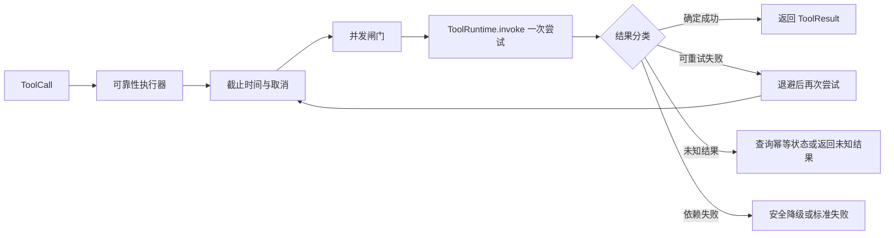

# 第 5 课：实现超时、取消与有限重试

> 章节导航：[第二章：Function Calling、Tool Runtime 与 MCP](./index.md)  
> 上一课：[第 4 课：建立 Tool Runtime 执行链](./lesson-04-tool-runtime-execution.md)<br>
> 下一课：[第 6 课：实现幂等、并发控制与故障隔离](./lesson-06-tool-idempotency-concurrency.md)

## 一、你将完成什么

本课先解决一次工具调用在时间维度上的可靠性问题：

1. 从 `ToolSpec` 与请求预算计算实际执行期限。
2. 区分停止等待、取消传播和底层操作真正终止。
3. 用稳定错误分类判断调用是否允许重试。
4. 实现有次数、总时长和退避上限的有限重试。

完成本课后，你应能说明本课能力在 Tool Runtime 中的位置，并用测试或可查询证据证明它确实生效。

## 二、可靠性首先是语义问题

“失败后再试一次”是最容易写出的可靠性代码，也是最容易造成重复扣款、重复发货和重复创建工单的代码。先定义失败语义，再决定调度策略。

### 2.1 四种需要区分的结果

| 结果 | 含义 | 是否适合自动重试 |
| --- | --- | ---: |
| 确定成功 | 下游确认操作已完成 | 否，直接返回结果 |
| 确定失败 | 下游确认没有完成，且错误可分类 | 仅在错误契约允许时 |
| 未知结果 | 请求可能已被下游接受，但响应丢失或超时 | 只有有幂等保护时才可重试 |
| 本地未执行 | 调用在进入业务实现前被拦截 | 不应重试同一调用 |

网络超时通常只能证明“本次等待超过了本地预算”，不能证明“下游没有执行”。因此，`timeout` 不能直接被翻译为 `safe_to_retry=true`。

### 2.2 正确性、可用性和恢复性

- **正确性**：不执行越权操作，不把错误包装成成功，不违反工具契约；
- **可用性**：依赖短暂抖动时，有限重试或降级仍能给调用方有用结果；
- **恢复性**：超时、取消、进程重启后，资源和幂等状态仍可被清理或继续查询。

可靠性设计不能牺牲正确性来换取一个更高的“成功率”指标。工具调用的成功率应按业务语义统计，不能把 fallback、缓存旧数据和“已接收但未知结果”都算成成功。

## 三、可靠性执行链的位置

第 4 课的执行顺序仍然是每次尝试的内部边界。本课增加的是外层调度：



应当保持以下边界：

| 层 | 负责 | 不负责 |
| --- | --- | --- |
| `ToolRuntime` | 一次调用的解析、输入/输出校验、鉴权和错误标准化 | 等待、重试和并发排队 |
| 可靠性执行器 | 截止时间、取消、尝试次数、退避、幂等和限流 | 改写业务参数或绕过 Runtime |
| 工具实现 | 业务动作与领域错误 | 自己启动无限重试线程 |
| 依赖适配器 | 将 HTTP/SDK 错误分类为稳定故障类型 | 决定是否重复整个工具调用 |

每次重试都必须重新进入同一条 `ToolRuntime` 边界。不能第一次调用走 Runtime，第二次为了“快速重试”直接调用 handler；否则第二次会绕过版本解析、权限和输出校验。

## 四、从 ToolSpec 读取执行预算

第 2 课已经在 `ToolExecutionPolicy` 中声明了：

```python
class ToolExecutionPolicy(BaseModel):
    timeout_ms: int
    max_attempts: int = 1
    retry_mode: RetryMode = RetryMode.NEVER
    idempotency_key_required: bool = False
```

这些字段是工具作者给出的**上限和意图**，不是执行器可以无条件接受的承诺。运行时还要应用平台级上限：

```python
effective_timeout_ms = min(
    spec.execution.timeout_ms,
    runtime_limits.max_tool_timeout_ms,
    request_deadline.remaining_ms(),
)
effective_attempts = min(
    spec.execution.max_attempts,
    runtime_limits.max_attempts,
)
```

例如工具声明 60 秒，但用户请求只剩 2 秒，执行器最多只能使用剩余的 2 秒；工具声明最多 3 次尝试，但平台为写操作全局限制为 2 次，也只能尝试 2 次。

不要把“每次尝试超时”与“整次调用预算”混为一谈：

```text
整次调用截止时间 = 入口截止时间
每次尝试预算 = min(工具超时、剩余整次调用时间)
退避时间 = 也必须从整次调用预算中扣除
```

没有总截止时间的重试，会让一次用户请求在多次退避后远超上游 HTTP 请求的生命周期。

## 五、超时：停止等待不等于停止执行

### 5.1 使用绝对截止时间

不要在每一层都重新计算“再等 3 秒”。入口处创建一个单调时钟上的绝对截止时间，向下游透传：

```python
from dataclasses import dataclass
import time


@dataclass(frozen=True)
class Deadline:
    at_monotonic: float

    @classmethod
    def after_ms(cls, timeout_ms: int) -> "Deadline":
        return cls(time.monotonic() + timeout_ms / 1000)

    def remaining_ms(self) -> int:
        return max(0, int((self.at_monotonic - time.monotonic()) * 1000))

    def expired(self) -> bool:
        return self.remaining_ms() <= 0
```

墙上时钟可能因为校时回拨或跳跃，不能用它计算耗时和超时。`time.monotonic()` 只用于本地时间预算；日志中的开始时间仍可以使用 UTC 时间戳。

### 5.2 异步调用要真正传播取消

对异步依赖，超时应取消当前任务并等待其清理：

```python
import asyncio
from collections.abc import Awaitable, Callable


async def await_with_deadline(
    operation: Callable[[], Awaitable[object]],
    deadline: Deadline,
) -> object:
    remaining = deadline.remaining_ms()
    if remaining <= 0:
        raise ToolTimeout("tool deadline exceeded before attempt")

    try:
        async with asyncio.timeout(remaining / 1000):
            return await operation()
    except TimeoutError as error:
        raise ToolTimeout("tool attempt timed out") from error
```

工具实现和依赖客户端应该在 `CancelledError` 上执行必要的连接释放、临时文件删除和事务回滚，然后继续抛出取消异常。不要在 `except Exception` 中吞掉取消信号；在某些 Python 版本中取消异常不属于普通业务错误，而吞掉它会让任务看似成功地继续运行。

### 5.3 同步调用不能凭线程强制停止

`asyncio.to_thread()` 或线程池超时只能让等待方停止等待，不能安全杀掉已经在运行的任意同步函数。线程可能仍然持有连接、写入文件或修改外部状态。

因此有三种选择：

1. 优先使用支持超时参数和取消的异步 HTTP、数据库或 SDK 客户端；
2. 把不可控的同步依赖放进可终止的独立进程，并为进程设置资源限制；
3. 如果只能停止等待，要把结果分类为“未知结果”，写操作不得因为本地超时自动重试。

超时处理完成后必须释放并发信号量、连接和临时资源。使用 `async with` 或 `try/finally`，不要把清理依赖在“正常返回”分支里。

## 六、取消：用户已经不需要的工作应尽快停止

超时是系统发出的取消，用户点“停止”、客户端断开连接、任务被上游取消也都是取消。为执行器提供一个明确的取消令牌：

```python
import asyncio
from dataclasses import dataclass


@dataclass(frozen=True)
class Cancellation:
    event: asyncio.Event

    def raise_if_cancelled(self) -> None:
        if self.event.is_set():
            raise ToolCancelled("tool call was cancelled")
```

检查点至少应位于：排队前、每次尝试前、退避等待前、依赖调用返回后和结果提交前。取消不是可重试错误：用户明确停止了动作，执行器不能在后台偷偷开始下一次尝试。

取消返回的稳定错误可以是 `tool_cancelled`，但要区分两种情况：

- 工具尚未进入业务实现：可以明确说明未执行；
- 工具已经把写请求发送给下游：只能说明本地已取消等待，结果可能未知。

后者应在内部 Trace 标记 `outcome=unknown`，并通过幂等查询或人工流程确认最终状态。不要对模型说“已取消”来暗示外部状态一定没有变化。

## 七、错误分类：先判断能不能重试

可靠性执行器不应该根据异常类名猜测策略。依赖适配器应将错误映射为有限的内部分类：

```python
from enum import StrEnum


class FailureKind(StrEnum):
    INVALID_ARGUMENT = "invalid_argument"
    PERMISSION_DENIED = "permission_denied"
    CONFIRMATION_REQUIRED = "confirmation_required"
    NOT_FOUND = "not_found"
    RATE_LIMITED = "rate_limited"
    TRANSIENT = "transient"
    TIMEOUT = "timeout"
    UNKNOWN_OUTCOME = "unknown_outcome"
    PERMANENT = "permanent"
    CANCELLED = "cancelled"
```

一个简单的策略表如下：

| FailureKind | 典型原因 | 默认重试 |
| --- | --- | ---: |
| `invalid_argument` | Schema 或业务参数错误 | 否 |
| `permission_denied` | 缺少权限或资源授权失败 | 否 |
| `confirmation_required` | 没有有效审批 | 否 |
| `not_found` | 资源不存在 | 否 |
| `rate_limited` | 下游返回 429 | 仅按 `Retry-After` 且仍在预算内 |
| `transient` | 连接重置、503、临时 DNS 失败 | 仅在策略允许时 |
| `timeout` | 本次等待超过预算 | 读操作可谨慎重试；写操作先判断幂等 |
| `unknown_outcome` | 响应丢失、取消发生在提交后 | 仅通过幂等状态查询 |
| `permanent` | 明确不可恢复的业务失败 | 否 |
| `cancelled` | 用户或上游主动取消 | 否 |

第 4 课返回的 `ToolResult.error.retryable` 是一个信号，不是最终授权。执行器还要检查工具的 `retry_mode`、幂等键、剩余时间和当前尝试次数。

## 八、有限重试与退避

### 8.1 重试的必要条件

一次重试必须同时满足：

1. 失败类别属于瞬时故障或明确的限流故障；
2. ToolSpec 允许多次尝试；
3. 尚未达到 `max_attempts`；
4. 调用仍在总截止时间内；
5. 对可能产生副作用的调用，幂等保护已经建立；
6. 当前取消令牌没有被触发。

输入错误、权限错误、确认缺失、输出 Schema 错误和确定性的领域错误不应重试。重试不会让错误参数变合法，反而会增加依赖压力。

### 8.2 指数退避加抖动

固定间隔会让大量请求在同一时刻再次冲击故障依赖。常用公式是：

```text
base = min(max_delay, initial_delay * 2 ** (attempt - 1))
delay = random(0, base)       # full jitter
```

还要接受下游的 `Retry-After`，并取不超过总截止时间的值：

```python
import random


def retry_delay_ms(
    *,
    attempt: int,
    initial_ms: int = 100,
    max_ms: int = 2_000,
    retry_after_ms: int | None = None,
) -> int:
    exponential = min(max_ms, initial_ms * (2 ** max(0, attempt - 1)))
    jittered = random.randint(0, exponential)
    if retry_after_ms is None:
        return jittered
    return min(max_ms, max(jittered, retry_after_ms))
```

随机数会让测试不稳定，生产实现应注入 `Sleeper` 和随机源；测试中传入固定随机源或直接断言“等待不超过预算”。不要在退避期间持有数据库事务或业务锁。

### 8.3 重试预算示例

假设总预算 3 秒、每次尝试最多 800 ms、最多 3 次尝试，退避分别为 100 ms 和 200 ms：

```text
尝试 1：0ms - 800ms
退避：800ms - 900ms
尝试 2：900ms - 1700ms
退避：1700ms - 1900ms
尝试 3：1900ms - 2700ms
剩余 300ms：用于整理结果和释放资源
```

如果第二次尝试开始时只剩 500 ms，就不能再使用完整的 800 ms；每次尝试都取“工具上限”和“剩余预算”的较小值。

## 九、完成标准

- 每次调用都有不超过请求总预算的实际 deadline。
- 用户取消可以传播到等待中的任务，并形成明确终态。
- 只有被契约标记为可重试的瞬时错误才会重试。
- 重试次数、退避和总时间都有硬上限，且每次尝试可追踪。

## 十、本课小结

本课把超时、取消和重试收敛为受预算约束的调度语义。下一课继续处理更棘手的副作用问题：幂等、并发隔离、依赖失败与安全降级。
