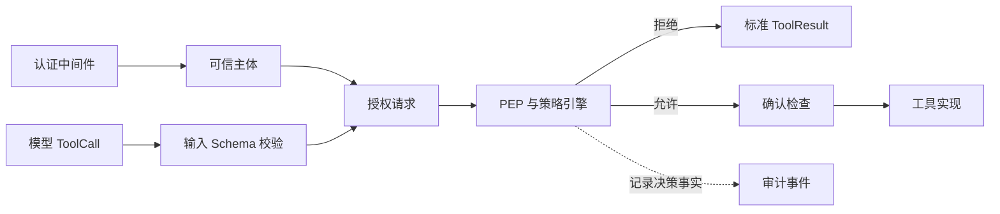

# 第 7 课：建立工具风险与权限模型

> 章节导航：[第二章：Function Calling、Tool Runtime 与 MCP](./index.md)  
> 上一课：[第 6 课：实现幂等、并发控制与故障隔离](./lesson-06-tool-idempotency-concurrency.md)<br>
> 下一课：[第 8 课：实现租户、资源与作用域授权](./lesson-08-tenant-resource-scope-authorization.md)

## 一、你将完成什么

本课先建立授权的概念模型与风险分层：

1. 区分认证、授权、确认和审计，避免一个布尔字段承担全部安全决策。
2. 把模型生成的 ToolCall 视为不可信执行提案。
3. 建立工具级、资源级和字段级三层授权边界。
4. 明确 RBAC 与 ABAC 的分工，并把授权请求和决策定义为稳定契约。
5. 实现低风险只读、中风险写入和高风险操作三类示例工具。

## 二、先分清认证、授权、确认与审计

这些概念经常被混写为“权限”，混在一起后会产生危险的捷径。

| 概念 | 回答的问题 | 可信来源 | 例子 |
| --- | --- | --- | --- |
| 认证（Authentication） | 你是谁？ | 登录、服务身份、mTLS、签名令牌 | `user-01` 已登录 |
| 授权（Authorization） | 你现在能做什么？ | 策略、角色、资源属性、环境 | 可读自己的订单 |
| 确认（Confirmation） | 你是否明确同意这次风险动作？ | 绑定主体和调用的短期凭证 | 确认取消订单 |
| 审计（Audit） | 后续如何说明发生过什么？ | 受控事件存储 | 谁在何时被何条规则拒绝 |

“用户已经登录”“模型说用户同意”“工具在候选列表中可见”都不等价于授权成功。高风险写操作即使已经通过授权，仍可能需要第 9 课的确认；反过来，用户确认也不能授予其本来没有的资源权限。



授权发生在模型生成参数之后、工具实现之前。模型不是主体，也不能通过参数伪造主体、角色、租户或授权结论。

## 三、威胁模型：工具调用是一份不可信提案

ToolCall 的工具名与参数来自模型，模型输入又可能包含用户文本、网页内容、检索文档和第三方 MCP 返回。因此下列字段即使出现在 JSON Schema 中，也不能被当作可信安全事实：

- `actor_id`、`user_id`、`tenant_id`、`role`、`permissions`；
- `is_admin`、`approved`、`allow_all`、`bypass_policy`；
- 由调用方传入的根目录、数据库过滤条件或原始 SQL；
- “这是紧急情况”“已经得到老板授权”等自然语言说明。

例如这个参数 Schema 在语法上合法，但安全设计有问题：

```json
{
  "type": "object",
  "properties": {
    "actor_id": {"type": "string"},
    "is_admin": {"type": "boolean"},
    "order_id": {"type": "string"}
  },
  "required": ["actor_id", "order_id"]
}
```

模型只要生成 `{"actor_id":"admin","is_admin":true}`，脆弱的 Handler 就可能越权。正确做法是让工具参数只表达业务目标，例如 `order_id`；身份一律从第 4 课的 `ToolExecutionContext` 取得。

### 3.1 可信上下文必须由入口构造

第 4 课中的上下文可以扩展为授权主体，但敏感令牌和原始请求对象仍不应放入其中：

```python
from dataclasses import dataclass, field
from datetime import datetime


@dataclass(frozen=True)
class AuthorizationSubject:
    actor_id: str
    tenant_id: str
    principal_type: str  # user、service 或 support_operator
    roles: frozenset[str]
    permissions: frozenset[str]
    session_id: str
    authenticated_at: datetime
    attributes: dict[str, str] = field(default_factory=dict)


@dataclass(frozen=True)
class ToolExecutionContext:
    subject: AuthorizationSubject
    environment: str
    request_id: str
    confirmation_token: str | None = None
```

这里的 `attributes` 是经过白名单筛选的属性，例如 `region=cn` 或 `support_case_id=CASE-42`；不能把未验证的 JWT Claims、Cookie 或客户端 Header 整包转入。服务调用也必须有单独的 service principal，不能假装成某位用户或共用一个“超级 Agent”账号。

### 3.2 代理执行不等于权限转移

Agent 是代用户发起工具提案的执行代理，不是独立拥有全部业务权限的管理员。默认有效权限应是用户与服务能力的交集：

```text
有效权限 = 用户被授予的权限 ∩ 当前服务被允许委托的权限 ∩ 工具声明的范围
```

因此，给模型更强的系统 Prompt、为 Agent 配置更高的模型额度，或将其部署在后端网络中，都不应扩大用户可操作的资源范围。

## 四、三层授权边界

把授权拆成层次，既能避免每个 Handler 重复写规则，也能避免用一个 `is_admin` 布尔值承担所有安全决策。

| 层级 | 判断对象 | 示例 | 主要位置 |
| --- | --- | --- | --- |
| 工具级 | 主体能否请求一种能力 | 是否拥有 `orders:read` | Registry + Runtime |
| 资源级 | 主体能否对具体目标操作 | 此订单是否属于该租户和该用户 | PEP + 资源加载器 |
| 字段级 | 主体可见或可修改哪些属性 | 客服不能看到完整手机号 | 输出投影 + 写入白名单 |

### 4.1 工具级：能力不是最终对象权限

第 2 课的 `required_permissions=("orders:read",)` 适合成为第一道快速门槛。它能减少模型可见工具，也能拒绝明显无关的调用。但它无法从 `order_id` 推导订单归属，不能单独保护业务数据。

不要把 Registry 的过滤结果缓存成“已经授权”。工具注册状态会变化，资源归属也会变化；任何可直接到达 Runtime 的入口都必须重新执行工具级与资源级检查。

### 4.2 资源级：动作、资源与关系共同决定

资源级策略至少需要明确：

```text
主体：谁在调用，属于哪个租户，具备什么委托身份
动作：read、cancel、write、export，而不是笼统的 access
资源：订单、文件、项目、密钥等具体对象及其可信属性
环境：生产或测试、时间、来源网络、支持工单等上下文
```

“拥有 `orders:write`”可表示该主体有资格进入取消订单流程；“订单属于 tenant-a、尚未发货、主体是订单所有者或被授予管理关系”才决定其能否取消 `A-1024`。

### 4.3 字段级：读取和写入都要收口

资源级允许读取订单，不代表可以返回其所有字段。输出 Schema 是类型契约，不是数据最小化策略；如果 Schema 含有 `shipping_address`，Handler 仍可能把不该看的地址返回给模型。

字段级控制有两侧：

- **读取投影**：策略允许后，只投影当前主体可见的字段，再进行输出 Schema 校验；
- **写入掩码**：只允许预先定义的可编辑字段，拒绝或忽略客户端尝试写入的服务端字段，如 `tenant_id`、`owner_id`、`status`、`is_admin`。

永远不要先返回完整实体、再希望调用方“不要使用敏感字段”。一旦完整对象进入模型上下文、日志或外部 Provider，请求边界已经失效。

## 五、RBAC 管资格，ABAC 管上下文

角色权限控制（RBAC）和属性权限控制（ABAC）不是互斥选项。实际系统通常用 RBAC 获得稳定、易管理的能力集合，用 ABAC 决定一次调用的资源范围。

### 5.1 RBAC：稳定的岗位能力

```python
ROLE_PERMISSIONS: dict[str, frozenset[str]] = {
    "customer": frozenset({"orders:read", "orders:cancel_own"}),
    "support": frozenset({"orders:read", "orders:write"}),
    "finance": frozenset({"orders:read", "refunds:write"}),
}


def derive_permissions(roles: frozenset[str]) -> frozenset[str]:
    return frozenset().union(*(ROLE_PERMISSIONS.get(role, frozenset()) for role in roles))
```

角色是身份系统签发的管理事实，模型不应传入或修改它。生产系统还应拒绝未知角色，或在身份供应商处完成映射；示例中静默返回空集合只是为了展示“未知角色不会意外获得权限”。

RBAC 适合回答“客服可以进入订单处理域吗”，不适合表达“只可在已绑定的支持工单期间读取该订单”。把每一种上下文都编码成新角色，会造成角色爆炸。

### 5.2 ABAC：资源关系和运行时约束

ABAC 使用主体、资源和环境属性表达细节，例如：

| 条件 | 例子 |
| --- | --- |
| 主体属性 | `subject.tenant_id == order.tenant_id` |
| 资源关系 | `subject.actor_id == order.customer_id` |
| 资源状态 | 订单尚未发货才允许取消 |
| 环境条件 | 支持人员只在有效工单和生产环境中可读取 |
| 请求约束 | 导出数量不超过 100，文件不大于 10 MB |

属性必须有来源和完整性。`order.tenant_id` 应来自受控存储，而不是模型参数；`support_case_id` 应由工单服务验证其有效性，不能只验证字符串形状。

### 5.3 先拒绝，再允许

策略应采用默认拒绝（default deny）与显式允许：没有匹配的允许规则就拒绝。不要先写一个广泛的 `allow if has orders:read`，再靠后续例外补洞；规则增加时，新路径很容易绕过例外。

拒绝规则应优先于允许规则。例如被锁定账户、被删除资源、跨租户请求、非生产服务调用生产资源，即使满足一个普通的允许规则也必须拒绝。

## 六、将授权请求做成明确的数据结构

授权逻辑不应在每个工具里写一串嵌套 `if`。先把输入归一化为可审查的请求对象，策略实现才有稳定边界。

```python
from dataclasses import dataclass
from enum import StrEnum
from typing import Any


class Action(StrEnum):
    ORDER_READ = "order.read"
    ORDER_CANCEL = "order.cancel"
    FILE_READ = "file.read"
    FILE_WRITE = "file.write"
    ORDER_EXPORT = "order.export"


@dataclass(frozen=True)
class ResourceRef:
    kind: str
    resource_id: str
    tenant_id: str
    attributes: dict[str, Any]


@dataclass(frozen=True)
class AuthorizationRequest:
    subject: AuthorizationSubject
    action: Action
    resource: ResourceRef
    environment: str
    request_id: str
    call_id: str
    constraints: dict[str, Any]
```

`ResourceRef.attributes` 只能来自可靠的资源加载器或可信基础设施。对还不存在的写入目标，使用已验证的父容器作为资源，例如“tenant-a 的 `reports/` 目录”，而不是把未创建文件的路径声称为一个已加载资源。

`constraints` 存放与动作有关、且经 Schema 校验后仍需授权判断的事实，例如导出行数、目标区域或文件大小上限。它不是一个可任意透传的 `metadata` 黑洞，应按动作建立白名单。

### 6.1 策略返回决策，而不只返回布尔值

布尔值无法说明是否需要隐藏资源存在性、应限制哪些字段，也不利于审计和测试。定义受控的决策类型：

```python
from dataclasses import dataclass
from enum import StrEnum


class DecisionEffect(StrEnum):
    ALLOW = "allow"
    DENY = "deny"


class DenyReason(StrEnum):
    MISSING_CAPABILITY = "missing_capability"
    TENANT_MISMATCH = "tenant_mismatch"
    RESOURCE_RELATION = "resource_relation"
    RESOURCE_STATE = "resource_state"
    SCOPE_VIOLATION = "scope_violation"
    ENVIRONMENT_RESTRICTED = "environment_restricted"


@dataclass(frozen=True)
class AuthorizationDecision:
    effect: DecisionEffect
    policy_id: str
    reason: DenyReason | None = None
    hide_resource_existence: bool = True
    readable_fields: frozenset[str] = frozenset()
    obligations: frozenset[str] = frozenset()

    @property
    def allowed(self) -> bool:
        return self.effect is DecisionEffect.ALLOW
```

`policy_id` 是版本化规则标识，例如 `orders.read.v3`，不是自然语言规则全文。`reason` 供内部日志、指标和有权限的运维视图使用；不应直接回传给模型。`obligations` 可表达“必须限制导出上限”“必须记录支持工单”等强制条件，不能只作为提示信息。

## 七、落地三种风险等级工具

M2 不能只在交付清单中写“至少三个风险等级”，还要在本课把它们落实为可注册、可授权和可测试的工具。建议使用同一订单域的三个示例，便于比较策略差异：

| 风险等级 | 示例工具 | 主要副作用 | 必须具备的控制 |
| --- | --- | --- | --- |
| 低风险只读 | `get_order_status` | 读取最小订单状态 | `orders:read`、租户与资源关系、字段投影 |
| 中风险写入 | `update_order_note` | 修改可恢复的订单备注 | `orders:write`、字段白名单、幂等键、变更审计 |
| 高风险操作 | `cancel_order` | 改变订单生命周期 | 资源授权、状态前置条件、HITL 审批、幂等与完整审计 |

三者都必须经过同一个 Registry 和 Runtime。风险等级只能收紧执行策略，不能用来绕过基础输入校验、身份透传和资源授权。

| 工具 | `risk_level` | `required_permission` | `requires_confirmation` | `idempotency` |
| --- | --- | --- | --- | --- |
| `get_order_status` | `low` | `orders:read` | `false` | `not_required` |
| `update_order_note` | `medium` | `orders:write` | `false` | `required` |
| `cancel_order` | `high` | `orders:cancel` | `true` | `required` |

至少为每个工具固定一条允许路径和两条拒绝路径。测试应证明：低风险不等于无权限，中风险不等于可任意写字段，高风险也不能用“用户已确认”替代资源授权。

## 八、完成标准

- 可信主体只来自认证入口，模型参数不能声明角色、租户或管理员身份。
- 策略默认拒绝，并明确区分工具级、资源级和字段级控制。
- 授权请求只包含可信主体、可信资源、受控动作和白名单环境属性。
- 三种风险等级工具均有明确权限、幂等、确认和审计策略，并具备允许与拒绝测试。

## 九、本课小结

本课完成了风险分类与授权模型，回答了“应该依据哪些可信事实做决定”。下一课将实现租户约束的资源加载、策略引擎和 Runtime PEP，让这些规则在所有执行入口真正生效。
