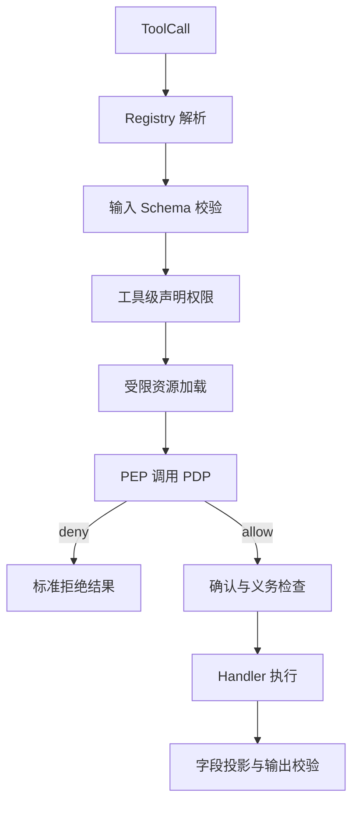

# 第 8 课：实现租户、资源与作用域授权

> 章节导航：[第二章：Function Calling、Tool Runtime 与 MCP](./index.md)  
> 上一课：[第 7 课：建立工具风险与权限模型](./lesson-07-tool-risk-permission-model.md)<br>
> 下一课：[第 9 课：实现 Human-in-the-loop 审批状态机](./lesson-09-hitl-approval.md)

## 一、你将完成什么

本课把第 7 课的授权契约落到具体执行边界：

1. 在数据访问和文件路径解析阶段限制租户与工作区范围。
2. 实现可替换的 Policy Decision Point，并在 Runtime 建立不可绕过的 PEP。
3. 对读取结果和写入字段应用最小化投影与白名单。
4. 处理跨租户支持、可靠性重试、MCP 远程工具与策略缓存边界。
5. 用拒绝场景和策略合同测试证明资源与作用域约束。

## 二、资源加载本身也是安全边界

常见错误是先用不带范围的查询拿到资源，再在 Python 中比较租户：

```python
# 错误：在读取完整对象之后才判断是否属于当前租户。
order = order_repository.find_by_id(order_id)
if order.tenant_id != context.subject.tenant_id:
    raise PermissionError()
```

即使最终拒绝，这种模式仍可能让缓存、日志、异常和计时差异泄露跨租户信息。优先让数据访问层把租户范围写进查询：

```python
class OrderRepository:
    def find_in_tenant(self, *, tenant_id: str, order_id: str) -> "Order | None":
        return self._db.fetch_one(
            """
            SELECT id, tenant_id, customer_id, status, updated_at
            FROM orders
            WHERE tenant_id = :tenant_id AND id = :order_id
            """,
            {"tenant_id": tenant_id, "order_id": order_id},
        )
```

数据库连接也应绑定租户上下文，或使用行级安全（RLS）作为纵深防御。应用层策略仍有价值，因为它能表达订单所有者、支持工单和字段投影；但不能把“记得每次 WHERE tenant_id”完全寄托在业务代码习惯上。

### 7.1 路径不是普通字符串

文件工具尤其容易被 `../`、符号链接和前缀碰撞绕过。`/workspace/a` 不能通过字符串前缀判断来保护，因为 `/workspace/ab` 也以它开头。

```python
from pathlib import Path


class PathOutsideWorkspace(ValueError):
    pass


def resolve_workspace_path(*, workspace_root: Path, requested_path: str) -> Path:
    root = workspace_root.resolve(strict=True)
    candidate = (root / requested_path).resolve(strict=False)
    try:
        candidate.relative_to(root)
    except ValueError as error:
        raise PathOutsideWorkspace("path escapes workspace") from error
    return candidate
```

对读取已有文件，打开前应再次以 `strict=True` 解析并检查真实路径，以避免解析到打开之间的符号链接替换。对写入新文件，检查已存在父目录的真实路径、禁止不受控符号链接，并使用支持目录文件描述符或原子创建的文件 API 降低 TOCTOU 风险。不要把客户端给出的绝对路径、根目录或 `allow_symlinks=true` 当作正常参数。

### 7.2 资源标识必须在业务域内解析

`order_id`、`project_id`、对象存储键和数据库过滤器都只是候选标识。工具参数校验成功后，仍要由域服务解析为 `ResourceRef`。不要允许工具直接接收任意 SQL、任意 URL 或任意云资源 ARN；若确有集成需求，也必须将其解析并限制到租户、区域、账户和允许的操作集合。

## 三、实现策略引擎：小接口，清楚的依赖

无需一开始引入一门复杂的策略语言。对于当前课程规模，一个明确的 Python 协议和按资源域拆分的策略已经足够，并能在将来替换为 OPA、Cedar 或集中式授权服务。

```python
from typing import Protocol


class AuthorizationPolicy(Protocol):
    def decide(self, request: AuthorizationRequest) -> AuthorizationDecision:
        """只根据可信主体、可信资源和受控约束返回决策。"""


class OrderPolicy:
    def decide(self, request: AuthorizationRequest) -> AuthorizationDecision:
        if request.action not in {Action.ORDER_READ, Action.ORDER_CANCEL}:
            return self._deny("orders.unsupported.v1", DenyReason.SCOPE_VIOLATION)

        if request.subject.tenant_id != request.resource.tenant_id:
            return self._deny("orders.tenant.v1", DenyReason.TENANT_MISMATCH)

        if request.action is Action.ORDER_READ:
            return self._decide_read(request)
        return self._decide_cancel(request)

    def _decide_read(self, request: AuthorizationRequest) -> AuthorizationDecision:
        if "orders:read" not in request.subject.permissions:
            return self._deny("orders.read.v3", DenyReason.MISSING_CAPABILITY)

        is_owner = request.subject.actor_id == request.resource.attributes["customer_id"]
        has_case = request.subject.attributes.get("support_case_id") == request.resource.attributes.get("support_case_id")
        is_support = "support" in request.subject.roles and has_case
        if not (is_owner or is_support):
            return self._deny("orders.read.v3", DenyReason.RESOURCE_RELATION)

        fields = {"order_id", "status", "updated_at"}
        if is_owner:
            fields.add("shipping_address")
        return AuthorizationDecision(
            effect=DecisionEffect.ALLOW,
            policy_id="orders.read.v3",
            readable_fields=frozenset(fields),
        )

    def _decide_cancel(self, request: AuthorizationRequest) -> AuthorizationDecision:
        if "orders:write" not in request.subject.permissions:
            return self._deny("orders.cancel.v2", DenyReason.MISSING_CAPABILITY)
        if request.subject.actor_id != request.resource.attributes["customer_id"]:
            return self._deny("orders.cancel.v2", DenyReason.RESOURCE_RELATION)
        if request.resource.attributes["status"] not in {"pending", "paid"}:
            return self._deny("orders.cancel.v2", DenyReason.RESOURCE_STATE)
        return AuthorizationDecision(
            effect=DecisionEffect.ALLOW,
            policy_id="orders.cancel.v2",
            obligations=frozenset({"require_confirmation"}),
        )

    @staticmethod
    def _deny(policy_id: str, reason: DenyReason) -> AuthorizationDecision:
        return AuthorizationDecision(
            effect=DecisionEffect.DENY,
            policy_id=policy_id,
            reason=reason,
        )
```

示例把支持人员的访问绑定到资源关联的工单，而不是给 `support` 一个无限制的“读所有订单”权限。实际系统不应信任 `resource.attributes["support_case_id"]` 恰好存在；应由独立的工单关系查询确认该工单仍有效、属于当前租户且覆盖该订单。

### 8.1 Policy Decision Point 与 Policy Enforcement Point

上述 `OrderPolicy` 是 Policy Decision Point（PDP）：只做决策。Runtime 中的 PEP 负责在正确的时点调用 PDP、阻止未授权执行，并把决策事实写入 Trace。

| 组件 | 职责 | 不应做什么 |
| --- | --- | --- |
| PEP（Runtime） | 构造请求、调用策略、强制拒绝、记录决策 | 把拒绝改成“建议”或自己猜规则 |
| PDP（策略） | 按规则产生 allow/deny、字段和义务 | 执行业务副作用 |
| 资源加载器 | 受租户约束地取得授权所需属性 | 根据模型参数赋予身份 |
| Handler | 使用已授权资源做业务动作 | 重新信任原始参数绕过授权 |

策略“允许”必须覆盖工具实际会做的动作。一个 `order.read` 决策不能被 Handler 用来顺带取消订单或返回支付卡号；动作拆分和字段投影是防止这类权限扩张的基础。

## 四、把 PEP 接入 Tool Runtime

授权请求必须在输入 Schema 校验后构造，因为此时可以安全读取 `order_id` 的形状；它必须在 Handler 前完成，因为之后可能发生副作用。对于读取资源，先受租户范围加载最小授权属性；对于写入资源，真正写入前应在同一事务或带版本条件的更新中再次验证关键状态，避免授权与写入之间发生竞争。



为避免每个 Handler 自己从参数取资源，可为需要资源授权的工具注册一个 request builder：

```python
from collections.abc import Callable


AuthorizationRequestBuilder = Callable[
    [dict[str, object], ToolExecutionContext, str], AuthorizationRequest
]


class ToolAuthorizer:
    def __init__(
        self,
        *,
        builders: dict[tuple[str, str], AuthorizationRequestBuilder],
        policies: dict[str, AuthorizationPolicy],
    ) -> None:
        self._builders = builders
        self._policies = policies

    def authorize(
        self,
        *,
        tool_name: str,
        tool_version: str,
        arguments: dict[str, object],
        context: ToolExecutionContext,
        call_id: str,
    ) -> AuthorizationDecision:
        builder = self._builders.get((tool_name, tool_version))
        if builder is None:
            # 没有资源策略的工具也必须显式注册；默认拒绝。
            return AuthorizationDecision(
                effect=DecisionEffect.DENY,
                policy_id="runtime.missing_authorizer.v1",
                reason=DenyReason.SCOPE_VIOLATION,
            )
        request = builder(arguments, context, call_id)
        policy = self._policies[request.resource.kind]
        return policy.decide(request)
```

在第 4 课的 `ToolRuntime.invoke()` 中，工具级 `required_permissions` 检查后、确认检查前增加：

```python
decision = self._authorizer.authorize(
    tool_name=spec.name,
    tool_version=spec.version,
    arguments=arguments,
    context=context,
    call_id=call.call_id,
)
self._trace.record_authorization(
    request_id=context.request_id,
    call_id=call.call_id,
    policy_id=decision.policy_id,
    effect=decision.effect,
    reason=decision.reason,
)
if not decision.allowed:
    return self._authorization_error(call=call, spec=spec, decision=decision)
if "require_confirmation" in decision.obligations:
    # 第 9 课会验证令牌的主体、调用、版本、过期时间和一次性消费。
    require_confirmation = True
```

真实代码中应将 `require_confirmation` 与 `spec.security.requires_confirmation` 合并为“任一要求即必须确认”，而不是让策略义务覆盖工具契约。一个常见做法是在 Authorizer 返回的决策中携带义务，在 Runtime 统一执行全部义务；不能让 Handler 忘记执行它们。

### 9.1 授权不足时的稳定错误语义

工具的外部结果必须避免成为资源枚举接口。对按 ID 读取的资源，推荐统一暴露一个不区分不存在和无权访问的领域错误：

```python
def _authorization_error(
    self,
    *,
    call: ToolCall,
    spec: ToolSpec,
    decision: AuthorizationDecision,
) -> ToolResult:
    if decision.hide_resource_existence:
        return self._error(
            call=call,
            spec=spec,
            code="order_not_found",
            message="订单编号不存在，或当前用户无权查看该订单。",
        )
    return self._error(
        call=call,
        spec=spec,
        code="permission_denied",
        message="当前身份不具备执行此操作的权限。",
    )
```

这里的 `order_not_found` 必须是 `ToolSpec.errors` 中已声明的错误，且仅适用于按资源标识读取等确实需要隐藏存在性的场景。对于“尝试调用一个禁止的管理工具”或“导出行数超过上限”，返回通用 `permission_denied` 或 `scope_violation` 更清楚。外部错误码不应包含 `tenant_mismatch`、`not_owner`、内部策略名或角色名。

**不能用延时伪装保护枚举。** 人为 `sleep` 既难以一致，也会消耗并发槽位；正确措施是受租户范围查询、统一外部错误、限流和审计异常探测。

## 五、字段投影与写入约束

### 10.1 在输出 Schema 前执行读取投影

授权决策输出的 `readable_fields` 应由一个显式投影器执行。投影器不应接受调用方指定的字段列表作为最终权限依据。

```python
from typing import Any


def project_order_for_subject(
    *,
    order: dict[str, Any],
    decision: AuthorizationDecision,
) -> dict[str, Any]:
    if not decision.allowed:
        raise RuntimeError("cannot project a denied resource")
    return {
        field: value
        for field, value in order.items()
        if field in decision.readable_fields
    }
```

输出 Schema 应允许策略能合法投影出的形状。若同一工具对不同角色输出结构差异很大，优先拆分成不同目的的工具或使用显式的可选字段，避免用一个“全量订单工具”在不同权限下偷偷返回不稳定对象。无论哪种形式，投影后仍要通过第 4 课的输出校验。

模型需要的字段应当是完成任务所必需的最小集合。例如客服只需知道是否可以取消订单，不需要看到精确收货地址；这既降低隐私泄露，也降低 Prompt 注入后可被外带的数据量。

### 10.2 写入使用允许字段与服务端赋值

不要采用“删除几个危险字段，其余都更新”的黑名单模式。新字段一旦加入实体，便可能被意外开放。使用按工具定义的允许字段：

```python
ALLOWED_PROFILE_PATCH_FIELDS = frozenset({"display_name", "notification_email"})


def select_profile_patch(arguments: dict[str, object]) -> dict[str, object]:
    patch = arguments["patch"]
    if not isinstance(patch, dict):
        raise ValueError("validated schema must provide an object patch")
    unexpected = set(patch) - ALLOWED_PROFILE_PATCH_FIELDS
    if unexpected:
        raise ValueError("patch contains fields not allowed by this tool")
    return {name: patch[name] for name in ALLOWED_PROFILE_PATCH_FIELDS if name in patch}
```

`tenant_id`、资源所有者、审批状态、余额、权限和审计时间应由服务端赋值或通过独立、受控的领域操作变更。即使用户能修改自己的资料，也不能让通用 `update_profile` 接收整个 ORM 对象。

### 10.3 列表与导出是独立的资源范围问题

过滤条件和分页上限也是策略的一部分。不能因为每条订单都经过单项授权，就允许一次导出全部订单：

- 在数据查询前固定 `tenant_id` 和可见范围；
- 对 `limit` 设平台上限，不能让模型请求无限大值；
- 对导出、批量删除等动作使用独立权限、风险和确认策略；
- 不根据调用方传入的 `include_deleted`、`all_tenants`、`fields=*` 扩大范围。

## 六、租户隔离与作用域约束

租户 ID 是授权输入，不是普通的业务筛选条件。每一条访问路径都应有同样的隔离规则：主库查询、缓存键、搜索索引、对象存储前缀、异步任务、导出文件和 Trace。

```text
tenant_id 应来自可信主体或已验证的委托上下文
缓存键至少包含 tenant_id、资源 ID、策略相关范围
对象存储键固定在 tenants/{tenant_id}/... 前缀下
异步任务载荷保存不可变主体快照或可重新验证的授权引用
```

不要仅在 HTTP 路由层检查一次租户。Tool Runtime 可以被 CLI、队列消费者、MCP Client 或内部测试入口调用，它们都必须传入可信上下文并走同一 PEP。

### 11.1 限额与操作范围

授权不仅是“允许/拒绝”，还包括授权的最大范围。下列约束宜由策略或义务明确表达：

| 动作 | 典型范围约束 |
| --- | --- |
| `order.export` | 最多 100 条，仅当前租户，仅脱敏字段 |
| `file.write` | 仅工作区内、仅 `.md` 和 `.txt`、最大 1 MB |
| `notification.send` | 仅已验证收件人、每小时限额 |
| `refund.create` | 金额不超过岗位额度且币种受限 |

额度检查要使用精确货币类型和服务端订单金额，不能相信模型给出的 `amount` 已经与订单一致。高价值额度通常还需要审批或双人复核，第 9 课会承接这一点。

### 11.2 跨租户支持访问必须显式建模

排障人员确实可能需要跨租户访问，但不能通过赋予 `tenant_id="*"` 或全局管理员角色解决。应使用短期、目的受限的委托上下文：目标租户、支持工单、只读动作集合、失效时间和签发人都必须可验证并记录。策略应默认拒绝跨租户，再只允许这类明确定义的例外。

## 七、与可靠性机制的边界

第 5–6 课的可靠性执行器位于 Runtime 外层，但每次尝试都必须重新经过授权边界：

```text
可靠性执行器
    -> Runtime：解析、Schema、工具级授权、资源级 PEP、确认、Handler
    -> 失败分类
    -> 允许时再进入 Runtime
```

原因不是形式主义：重试之间用户可能被禁用、角色可能被回收、资源归属和状态可能变化、确认也可能过期。第一次允许不能变成后续尝试的永久通行证。

以下规则尤其重要：

1. `retryable=true` 只表示故障类别可尝试恢复，绝不表示调用仍有权限；
2. 授权拒绝、作用域拒绝和确认缺失都不可自动重试；
3. 缓存的授权决策必须很短、按主体和资源精确分区，并在权限或资源状态变更时失效；
4. 对写操作，在最终提交点再次满足关键条件，例如 `UPDATE ... WHERE tenant_id = ? AND status = 'pending'`；
5. 幂等键防重复执行，不授予权限，也不能跨主体、租户或动作复用。

### 12.1 授权与并发竞争

授权成功到 Handler 写入之间，订单可能被发货或转移。不要把一次预检查当作永久事实。写入操作应通过事务、乐观锁版本号或条件更新，把“仍满足授权所依赖的状态”和“执行变更”尽量放在同一个原子边界。

例如取消订单的更新条件至少包含订单 ID、租户、当前状态和版本号；影响行数为零时返回领域状态错误或重新读取后作出准确判断，而不是盲目重试取消。

## 八、不要把安全边界交给 Prompt、工具描述或 MCP

工具描述中写“只能读取自己的订单”有助于模型选择正确工具，但描述不是执行机制。攻击者可以直接构造 ToolCall，旧模型可能忽略描述，远程 MCP Server 也可能提供与描述不一致的能力。

MCP 的 Tools、Resources 和 Prompts 是能力发现与通信协议，不是本地业务授权标准。接入外部 MCP 时，仍需：

- 在本地 Registry 中为远程工具声明最小权限、租户和风险策略；
- 用本地 PEP 判定用户是否能请求该远程能力；
- 为远程调用使用范围最小、短期、可撤销的下游凭证；
- 验证远程返回内容，并按本地字段策略投影后再交给模型；
- 不把用户主会话 Token、数据库密码或全局服务密钥透传给 MCP Server。

“该 MCP Server 已通过网络隔离”也不能代替授权。网络位置最多是环境属性或纵深防御的一层，不是主体与资源关系的证明。

## 九、策略测试：把拒绝路径当成产品能力

策略变更极易产生越权回归，因此测试应覆盖允许与拒绝的对偶场景，而不只测试“管理员能成功”。先提供固定夹具：

```python
import pytest
from dataclasses import replace


@pytest.fixture
def own_order_request(customer_subject: AuthorizationSubject) -> AuthorizationRequest:
    return AuthorizationRequest(
        subject=customer_subject,
        action=Action.ORDER_READ,
        resource=ResourceRef(
            kind="order",
            resource_id="A-1024",
            tenant_id="tenant-a",
            attributes={
                "customer_id": customer_subject.actor_id,
                "status": "paid",
                "support_case_id": None,
            },
        ),
        environment="production",
        request_id="req-test",
        call_id="call-test",
        constraints={},
    )
```

### 14.1 单元测试规则矩阵

```python
@pytest.mark.parametrize(
    ("mutate", "expected"),
    [
        (lambda request: request, DecisionEffect.ALLOW),
        (
            lambda request: replace(
                request,
                resource=replace(request.resource, tenant_id="tenant-b"),
            ),
            DecisionEffect.DENY,
        ),
        (
            lambda request: replace(
                request,
                resource=replace(
                    request.resource,
                    attributes={**request.resource.attributes, "customer_id": "user-other"},
                ),
            ),
            DecisionEffect.DENY,
        ),
    ],
)
def test_order_read_policy_bounds_resource(
    own_order_request: AuthorizationRequest,
    mutate: object,
    expected: DecisionEffect,
) -> None:
    decision = OrderPolicy().decide(mutate(own_order_request))
    assert decision.effect is expected
```

示例需要 `from dataclasses import replace`。实际测试还应覆盖缺少 `orders:read`、支持工单失效、取消已发货订单、错误环境、字段集合和每条拒绝规则的优先级。不要只断言 `allowed is False`，还要断言策略 ID、是否隐藏资源存在性及义务集合符合预期。

### 14.2 Runtime 集成测试

集成测试验证 PEP 的位置，而不是重复单元测试所有规则：

1. 跨租户 `order_id` 不能到达 Handler，外部结果与不存在订单一致；
2. 未注册 Authorizer 的资源工具默认拒绝，不能悄悄放行；
3. 授权允许但确认缺失时，Handler 仍不执行；
4. 重试前权限被回收时，第二次尝试被拒绝；
5. 输出投影后不含禁止字段，且仍符合输出 Schema；
6. `../`、绝对路径和指向工作区外的符号链接均不能到达文件 Handler。

为每个测试计数 Handler 调用次数。只检查最终错误码不足以证明安全边界真的在副作用之前生效。

### 14.3 策略合同测试与回归样本

当策略服务独立部署或需要兼容多语言实现时，维护一组版本化授权样本：输入主体、资源快照、动作、预期决策、字段与义务。Python Runtime、将来的远程 PDP 和测试 CLI 都应跑同一组样本。

策略变更上线前还应回放脱敏的历史授权事件，统计 allow/deny 的变化。新增允许必须人工审查；新增拒绝也要评估是否会中断正常业务。策略版本写入事件后，才能定位“哪次规则变更导致行为改变”。

## 十、记录最少但足够的授权事实

第 9 课会建立正式审计链，本课先规定决策 Trace 的最小字段：

| 字段 | 用途 | 注意事项 |
| --- | --- | --- |
| `request_id`、`call_id` | 关联请求与工具调用 | 不使用参数哈希代替调用 ID |
| `actor_id`、`principal_type` | 定位主体 | 访问受控，避免写入原始会话令牌 |
| `tenant_id`、`resource_kind`、资源摘要 | 定位授权范围 | 资源 ID 按敏感等级脱敏或哈希 |
| `action`、`tool_name@version` | 说明请求的能力 | 动作和工具应可映射 |
| `policy_id`、`effect`、内部 `reason` | 分析规则结果 | 原因不直接回传模型 |
| `confirmation_required`、`decision_at` | 衔接确认和时序 | 使用 UTC 时间戳 |

不要把完整工具参数、完整订单、地址、银行卡号、Authorization Header 或下游响应无选择地写入 Trace。审计日志本身也是高价值数据，需要访问控制、脱敏、保留期限和防篡改设计。

对拒绝率突增、某主体对连续资源 ID 的探测、跨租户拒绝、路径穿越尝试等建立指标和告警。安全日志的价值在于发现趋势，不在于把每次失败打印成堆栈。

## 十一、常见错误与修正

### 16.1 只在模型可见性阶段过滤工具

模型可能忽略工具列表、旧任务可以重放调用，内部入口也能绕过发现。因此 Registry 过滤只能减少误用；Runtime PEP 才是强制边界。

### 16.2 将 `actor_id` 放入工具参数

参数属于模型提案，可被伪造。身份、租户和角色必须由入口认证后的上下文提供；工具参数只携带业务目标。

### 16.3 仅检查 `orders:read`

这会让拥有读能力的用户枚举整个租户甚至跨租户资源。至少同时检查租户、资源关系、状态和字段投影。

### 16.4 用 `path.startswith(root)` 做路径白名单

前缀碰撞、`..` 和符号链接都能绕过。先解析真实路径，再通过 `relative_to()` 判断，并在实际打开时防范 TOCTOU。

### 16.5 先读全量数据，再在响应层脱敏

完整对象可能已经进入缓存、日志或模型上下文。查询阶段就限制列和租户，策略允许后再做字段投影。

### 16.6 把授权成功缓存很久

角色、工单、资源状态和租户归属会变化。需要缓存时，使用短 TTL、精确缓存键和撤销失效；高风险写操作在提交点重新验证。

### 16.7 用重试绕过临时授权错误

权限被拒绝通常不是瞬时网络错误。重试既不能获得权限，也可能在权限回收后继续尝试副作用；每次可靠性重试都应回到 Runtime 重新授权。

### 16.8 让远程 MCP Server 代替本地策略

远程服务的认证结果只能是附加信号。平台仍须决定当前用户能否调用、下发何种下游凭证以及哪些结果可回传模型。

## 十二、练习

### 练习 1：为 `get_order` 建立资源级授权

实现一个 `OrderAuthorizationRequestBuilder`，从已校验的 `order_id` 和可信上下文构造请求。要求：

1. 资源加载查询必须带上 `tenant_id`；
2. 所有者可读取订单状态和更新时间；
3. 有效支持工单的客服可读取同样的最小字段；
4. 不存在、跨租户和无关系订单对模型返回同一种外部错误；
5. Handler 在拒绝路径上的调用次数为零。

### 练习 2：为工作区写入工具设计路径策略

为 `write_workspace_file` 设计 Schema、资源解析器和策略。限制相对路径、允许扩展名、最大字节数和工作区归属；分别测试 `../secret.txt`、绝对路径、`workspace2` 前缀碰撞与工作区内指向外部的符号链接。

### 练习 3：设计订单导出义务

新增 `order.export` 动作，要求普通客服最多导出 100 条、字段不含地址，财务角色可导出支付状态但仍不能跨租户。把“最大行数”和“字段投影”表示为决策义务，并在 Runtime 或 Handler 边界强制执行，而不是只写在工具描述里。

## 十三、完成标准

- 资源查询在加载阶段就绑定租户或工作区范围，不先读取完整跨租户对象再判断。
- Runtime 的所有入口都经过同一个 PEP，Handler、CLI 与 MCP 不能旁路。
- 策略允许只覆盖明确动作、资源和字段，写入时重新检查关键状态。
- 跨租户支持访问具有工单、目标租户、动作集合、失效时间和审计证据。
- 策略测试覆盖租户不匹配、越界路径、字段越权、资源状态变化和默认拒绝。

## 十四、本课小结

租户、资源和作用域授权把抽象权限变成了可执行的平台边界。下一课将在授权通过之后，对高风险调用建立不可变提案、一次性批准凭证和显式审批状态机。
