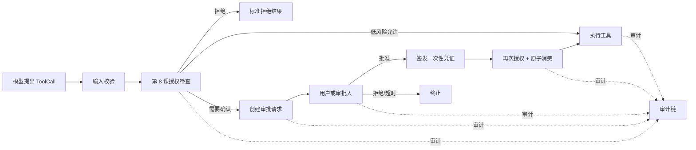
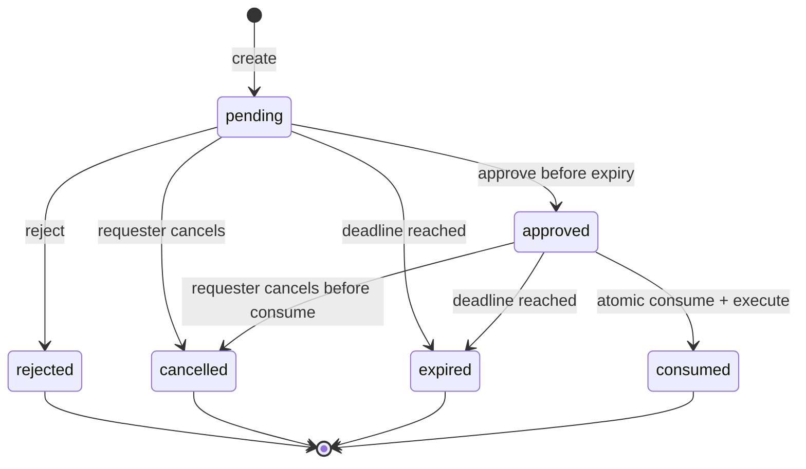
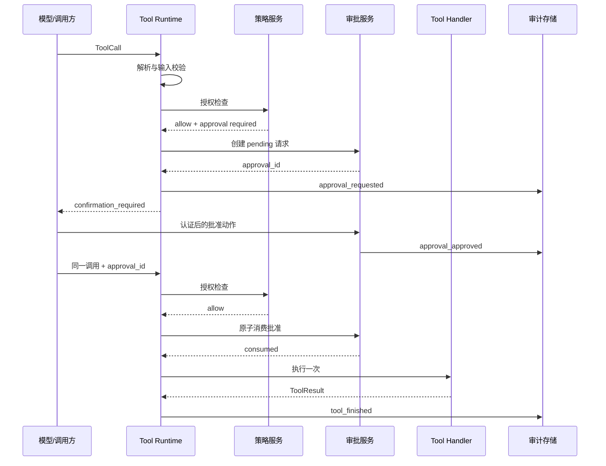

# 第 9 课：实现 Human-in-the-loop 审批状态机

> 章节导航：[第二章：Function Calling、Tool Runtime 与 MCP](./index.md)  
> 上一课：[第 8 课：实现租户、资源与作用域授权](./lesson-08-tenant-resource-scope-authorization.md)<br>
> 下一课：[第 10 课：建立审计、Trace 与风险回放](./lesson-10-tool-audit-recovery.md)

## 一、你将完成什么

本课把高风险调用的人工确认实现为可持久化状态机：

1. 明确审批与认证、授权、审计的区别。
2. 将待执行调用冻结为不可变审批提案。
3. 约束审批人、职责分离、凭证有效期和一次性消费。
4. 把批准、拒绝、取消、过期与未知结果接回 Runtime。

完成本课后，你应能说明本课能力在 Tool Runtime 中的位置，并用测试或可查询证据证明它确实生效。

## 二、确认不是授权，也不是模型的自述

在工具系统中，至少要分开下面四件事：

| 机制 | 它证明什么 | 不证明什么 |
| --- | --- | --- |
| 认证 | 请求来自哪个可信主体 | 主体能访问哪项资源 |
| 授权 | 主体当前能否执行目标动作 | 主体是否看清并同意这次风险 |
| 审批/确认 | 特定主体同意一份具体风险提案 | 主体拥有额外权限 |
| 审计 | 系统保留了可核查的事实 | 事实本身一定正确或允许执行 |

模型生成的 `approved`、`user_confirmed`、`reason`，甚至“用户已经说过可以”都只是输入文本，不能作为审批结论。审批结论必须来自经过认证的审批入口，并被服务端持久化。



确认放在授权之后的原因很重要：无权动作不能借“用户确认”获得授权，也不应产生可被用来枚举资源的审批请求。执行前再授权一次，是因为审批等待期间角色、租户、资源状态、额度或支持工单都可能改变。

## 三、先定义哪些工具需要审批

不要根据工具名字中是否出现 `delete` 这种字符串猜测风险。风险应由第 2 课 `ToolSpec` 中的声明、资源属性和运行时环境共同决定。

### 3.1 风险分级不是权限分级

| 等级 | 典型操作 | 默认处理 |
| --- | --- | --- |
| `low` | 查询自己的非敏感状态 | 授权通过后直接执行并记录摘要 |
| `medium` | 创建草稿、修改可撤销偏好 | 可直接执行，必要时显示可撤销记录 |
| `high` | 取消订单、覆盖文件、发送外部消息 | 明确用户确认，短有效期、一次消费 |
| `critical` | 退款、导出敏感数据、生产配置变更 | 审批、强认证、可能需要多人或职责分离 |

风险级别表达的是“本次执行前还要增加什么保护”，不是权限替代品。`refunds:write` 是资格；某笔退款是否需要本人确认、金额阈值或财务复核是风险策略。

```python
from enum import StrEnum
from pydantic import BaseModel, Field


class RiskLevel(StrEnum):
    LOW = "low"
    MEDIUM = "medium"
    HIGH = "high"
    CRITICAL = "critical"


class ApprovalPolicy(BaseModel):
    required: bool = False
    risk_level: RiskLevel = RiskLevel.LOW
    expires_in_seconds: int = Field(default=300, ge=30, le=3600)
    require_step_up_auth: bool = False
    required_approver_roles: tuple[str, ...] = ()
    allow_self_approval: bool = True


class ToolSpec(BaseModel):
    # 省略第 2 课已有字段
    name: str
    version: str
    approval: ApprovalPolicy = ApprovalPolicy()
```

`required=True` 适合静态高风险工具。更细的策略可在 Runtime 中根据已经加载的可信资源决定，例如退款金额超过 1,000 元、导出行数超过 100，或写入目标是生产环境时要求审批。模型传入的 `amount`、`environment` 不能直接用于这个判断，必须使用服务端可信数据。

### 3.2 审批提示应展示影响，而不是原始参数

审批页面或客户端需要让人理解将发生什么，但不能把不可信、未脱敏的大对象原样展示。审批请求应保存一个服务端构造的展示摘要：

```python
from dataclasses import dataclass
from typing import Any


@dataclass(frozen=True)
class ApprovalPreview:
    title: str
    summary: str
    resource_refs: tuple[str, ...]
    irreversible: bool
    fields_changed: tuple[str, ...] = ()


def build_refund_preview(order: "Order", refund_cents: int) -> ApprovalPreview:
    return ApprovalPreview(
        title="确认发起退款",
        summary=f"将为订单 {order.public_number} 发起 {refund_cents / 100:.2f} 元退款。",
        resource_refs=(f"order:{order.public_number}",),
        irreversible=False,
        fields_changed=("refund_status",),
    )
```

展示摘要应来自完成输入校验和资源加载后的领域对象。不要向审批人显示模型写的“这只是测试”作为风险说明，也不要把银行卡号、住址、访问令牌或完整文件内容复制到审批表单。

## 四、审批请求是一份不可变的执行提案

用户点击批准的对象必须是准确的一次调用，而不是“未来所有退款”或“这个工具都可以用”。创建审批请求时，把会影响执行语义的事实冻结下来。

### 4.1 必须绑定的事实

| 字段 | 为什么需要绑定 |
| --- | --- |
| `approval_id` | 审批记录与审计事件的稳定主键 |
| `request_id`、`call_id` | 与入口请求、工具调用和重试链关联 |
| `tenant_id`、`requester_id` | 防止跨租户或替换主体使用 |
| `tool_name`、`tool_version` | 防止批准旧行为却执行新版本工具 |
| `input_digest` | 防止批准参数 A 后执行参数 B |
| 资源摘要与风险策略版本 | 支持复盘当时的影响和规则 |
| `expires_at` | 让决定只在有限时间内有效 |
| `idempotency_key`（如适用） | 关联同一用户意图，不能单独当确认凭证 |

输入摘要必须采用**规范化后、服务端认可的参数**计算。直接对原始 JSON 字符串求哈希不可靠：对象字段顺序、空白、默认值表示差异都会导致同一语义有多个摘要。

```python
import hashlib
import json
from typing import Any


def canonical_json(value: Any) -> bytes:
    return json.dumps(
        value,
        ensure_ascii=True,
        sort_keys=True,
        separators=(",", ":"),
        allow_nan=False,
    ).encode("utf-8")


def digest_tool_input(validated_input: dict[str, Any]) -> str:
    return hashlib.sha256(canonical_json(validated_input)).hexdigest()
```

如果参数内含密码、令牌或高敏感文本，不应将它们完整持久化到审批表。可以保留受控加密原文供执行使用，同时对用于审计和展示的字段做白名单投影与掩码；摘要可覆盖完整的密文前语义，但不应把原文写入普通日志。

### 4.2 数据模型与状态

审批记录不是内存中的 `dict`。进程重启、用户隔天返回、多个 Web 实例和异步任务都要求它持久化，并具有可并发更新的版本或条件更新。

```python
from dataclasses import dataclass
from datetime import datetime
from enum import StrEnum


class ApprovalStatus(StrEnum):
    PENDING = "pending"
    APPROVED = "approved"
    REJECTED = "rejected"
    EXPIRED = "expired"
    CANCELLED = "cancelled"
    CONSUMED = "consumed"


@dataclass(frozen=True)
class ApprovalRequest:
    approval_id: str
    tenant_id: str
    requester_id: str
    request_id: str
    call_id: str
    tool_name: str
    tool_version: str
    input_digest: str
    policy_version: str
    preview: ApprovalPreview
    status: ApprovalStatus
    created_at: datetime
    expires_at: datetime
    decided_at: datetime | None = None
    decided_by: str | None = None
    decision_reason: str | None = None
    consumed_at: datetime | None = None
    row_version: int = 0
```

`decision_reason` 应是短的、受控的分类或可选人工说明，不能默认记录审批人输入的全部敏感内容。数据库表还应有 `tenant_id, status, expires_at` 与 `requester_id, created_at` 等查询索引；读取审批记录必须带租户条件。

## 五、状态机必须显式且可验证

审批系统最危险的错误通常不是“没有按钮”，而是允许已拒绝的请求复活、超时后仍执行，或让多个并发执行者重复消费同一批准。



`consumed` 表示批准已经被某次执行尝试原子占用，**不等价于工具一定成功**。工具执行超时或下游响应丢失时，结果可能未知；这时要结合第 5–6 课的幂等记录查询真实结果，而不是重置审批状态后再执行一遍。

### 5.1 允许的转换表

| 当前状态 | 命令 | 下一个状态 | 前提 |
| --- | --- | --- | --- |
| `pending` | `approve` | `approved` | 未过期、审批人合格、满足强认证 |
| `pending` | `reject` | `rejected` | 未过期、审批人合格 |
| `pending` | `cancel` | `cancelled` | 请求人或管理员，尚未执行 |
| `pending` | `expire` | `expired` | 当前时间到期 |
| `approved` | `consume` | `consumed` | 未过期、绑定事实匹配、再次授权成功 |
| `approved` | `cancel` | `cancelled` | 尚未被消费 |
| `approved` | `expire` | `expired` | 当前时间到期 |

`rejected`、`cancelled`、`expired`、`consumed` 都是终态。需要重新发起时，创建新的 `approval_id` 和新的审计事件；不要修改原记录为 `pending`，否则审计链和用户意图都会变得含混。

### 5.2 过期不能依赖后台定时任务

定时任务可以把历史 `pending` 标记成 `expired` 以便查询，但安全判断不能依赖它按时运行。任何读取、批准和消费操作都必须先比较服务端 UTC 时间与 `expires_at`，把过期记录视为不可用。

```python
from datetime import UTC, datetime


def is_expired(approval: ApprovalRequest, now: datetime) -> bool:
    return now.astimezone(UTC) >= approval.expires_at.astimezone(UTC)


def can_approve(approval: ApprovalRequest, now: datetime) -> bool:
    return approval.status is ApprovalStatus.PENDING and not is_expired(approval, now)
```

客户端倒计时只改善体验，不能作为安全时钟。服务端应使用可信 UTC 时间；针对时钟漂移、数据库时间和应用时间的差异要有监控与统一策略。

## 六、审批人、职责分离与强认证

简单的“用户确认”与“组织审批”共用同一状态机，但批准资格不同。

### 6.1 三种常见模式

| 模式 | 谁可以批准 | 适用例子 |
| --- | --- | --- |
| 自我确认 | 发起者本人 | 取消自己的订单、发送消息 |
| 角色审批 | 指定角色成员 | 财务审批退款、运维批准变更 |
| 双人复核 | 与发起者不同的两位合格主体 | 大额付款、密钥轮换 |

审批人身份必须来自审批入口的可信会话，而不是 `approve(approver_id="finance-admin")` 这类客户端参数。对于 `critical` 操作，批准时应检查近期强认证状态，例如 WebAuthn、企业 SSO 的重新验证或受控的二次验证声明。

```python
def may_approve(
    approval: ApprovalRequest,
    approver: "AuthorizationSubject",
    policy: ApprovalPolicy,
) -> bool:
    if approver.tenant_id != approval.tenant_id:
        return False
    if not policy.allow_self_approval and approver.actor_id == approval.requester_id:
        return False
    if policy.required_approver_roles:
        return bool(approver.roles.intersection(policy.required_approver_roles))
    return approver.actor_id == approval.requester_id
```

真实项目还要验证审批人账户未禁用、会话未撤销、工单或变更窗口有效，并以策略引擎取代上面的简化函数。不要把“审批角色”直接等同于所有执行权限：合格审批人可以同意，但实际执行仍以请求者的授权和工具运行时服务身份为准。

### 6.2 不要用链接本身当作权限

邮件或聊天中的审批链接应只定位一条审批请求，点击后仍要完成认证、租户检查和审批资格检查。链接中带有的随机 ID 不是可转发的万能凭证；敏感操作不要通过“打开链接即批准”执行。

## 七、批准凭证：绑定、短期、一次性

审批状态为 `approved` 后，Runtime 可以收到一个审批引用或服务端签发的短期凭证。无论形式如何，执行时都必须验证它指向的持久化记录，而不是信任模型携带的字符串。

```python
@dataclass(frozen=True)
class ApprovalBinding:
    approval_id: str
    tenant_id: str
    requester_id: str
    call_id: str
    tool_name: str
    tool_version: str
    input_digest: str


def matches_call(
    binding: ApprovalBinding,
    *,
    context: "ToolExecutionContext",
    call: "ToolCall",
    validated_input: dict[str, object],
) -> bool:
    return (
        binding.tenant_id == context.subject.tenant_id
        and binding.requester_id == context.subject.actor_id
        and binding.call_id == call.id
        and binding.tool_name == call.name
        and binding.tool_version == call.version
        and binding.input_digest == digest_tool_input(validated_input)
    )
```

不建议把全部审批事实放进长期可验证、无法撤销的 JWT。即使签名正确，它也无法自然反映审批被取消、用户被禁用或资源状态变化。若用签名 token 降低查询开销，也应采用短 TTL、`jti`、受众与密钥轮换，并在消费时回查审批记录的当前状态。

## 八、原子消费：解决重复点击与并发执行

“先查 `approved`，再把它设为 `consumed`”在两个并发请求下会导致双重执行。消费必须在数据库事务中以条件更新或行锁完成。

### 8.1 条件更新示例

以下伪 SQL 展示核心条件；实际参数必须使用预编译语句，并将 `now` 使用统一 UTC 时钟传入：

```sql
UPDATE approval_requests
SET status = 'consumed', consumed_at = :now, row_version = row_version + 1
WHERE approval_id = :approval_id
  AND tenant_id = :tenant_id
  AND requester_id = :requester_id
  AND call_id = :call_id
  AND tool_name = :tool_name
  AND tool_version = :tool_version
  AND input_digest = :input_digest
  AND status = 'approved'
  AND expires_at > :now;
```

只有受影响行数为 `1` 才可以进入 Handler。为 `0` 时不能盲目返回“缺少确认”，而要在受控读取后区分已拒绝、已取消、已过期、已被消费或绑定不匹配；对模型的外部错误仍保持稳定，细节只进入审计。

```python
class ApprovalStore:
    async def consume_if_approved(self, binding: ApprovalBinding, now: datetime) -> bool:
        """在同一数据库事务中执行上面的条件更新。"""
        ...


async def consume_approval_or_raise(
    store: ApprovalStore,
    binding: ApprovalBinding,
    now: datetime,
) -> None:
    consumed = await store.consume_if_approved(binding, now)
    if not consumed:
        raise ApprovalUnavailable("approval is not available for this invocation")
```

不要在 Handler 成功后才消费。那样并发请求在副作用发生前都认为自己持有批准。也不要在执行失败后自动把 `consumed` 改回 `approved`：失败可能是“未知结果”，恢复批准会给重复扣款或重复删除打开通道。

### 8.2 消费与幂等的关系

审批与幂等解决不同问题：

| 机制 | 防止什么 | 关键绑定 |
| --- | --- | --- |
| 审批消费 | 同一风险确认被多次执行 | 主体、调用、工具版本、参数摘要、期限 |
| 幂等键 | 同一业务意图因重试重复产生副作用 | 业务操作、租户、调用者、请求体摘要 |

高风险写工具通常两者都需要。正常路径是“原子消费批准 -> 调用带幂等键的业务操作 -> 记录结果”。进程在消费后崩溃时，通过幂等记录查询是否已经执行；不能因为审批已消费就假设业务失败。

## 九、把审批放回 Tool Runtime

第 14 至 16 课已经确定了 Runtime 的强制边界。本课只在授权成功后插入审批决策，并在真正执行前重新验证授权。



### 9.1 Runtime 的分支语义

```python
async def invoke(call: "ToolCall", context: "ToolExecutionContext") -> "ToolResult":
    spec = registry.resolve(call.name, call.version)
    validated_input = validate_input(spec, call.arguments)

    first_decision = await authorizer.decide(spec, validated_input, context)
    if not first_decision.allowed:
        await audit.record_denied(call, context, first_decision)
        return ToolResult.permission_denied()

    if first_decision.requires_approval:
        binding = approval_binding_for(spec, call, validated_input, context)
        if context.approval_id is None:
            request = await approvals.create_or_get_pending(binding, first_decision.preview)
            await audit.record_approval_requested(request)
            return ToolResult.confirmation_required(request.approval_id, request.expires_at)

        second_decision = await authorizer.decide(spec, validated_input, context)
        if not second_decision.allowed:
            await audit.record_denied(call, context, second_decision)
            return ToolResult.permission_denied()

        await approvals.consume_or_raise(context.approval_id, binding)

    return await execute_with_reliability(spec, validated_input, context)
```

这段代码省略了异常处理、输出 Schema 校验和第 5–6 课的取消与幂等细节。关键顺序不能改变：参数先验证，授权先于创建审批，第二次授权先于消费，消费先于副作用。对于并不需要审批的工具，仍然只有一次正常授权检查。

### 9.2 创建请求也要幂等

用户刷新页面或客户端重发同一 ToolCall，不应产生一排相同的待审批记录。可以为 `pending` 请求设置唯一键：

```text
tenant_id + requester_id + call_id + tool_name + tool_version + input_digest
```

冲突时返回仍未过期的既有 `pending` 请求；若它已是终态或参数发生变化，则创建一条新的请求。不要仅用 `tool_name` 去重，否则不同订单或不同参数会错误共享审批。

## 十、取消、拒绝、过期与未知结果

审批流程必须诚实地表达终止原因，不能把所有情况都写成“用户拒绝”。

| 情况 | 审批状态 | 是否调用 Handler | 对调用方的语义 |
| --- | --- | ---: | --- |
| 用户选择拒绝 | `rejected` | 否 | 明确取消该动作 |
| 请求人主动撤回 | `cancelled` | 否 | 调用已取消 |
| 等待到期 | `expired` | 否 | 需要重新确认 |
| 批准已被其他请求消费 | `consumed` | 当前请求否 | 查询业务幂等结果或返回不可重放 |
| 消费后下游超时 | `consumed` | 可能已调用 | 结果未知，查询幂等状态 |
| 二次授权失败 | 保持 `approved` 或按策略取消 | 否 | 权限/资源状态已变化 |

二次授权失败时是否把 `approved` 变为 `cancelled` 是产品与安全策略选择。高风险资源状态变化通常应取消它，避免资源恢复后旧批准意外生效；短期、一次性批准也可以保留到自然过期，但执行时必须持续重新授权。无论选择哪种，都应记录策略版本和理由。

不要把审批拒绝标成 `retryable=true`。重试网络请求不等于用户改主意；模型也不应通过生成另一套近似参数绕过拒绝。必要时为同一用户意图设置冷却窗口，并在产品层向用户展示明确的重新发起入口。

## 十一、完成标准

- 需要审批的工具不会因模型自述或布尔参数而获得批准。
- 审批请求绑定调用、工具版本、参数摘要、主体和失效时间。
- 批准凭证短期、一次性且原子消费，重复点击不会重复执行。
- 拒绝、取消、过期和未知结果都有显式状态及恢复入口。

## 十二、本课小结

本课完成了高风险调用的人机协作边界。审批决定本身还不是完整审计证据，下一课会建立可查询的审计链，并验证它与重试、MCP 和异步任务的协作。
