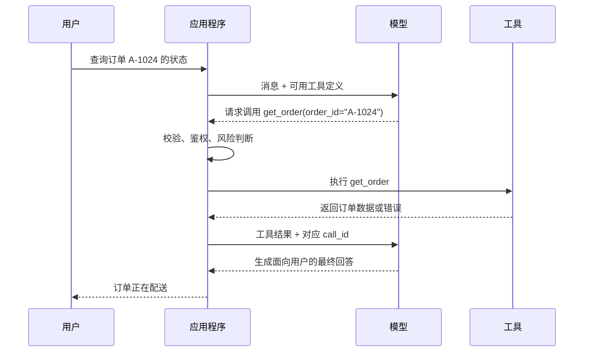

# 第 11 课：理解 Function Calling 与 Tool Use

> 所属章节：[第二章：Function Calling、Tool Runtime 与 MCP](./index.md)
>
> 上一课：[第 10 课：建立模型基线并完成 M1 验收](../chapter-01-llm-gateway/lesson-10-baseline-and-acceptance.md)
>
> 下一课：[第 12 课：定义统一 Tool Schema](./lesson-12-unified-tool-schema.md)

## 一、你将完成什么

第一章完成后，`agent-platform` 已经能够稳定调用模型、管理 Prompt、校验 Structured Output，并记录一次模型请求的延迟与用量。

但它仍然只能生成内容。即使模型回答“我已经查询了订单”，系统也无法确认它是否真的访问过订单服务。

这一课把模型输出从“只有文本”扩展为两种结果：

1. 直接返回文本；
2. 提出一个或多个工具调用请求。

你会完成以下内容：

1. 理解 Function Calling 与 Tool Use 的完整调用链；
2. 区分模型、Provider Adapter、Tool Runtime 与 Agent Loop 的职责；
3. 认识工具定义、工具调用和工具结果三类核心协议对象；
4. 处理单工具、并行多工具和依赖调用三种形态；
5. 理解工具描述为什么会影响模型的选择准确率；
6. 把工具结果与失败信息正确返回模型；
7. 实现一个有明确停止条件的最小工具调用回合。

本课不会实现正式的 Tool Registry，也不会执行 Shell、SQL、文件写入等真实高风险操作。后续课程会逐步补上 Schema、注册中心、权限、审批、超时、重试和审计。

## 二、Function Calling 到底做了什么

Function Calling 并不是让模型直接执行一个函数。

模型只做两件事：

- 根据当前对话和可见工具，判断是否需要调用工具；
- 生成工具名称和调用参数。

真正的执行者始终是应用程序。应用程序必须决定工具是否存在、参数是否合法、当前用户是否有权限，以及执行结果能否返回模型。

一轮完整的工具调用如下：



这里最容易产生的误解是：模型返回了工具参数，就代表工具已经执行成功。

实际上，模型输出的只是一个**调用提案**。在 Runtime 明确接受并完成执行之前，系统不能向用户声称操作已经发生。

### 2.1 Function Calling 与 Tool Use

课程中使用下面的定义：

- **Function Calling**：模型与应用之间交换工具定义、调用请求和调用结果的协议能力；
- **Tool Use**：从工具发现、选择、调用、执行、结果回传到失败处理的完整过程。

不同模型 API 可能把调用放在消息字段、内容块或独立响应项中，也可能使用不同的结束原因。字段名称会变化，但核心过程不变：

```text
声明能力 -> 模型提出调用 -> 应用受控执行 -> 返回结果 -> 模型继续生成
```

因此，业务层不应该直接依赖某个 Provider 的原始响应字段。Provider Adapter 应先把厂商协议转换成课程自己的统一对象。

## 三、先划清四个组件的边界

Function Calling、Tool Runtime、Agent Loop 和 MCP 经常一起出现，但它们解决的不是同一个问题。

| 组件 | 负责什么 | 不负责什么 |
| --- | --- | --- |
| 模型 Function Calling | 选择工具并生成候选参数 | 不直接执行工具，不决定最终权限 |
| Provider Adapter | 转换模型 API 与内部协议 | 不承载业务工具，不绕过 Runtime |
| Tool Runtime | 校验、鉴权、执行、超时、重试和审计 | 不负责长程任务规划 |
| Agent Loop | 决定何时继续观察、调用或结束 | 不替代具体工具的执行边界 |
| MCP | 统一外部能力的发现与连接方式 | 不替代本地权限、审批和审计策略 |

本课只实现一次有上限的：

```text
模型请求工具 -> 应用返回工具结果 -> 模型生成最终回答
```

如果第二次模型响应又提出新的工具调用，最小实现会停止并返回明确错误。第三章加入 Agent Loop 后，系统才会根据状态、步数和预算决定是否继续。

### 3.1 Structured Output 与 Function Calling 的区别

第一章的 Structured Output 和本章的 Function Calling 都会使用 JSON Schema，但目的不同：

| 能力 | 要解决的问题 | 结果交给谁 |
| --- | --- | --- |
| Structured Output | 模型应返回什么业务数据 | 直接交给应用或用户 |
| Function Calling | 模型希望应用执行什么能力 | 先交给 Tool Runtime |

例如，生成一份符合 Schema 的文章摘要属于 Structured Output；查询实时订单后再回答用户属于 Function Calling。

不要为了获得 JSON 而伪造工具，也不要把工具参数当成已经完成的业务结果。

## 四、认识三类核心协议对象

为了隔离 Provider 差异，先定义本章使用的最小内部协议。以下代码可以放在 `apps/api/app/tools/contracts.py` 中。

```python
from typing import Any, Literal

from pydantic import BaseModel, ConfigDict, Field


class ToolDefinition(BaseModel):
    model_config = ConfigDict(extra="forbid")

    name: str = Field(pattern=r"^[a-z][a-z0-9_]{0,63}$")
    description: str = Field(min_length=1, max_length=500)
    input_schema: dict[str, Any]


class ToolCall(BaseModel):
    model_config = ConfigDict(extra="forbid")

    call_id: str = Field(min_length=1)
    name: str = Field(min_length=1)
    arguments: dict[str, Any]


class AssistantTurn(BaseModel):
    text: str | None = None
    tool_calls: list[ToolCall] = Field(default_factory=list)


class ToolResult(BaseModel):
    model_config = ConfigDict(extra="forbid")

    call_id: str
    tool_name: str
    status: Literal["success", "error"]
    data: dict[str, Any] | None = None
    error_code: str | None = None
    error_message: str | None = None
```

这四个对象表达了一个稳定边界。

### 4.1 `ToolDefinition`：应用告诉模型“可以做什么”

工具定义不是 Python 函数本身，也不是网络地址。它是模型可见的能力说明：

```python
get_order_tool = ToolDefinition(
    name="get_order",
    description="根据完整订单编号查询订单的当前状态和最近一次更新时间。只用于读取订单，不会修改订单。",
    input_schema={
        "type": "object",
        "properties": {
            "order_id": {
                "type": "string",
                "description": "完整订单编号，例如 A-1024",
                "pattern": "^[A-Z]-[0-9]{4,12}$",
            }
        },
        "required": ["order_id"],
        "additionalProperties": False,
    },
)
```

`input_schema` 告诉模型应该生成哪些参数。它也为 Runtime 的执行前校验提供依据，但模型按 Schema 生成并不等于输入可信。第 12 课会把这个最小定义扩展成包含输出、错误、版本和风险策略的统一 Tool Schema。

### 4.2 `ToolCall`：模型提出“希望调用什么”

模型可能返回：

```json
{
  "call_id": "call_01",
  "name": "get_order",
  "arguments": {
    "order_id": "A-1024"
  }
}
```

`call_id` 是这一轮调用的关联标识，必须原样保存。多个调用即使使用同一个工具，也要有不同的 `call_id`。

Provider 有时会把 `arguments` 返回为 JSON 字符串，流式响应还可能把它拆成多个片段。这些差异应由 Adapter 完成拼接和解析；进入业务层的 `ToolCall.arguments` 必须已经是对象。

### 4.3 `ToolResult`：应用声明“实际发生了什么”

成功结果可以表示为：

```json
{
  "call_id": "call_01",
  "tool_name": "get_order",
  "status": "success",
  "data": {
    "order_id": "A-1024",
    "status": "shipping",
    "updated_at": "2026-08-12T09:30:00+08:00"
  },
  "error_code": null,
  "error_message": null
}
```

失败结果也应该结构化：

```json
{
  "call_id": "call_01",
  "tool_name": "get_order",
  "status": "error",
  "data": null,
  "error_code": "order_not_found",
  "error_message": "没有找到订单 A-1024"
}
```

不要把异常堆栈、数据库连接信息或内部路径直接返回模型。模型需要的是可判断、可解释的结果，不是服务内部细节。

## 五、模型如何选择工具

模型选择工具时，主要依赖当前对话、工具名称、描述和参数 Schema。工具代码写得多漂亮，模型并看不到。

因此，工具描述本身就是运行时协议的一部分。

### 5.1 一个模糊描述为什么容易选错

下面的描述信息不足：

```text
名称：order
描述：处理订单
```

模型无法判断它用于查询、取消、退款还是修改地址，也不知道调用后是否产生副作用。

更好的拆分方式是：

```text
get_order
根据完整订单编号读取订单状态和更新时间，不修改任何数据。

cancel_order
取消一个尚未发货的订单。该操作会修改订单状态，需要用户明确确认。
```

拆分后，名称表达动作，描述说明适用条件和副作用，Schema 约束必要参数。权限仍然由 Runtime 判断，不能仅靠描述中的“需要确认”保护真实操作。

### 5.2 编写工具描述的五条规则

1. **名称稳定且表达动作**：优先使用 `get_order`、`search_documents`，不要使用 `tool_1`；
2. **说明何时使用**：写清适用任务和前置条件；
3. **说明何时不要使用**：有相似工具时尤其重要；
4. **明确副作用**：读取、写入、删除、发送等行为不能含糊；
5. **字段语义具体**：参数描述要包含格式、单位、范围或示例。

描述不应包含 API Key、内部地址或对模型无用的实现细节。工具数量很多时，也不应把所有工具无条件发送给模型；第 13 课会通过 Registry 和可见性过滤缩小候选集合。

### 5.3 `auto`、`required` 与指定工具

常见模型 API 会提供三类选择策略：

| 策略 | 含义 | 适用场景 |
| --- | --- | --- |
| `auto` | 模型可以回答，也可以调用工具 | 普通对话默认值 |
| `required` | 模型必须选择至少一个工具 | 输入必须落入某个外部流程时 |
| 指定工具 | 只能选择某个工具 | 上游已经完成可靠路由时 |

`required` 并不会让不相关的工具突然变得合理。候选工具错误或参数缺失时，强制调用只会产生一个看似结构化的错误决定。

## 六、三种调用形态

### 6.1 单工具调用

用户问“订单 A-1024 到哪里了”，模型请求一次 `get_order`。应用执行并返回结果，模型再生成最终回答。

这是本课最小实现覆盖的主要路径。

### 6.2 多个互相独立的工具调用

用户问“比较北京和上海今天的天气”，模型可能在同一轮提出两个调用：

```json
[
  {
    "call_id": "call_beijing",
    "name": "get_weather",
    "arguments": {"city": "北京"}
  },
  {
    "call_id": "call_shanghai",
    "name": "get_weather",
    "arguments": {"city": "上海"}
  }
]
```

两个调用没有数据依赖，可以并发执行，但结果顺序不一定等于完成顺序。系统必须使用 `call_id` 关联结果，不能依赖数组下标或工具名称。

本课只识别这种形态；第 15 课再实现并发上限、超时和部分失败策略。

### 6.3 存在依赖的连续调用

用户说“找到最近的订单并查询物流”。系统可能需要：

```text
第 1 轮：list_recent_orders -> 得到 order_id
第 2 轮：get_shipping(order_id) -> 得到物流
第 3 轮：生成最终回答
```

第二个调用依赖第一个结果，模型无法在第一轮可靠地同时生成两个完整参数。它需要观察第一次结果后再决定下一步。

这已经进入 Agent Loop 的范围。本课可以解释和识别它，但不会用无限 `while` 循环把它偷偷实现出来。

## 七、工具结果如何返回模型

工具执行完成后，应用需要把两部分信息放回对话：

1. 模型上一轮提出的工具调用；
2. 每个 `call_id` 对应的工具结果。

概念上可以表示为：

```json
[
  {
    "role": "assistant",
    "tool_calls": [
      {
        "call_id": "call_01",
        "name": "get_order",
        "arguments": {"order_id": "A-1024"}
      }
    ]
  },
  {
    "role": "tool",
    "tool_call_id": "call_01",
    "content": {
      "status": "success",
      "data": {"order_id": "A-1024", "status": "shipping"}
    }
  }
]
```

实际字段由 Provider Adapter 映射。内部协议只需要保证关联关系和结果语义不丢失。

### 7.1 返回结果的四条原则

- **可关联**：结果必须携带原始 `call_id`；
- **可判断**：成功和失败要使用稳定状态与错误码；
- **足够精简**：只返回模型完成当前任务所需的数据；
- **视为不可信输入**：网页、文件和第三方 API 的文本可能包含恶意指令，不能自动提升为系统指令。

工具结果过大时需要截断、分页或保存为资源引用。输入输出限制与脱敏会在第 14 和第 17 课实现。

### 7.2 工具失败后还要不要再问模型

取决于错误是否适合让模型解释或修正：

| 失败类型 | 建议处理 |
| --- | --- |
| 业务上未找到数据 | 返回稳定错误结果，让模型向用户解释 |
| 可修正的参数错误 | 返回字段级错误，由有上限的 Loop 决定是否重试 |
| 未知工具 | Runtime 拒绝，记录协议错误，不猜测相近名称执行 |
| 未授权或审批拒绝 | 明确终止，不允许模型通过换一种说法绕过 |
| 内部异常 | 返回通用错误码，隐藏内部细节并记录 Trace |

模型可以帮助组织语言，但不能覆盖 Runtime 已经做出的权限和风险决定。

## 八、实现一个有边界的最小调用回合

为了验证协议，我们先定义两个依赖接口：一个负责和模型交换工具协议，一个代表后续要实现的 Tool Runtime。

```python
from collections.abc import Sequence
from typing import Protocol

from app.schemas import ChatMessage
from app.tools.contracts import (
    AssistantTurn,
    ToolCall,
    ToolDefinition,
    ToolResult,
)


class ToolCallingProvider(Protocol):
    async def complete_with_tools(
        self,
        *,
        messages: Sequence[ChatMessage | dict[str, object]],
        tools: Sequence[ToolDefinition],
    ) -> AssistantTurn: ...


class ToolExecutor(Protocol):
    async def execute(self, call: ToolCall) -> ToolResult: ...
```

`ToolCallingProvider` 由 Provider Adapter 实现，负责把内部对象映射成具体模型 API。`ToolExecutor` 当前可以使用课堂提供的内存实现；第 14 课会把它替换成正式执行链。

接着实现一次受限的工具调用：

```python
class ToolUseError(Exception):
    pass


class ToolUseService:
    def __init__(
        self,
        *,
        provider: ToolCallingProvider,
        executor: ToolExecutor,
        max_calls_per_turn: int = 4,
    ) -> None:
        self.provider = provider
        self.executor = executor
        self.max_calls_per_turn = max_calls_per_turn

    async def run_once(
        self,
        *,
        messages: list[ChatMessage | dict[str, object]],
        tools: list[ToolDefinition],
    ) -> str:
        first_turn = await self.provider.complete_with_tools(
            messages=messages,
            tools=tools,
        )

        if not first_turn.tool_calls:
            return first_turn.text or ""

        if len(first_turn.tool_calls) > self.max_calls_per_turn:
            raise ToolUseError("too_many_tool_calls")

        results = [
            await self.executor.execute(call)
            for call in first_turn.tool_calls
        ]
        follow_up_messages = [
            *messages,
            {
                "role": "assistant",
                "text": first_turn.text,
                "tool_calls": [
                    call.model_dump() for call in first_turn.tool_calls
                ],
            },
            *[
                {
                    "role": "tool",
                    "tool_call_id": result.call_id,
                    "content": result.model_dump_json(),
                }
                for result in results
            ],
        ]
        final_turn = await self.provider.complete_with_tools(
            messages=follow_up_messages,
            tools=tools,
        )

        if final_turn.tool_calls:
            raise ToolUseError("additional_tool_round_not_supported")

        return final_turn.text or ""
```

这段代码故意保持简单，但包含四个不能省略的停止条件：

1. 模型没有调用工具时直接返回文本；
2. 一轮调用数量不能超过上限；
3. 工具结果必须带着原始关联信息返回模型；
4. 第二次响应再次请求工具时明确停止。

当前版本串行执行多个调用。不要为了追求并发，直接把真实工具塞进 `gather()`：不同工具的并发上限、取消、依赖和副作用策略尚未定义。第 15 课会专门处理这些问题。

### 8.1 为什么不检查一个固定的结束字段

有些模型 API 使用 `finish_reason` 表示工具调用，有些把调用作为内容块或响应项。更稳定的内部判断是：

```python
if first_turn.tool_calls:
    # 进入工具调用分支
```

Adapter 可以保留原始结束原因用于 Trace，但业务服务不应把控制流绑定到某个 Provider 的字符串常量。

### 8.2 本课的内存执行器应该做什么

为了不提前实现 Runtime，本课的执行器只需要支持一个确定性的只读工具：

```python
class DemoOrderExecutor:
    async def execute(self, call: ToolCall) -> ToolResult:
        if call.name != "get_order":
            return ToolResult(
                call_id=call.call_id,
                tool_name=call.name,
                status="error",
                error_code="tool_not_found",
                error_message="请求的工具不存在",
            )

        order_id = call.arguments.get("order_id")
        if order_id != "A-1024":
            return ToolResult(
                call_id=call.call_id,
                tool_name=call.name,
                status="error",
                error_code="order_not_found",
                error_message="没有找到该订单",
            )

        return ToolResult(
            call_id=call.call_id,
            tool_name=call.name,
            status="success",
            data={
                "order_id": order_id,
                "status": "shipping",
                "updated_at": "2026-08-12T09:30:00+08:00",
            },
        )
```

它只是协议夹具，不是生产工具实现。它没有版本、完整 Schema 校验、身份、权限、超时和审计，所以不能直接扩展成真实订单服务。

## 九、必须覆盖的五条验证路径

本课不以“模型偶尔选对一次”为完成标准。至少手动验证下面五种响应：

| 场景 | Provider 第一轮响应 | 期望行为 |
| --- | --- | --- |
| 无需工具 | 只有文本 | 直接返回文本，不执行工具 |
| 单工具成功 | 一个合法调用 | 执行一次，回传结果，得到最终文本 |
| 多工具请求 | 两个独立调用 | 每个 `call_id` 都得到对应结果 |
| 工具失败 | 工具返回稳定错误 | 错误结果回传模型，不伪造成成功 |
| 依赖调用 | 第二轮再次请求工具 | 返回 `additional_tool_round_not_supported` |

建议使用可控的 Mock Provider 固定以上响应。真实模型只用于观察工具描述对选择结果的影响，不作为协议验证的唯一依据。

同时记录每次模型交换的最小信息：

- `run_id`；
- 模型与 Provider；
- 可见工具名称；
- `call_id`、工具名和参数；
- 工具结果状态；
- 本轮停止原因。

本课先确认这些字段存在。第 17 和第 20 课会把它们整理成正式审计记录与 Tool Call Trace。

## 十、常见错误

### 10.1 模型返回调用后，应用直接告诉用户“操作成功”

模型输出只是调用提案。必须等 Runtime 返回成功结果后，才能描述操作已经完成。

### 10.2 通过 `if tool_name == ...` 无限扩展业务分支

少量分支适合本课演示，不适合作为正式架构。第 13 课会通过 Registry 管理注册、发现和版本。

### 10.3 信任模型生成的参数

Schema 能提高生成正确率，不能证明参数安全。所有参数仍需在执行前校验、鉴权和做作用域限制。

### 10.4 把所有工具都发给模型

候选越多、描述越相似，选择越容易出错，Prompt 成本也越高。工具集合应根据身份、任务和环境过滤。

### 10.5 工具失败后只返回自然语言

“查询失败了”缺少稳定错误码和关联 ID，模型与观测系统都无法可靠判断发生了什么。

### 10.6 用无限循环处理连续调用

没有最大步数、时间、Token 和成本预算的循环，会把一次错误选择放大成失控任务。连续调用留给第三章的 Agent Loop。

## 十一、课堂练习

为下面三个工具分别编写名称、描述和 Input Schema：

1. 在代码仓库中搜索文本，只读；
2. 读取指定路径的文件，只读；
3. 创建 Issue，会产生外部写操作。

然后回答以下问题：

- 搜索结果为空，是工具失败还是成功但没有数据？
- 用户没有提供文件路径时，应该强制模型调用工具吗？
- 创建 Issue 前，模型的调用提案能否视为用户已经确认？
- “先搜索文件，再读取搜索结果中的第一个文件”属于并行调用还是依赖调用？

最后，用同一组 10 条用户问题比较两版工具描述，记录模型选择正确的次数。这里只做最小人工对比，第六章会把这类案例纳入 Golden Dataset 和自动评测。

## 十二、完成标准

完成本课后，你应该能够做到：

- 清楚解释“模型提出调用”和“应用执行工具”的区别；
- 画出消息、调用请求、工具结果和最终回答之间的关系；
- 使用内部对象隔离不同 Provider 的工具调用字段；
- 正确关联多个 `call_id` 与工具结果；
- 区分单调用、并行调用和依赖调用；
- 将业务失败作为结构化结果返回，而不是伪造成成功；
- 在最小实现中限制调用数量和工具轮数；
- 解释 Function Calling、Tool Runtime、Agent Loop 与 MCP 的职责边界。

## 十三、本课小结

Function Calling 为模型增加的不是执行权限，而是一种表达调用意图的结构化协议。

一个可靠的工具调用过程至少包含：工具定义、模型调用提案、应用受控执行、关联结果回传和明确停止条件。模型负责选择和生成参数，Provider Adapter 负责协议转换，Tool Runtime 负责执行边界，Agent Loop 负责多步决策。

下一课会把本课的 `ToolDefinition` 扩展成正式的统一 Tool Schema，为每个工具补上输入、输出、错误、版本、风险和执行策略契约。
