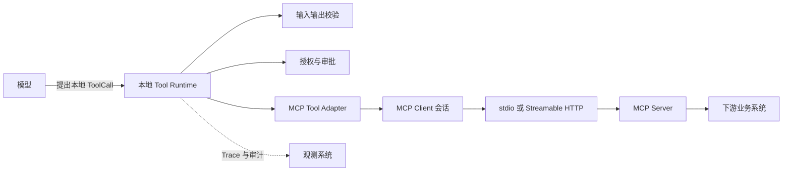
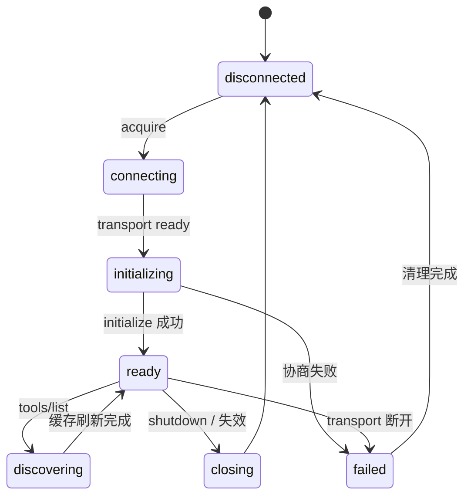

# 第 11 课：理解 MCP 协议与 Transport

> 章节导航：[第二章：Function Calling、Tool Runtime 与 MCP](./index.md)  
> 上一课：[第 10 课：建立审计、Trace 与风险回放](./lesson-10-tool-audit-recovery.md)<br>
> 下一课：[第 12 课：将 MCP Client 接入 Tool Runtime](./lesson-12-mcp-client-runtime-integration.md)

## 一、你将完成什么

本课先建立 MCP 的协议边界和连接基础：

1. 区分 MCP 与模型 Tool Calling、本地 Runtime、Agent Loop 的职责。
2. 理解 Tools、Resources、Prompts 与 Client、Server 的关系。
3. 比较 `stdio` 与 Streamable HTTP 的故障和信任边界。
4. 实现显式的连接、初始化、能力协商、关闭与重连生命周期。
5. 把能力发现视为需要校验和固定版本的外部配置输入。

完成本课后，你应能说明本课能力在 Tool Runtime 中的位置，并用测试或可查询证据证明它确实生效。

## 二、MCP 解决什么，不解决什么

MCP 是应用层协议。Client 与 Server 通过受管理的传输连接交换结构化请求、响应和通知；它不等同于模型函数，也不替代业务授权。

| 组件 | 负责什么 | 不负责什么 |
| --- | --- | --- |
| MCP Client | 建立会话、协商能力、发现和调用远程能力 | 判断用户是否有业务权限 |
| MCP Server | 声明并实现工具、资源、提示词等能力 | 信任模型写入的身份或审批结论 |
| Transport | 传递消息、维护连接、报告断开 | 解释业务语义 |
| Tool | 可由 Client 调用、可能有副作用的操作 | 自动获得本地 Runtime 的权限 |
| Resource | 可读取的具名上下文或数据 | 自动进入模型上下文 |
| Prompt | Server 提供的参数化消息模板 | 改变系统提示词或开启工具权限 |
| 本地 Tool Runtime | 校验、授权、审批、执行策略、结果标准化 | 信任任意远程 Server |



模型只应看见经 Registry 与可见性策略筛选后的**本地**工具名。它不应知道 Server URL、子进程命令、访问令牌或原始协议错误。

### 2.1 Tools、Resources 与 Prompts 不可混用

| MCP 能力 | 典型用途 | 本地接入方式 |
| --- | --- | --- |
| `tools/list`、`tools/call` | 查订单、创建工单、写入文件 | 映射为 `ToolSpec`，经过完整 Runtime |
| `resources/list`、`resources/read` | 文档、配置片段、只读数据 | 单独的受限上下文读取入口，校验 URI 与内容 |
| `prompts/list`、`prompts/get` | 维护的任务模板 | 作为外部模板，审核消息后才进入上下文 |

不要为了“统一”把 Resource 伪装成 Tool 后自动读取全部内容。资源 URI 可能指向敏感对象，内容也可能包含提示注入。也不要让 Server 提供的 Prompt 自动覆盖系统提示词或获得工具权限。它们都是外部输入。

## 三、传输方式决定故障模型

常见部署使用 `stdio` 或 Streamable HTTP。选择并不只看开发方便，还要看信任边界、网络路径、连接寿命和运维能力。

| Transport | 适用场景 | 优点 | 必须处理的风险 |
| --- | --- | --- | --- |
| `stdio` | 本机命令行工具、受控容器 sidecar | 不暴露网络端口，进程边界清晰 | 可执行文件路径、环境变量、子进程退出、输出污染 |
| Streamable HTTP | 远程服务、共享平台、负载均衡后部署 | 易于跨网络、认证和扩缩容 | SSRF、重定向、TLS、代理、会话恢复、未知结果 |

旧式 HTTP+SSE 的部署也可能存在。具体传输能力以所选 SDK 与目标 Server 的兼容性为准；不能假设所有 HTTP MCP Server 都具有相同会话和恢复语义。

### 3.1 `stdio` 是受控子进程

下面的写法把模型输入拼进 shell，存在命令注入与环境泄露问题：

```python
# 不要这样做。
subprocess.Popen(f"npx -y {user_supplied_package}", shell=True)
```

部署配置应维护不可变的命令、参数、工作目录与最小环境，并以参数数组启动：

```python
from dataclasses import dataclass
from pathlib import Path


@dataclass(frozen=True)
class StdioServerConfig:
    server_id: str
    command: str
    args: tuple[str, ...]
    cwd: Path
    allowed_env: dict[str, str]


GITHUB_SERVER = StdioServerConfig(
    server_id="github-internal",
    command="/opt/agent/mcp/github-server",
    args=("--mode", "readonly"),
    cwd=Path("/var/empty"),
    allowed_env={"LANG": "C.UTF-8"},
)
```

`server_id` 只能来自可信配置，而非 ToolCall 参数。不要继承整个进程环境：云凭证、数据库密码、代理设置与调试变量都可能被子进程读取。每个 Server 应有独立运行身份、CPU/内存上限和退出监控。

### 3.2 HTTP endpoint 是 SSRF 边界

模型和普通用户都不能传入 MCP endpoint。连接目标来自平台配置 allowlist，发起连接前再次解析与校验：

```python
from urllib.parse import urlparse


ALLOWED_MCP_ORIGINS = {
    "https://mcp.github.internal",
    "https://mcp.search.internal",
}


def validate_mcp_endpoint(endpoint: str) -> str:
    parsed = urlparse(endpoint)
    origin = f"{parsed.scheme}://{parsed.netloc}"
    if parsed.scheme != "https" or origin not in ALLOWED_MCP_ORIGINS:
        raise ValueError("mcp_server_not_allowed")
    if parsed.username or parsed.password or parsed.fragment:
        raise ValueError("invalid_mcp_endpoint")
    return endpoint
```

生产实现还应限制重定向、校验 DNS 实际解析结果不得进入 loopback、link-local 和内部控制平面网段，并防止 DNS rebinding。仅检查 URL 前缀无法阻挡伪造 hostname 或用户信息部分的绕过。

## 四、建立显式会话生命周期

不能在每次工具调用时“拿 URL 发请求”。MCP 会话需要初始化、版本与能力协商，并在关闭时释放 transport 和子进程。



### 4.1 初始化是必需握手

初始化阶段应完成：

1. 创建 transport，设定连接、空闲与总时限；
2. 发送 `initialize`，声明 Client 的协议版本和能力；
3. 验证 Server 返回的协议版本、Server 信息与声明能力；
4. 发送初始化完成通知，API 名称以所选 SDK 为准；
5. 将协商结果绑定到连接代次（generation），再允许发现或调用。

```python
from dataclasses import dataclass
from enum import StrEnum


class SessionState(StrEnum):
    DISCONNECTED = "disconnected"
    INITIALIZING = "initializing"
    READY = "ready"
    FAILED = "failed"
    CLOSING = "closing"


@dataclass(frozen=True)
class NegotiatedServer:
    server_id: str
    protocol_version: str
    server_name: str
    server_version: str
    supports_tools: bool
    generation: int


class McpSession:
    async def initialize(self) -> NegotiatedServer:
        if self._state not in {SessionState.DISCONNECTED, SessionState.FAILED}:
            raise RuntimeError("invalid_mcp_session_state")
        self._state = SessionState.INITIALIZING
        try:
            result = await self._sdk_session.initialize(
                client_info={"name": "agent-platform", "version": "1.0.0"},
                capabilities={"roots": {"listChanged": False}},
            )
            self._validate_initialize_result(result)
            await self._sdk_session.send_initialized_notification()
            self._generation += 1
            self._state = SessionState.READY
            return NegotiatedServer(
                server_id=self.server_id,
                protocol_version=result.protocol_version,
                server_name=result.server_info.name,
                server_version=result.server_info.version,
                supports_tools=bool(result.capabilities.tools),
                generation=self._generation,
            )
        except Exception:
            self._state = SessionState.FAILED
            await self.close()
            raise
```

未协商的 Client 无法可靠判断可用能力、版本不兼容和通知行为。协议版本不兼容属于配置或发布错误，不能悄悄降级成普通工具失败。

### 4.2 会话所有权与并发

共享连接能否并发请求取决于 transport、SDK 和 Server 的保证。异步函数能 `gather`，不代表 Server 能安全处理并发写操作。

```python
class McpSessionManager:
    def __init__(self, factory: "SessionFactory") -> None:
        self._factory = factory
        self._sessions: dict[str, McpSession] = {}
        self._locks: dict[str, asyncio.Lock] = {}

    async def acquire_ready(self, server_id: str) -> McpSession:
        lock = self._locks.setdefault(server_id, asyncio.Lock())
        async with lock:
            current = self._sessions.get(server_id)
            if current and current.is_ready:
                return current
            replacement = await self._factory.connect(server_id)
            await replacement.initialize()
            self._sessions[server_id] = replacement
            return replacement
```

这个锁只保护建连与替换，不自动保证调用可并发。对于不支持多路复用的 Server，应按 Server 串行化或使用有限会话池。写操作的并发正确性仍由第 5–6 课的幂等键和执行策略保证。

## 五、能力发现是受控配置输入

`tools/list` 返回的是 Server 对“它能做什么”的声明，不是本地自动信任的注册表。发现结果必须经过 namespace、Schema、策略、版本和可见性校验，再写入本地 Registry。

```python
from dataclasses import dataclass
from typing import Any


@dataclass(frozen=True)
class DiscoveredMcpTool:
    server_id: str
    remote_name: str
    description: str
    input_schema: dict[str, Any]
    annotations: dict[str, Any]


async def discover_tools(session: McpSession) -> list[DiscoveredMcpTool]:
    result = await session.list_tools()
    return [
        DiscoveredMcpTool(
            server_id=session.server_id,
            remote_name=tool.name,
            description=tool.description or "",
            input_schema=tool.input_schema,
            annotations=tool.annotations or {},
        )
        for tool in result.tools
    ]
```

### 5.1 本地名必须带 Server 命名空间

两个 Server 都可能声明 `search` 或 `read_file`。直接按远程名注册会覆盖实现，也让审计无法回答“实际调用了谁”。本地名应由可信 `server_id` 与远程名组成，例如 `mcp.github_internal.search_issues`。

```python
import re


REMOTE_TOOL_NAME = re.compile(r"^[a-z][a-z0-9_]{0,63}$")


def local_mcp_tool_name(server_id: str, remote_name: str) -> str:
    if not REMOTE_TOOL_NAME.fullmatch(remote_name):
        raise ValueError("invalid_remote_tool_name")
    return f"mcp.{server_id.replace('-', '_')}.{remote_name}"
```

`server_id` 是经过审核的稳定配置，不能使用远程 `serverInfo.name`。Server 升级、改名或被劫持时，本地权限策略不能跟着它的自述漂移。

### 5.2 输入 Schema 需要二次校验

MCP Tool 的输入契约通常是 JSON Schema，但本地 `ToolSpec` 还包含输出 Schema、权限、风险、超时、重试、幂等和审计策略。远程输入 Schema 不能单独构成可执行契约。

| 字段 | 来源 | 本地处理 |
| --- | --- | --- |
| 名称、描述、输入 Schema | `tools/list` | 语法校验、长度限制、审查和固定快照 |
| 输出 Schema | 平台契约或受版本控制的适配配置 | 不因远程未声明而跳过验证 |
| 权限、风险、审批 | 本地安全策略 | 不接受远程声明为准 |
| 超时、重试、并发、幂等 | 本地执行策略 | 根据副作用和下游语义配置 |
| 模型可见性 | 本地 Registry | 按租户、角色、环境过滤 |

```python
def to_local_spec(tool: DiscoveredMcpTool, policy: "McpToolPolicy") -> "ToolSpec":
    validate_json_schema(tool.input_schema, max_depth=8, max_properties=100)
    if not policy.allows_remote_name(tool.remote_name):
        raise ValueError("remote_tool_not_allowed")
    return ToolSpec(
        name=local_mcp_tool_name(tool.server_id, tool.remote_name),
        version=policy.contract_version,
        description=policy.public_description or tool.description[:500],
        input_schema=tool.input_schema,
        output_schema=policy.output_schema,
        permissions=policy.permissions,
        execution=policy.execution,
        approval=policy.approval,
    )
```

本地版本是**适配契约版本**，不是伪造的远程版本。审计还应保留 `remote_server_id`、协商到的 Server 版本、连接 generation 和发现快照摘要，才能定位 Server 更新带来的行为变化。

### 5.3 发现缓存必须有失效语义

每次调用都 `tools/list` 会增加延迟，并把 Server 抖动放大成全站故障；永久缓存则会继续暴露已删除或变更的能力。发现结果应是有 TTL 的配置快照：

```python
@dataclass(frozen=True)
class ToolCatalogSnapshot:
    server_id: str
    generation: int
    digest: str
    tools: tuple[DiscoveredMcpTool, ...]
    fetched_at: datetime
    expires_at: datetime


async def get_catalog(server_id: str, now: datetime) -> ToolCatalogSnapshot:
    snapshot = await catalog_store.get(server_id)
    if snapshot and snapshot.expires_at > now and session_manager.matches(snapshot):
        return snapshot
    session = await session_manager.acquire_ready(server_id)
    tools = await discover_tools(session)
    refreshed = build_snapshot(session, tools, now, ttl=timedelta(minutes=5))
    await validate_and_publish(refreshed)
    return refreshed
```

能力列表变化通知可以触发提前刷新，但不能是唯一机制，通知可能丢失。刷新失败时可在短暂 `stale-if-error` 窗口使用**已审核且仍符合本地策略**的快照；不能用失败响应中的半截列表替换健康快照。高风险工具可要求调用前确认 catalog generation 未变化。

## 六、完成标准

- 能准确解释 MCP 提供互操作协议，但不替代本地授权、审批与审计。
- Transport 选择与进程、网络、认证和故障模型相匹配。
- 连接生命周期具有明确状态、超时、关闭和重连行为。
- Server 返回的能力清单经过限制、校验和版本记录后才可进入本地系统。

## 七、本课小结

本课完成了 MCP Client 的协议和会话基础，但远程工具仍不能绕过本地平台策略。下一课会把发现到的能力映射为本地契约，并接入已有 Tool Runtime。
