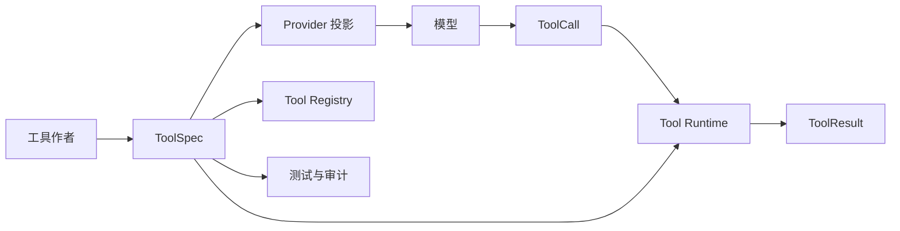

# 第 12 课：定义统一 Tool Schema

> 所属章节：[第二章：Function Calling、Tool Runtime 与 MCP](./index.md)<br>
> 上一课：[第 11 课：理解 Function Calling 与 Tool Use](./lesson-11-function-calling-tool-use.md)<br>
> 下一课：[第 13 课：实现 Tool Registry](./lesson-13-tool-registry.md)

## 一、你将完成什么

第 11 课中，`ToolDefinition` 只有名称、描述和输入 Schema。它足以让模型提出一次调用，却不足以支撑一个真正的工具运行时：调用成功时结果长什么样？哪些错误可以返回模型？谁能调用它？默认多久超时？同名工具升级后如何避免旧调用悄悄改变含义？这些问题都还没有契约。

这一课把最小工具定义扩展为统一 `ToolSpec`。它是工具作者、Provider Adapter、Tool Runtime、Registry、审计系统之间共享的事实来源。

完成后，你会得到：

1. 一套带身份、输入、输出、错误、安全和执行策略的 Tool Schema；
2. 一个只向模型暴露必要字段的 Provider 投影；
3. 输入、输出和错误的边界校验；
4. 可预测的 Schema 版本与兼容性规则；
5. 用确定性测试验证契约，而不是依赖模型偶然生成正确参数。

本课定义并校验契约，不实现工具发现、真实执行、权限判定、审批、重试和并发调度。这些职责会在后续课次逐步接入这个契约。

## 二、为什么不能只保留 Input Schema

只保留输入 Schema 的工具，像一个只写了函数名和参数、没有返回值和异常说明的 SDK。调用者只能猜测，运行时也无法统一处理边界情况。

以“取消订单”为例：

```text
cancel_order(order_id)
```

仅凭这一行，系统无法知道：

- 返回的是取消后的订单、受理编号，还是空值；
- `order_not_found`、`order_already_shipped` 是否是可预期业务结果；
- 这个操作是否产生外部副作用；
- 是否必须具有 `orders:write` 权限或等待用户审批；
- 网络抖动时是否可以重试；
- 新版本是否仍然保持相同语义。

统一 Schema 的目的不是让模型看到更多内部配置，而是把这些规则从散落的 `if` 分支收敛为可读、可校验、可测试的合同。



同一份 `ToolSpec` 有多个消费者，但每个消费者只读取自己的字段。模型需要名称、描述和输入 Schema；Runtime 需要完整策略；Registry 需要身份与版本；审计需要解析后的契约版本。不要为每个消费者复制一份近似定义。

## 三、先确定 Schema 的边界

一个工具契约至少回答六个问题：

| 部分 | 要回答的问题 | 示例 |
| --- | --- | --- |
| 身份 | 这是哪个稳定能力、哪个版本？ | `get_order@1.0.0` |
| 输入 | 可以接受什么数据，哪些字段必填？ | `order_id` 必须匹配订单编号格式 |
| 输出 | 成功时返回什么结构？ | 订单状态与更新时间 |
| 错误 | 预期失败如何分类，能否安全暴露？ | `order_not_found` |
| 安全 | 副作用、风险、权限和确认要求是什么？ | 写操作、`orders:write`、需要确认 |
| 执行 | 此工具声明的时间和重试边界是什么？ | 3 秒，最多 1 次尝试 |

这里的“声明”尤其重要。`timeout_ms=3000` 并不代表工具作者可以绕过 Runtime 自己无限执行 30 秒；Runtime 还会应用全局上限。`max_attempts=1` 也不代表已经实现重试，它只是提前记录此工具允许的最大策略。第 15 课才会实现实际调度。

### 3.1 Tool Schema 不是模型工具格式

OpenAI Compatible、Anthropic、Gemini 或 MCP 的工具描述格式各不相同。业务代码若直接保存某家 Provider 的 `function.parameters`，以后就会把模型协议、风险策略和工具实现绑死。

课程中的方向是：

```text
内部 ToolSpec -> Provider Adapter -> 厂商工具格式
厂商调用响应 -> Provider Adapter -> 内部 ToolCall
```

内部对象是应用的稳定边界；厂商格式只是边缘适配。MCP Tool 的 `inputSchema` 也可以被映射到同一份内部输入 Schema，但 MCP 不会替本地 Runtime 做授权和审计。

### 3.2 输入与输出都使用 JSON Schema

JSON Schema 适合作为这一层的结构语言：Provider 普遍支持输入 JSON Schema，Python 运行时可以独立验证，其他语言实现也可复用。课程示例使用 Draft 2020-12。

Schema 只能检查数据形状，不能替代业务规则。例如“订单属于当前用户”“订单还未发货”“金额未超过额度”都依赖身份和业务状态，应由后续 Runtime 和具体工具判断。

## 四、定义稳定的内部契约

在 `apps/api/app/tools/contracts.py` 中，用 Pydantic 定义 Schema 的元数据与调用结果。下面的代码替换第 11 课的最小 `ToolDefinition`；`ToolCall` 保持为模型调用提案，`ToolResult` 扩展为完整结果信封。

```python
from enum import StrEnum
from typing import Any, Literal

from pydantic import BaseModel, ConfigDict, Field, field_validator, model_validator


JsonObject = dict[str, Any]


class ToolRisk(StrEnum):
    READ = "read"
    WRITE = "write"
    HIGH = "high"


class SideEffect(StrEnum):
    NONE = "none"
    REVERSIBLE = "reversible"
    EXTERNAL = "external"
    IRREVERSIBLE = "irreversible"


class RetryMode(StrEnum):
    NEVER = "never"
    IDEMPOTENT_ONLY = "idempotent_only"


class ToolErrorSpec(BaseModel):
    model_config = ConfigDict(extra="forbid", frozen=True)

    code: str = Field(pattern=r"^[a-z][a-z0-9_]{0,63}$")
    description: str = Field(min_length=1, max_length=300)
    retryable: bool = False
    expose_to_model: bool = True


class ToolSecurityPolicy(BaseModel):
    model_config = ConfigDict(extra="forbid", frozen=True)

    risk: ToolRisk
    side_effect: SideEffect
    required_permissions: tuple[str, ...] = ()
    requires_confirmation: bool = False

    @model_validator(mode="after")
    def require_protection_for_writes(self) -> "ToolSecurityPolicy":
        if self.risk is ToolRisk.READ and self.side_effect is not SideEffect.NONE:
            raise ValueError("read tools cannot declare side effects")
        if self.side_effect is SideEffect.IRREVERSIBLE:
            if self.risk is not ToolRisk.HIGH or not self.requires_confirmation:
                raise ValueError(
                    "irreversible tools must be high risk and require confirmation"
                )
        return self


class ToolExecutionPolicy(BaseModel):
    model_config = ConfigDict(extra="forbid", frozen=True)

    timeout_ms: int = Field(ge=100, le=60_000)
    max_attempts: int = Field(ge=1, le=3, default=1)
    retry_mode: RetryMode = RetryMode.NEVER
    idempotency_key_required: bool = False

    @model_validator(mode="after")
    def only_retry_idempotent_operations(self) -> "ToolExecutionPolicy":
        if self.max_attempts > 1 and self.retry_mode is RetryMode.NEVER:
            raise ValueError("retry_mode is required when max_attempts is greater than 1")
        if self.retry_mode is RetryMode.IDEMPOTENT_ONLY:
            if not self.idempotency_key_required:
                raise ValueError("retries require an idempotency key")
        return self


class ToolSpec(BaseModel):
    model_config = ConfigDict(extra="forbid", frozen=True)

    name: str = Field(pattern=r"^[a-z][a-z0-9_]{0,63}$")
    version: str = Field(pattern=r"^[0-9]+\.[0-9]+\.[0-9]+$")
    description: str = Field(min_length=1, max_length=500)
    input_schema: JsonObject
    output_schema: JsonObject
    errors: tuple[ToolErrorSpec, ...] = ()
    security: ToolSecurityPolicy
    execution: ToolExecutionPolicy

    @field_validator("input_schema", "output_schema")
    @classmethod
    def require_object_schema(cls, value: JsonObject) -> JsonObject:
        if value.get("type") != "object":
            raise ValueError("tool schemas must have type=object")
        return value

    @model_validator(mode="after")
    def reject_duplicate_error_codes(self) -> "ToolSpec":
        codes = [error.code for error in self.errors]
        if len(codes) != len(set(codes)):
            raise ValueError("tool error codes must be unique")
        return self


class ToolCall(BaseModel):
    model_config = ConfigDict(extra="forbid", frozen=True)

    call_id: str = Field(min_length=1, max_length=128)
    name: str = Field(min_length=1)
    arguments: JsonObject


class ToolFailure(BaseModel):
    model_config = ConfigDict(extra="forbid", frozen=True)

    code: str = Field(pattern=r"^[a-z][a-z0-9_]{0,63}$")
    message: str = Field(min_length=1, max_length=500)
    retryable: bool = False


class ToolResult(BaseModel):
    model_config = ConfigDict(extra="forbid", frozen=True)

    call_id: str
    tool_name: str
    tool_version: str
    status: Literal["success", "error"]
    data: JsonObject | None = None
    error: ToolFailure | None = None

    @model_validator(mode="after")
    def keep_success_and_error_unambiguous(self) -> "ToolResult":
        if self.status == "success" and (self.data is None or self.error is not None):
            raise ValueError("successful results require data and cannot contain error")
        if self.status == "error" and (self.data is not None or self.error is None):
            raise ValueError("error results require error and cannot contain data")
        return self
```

### 4.1 为什么 `ToolCall` 不携带版本

模型看到的工具名应尽量稳定，不能期待它每次都正确生成 `get_order@1.2.0`。因此模型只提出 `name` 和 `arguments`，由 Registry 按已发布规则解析到确定的 `ToolSpec`。Runtime 在结果、Trace 和审计记录中写入最终的 `tool_version`。

这意味着同一轮调用必须先完成“名称 -> 确切版本”的解析，再执行和记录。绝不能执行后才读取“当前最新版”；否则一次重试、重放或审计可能得到不同语义。

### 4.2 风险、确认与权限不能混为一个布尔值

`risk` 表达影响等级，`side_effect` 表达是否及如何改变外部状态，`required_permissions` 表达调用者需要具备的能力，`requires_confirmation` 表达执行前还需要一次明确的人类决定。它们分别回答不同问题。

例如：

| 工具 | 风险 | 副作用 | 权限 | 确认 |
| --- | --- | --- | --- | --- |
| `get_order` | `read` | `none` | `orders:read` | 否 |
| `cancel_order` | `write` | `reversible` | `orders:write` | 是 |
| `delete_tenant` | `high` | `irreversible` | `tenant:delete` | 是 |

本课中的确认只是声明，不能以 `requires_confirmation=True` 代替真正的审批流程。第 17 课会保存审批请求、操作者、决定和失效时间。

### 4.3 错误码是协议的一部分

错误码应描述调用方可处理的类别，而不是 Python 异常类名。例如使用 `order_not_found`、`order_already_shipped`、`upstream_unavailable`，不要把 `KeyError`、`httpx_connect_error` 暴露为契约。

`ToolErrorSpec.expose_to_model=False` 适用于内部错误类别。Runtime 仍要把它记录到审计与指标中，但返回模型时只给出安全的统一失败结果，例如 `tool_execution_failed`。不要把堆栈、SQL、内网地址或令牌放入 `ToolFailure.message`。

## 五、为示例工具写完整契约

下面定义一个只读的订单查询工具。JSON Schema 中的 `additionalProperties: false` 很关键：它使未声明字段在执行前失败，而不是被某个实现静默忽略。

```python
from app.tools.contracts import (
    RetryMode,
    SideEffect,
    ToolErrorSpec,
    ToolExecutionPolicy,
    ToolRisk,
    ToolSecurityPolicy,
    ToolSpec,
)


GET_ORDER_V1 = ToolSpec(
    name="get_order",
    version="1.0.0",
    description=(
        "根据完整订单编号读取订单的状态和最近更新时间。"
        "仅用于查询订单，不会修改订单。"
    ),
    input_schema={
        "type": "object",
        "additionalProperties": False,
        "properties": {
            "order_id": {
                "type": "string",
                "pattern": "^[A-Z]-[0-9]{4,12}$",
                "description": "完整订单编号，例如 A-1024。",
            }
        },
        "required": ["order_id"],
    },
    output_schema={
        "type": "object",
        "additionalProperties": False,
        "properties": {
            "order_id": {"type": "string"},
            "status": {
                "type": "string",
                "enum": ["pending", "paid", "shipping", "delivered", "cancelled"],
            },
            "updated_at": {
                "type": "string",
                "format": "date-time",
            },
        },
        "required": ["order_id", "status", "updated_at"],
    },
    errors=(
        ToolErrorSpec(
            code="order_not_found",
            description="订单编号不存在，或当前用户无权查看该订单。",
        ),
        ToolErrorSpec(
            code="upstream_unavailable",
            description="订单服务暂时不可用。",
            retryable=True,
        ),
    ),
    security=ToolSecurityPolicy(
        risk=ToolRisk.READ,
        side_effect=SideEffect.NONE,
        required_permissions=("orders:read",),
    ),
    execution=ToolExecutionPolicy(
        timeout_ms=3_000,
        max_attempts=1,
        retry_mode=RetryMode.NEVER,
    ),
)
```

这里刻意把“无权读取”和“订单不存在”映射成同一个模型可见错误，避免工具成为订单枚举接口。Runtime 的内部审计可以保留更精确的拒绝原因，但不应告诉模型或用户具体是哪一种。

### 5.1 写操作的契约差异

取消订单应使用独立工具，不要在 `get_order` 上增加 `action="cancel"`。名称清楚的独立工具有独立的权限、输出和确认策略。

```python
CANCEL_ORDER_V1 = ToolSpec(
    name="cancel_order",
    version="1.0.0",
    description=(
        "取消一个尚未发货的订单。会修改订单状态；"
        "只有在用户已明确确认取消后才可调用。"
    ),
    input_schema={
        "type": "object",
        "additionalProperties": False,
        "properties": {
            "order_id": {
                "type": "string",
                "pattern": "^[A-Z]-[0-9]{4,12}$",
            },
            "idempotency_key": {
                "type": "string",
                "minLength": 16,
                "maxLength": 128,
            },
        },
        "required": ["order_id", "idempotency_key"],
    },
    output_schema={
        "type": "object",
        "additionalProperties": False,
        "properties": {
            "order_id": {"type": "string"},
            "status": {"const": "cancelled"},
            "cancelled_at": {"type": "string", "format": "date-time"},
        },
        "required": ["order_id", "status", "cancelled_at"],
    },
    errors=(
        ToolErrorSpec(
            code="order_not_cancellable",
            description="该订单当前状态不能取消。",
        ),
        ToolErrorSpec(
            code="upstream_unavailable",
            description="订单服务暂时不可用。",
            retryable=True,
        ),
    ),
    security=ToolSecurityPolicy(
        risk=ToolRisk.WRITE,
        side_effect=SideEffect.REVERSIBLE,
        required_permissions=("orders:write",),
        requires_confirmation=True,
    ),
    execution=ToolExecutionPolicy(
        timeout_ms=5_000,
        max_attempts=2,
        retry_mode=RetryMode.IDEMPOTENT_ONLY,
        idempotency_key_required=True,
    ),
)
```

模型不应自行编造高价值的 `idempotency_key`。它应由可信应用入口为一次用户意图生成，并在 Trace 中保存关联关系。第 15 课会实现重试与幂等，第 17 课会把确认和这次用户意图绑定。

## 六、校验输入、输出和 Schema 本身

Pydantic 校验了 `ToolSpec` 外壳，不会自动验证其中任意 `dict` 是否是合法 JSON Schema，也不会用它校验实际参数。安装 `jsonschema` 后，在 `apps/api/app/tools/validation.py` 中集中处理这三层校验：

```bash
pip install "jsonschema>=4.23,<5"
```

```python
from typing import Any

from jsonschema import Draft202012Validator, FormatChecker
from jsonschema.exceptions import SchemaError, ValidationError

from app.tools.contracts import JsonObject, ToolCall, ToolSpec


class ToolContractError(Exception):
    def __init__(self, code: str, message: str) -> None:
        self.code = code
        super().__init__(message)


def check_tool_spec(spec: ToolSpec) -> None:
    try:
        Draft202012Validator.check_schema(spec.input_schema)
        Draft202012Validator.check_schema(spec.output_schema)
    except SchemaError as error:
        raise ToolContractError("invalid_tool_schema", error.message) from error


def validate_input(spec: ToolSpec, call: ToolCall) -> JsonObject:
    if call.name != spec.name:
        raise ToolContractError("tool_name_mismatch", "调用名称与工具契约不一致")

    validator = Draft202012Validator(
        spec.input_schema,
        format_checker=FormatChecker(),
    )
    errors = sorted(validator.iter_errors(call.arguments), key=lambda item: list(item.path))
    if errors:
        raise ToolContractError("invalid_tool_arguments", format_error(errors[0]))
    return call.arguments


def validate_output(spec: ToolSpec, output: JsonObject) -> JsonObject:
    validator = Draft202012Validator(
        spec.output_schema,
        format_checker=FormatChecker(),
    )
    errors = sorted(validator.iter_errors(output), key=lambda item: list(item.path))
    if errors:
        raise ToolContractError("invalid_tool_output", format_error(errors[0]))
    return output


def format_error(error: ValidationError) -> str:
    path = ".".join(str(part) for part in error.path) or "arguments"
    return f"{path}: {error.message}"
```

实际项目可在 Registry 注册阶段对 `check_tool_spec()` 调用一次，并缓存每个版本的 Validator；不要在每次调用时重新解析大型 Schema。现在先保持实现直白，下一课 Registry 出现后再放入注册流程。

### 6.1 输入校验必须发生在工具实现之前

执行链顺序必须是：

```text
解析名称和版本 -> 校验输入 Schema -> 身份与权限检查 -> 审批检查 -> 执行工具 -> 校验输出 Schema -> 标准化结果
```

本课只实现第一、二、六步。后续步骤没有实现前，Demo 执行器也不能被误认为生产 Runtime。

不要对模型参数做隐式类型转换。例如 Schema 要求整数时，`"10"` 应当被拒绝，而不是悄悄变成 `10`。隐式转换会让模型错误、用户错误与工具行为之间失去可追踪的边界。需要兼容旧格式时，明确加入新版 Schema 或在受控迁移层转换并记录。

### 6.2 输出校验不是多余的

工具实现也会改动、超时后可能走降级分支、第三方 API 可能返回意外结构。输出校验能阻止“半正确”数据进入模型上下文，例如：

```json
{
  "order_id": "A-1024",
  "status": "in_transit"
}
```

上例既缺少 `updated_at`，又使用了未声明枚举值。Runtime 应记录 `invalid_tool_output`，返回安全的错误信封，而不是把错误数据交给模型继续推理。

### 6.3 不要把任意 JSON Schema 当作安全输入

工具作者通常是可信代码，但仍应在注册时限制 Schema 大小、嵌套深度和引用策略。为避免远程引用与意外网络访问，本章规定：

- 使用本地内联 Schema；
- 不允许远程 `$ref`；
- 输入和输出根节点必须是 `object`；
- 显式定义 `additionalProperties`，默认优先 `false`；
- 对字符串长度、数组数量和数值范围写出实际业务边界。

JSON Schema 不是权限系统。即使参数通过 Schema，也必须在第 16 课按照身份、租户和资源范围再次判断。

## 七、只向模型投影必要字段

模型不需要知道权限名、内部错误开关、超时或重试策略。这些字段既无助于工具选择，也可能暴露内部实现。Provider Adapter 应把完整 `ToolSpec` 投影为第 11 课的模型可见定义：

```python
from typing import Any

from app.tools.contracts import ToolSpec


def to_model_tool(spec: ToolSpec) -> dict[str, Any]:
    return {
        "type": "function",
        "function": {
            "name": spec.name,
            "description": spec.description,
            "parameters": spec.input_schema,
        },
    }
```

Provider Adapter 负责把这个中间表示转换成厂商请求格式。若某个 Provider 不支持完整的 JSON Schema 关键词，Adapter 应明确降级并记录能力差异；Runtime 仍必须以完整 Schema 校验参数，不能因为 Provider 不支持就放松执行边界。

工具的可见性也不能只靠这层投影。第 13 课的 Registry 会先根据工具状态、租户、环境和权限过滤候选集合，再把剩余工具投影给模型。

## 八、版本与兼容性规则

工具名表达能力，版本表达这项能力的精确契约。使用 `MAJOR.MINOR.PATCH`：

| 变更 | 版本规则 | 示例 |
| --- | --- | --- |
| 只修改描述、修正文案 | `PATCH` | `1.0.0 -> 1.0.1` |
| 新增可选输入字段，或新增不影响旧调用的可选输出字段 | `MINOR` | `1.0.0 -> 1.1.0` |
| 删除字段、改变字段类型或语义、收紧旧输入限制、改变副作用 | `MAJOR` | `1.1.0 -> 2.0.0` |

对于模型可见的工具，兼容性要更保守：

- **不要**把可选字段立即改成必填；旧 Prompt、缓存调用和回放记录仍可能发送旧参数。
- **不要**把输出中 `status="shipping"` 的语义改成“已签收”；这属于破坏性变更，即使 JSON Schema 没变。
- 新主版本使用新工具名或由 Registry 显式选择，例如让 `cancel_order` 继续绑定到 `1.x`，把有明显新语义的能力命名为 `request_order_cancellation`。
- 已执行调用必须记录解析后的 `name@version`、输入摘要和输出摘要，重放时读取原版本，而不是“当前最新版本”。

版本不是为每次代码提交而增加。工具实现的内部性能优化、日志调整或 bug 修复若不改变外部契约，可以保持版本不变，但必须通过回归测试。

## 九、用测试固定契约

创建 `tests/test_tool_contracts.py`。以下测试不调用真实模型或订单服务，验证的是工具协议的稳定性：

```python
import pytest

from app.tools.contracts import ToolCall
from app.tools.definitions import GET_ORDER_V1
from app.tools.validation import ToolContractError, check_tool_spec, validate_input, validate_output


def test_get_order_schema_is_valid() -> None:
    check_tool_spec(GET_ORDER_V1)


def test_valid_input_passes_before_execution() -> None:
    call = ToolCall(
        call_id="call_01",
        name="get_order",
        arguments={"order_id": "A-1024"},
    )

    assert validate_input(GET_ORDER_V1, call) == {"order_id": "A-1024"}


@pytest.mark.parametrize(
    "arguments",
    [
        {},
        {"order_id": "A-12"},
        {"order_id": "A-1024", "include_private_notes": True},
    ],
)
def test_invalid_input_is_rejected(arguments: dict[str, object]) -> None:
    call = ToolCall(call_id="call_01", name="get_order", arguments=arguments)

    with pytest.raises(ToolContractError) as error:
        validate_input(GET_ORDER_V1, call)

    assert error.value.code == "invalid_tool_arguments"


def test_valid_output_passes() -> None:
    output = {
        "order_id": "A-1024",
        "status": "shipping",
        "updated_at": "2026-08-18T09:30:00+08:00",
    }

    assert validate_output(GET_ORDER_V1, output) == output


def test_undeclared_output_is_rejected() -> None:
    with pytest.raises(ToolContractError) as error:
        validate_output(
            GET_ORDER_V1,
            {"order_id": "A-1024", "status": "shipping"},
        )

    assert error.value.code == "invalid_tool_output"
```

再补两类测试：一类验证不可逆工具缺少确认时，`ToolSecurityPolicy` 构造失败；另一类验证可重试写操作缺少幂等键时，`ToolExecutionPolicy` 构造失败。它们防止的是工具作者配置错误，而不是用户输入错误。

### 9.1 本课测试的边界

| 测试 | 本课验证 | 不验证 |
| --- | --- | --- |
| `ToolSpec` 构造测试 | Schema 元数据自洽、错误码唯一、策略组合合法 | 工具是否已注册 |
| 输入校验测试 | 参数形状、格式和未知字段 | 用户是否有资源权限 |
| 输出校验测试 | 结果形状符合承诺 | 第三方服务是否真实可用 |
| Provider 投影测试 | 不泄露内部策略字段 | 模型是否一定选择正确工具 |

真实模型测试可以观察工具描述是否清晰，但不能替代这些确定性测试。第六章会将工具选择、参数正确率和风险拒绝路径纳入可回归评测集。

## 十、常见错误

### 10.1 把工具实现函数当作唯一契约

Python 函数签名不能完整表达 JSON 输入、外部错误、权限、风险和跨语言调用规则。实现可以改变，`ToolSpec` 才是 Runtime 依赖的稳定接口。

### 10.2 只校验模型生成的输入，不校验工具输出

这会让下游服务返回的意外结构直接污染模型上下文。输入和输出是同一条边界的两侧，应分别验证。

### 10.3 把原始异常信息发回模型

异常中常含有路径、SQL、服务地址或敏感数据。只返回预声明、安全且可行动的错误码和消息，详细原因进入受控日志。

### 10.4 用重试掩盖非幂等写操作

超时不代表服务端没有完成。未绑定幂等键的 `cancel_order` 重试可能取消两次或制造相互矛盾的记录。先定义幂等语义，再在第 15 课实现有限重试。

### 10.5 让版本只存在于文档标题

若版本没有进入 Registry 解析、`ToolResult`、Trace 和回放记录，它无法帮助定位或复现问题。版本必须是运行时数据。

### 10.6 让模型决定权限和确认

模型可以解释“该操作需要确认”，但不能作为确认本身，也不能决定用户是否有权限。这些判断必须在可信 Runtime 中执行。

## 十一、课堂练习

为下面三个工具各写一份 `ToolSpec`，并说明你的关键取舍：

1. `search_code`：按仓库路径和关键词搜索文本，只读，返回最多 20 个文件片段；
2. `read_file`：读取指定路径的文件，只读，要求明确最大字节数和二进制文件处理策略；
3. `create_issue`：在项目中创建 Issue，写操作，要求摘要、正文和幂等键。

然后回答：

- 搜索结果为空应返回成功的空列表，还是 `error`？为什么？
- `read_file` 的 `path` 通过了字符串 Schema 后，为什么仍不能直接读取？
- 为 `create_issue` 新增必填 `assignee` 时，为什么是破坏性变更？
- 一个输出字段的值可能包含来自网页的文本时，为什么不能因为它通过 Schema 就信任其内容？

建议答案方向：空结果通常是成功状态下的业务数据；路径还要通过工作区、租户和软链接边界检查；新增必填字段会使旧调用失效；文本可能包含提示注入或不可信指令，需要在后续上下文处理链路中标记来源并限制作用。

## 十二、完成标准

完成本课后，你应该能够做到：

- 用一份 `ToolSpec` 描述工具的输入、输出、错误、安全和执行边界；
- 解释模型可见工具定义与完整内部契约之间的区别；
- 在执行前校验参数、在返回模型前校验工具输出；
- 用稳定错误码表达可预期失败，并隐藏内部错误细节；
- 区分风险、副作用、权限和确认四类独立策略；
- 为可重试写操作定义幂等要求，而不提前实现不安全重试；
- 判断一次变更应使用 PATCH、MINOR 还是 MAJOR 版本；
- 编写不依赖真实模型的 Tool Schema 合同测试。

## 十三、本课小结

Tool Schema 是 Tool Runtime 的接口层，而不是给模型看的几行参数说明。完整契约把“工具是什么、能接收什么、会返回什么、可能怎样失败、谁能执行、怎样受限”固定下来，并让 Provider、Runtime、Registry 与审计系统共享同一份事实。

下一课会以 `ToolSpec` 为注册单元，实现 Tool Registry：管理工具注册、版本解析、启停和按身份过滤可见工具，再将过滤后的模型投影交给 Provider Adapter。
