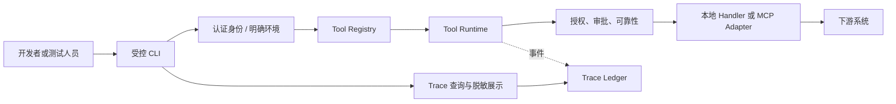
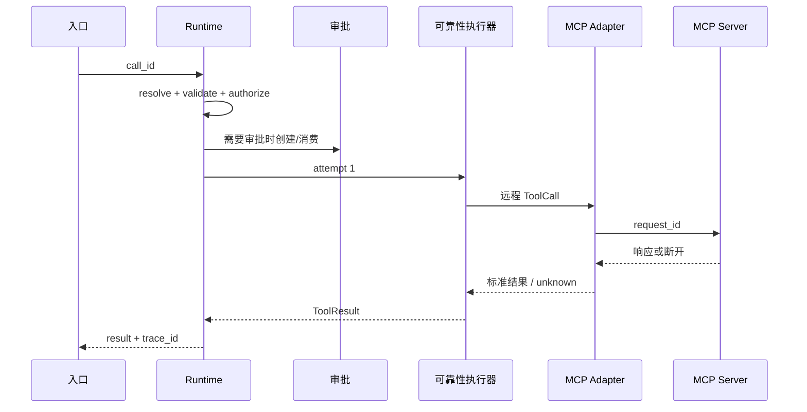

# 第 14 课：建立调试入口并完成 M2 验收

> 章节导航：[第二章：Function Calling、Tool Runtime 与 MCP](./index.md)  
> 上一课：[第 13 课：开发自定义 MCP Server](./lesson-13-custom-mcp-server.md)<br>
> 下一章：[第三章：Agent Loop、State、Harness 与 Codebase Agent](../chapter-03-agent-loop-codebase-agent/)

## 一、你将完成什么

前九课已经为 `agent-platform` 建立了 Tool Schema、Registry、Runtime、可靠性、安全、审批审计与 MCP 双向接入。最后一个问题是：当一次调用被拒绝、超时、进入审批或远程 MCP Server 断开时，工程师如何在不泄露数据、也不绕过安全边界的前提下定位它？

本课为平台提供受控的 CLI 调试入口和 Tool Call Trace，并用一组可重复的场景完成 M2 验收。完成后，你会得到：

1. 使用真实 Registry 与 Runtime 的 `tools` CLI；
2. 可关联请求、调用、审批、重试和远程操作的 Trace 数据模型；
3. 默认脱敏、权限受控、不可执行副作用重放的排障机制；
4. 正常、拒绝、审批、超时、取消、未知结果和 MCP 故障的验收场景；
5. 可交付、可运行、可回归的 M2 验收清单。

本课不为模型增加 Agent Loop，也不让 CLI 代替产品 API。第三章将在这个可靠的执行底座上实现任务状态机、循环规划和长程编排。

## 二、调试入口也必须经过 Runtime

最危险的调试工具通常长成这样：直接导入某个 handler，手写管理员身份，调用后打印全部参数和异常。它“方便”地绕过了第 2–13 课建立的契约与执行边界，因而无法证明生产路径正确。



CLI 是一个额外入口，不是额外权限。它应使用与 HTTP、Agent 或 MCP Client 相同的：

| 必须复用 | 为什么 |
| --- | --- |
| `ToolRegistry.resolve_for_call()` | 确定真实启用版本，不能按名称直查函数 |
| `ToolRuntime.invoke()` | 输入输出校验、授权、确认与错误标准化不分入口 |
| 可靠性执行器 | deadline、取消、重试、并发与幂等语义一致 |
| 审批服务 | 高风险调用只能创建/消费真实审批凭证 |
| 审计与 Trace | 调试调用与生产调用都可关联、可追责 |

调试身份也遵循最小权限。开发环境可以有专门测试主体；预生产和生产必须经组织认证、环境显式选择、角色限制和完整审计。绝不能以 `--admin` 参数或环境变量为由伪造任意用户、租户、角色或审批状态。

## 三、定义一个受控 CLI

命令应短小、可组合，并将风险显式暴露给操作者：

```text
agent-tools list       --environment staging --actor dev_42
agent-tools describe   orders.get --version 1.0.0
agent-tools validate   orders.cancel --input ./cancel.json
agent-tools invoke     orders.get --input ./get.json --context ./context.json
agent-tools invoke     orders.cancel --input ./cancel.json --approval apv_xxx
agent-tools trace show call_01J... --redaction standard
agent-tools trace find --request req_01J... --limit 20
agent-tools replay     call_01J... --mode validate-only
```

`list` 只展示当前身份可发现的工具；`describe` 展示精确契约和风险策略；`validate` 执行 Schema 和可解析性检查但绝不调用业务实现；`invoke` 进入完整 Runtime；`replay` 默认只验证存档的契约和输入，不能静默再次执行写操作。

### 3.1 上下文由可信来源构造

不要把如下 JSON 直接交给操作者：

```json
{"actor_id":"root","tenant_id":"any","permissions":["*"],"confirmed":true}
```

它把身份和审批变成可伪造的命令参数。CLI 只接收一个受控身份配置名或已认证会话，再由平台加载允许的上下文：

```python
from dataclasses import dataclass


@dataclass(frozen=True)
class CliInvocation:
    tool_name: str
    input_path: str
    environment: str
    identity_profile: str
    approval_id: str | None = None
    dry_run: bool = False


async def invoke_from_cli(command: CliInvocation) -> "ToolResult":
    identity = identity_profiles.load_for_environment(
        profile_name=command.identity_profile,
        environment=command.environment,
    )
    arguments = load_json_object(command.input_path, max_bytes=64_000)
    context = execution_context_from_identity(identity)
    if command.approval_id is not None:
        context = await approval_service.attach_for_execution(
            approval_id=command.approval_id,
            context=context,
            tool_name=command.tool_name,
            arguments=arguments,
        )
    return await runtime.invoke(
        name=command.tool_name,
        arguments=arguments,
        context=context,
        dry_run=command.dry_run,
    )
```

`identity_profile` 不是一段自由文本，而是受版本控制的开发配置或由身份提供方返回的别名。生产中应通过短期登录态或工作负载身份换取受众绑定的委托令牌。CLI 不写入令牌文件、数据库密码或完整审批内容；输入文件的权限也应限制为当前用户可读。

### 3.2 明确环境与写入保护

环境选择必须是必填项，并与身份受众、Registry 地址和审计租户交叉验证。`production` 不能是默认值。对于写 Tool，要求两层机械保护：显式 `--execute`，以及交互确认或受控审批凭证。CI 与非交互终端不应自动跳过这一步。

```python
def require_write_intent(spec: "ToolSpec", command: CliInvocation) -> None:
    if spec.risk.level in {"high", "critical"} and command.dry_run:
        return
    if spec.is_write and not command.execute:
        raise CliUsageError("写操作需要显式 --execute；可先使用 --dry-run。")
    if command.environment == "production" and not command.approval_id:
        raise CliUsageError("生产写操作需要真实审批凭证。")
```

`--dry-run` 只能在 Tool 明确实现模拟语义时出现；不能把“少传一个标志”假装成 dry run。对于不支持模拟的高风险 Tool，CLI 应拒绝而不是猜测其没有副作用。

## 四、让 CLI 输出机器可读的结果

人类终端输出应适合快速阅读，自动化则应读取稳定 JSON。两者都不能打印未脱敏输入、令牌或内部异常。

```json
{
  "request_id": "req_01J9Q6P4J3",
  "call_id": "call_01J9Q6P4J4",
  "tool": {"name": "orders.get", "version": "1.2.0"},
  "outcome": "success",
  "data": {"order_number": "ORD-AB12CD34", "status": "paid"},
  "trace_id": "trc_01J9Q6P4J5"
}
```

错误输出仍使用第 4 课的标准错误码：

```json
{
  "request_id": "req_01J9Q6P4J3",
  "call_id": "call_01J9Q6P4J4",
  "tool": {"name": "orders.cancel", "version": "1.0.0"},
  "outcome": "error",
  "error": {"code": "approval_required", "retryable": false},
  "trace_id": "trc_01J9Q6P4J5"
}
```

不要用进程退出码代替领域结果。建议约定：`0` 表示 Tool 成功；`2` 表示 CLI 参数或本地配置错误；`3` 表示 Runtime 给出标准失败；`4` 表示调用被取消或结果未知。脚本可以据此控制流程，同时仍读取 JSON 中的业务错误码。

## 五、设计 Tool Call Trace

日志是一串事件，Trace 是一次调用的因果视图。一次 ToolCall 可能经历版本解析、Schema 校验、授权、审批、排队、重试、MCP 会话、下游请求和最终结果。只记录“开始/结束”无法回答“为何耗时”和“到底执行了吗”。



### 5.1 Trace 事件模型

```python
from dataclasses import dataclass
from datetime import datetime
from enum import StrEnum
from typing import Any


class TraceEventType(StrEnum):
    RECEIVED = "received"
    RESOLVED = "resolved"
    INPUT_REJECTED = "input_rejected"
    AUTHORIZED = "authorized"
    APPROVAL_PENDING = "approval_pending"
    APPROVAL_CONSUMED = "approval_consumed"
    ATTEMPT_STARTED = "attempt_started"
    ATTEMPT_FINISHED = "attempt_finished"
    RETRY_SCHEDULED = "retry_scheduled"
    CANCELLED = "cancelled"
    COMPLETED = "completed"


@dataclass(frozen=True)
class ToolTraceEvent:
    trace_id: str
    request_id: str
    call_id: str
    sequence: int
    occurred_at: datetime
    event_type: TraceEventType
    tool_name: str | None
    tool_version: str | None
    attempt: int | None
    duration_ms: int | None
    result_code: str | None
    attributes: dict[str, str]
```

事件只追加，不原地修改。`sequence` 使同一调用在并发写入时仍能排序；持久化层以 `(trace_id, sequence)` 唯一约束或由服务端生成序号。对于重试，所有 attempt 共享 `call_id` 和 `trace_id`，再以 `attempt` 区分，不能为每次重试伪造一条全新业务调用。

### 5.2 Trace 必须记录什么，不记录什么

| 记录 | 原因 |
| --- | --- |
| `request_id`、`call_id`、`trace_id`、父调用 ID | 关联入口、并行调用和 Agent 后续流程 |
| 工具名称、精确版本、Registry revision | 回放当时解析到的契约 |
| 身份的不可逆摘要、租户、环境 | 权限排障与隔离证明 |
| 输入摘要、风险/策略版本、审批 ID 摘要 | 验证提案与实际执行一致 |
| attempt、排队/执行时长、下游类别、稳定错误码 | 可靠性分析与告警 |
| MCP `server_id`、连接 generation、远程 Tool 名称 | 远程故障定位 |

| 不记录 | 替代方式 |
| --- | --- |
| 访问令牌、Cookie、Authorization Header | 仅记录凭证类型、签发方和过期状态 |
| 密码、密钥、完整敏感输入 | 规范化输入摘要与字段级脱敏投影 |
| 原始文件、Resource、Prompt 正文 | 内容长度、内容哈希、受限取证引用 |
| 原始异常堆栈 | 受限错误库中的 `error_ref` |
| 客户地址、支付信息等多余输出 | 已定义输出 Schema 的最小投影 |

摘要应对**通过验证与规范化后的输入**计算，使用带版本的 HMAC 或受控哈希密钥；普通 SHA-256 对低熵枚举值容易被离线猜出。为了排障确有必要的少量原文应加密存储、短保留、按角色读取，并留下查看审计。

```python
def trace_input_digest(canonical_input: bytes, key: bytes, schema_version: str) -> str:
    return f"v{schema_version}:" + hmac_sha256(key, canonical_input).hexdigest()


async def record_attempt(event: ToolTraceEvent) -> None:
    await trace_store.append(event)
    metrics.observe("tool_attempt_ms", event.duration_ms or 0, tags={
        "tool": event.tool_name or "unknown",
        "code": event.result_code or "in_progress",
    })
```

## 六、展示和查询 Trace 的权限边界

`trace show` 不是“查看所有日志”。它需要单独的 `tools:trace:read` 权限，默认只能读取所属租户和环境；跨租户、生产原文查看和导出需要更高权限、短时审批与访问审计。

```text
agent-tools trace show call_01J... --redaction standard

Trace trc_01J...  request req_01J...  call call_01J...
orders.cancel@1.0.0  tenant=tnt_6f...  policy=2026-08-18
00  received
01  resolved registry_revision=204
02  authorized decision=allow
03  approval_consumed approval=apv_8d...
04  attempt_started attempt=1 transport=mcp_http server=orders-internal
05  completed result=outcome_unknown duration_ms=5031
```

可见的字段由渲染器按读取者角色再次投影，不能相信写入 Trace 时的“已脱敏”永远足够。被拒绝的查询本身也要审计。对于模型或普通用户展示 Trace，应进一步缩减为状态、可行动错误和客服关联号，不展示工具目录、内部服务名、策略细节或下游拓扑。

### 6.1 重放不是重新执行

排障常需要“重放”，但写 Tool 的重新执行可能造成重复扣费或破坏资源。将重放拆成三种不同操作：

| 模式 | 做什么 | 是否允许副作用 |
| --- | --- | --- |
| `validate-only` | 用存档 Schema 和输入摘要验证可解析性 | 否 |
| `simulate` | 调用 Tool 明确实现的模拟分支 | 仅模拟环境 |
| `re-execute` | 作为新的受控调用重新执行 | 仅新审批、幂等键和显式授权后 |

`re-execute` 不是原调用的延续：它生成新 `request_id`、`call_id`、审批和审计事件，并在 Trace 中记录 `replay_of`。不能复用已经消费的审批，也不能把旧幂等键用于不同用户意图。

## 七、建立可重复的 M2 验收环境

验收不要依赖真实客户数据或人工记忆。准备可重置的环境：固定租户、低权限和高权限测试身份、三个风险等级的 Tool、一个可注入延迟/断连的下游 fake，以及自定义 MCP Server。

```text
fixtures/
  identities/reader.json
  identities/operator.json
  identities/other-tenant.json
  tool-inputs/get-order.json
  tool-inputs/cancel-order.json
  tool-inputs/invalid-order.json
  scenarios/m2-acceptance.yaml
```

fixture 中不得存放生产 token、真实客户订单或长期审批凭证。每次场景开始前重置 Repository、审批表、幂等记录和 Trace 索引；对于无法重置的共享环境，使用唯一资源前缀和明确清理任务，绝不用模糊查询删除数据。

### 7.1 验收场景矩阵

| 编号 | 场景 | 操作 | 必须观察到 |
| --- | --- | --- | --- |
| A1 | 工具发现 | `list` 使用 reader 身份 | 只出现 reader 可见工具和已启用版本 |
| A2 | 非法参数 | 调用 `orders.get`，订单号格式错误 | Handler 未执行，`invalid_arguments` Trace 完整 |
| A3 | 跨租户 | other-tenant 读取订单 | `forbidden` 或不可见语义，无资源泄露 |
| A4 | 审批 | 调用高风险取消 | 先得到 `approval_required`，批准后仅可消费一次 |
| A5 | 幂等 | 使用同一键重复取消 | 返回同一 `operation_id`，无二次写入 |
| A6 | 超时 | fake 下游超出 deadline | 释放并发槽，标准 `timeout` 或未知结果 |
| A7 | 取消 | attempt 未提交时发出取消 | 结果为 `cancelled`，下游未写入 |
| A8 | 未知结果 | 下游提交后丢失响应 | `outcome_unknown`，同键查询不重复执行 |
| A9 | MCP 目录 | Client 连接自定义 Server | 协商、`tools/list`、Schema 映射和名称空间正确 |
| A10 | MCP 断连 | 调用过程中关闭 transport | 写操作不自动重试，Trace 有 server/generation |
| A11 | 脱敏 | 查询 Trace 与导出 | 无 token、密码、地址和完整敏感参数 |
| A12 | CLI 边界 | 直接调用高风险 Tool | 缺 `--execute` 或审批时被 CLI/Runtime 拦截 |

`A3` 不能仅断言 HTTP 状态码。还要检查结果长度、错误信息、Trace 和时序不泄露订单存在性。`A5`、`A8` 要检查真实的下游写入次数；“结果看起来相同”无法证明未重复写入。

### 7.2 用场景文件驱动验收

```yaml
name: A5-idempotent-cancel
identity_profile: operator
environment: test
tool: orders.cancel
input: fixtures/tool-inputs/cancel-order.json
steps:
  - invoke: {expect_code: ok, capture: operation_id}
  - invoke: {expect_code: ok, expect_same: operation_id}
assert:
  downstream_write_count: 1
  trace_attempts: 2
  audit_events: [tool_received, tool_completed, tool_completed]
```

场景驱动器应调用 CLI 的结构化输出或直接调用同一 Runtime API，不能创建“只为测试而存在”的旁路。时间、随机 ID 和外部调用用可控时钟及 fake 注入，避免验收因网络抖动偶发失败。

## 八、故障排查顺序

当用户报告“工具没工作”，先沿 Trace 的状态机定位，不要一开始查模型提示词或下游数据库：

```text
没有 call_id
  -> 入口或模型未产生 ToolCall
有 call_id，未 resolved
  -> Registry、可见性、版本或名称问题
已 resolved，未 authorized
  -> 身份、权限、资源范围或策略问题
approval_pending
  -> 等待有效审批；不能用重试绕过
attempt_started，未 finished
  -> deadline、取消、进程退出或 Trace 写入故障
attempt_finished=unknown
  -> 使用同一幂等键查询操作状态，禁止盲目重试
MCP transport_failed
  -> 检查 allowlist、会话 generation、认证与 Server 健康
```

Trace 本身不可用时，系统仍需保留最小结构化审计和指标，并触发告警。不要为了“确保记录成功”而阻塞高风险写操作直到日志无限重试；定义清楚审计不可用时是拒绝高风险操作、使用可靠队列，还是降级到不可变本地事件日志。

## 九、M2 最终交付与验收清单

### 9.1 交付物

- [ ] 统一 `ToolSpec`、版本化 Registry 与至少三个不同风险等级的工具。
- [ ] 所有入口均通过 Runtime 完成输入校验、身份透传、授权、输出校验和稳定错误映射。
- [ ] timeout、取消、有限重试、并发预算、幂等与未知结果策略可运行、可测试。
- [ ] 高风险动作有持久审批状态机、一次性消费和不可变审计。
- [ ] MCP Client 能安全发现并映射远程 Tool；自定义 MCP Server 有认证、租户隔离与稳定契约。
- [ ] 受控 CLI 支持发现、描述、校验、调用和脱敏 Trace 查询，且没有管理员旁路。
- [ ] Tool Call Trace 可关联 `request_id`、`call_id`、版本、尝试、审批和远程连接。
- [ ] A1 至 A12 场景可在隔离环境自动执行并生成报告。

### 9.2 验收问题

交付前逐项回答：

1. 非法输入能否在业务 Handler 之前被拒绝，并在 Trace 中留下不含原始敏感参数的证据？
2. 调试 CLI、MCP 适配器和未来 HTTP 入口是否确实复用同一个 Runtime？
3. 无权主体、跨租户主体和没有审批的主体，能否通过改参数、重试或 CLI 绕过限制？
4. 写操作超时和断连时，系统是否诚实地表明结果未知，而不是把它算作失败后自动重试？
5. 从 Trace 能否找到准确工具版本、策略版本、审批和下游尝试，又不会泄露凭证或客户数据？
6. 自定义 MCP Server 断连、目录变更和重启时，Client 是否按第 11–12 课的会话与缓存规则恢复？

任何一题不能以“通常没问题”回答。把答案变成可执行场景、自动化断言或明确的风险例外，并在发布记录中留档。

## 十、小结

本课把 Tool Runtime 从“有代码”推进到“可证明地运行”。CLI 让工程师能在相同安全边界内复现调用；Trace 将解析、授权、审批、重试和 MCP 调用串成因果链；验收场景则将正确性、可靠性与安全性变成可回归的事实。

至此，第二章的 M2 交付完成：模型拥有的是一组可发现的能力提案，而每个真实动作都必须经过版本化契约、可信身份、授权、审批、可靠性控制和审计。第三章将在这个基础上管理多次 ToolCall 的状态、计划和恢复。
