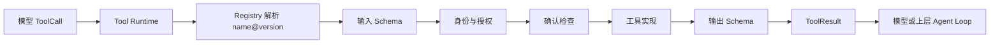

# 第 14 课：建立 Tool Runtime 执行链

> 所属章节：[第二章：Function Calling、Tool Runtime 与 MCP](./index.md)<br>
> 上一课：[第 13 课：实现 Tool Registry](./lesson-13-tool-registry.md)<br>
> 下一课：[第 15 课：处理工具调用的可靠性问题](./lesson-15-tool-call-reliability.md)

## 一、你将完成什么

第 13 课的 Registry 能回答“这个调用名当前应该解析到哪个版本”，但它仍然不执行任何业务代码。模型返回的 `ToolCall` 只是一个不可信的调用提案：名称可能不存在，参数可能不符合 Schema，模型也不能自行声明用户身份或权限。

这一课实现最小可用的 Tool Runtime。它把一次调用固定成一条有顺序、可追踪、可测试的执行链：

```text
解析名称和版本
    -> 输入 Schema 校验
    -> 身份透传与权限检查
    -> 确认状态检查
    -> 查找并执行工具实现
    -> 输出 Schema 校验
    -> 标准化 ToolResult
```

完成后，你会得到：

1. 所有新调用统一经过 Registry 解析，而不是按名称直接查函数；
2. 输入不合法时在业务执行前失败；
3. 身份来自可信应用上下文，并被原样透传给工具实现；
4. Registry 的粗粒度可见性之外，再做一次 Runtime 权限检查；
5. 工具异常、未实现、输出不合规都转换为稳定错误结果；
6. 每个结果都带有 `call_id`、工具名和确切版本，便于 Trace、审计和回放。

本课只实现一次调用的正确边界。超时、取消、有限重试、幂等和并发调度会在第 15 课实现；完整的资源级授权在第 16 课实现；确认请求的持久化与审批审计在第 17 课实现。

## 二、Runtime 是数据面

Registry 保存“哪些版本可以被新调用解析”，Runtime 负责“这一次具体调用能否安全完成”。两者必须协作，但不能合并成一个全能对象。



### 2.1 每个组件的边界

| 组件 | 在本课中的职责 | 明确不做的事 |
| --- | --- | --- |
| `ToolCall` | 携带模型提出的名称、调用 ID 和 JSON 参数 | 证明调用者身份、权限或版本 |
| `ToolRegistry` | 按可信上下文解析当前服务版本 | 执行业务函数、检查订单等资源权限 |
| `ToolSpec` | 声明输入、输出、错误、安全与执行策略 | 代替运行时做动态判断 |
| `ToolRuntime` | 串联解析、校验、授权、执行和结果标准化 | 自动重试、审批持久化、审计存储 |
| 工具实现 | 使用透传的身份和已校验参数完成业务动作 | 信任模型传入的身份字段 |

`discover()` 和 `resolve_for_call()` 都会做声明权限过滤，但这不是最终安全边界。调试 CLI、HTTP 接口或未来的 MCP 回调也必须进入同一个 Runtime；不能因为调用来自“内部”入口就绕过检查。

## 三、先定义可信执行上下文

模型参数是数据，不是身份。Runtime 的调用上下文必须由认证中间件、任务状态或受信任的应用入口构造，绝不能从 `call.arguments` 中读取 `actor_id`、`tenant_id` 或 `permissions`。

```python
from dataclasses import dataclass, field


@dataclass(frozen=True)
class ToolExecutionContext:
    actor_id: str
    tenant_id: str
    environment: str
    permissions: frozenset[str]
    request_id: str
    # 这是已由可信审批层签发的短期凭证，不是模型生成的字符串。
    confirmation_token: str | None = None
    metadata: dict[str, str] = field(default_factory=dict)
```

`metadata` 只放工具实现明确需要的、已脱敏的关联信息，例如请求来源或地域。访问令牌、数据库连接和原始 HTTP Request 应由基础设施通过依赖注入提供，不能塞进会被广泛复制的上下文对象。

### 3.1 为什么还要有 `request_id`

`call_id` 标识模型在一次对话中提出的调用；`request_id` 标识整个入口请求。一个请求可能包含多个工具调用，二者都需要写入 Trace：

| 标识 | 生命周期 | 用途 |
| --- | --- | --- |
| `request_id` | 一次用户请求 | 串联模型请求、多个 ToolCall 与最终响应 |
| `call_id` | 一个模型调用提案 | 区分同一请求中的并行调用、结果回传与重放 |
| `name@version` | 一次解析结果 | 确定契约、实现和审计的精确版本 |

不要使用参数哈希代替 `call_id`。两个合法调用可能参数相同，但它们仍可能属于不同的用户请求或确认流程。

## 四、工具实现的最小协议

Runtime 不应该接收任意 `Callable` 并猜测参数。给实现一个明确的协议，使它只能拿到已通过 Schema 校验的参数和可信上下文。

```python
from collections.abc import Callable
from typing import Protocol

from app.tools.contracts import JsonObject


class ToolHandler(Protocol):
    def __call__(
        self,
        arguments: JsonObject,
        context: ToolExecutionContext,
    ) -> JsonObject:
        """返回未包装的业务数据；Runtime 负责校验和封装。"""


ToolHandlerMap = dict[tuple[str, str], ToolHandler]
```

实现注册的键必须是 `(name, version)`，不能只按名称保存函数。否则 Registry 已经解析到 `get_order@1.0.0` 后，运行时却可能拿到 `1.1.0` 的实现，契约和代码就会发生错配。

### 4.1 业务错误与未知异常

工具实现可以抛出一个可预期的领域错误，但不能把数据库异常、堆栈和内部 URL直接发给模型：

```python
class ToolDomainError(Exception):
    def __init__(self, code: str, message: str, *, retryable: bool = False) -> None:
        self.code = code
        self.retryable = retryable
        super().__init__(message)
```

`code` 必须出现在 `ToolSpec.errors` 中。未声明的错误码、第三方 SDK 异常和其他未知异常都应被 Runtime 归一化为 `tool_execution_failed`，详细异常只进入受控日志或后续审计系统。

## 五、把错误语义先固定下来

`ToolResult` 是 Runtime 的唯一外部结果信封。成功结果只能有 `data`，失败结果只能有 `error`；调用方不需要通过捕获不同 Python 异常来猜测执行到了哪一步。

| 阶段 | 稳定错误码 | 是否调用业务实现 | 典型原因 |
| --- | --- | ---: | --- |
| Registry 解析 | `tool_not_available` | 否 | 未注册、未发布、禁用或不可见 |
| 输入校验 | `invalid_tool_arguments` | 否 | 缺少必填字段、类型错误、未知字段 |
| 权限检查 | `permission_denied` | 否 | 缺少声明权限 |
| 确认检查 | `confirmation_required` | 否 | 高风险工具没有可信确认凭证 |
| 实现查找 | `tool_not_implemented` | 否 | 契约已发布但实现未装载 |
| 业务异常 | 契约中声明的错误码 | 是 | 订单不存在、状态不允许等 |
| 未知异常 | `tool_execution_failed` | 是 | 未预期的 SDK、数据库或代码异常 |
| 输出校验 | `invalid_tool_output` | 是 | 实现返回缺字段或错误类型 |

对“工具不存在”“工具被禁用”和“当前用户不可见”统一返回 `tool_not_available`，避免通过错误差异枚举内部目录。内部 Trace 可以记录更精确的拒绝原因，但模型和普通用户不应看到。

## 六、实现 `ToolRuntime`

下面的实现假设第 12 课已有 `validate_input()`、`validate_output()` 和 `ToolContractError`，第 13 课已有 `ToolRegistry`、`ToolDiscoveryContext` 与 `ToolNotAvailable`。

在 `apps/api/app/tools/runtime.py` 中创建：

```python
from __future__ import annotations

from typing import Protocol

from app.tools.contracts import (
    JsonObject,
    ToolCall,
    ToolFailure,
    ToolResult,
    ToolSpec,
)
from app.tools.registry import (
    ToolDiscoveryContext,
    ToolNotAvailable,
    ToolRegistry,
)
from app.tools.validation import (
    ToolContractError,
    validate_input,
    validate_output,
)


class ToolDomainError(Exception):
    def __init__(self, code: str, message: str, *, retryable: bool = False) -> None:
        self.code = code
        self.retryable = retryable
        super().__init__(message)


class ConfirmationChecker(Protocol):
    def is_confirmed(
        self,
        *,
        call: ToolCall,
        spec: ToolSpec,
        context: ToolExecutionContext,
    ) -> bool:
        ...


class NoConfirmation(ConfirmationChecker):
    def is_confirmed(self, **kwargs: object) -> bool:
        return False


class ToolRuntime:
    def __init__(
        self,
        *,
        registry: ToolRegistry,
        handlers: dict[tuple[str, str], ToolHandler],
        confirmation_checker: ConfirmationChecker | None = None,
    ) -> None:
        self._registry = registry
        self._handlers = handlers
        self._confirmation_checker = confirmation_checker or NoConfirmation()

    def invoke(
        self,
        *,
        call: ToolCall,
        context: ToolExecutionContext,
    ) -> ToolResult:
        """执行一次新调用；预期失败全部返回 ToolResult。"""
        spec = self._resolve(call=call, context=context)
        if spec is None:
            return self._error(
                call=call,
                tool_version="unresolved",
                code="tool_not_available",
                message="当前工具不可用。",
            )

        try:
            arguments = validate_input(spec, call)
        except ToolContractError:
            return self._error(
                call=call,
                spec=spec,
                code="invalid_tool_arguments",
                message="工具参数不符合要求。",
            )

        if not self._has_permissions(spec, context):
            return self._error(
                call=call,
                spec=spec,
                code="permission_denied",
                message="当前身份无权执行此工具。",
            )

        if spec.security.requires_confirmation and not self._confirmation_checker.is_confirmed(
            call=call,
            spec=spec,
            context=context,
        ):
            return self._error(
                call=call,
                spec=spec,
                code="confirmation_required",
                message="此操作需要有效的用户确认。",
            )

        handler = self._handlers.get((spec.name, spec.version))
        if handler is None:
            return self._error(
                call=call,
                spec=spec,
                code="tool_not_implemented",
                message="工具实现暂不可用。",
            )

        try:
            output = handler(arguments, context)
        except ToolDomainError as error:
            return self._domain_error(call=call, spec=spec, error=error)
        except Exception:
            # 生产代码要记录带 request_id/call_id 的受控异常；不回传堆栈。
            return self._error(
                call=call,
                spec=spec,
                code="tool_execution_failed",
                message="工具执行失败。",
            )

        try:
            data = validate_output(spec, output)
        except ToolContractError:
            return self._error(
                call=call,
                spec=spec,
                code="invalid_tool_output",
                message="工具返回了不符合契约的数据。",
            )

        return ToolResult(
            call_id=call.call_id,
            tool_name=spec.name,
            tool_version=spec.version,
            status="success",
            data=data,
        )

    def _resolve(
        self,
        *,
        call: ToolCall,
        context: ToolExecutionContext,
    ) -> ToolSpec | None:
        discovery = ToolDiscoveryContext(
            actor_id=context.actor_id,
            tenant_id=context.tenant_id,
            environment=context.environment,
            permissions=context.permissions,
        )
        try:
            return self._registry.resolve_for_call(
                name=call.name,
                context=discovery,
            )
        except ToolNotAvailable:
            return None

    @staticmethod
    def _has_permissions(spec: ToolSpec, context: ToolExecutionContext) -> bool:
        required = set(spec.security.required_permissions)
        return required <= context.permissions

    def _domain_error(
        self,
        *,
        call: ToolCall,
        spec: ToolSpec,
        error: ToolDomainError,
    ) -> ToolResult:
        declared = next((item for item in spec.errors if item.code == error.code), None)
        if declared is None or not declared.expose_to_model:
            return self._error(
                call=call,
                spec=spec,
                code="tool_execution_failed",
                message="工具执行失败。",
                retryable=False,
            )
        return self._error(
            call=call,
            spec=spec,
            code=declared.code,
            message=declared.description,
            retryable=declared.retryable and error.retryable,
        )

    @staticmethod
    def _error(
        *,
        call: ToolCall,
        tool_version: str | None = None,
        spec: ToolSpec | None = None,
        code: str,
        message: str,
        retryable: bool = False,
    ) -> ToolResult:
        return ToolResult(
            call_id=call.call_id,
            tool_name=spec.name if spec is not None else call.name,
            tool_version=spec.version if spec is not None else (tool_version or "unresolved"),
            status="error",
            error=ToolFailure(
                code=code,
                message=message,
                retryable=retryable,
            ),
        )
```

这段代码有三个重要的工程约束：

1. **先解析，再校验，再执行**：没有确定版本就没有资格调用实现；参数不合规时不会产生副作用。
2. **所有路径都返回统一结果**：模型不需要知道 Runtime 内部抛过哪种 Python 异常。
3. **成功结果再次校验**：实现不是契约本身，第三方响应和降级分支都必须经过输出边界。

### 6.1 关于 `ToolExecutionContext` 的导入

为便于讲义阅读，上面的代码省略了同一文件中 `ToolExecutionContext` 和 `ToolHandler` 的重复定义。实际文件应将第三节的上下文、第四节的协议和第六节的 Runtime 放在一起，或拆成 `context.py`、`handlers.py` 与 `runtime.py` 三个模块。拆分时保持依赖方向：`runtime` 可以依赖 `contracts`、`registry` 和 `validation`，工具实现不应反向依赖 Runtime 的内部方法。

## 七、逐步走读一条成功调用

以 `get_order@1.0.0` 为例，可信入口先构造上下文，模型只提供订单参数：

```python
context = ToolExecutionContext(
    actor_id="user-01",
    tenant_id="tenant-a",
    environment="production",
    permissions=frozenset({"orders:read"}),
    request_id="req_20260818_0001",
)

call = ToolCall(
    call_id="call_01",
    name="get_order",
    arguments={"order_id": "A-1024"},
)

result = runtime.invoke(call=call, context=context)
```

执行过程如下：

1. Registry 根据 `tenant-a`、`production` 和 `orders:read` 解析服务版本。`call.arguments` 不参与版本选择。
2. `validate_input()` 检查 `order_id` 的格式与未知字段。失败时立即返回 `invalid_tool_arguments`。
3. Runtime 再次比较声明权限与可信上下文，防止绕过发现路径的入口直接执行。
4. `get_order` 实现从 `context.actor_id` 和 `context.tenant_id` 获取身份范围，而不是从参数读取伪造字段。
5. 返回数据通过输出 Schema 后，结果写入准确的 `tool_version`。

工具实现可以是：

```python
def get_order(arguments: JsonObject, context: ToolExecutionContext) -> JsonObject:
    order_id = str(arguments["order_id"])
    order = order_store.find_for_tenant(
        tenant_id=context.tenant_id,
        actor_id=context.actor_id,
        order_id=order_id,
    )
    if order is None:
        raise ToolDomainError("order_not_found", "order is unavailable")
    return {
        "order_id": order.id,
        "status": order.status,
        "updated_at": order.updated_at.isoformat(),
    }
```

这里的 `order_store.find_for_tenant()` 是资源级授权的一个示例。第 16 课会把这种检查抽成更系统的授权策略，但本课已经规定：实现只能从可信上下文获得身份，不能相信模型自己附带的 `actor_id`。

## 八、失败路径必须可预测

### 8.1 非法参数不应触发副作用

```python
result = runtime.invoke(
    call=ToolCall(
        call_id="call_bad",
        name="cancel_order",
        arguments={"order_id": "A-12"},
    ),
    context=context,
)

assert result.status == "error"
assert result.error.code == "invalid_tool_arguments"
```

不要先调用 Python 函数再让函数自行判断参数。这样会把输入错误变成可能已经发生的写操作，也会使不同工具的错误格式不一致。

### 8.2 缺少权限与缺少确认是两件事

- 缺少 `orders:write` 时返回 `permission_denied`；
- 有权限但没有有效确认凭证时返回 `confirmation_required`；
- 两者都满足才允许进入实现。

确认凭证必须绑定调用 ID、工具版本、用户和失效时间。只传一个布尔值 `confirmed=True` 很容易被错误复用；第 17 课会实现持久化审批记录和一次性消费。

### 8.3 工具实现返回异常结构

工具可能返回缺少 `updated_at` 的订单，或把数值状态写成任意字符串。Runtime 应返回 `invalid_tool_output`，而不是把不符合契约的对象放进模型上下文。对于这类错误，不要自动重试，因为重试不能修复确定性的契约错误。

### 8.4 实现异常不应暴露内部细节

以下内容都不应进入 `ToolFailure.message`：

- Python 堆栈和文件路径；
- SQL 语句、表名和内部主机名；
- 下游服务的认证头和访问令牌；
- 包含个人数据的原始响应。

日志可以记录经过脱敏的异常类型、`request_id`、`call_id`、工具版本和耗时，但日志本身也要遵循访问控制与保留期限。

## 九、声明的执行策略与本课实现范围

`ToolSpec.execution` 已声明 `timeout_ms`、`max_attempts` 和幂等要求，但本课的同步 Runtime 不偷偷实现重试：

| 能力 | 第 14 课 | 第 15 课 |
| --- | --- | --- |
| 读取并记录工具版本 | 实现 | 复用 |
| 参数和结果 Schema 校验 | 实现 | 复用 |
| 单次实现调用 | 实现 | 复用 |
| 超时、取消与资源回收 | 仅保留策略字段 | 实现 |
| 有限重试与退避 | 不实现 | 实现 |
| 幂等键与去重 | 校验契约声明 | 实现 |
| 并发上限与依赖调度 | 不实现 | 实现 |

如果现在在 `invoke()` 中直接套一个无限等待的线程或无条件重试，调用链看起来“更可靠”，实际上会留下无法取消、重复写入和线程泄漏的问题。可靠性策略应由下一课的执行器包裹这条核心链，而不是改变本课的错误和校验顺序。

## 十、测试 Runtime 合同

创建 `tests/test_tool_runtime.py`。测试重点是“哪一步发生、实现是否被调用、结果是否稳定”，而不是连接真实订单数据库。

```python
from unittest.mock import Mock

from app.tools.contracts import ToolCall
from app.tools.runtime import ToolDomainError, ToolExecutionContext, ToolRuntime


def context(*permissions: str) -> ToolExecutionContext:
    return ToolExecutionContext(
        actor_id="user-01",
        tenant_id="tenant-a",
        environment="production",
        permissions=frozenset(permissions),
        request_id="req-01",
    )


def call(name: str = "get_order", arguments: dict[str, object] | None = None) -> ToolCall:
    return ToolCall(
        call_id="call-01",
        name=name,
        arguments=arguments or {"order_id": "A-1024"},
    )


def test_invalid_arguments_do_not_call_handler(runtime_factory) -> None:
    handler = Mock()
    runtime = runtime_factory(handler=handler)

    result = runtime.invoke(
        call=call(arguments={"order_id": "A-12"}),
        context=context("orders:read"),
    )

    assert result.error.code == "invalid_tool_arguments"
    handler.assert_not_called()


def test_runtime_passes_trusted_identity_to_handler(runtime_factory) -> None:
    handler = Mock(
        return_value={
            "order_id": "A-1024",
            "status": "shipping",
            "updated_at": "2026-08-18T09:30:00+08:00",
        }
    )
    runtime = runtime_factory(handler=handler)

    result = runtime.invoke(
        call=call(arguments={"order_id": "A-1024", "actor_id": "attacker"}),
        context=context("orders:read"),
    )

    assert result.status == "error"
    assert result.error.code == "invalid_tool_arguments"
    handler.assert_not_called()


def test_missing_permission_is_rejected_before_execution(runtime_factory) -> None:
    handler = Mock()
    runtime = runtime_factory(handler=handler)

    result = runtime.invoke(call=call(), context=context())

    assert result.error.code == "permission_denied"
    handler.assert_not_called()


def test_declared_domain_error_is_standardized(runtime_factory) -> None:
    handler = Mock(side_effect=ToolDomainError("order_not_found", "internal detail"))
    runtime = runtime_factory(handler=handler)

    result = runtime.invoke(
        call=call(),
        context=context("orders:read"),
    )

    assert result.error.code == "order_not_found"
    assert result.error.message != "internal detail"


def test_invalid_output_never_reaches_model(runtime_factory) -> None:
    handler = Mock(return_value={"order_id": "A-1024", "status": "shipping"})
    runtime = runtime_factory(handler=handler)

    result = runtime.invoke(
        call=call(),
        context=context("orders:read"),
    )

    assert result.error.code == "invalid_tool_output"


def test_result_contains_resolved_version(runtime_factory) -> None:
    handler = Mock(
        return_value={
            "order_id": "A-1024",
            "status": "shipping",
            "updated_at": "2026-08-18T09:30:00+08:00",
        }
    )
    runtime = runtime_factory(handler=handler)

    result = runtime.invoke(call=call(), context=context("orders:read"))

    assert result.tool_name == "get_order"
    assert result.tool_version == "1.0.0"
    assert result.call_id == "call-01"
```

`runtime_factory` 是测试夹具：它创建 Registry、注册 `GET_ORDER_V1`、发布 `1.0.0`，并把 handler 放入 `(name, version)` 映射。测试不应该通过 monkeypatch 绕过 Registry，否则无法验证版本解析和不可见调用的边界。

### 10.1 需要补上的负向场景

| 场景 | 断言 | 实现调用 |
| --- | --- | ---: |
| 不存在工具名 | `tool_not_available` | 否 |
| 已禁用服务版本 | `tool_not_available` | 否 |
| 未声明的领域错误码 | `tool_execution_failed` | 是 |
| `expose_to_model=False` 的领域错误 | `tool_execution_failed` | 是 |
| 已注册但未装载实现 | `tool_not_implemented` | 否 |
| 可确认写工具无凭证 | `confirmation_required` | 否 |

测试每个分支时，都要断言 handler 的调用次数。仅检查最终错误码，无法证明非法参数真的在副作用之前被拦截。

## 十一、一次调用的 Trace 记录

Runtime 本课不负责把 Trace 写入数据库，但应该为后续观测留下稳定字段。建议在 `invoke()` 的入口和出口使用结构化事件：

```json
{
  "event": "tool_call_finished",
  "request_id": "req-20260818-0001",
  "call_id": "call-01",
  "actor_id": "user-01",
  "tenant_id": "tenant-a",
  "tool_name": "get_order",
  "tool_version": "1.0.0",
  "status": "success",
  "error_code": null,
  "duration_ms": 42
}
```

参数和结果不要默认原样写日志。可以保存 Schema 校验后的摘要、字段数量或经过脱敏的业务标识；高敏感工具还应记录访问策略的版本和确认决定。第 20 课会把这些事件接到 CLI 和 Tool Call Trace 页面。

## 十二、常见错误

### 12.1 直接按名称调用函数

```python
HANDLERS[call.name](call.arguments)
```

这种写法绕过了版本、输入校验、身份透传、授权和输出校验。即使它在 Demo 中很短，也不应成为生产入口。

### 12.2 让模型在参数中传身份

模型生成的 `{"actor_id": "admin"}` 只是普通字符串。身份必须来自认证会话或任务上下文；如果业务确实需要“代表某位用户”，应由可信服务明确签发委托凭证。

### 12.3 把发现过滤当作授权

工具从模型列表中消失只能降低误调用概率。攻击者、旧任务、调试入口和 MCP Server 仍可能构造调用，因此 Runtime 必须再次检查声明权限，并在后续课次做资源级授权。

### 12.4 让异常自动变成成功数据

`handler()` 返回 `None`、字符串或半截字典时，不能为了“让模型继续”而包装成成功。严格的输出校验更容易定位实现回归，也避免错误信息污染上下文。

### 12.5 在核心 Runtime 里无条件重试

网络超时不等于服务端没有完成写操作。重试逻辑需要幂等键、退避、取消和最大尝试次数，留给第 15 课的执行器实现。

### 12.6 用一个裸布尔值表达确认

`confirmed=True` 没有说明是谁确认、确认了哪个版本、何时过期。确认是可审计的授权决定，不是模型输出的一个字段。

## 十三、课堂练习

请为 `read_file` 和 `create_issue` 设计 Runtime 行为，并写出每个场景的预期错误码：

1. `read_file` 的参数包含 `path`，但路径位于工作区外；
2. `read_file` 通过输入 Schema，但文件内容超过 `max_bytes`；
3. `create_issue` 有 `issues:write` 权限，但没有审批凭证；
4. `create_issue` 返回了缺少 `issue_id` 的对象；
5. 模型调用了 Registry 中不存在的 `delete_repository`。

建议答案方向：第 1 项属于资源级授权拒绝，具体错误码由第 16 课统一；第 2 项是业务约束错误，不是 JSON Schema 错误；第 3 项是 `confirmation_required`；第 4 项是 `invalid_tool_output`；第 5 项是统一的 `tool_not_available`，不应泄露目录是否曾经存在该工具。

再画出一条时序：模型提出调用、Runtime 解析版本、参数失败、结果回传模型。标注哪一步绝不能触发工具副作用。

## 十四、完成标准

完成本课后，你应该能够做到：

- 解释 Registry 解析与 Runtime 执行的职责边界；
- 使用可信 `ToolExecutionContext` 透传身份、租户、环境和请求关联信息；
- 确保输入校验、权限检查和确认检查发生在业务实现之前；
- 按 `(name, version)` 绑定工具实现，避免契约与代码错配；
- 将领域错误、未知异常和输出错误标准化为 `ToolResult`；
- 在结果中记录确切工具版本、调用 ID 与稳定错误码；
- 编写能证明“未执行副作用”的 Runtime 负向测试；
- 说明为什么超时、重试、资源授权和审批审计需要后续专门组件。

## 十五、本课小结

Tool Runtime 是模型提案进入真实世界前的最后一道统一执行边界。它先用 Registry 确定不可变的 `name@version`，再校验参数、透传可信身份、检查权限与确认，最后执行绑定的实现并验证输出。无论调用在哪个入口到达，成功和失败都应通过同一种 `ToolResult` 返回。

这样，模型只负责提出“想调用什么、参数是什么”；Registry 负责决定“当前发布的契约是什么”；Runtime 负责决定“这一次是否允许执行、结果是否可信”。下一课将在这条链外包裹超时、取消、有限重试、幂等和并发控制，让执行从正确进一步走向可靠。
