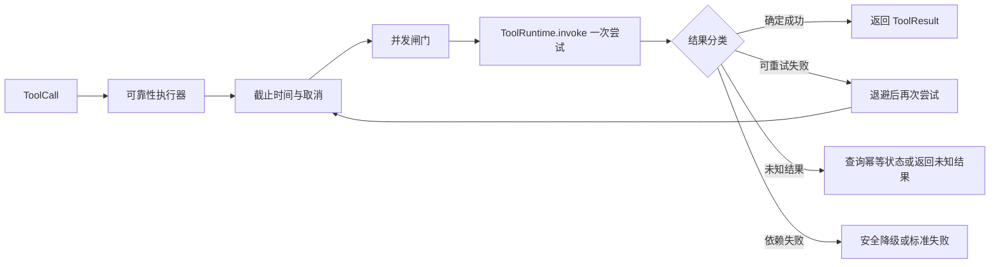

# 第 15 课：处理工具调用的可靠性问题

> 所属章节：[第二章：Function Calling、Tool Runtime 与 MCP](./index.md)<br>
> 上一课：[第 14 课：建立 Tool Runtime 执行链](./lesson-14-tool-runtime-execution.md)<br>
> 下一课：[第 16 课：建立权限模型与工具安全边界](./lesson-16-permission-security-boundary.md)

## 一、你将完成什么

第 14 课的 `ToolRuntime` 已经能把一次调用按正确顺序执行，但“能正确执行一次”不等于“在真实系统里可靠”。网络会抖动，下游会慢，用户会取消请求，多个 Agent 任务会同时争抢同一个依赖，写操作还可能在客户端收到超时前已经成功。

这一课在核心 Runtime 外包裹可靠性执行器，处理以下问题：

1. 为每次调用建立截止时间，并在超时后停止等待、释放资源；
2. 让取消信号沿调用链传播，而不是把取消的任务留在后台继续写数据；
3. 只对明确可重试的瞬时失败做有限重试，并使用退避和抖动；
4. 用幂等键保护有副作用的重试，区分“没有结果”和“执行失败”；
5. 对全局、工具、租户和调用者施加并发上限，避免单一依赖拖垮进程；
6. 在依赖不可用时返回诚实的失败或明确标记的降级结果，不伪造成功。

本课不重新定义第 12 课的 Schema，也不替代第 14 课的参数校验、权限检查和输出校验。可靠性执行器只负责调度一次或多次**已经通过 Runtime 边界检查的尝试**。资源级授权留给第 16 课，审批与审计留给第 17 课。

## 二、可靠性首先是语义问题

“失败后再试一次”是最容易写出的可靠性代码，也是最容易造成重复扣款、重复发货和重复创建工单的代码。先定义失败语义，再决定调度策略。

### 2.1 四种需要区分的结果

| 结果 | 含义 | 是否适合自动重试 |
| --- | --- | ---: |
| 确定成功 | 下游确认操作已完成 | 否，直接返回结果 |
| 确定失败 | 下游确认没有完成，且错误可分类 | 仅在错误契约允许时 |
| 未知结果 | 请求可能已被下游接受，但响应丢失或超时 | 只有有幂等保护时才可重试 |
| 本地未执行 | 调用在进入业务实现前被拦截 | 不应重试同一调用 |

网络超时通常只能证明“本次等待超过了本地预算”，不能证明“下游没有执行”。因此，`timeout` 不能直接被翻译为 `safe_to_retry=true`。

### 2.2 正确性、可用性和恢复性

- **正确性**：不执行越权操作，不把错误包装成成功，不违反工具契约；
- **可用性**：依赖短暂抖动时，有限重试或降级仍能给调用方有用结果；
- **恢复性**：超时、取消、进程重启后，资源和幂等状态仍可被清理或继续查询。

可靠性设计不能牺牲正确性来换取一个更高的“成功率”指标。工具调用的成功率应按业务语义统计，不能把 fallback、缓存旧数据和“已接收但未知结果”都算成成功。

## 三、可靠性执行链的位置

第 14 课的执行顺序仍然是每次尝试的内部边界。本课增加的是外层调度：



应当保持以下边界：

| 层 | 负责 | 不负责 |
| --- | --- | --- |
| `ToolRuntime` | 一次调用的解析、输入/输出校验、鉴权和错误标准化 | 等待、重试和并发排队 |
| 可靠性执行器 | 截止时间、取消、尝试次数、退避、幂等和限流 | 改写业务参数或绕过 Runtime |
| 工具实现 | 业务动作与领域错误 | 自己启动无限重试线程 |
| 依赖适配器 | 将 HTTP/SDK 错误分类为稳定故障类型 | 决定是否重复整个工具调用 |

每次重试都必须重新进入同一条 `ToolRuntime` 边界。不能第一次调用走 Runtime，第二次为了“快速重试”直接调用 handler；否则第二次会绕过版本解析、权限和输出校验。

## 四、从 ToolSpec 读取执行预算

第 12 课已经在 `ToolExecutionPolicy` 中声明了：

```python
class ToolExecutionPolicy(BaseModel):
    timeout_ms: int
    max_attempts: int = 1
    retry_mode: RetryMode = RetryMode.NEVER
    idempotency_key_required: bool = False
```

这些字段是工具作者给出的**上限和意图**，不是执行器可以无条件接受的承诺。运行时还要应用平台级上限：

```python
effective_timeout_ms = min(
    spec.execution.timeout_ms,
    runtime_limits.max_tool_timeout_ms,
    request_deadline.remaining_ms(),
)
effective_attempts = min(
    spec.execution.max_attempts,
    runtime_limits.max_attempts,
)
```

例如工具声明 60 秒，但用户请求只剩 2 秒，执行器最多只能使用剩余的 2 秒；工具声明最多 3 次尝试，但平台为写操作全局限制为 2 次，也只能尝试 2 次。

不要把“每次尝试超时”与“整次调用预算”混为一谈：

```text
整次调用截止时间 = 入口截止时间
每次尝试预算 = min(工具超时、剩余整次调用时间)
退避时间 = 也必须从整次调用预算中扣除
```

没有总截止时间的重试，会让一次用户请求在多次退避后远超上游 HTTP 请求的生命周期。

## 五、超时：停止等待不等于停止执行

### 5.1 使用绝对截止时间

不要在每一层都重新计算“再等 3 秒”。入口处创建一个单调时钟上的绝对截止时间，向下游透传：

```python
from dataclasses import dataclass
import time


@dataclass(frozen=True)
class Deadline:
    at_monotonic: float

    @classmethod
    def after_ms(cls, timeout_ms: int) -> "Deadline":
        return cls(time.monotonic() + timeout_ms / 1000)

    def remaining_ms(self) -> int:
        return max(0, int((self.at_monotonic - time.monotonic()) * 1000))

    def expired(self) -> bool:
        return self.remaining_ms() <= 0
```

墙上时钟可能因为校时回拨或跳跃，不能用它计算耗时和超时。`time.monotonic()` 只用于本地时间预算；日志中的开始时间仍可以使用 UTC 时间戳。

### 5.2 异步调用要真正传播取消

对异步依赖，超时应取消当前任务并等待其清理：

```python
import asyncio
from collections.abc import Awaitable, Callable


async def await_with_deadline(
    operation: Callable[[], Awaitable[object]],
    deadline: Deadline,
) -> object:
    remaining = deadline.remaining_ms()
    if remaining <= 0:
        raise ToolTimeout("tool deadline exceeded before attempt")

    try:
        async with asyncio.timeout(remaining / 1000):
            return await operation()
    except TimeoutError as error:
        raise ToolTimeout("tool attempt timed out") from error
```

工具实现和依赖客户端应该在 `CancelledError` 上执行必要的连接释放、临时文件删除和事务回滚，然后继续抛出取消异常。不要在 `except Exception` 中吞掉取消信号；在某些 Python 版本中取消异常不属于普通业务错误，而吞掉它会让任务看似成功地继续运行。

### 5.3 同步调用不能凭线程强制停止

`asyncio.to_thread()` 或线程池超时只能让等待方停止等待，不能安全杀掉已经在运行的任意同步函数。线程可能仍然持有连接、写入文件或修改外部状态。

因此有三种选择：

1. 优先使用支持超时参数和取消的异步 HTTP、数据库或 SDK 客户端；
2. 把不可控的同步依赖放进可终止的独立进程，并为进程设置资源限制；
3. 如果只能停止等待，要把结果分类为“未知结果”，写操作不得因为本地超时自动重试。

超时处理完成后必须释放并发信号量、连接和临时资源。使用 `async with` 或 `try/finally`，不要把清理依赖在“正常返回”分支里。

## 六、取消：用户已经不需要的工作应尽快停止

超时是系统发出的取消，用户点“停止”、客户端断开连接、任务被上游取消也都是取消。为执行器提供一个明确的取消令牌：

```python
import asyncio
from dataclasses import dataclass


@dataclass(frozen=True)
class Cancellation:
    event: asyncio.Event

    def raise_if_cancelled(self) -> None:
        if self.event.is_set():
            raise ToolCancelled("tool call was cancelled")
```

检查点至少应位于：排队前、每次尝试前、退避等待前、依赖调用返回后和结果提交前。取消不是可重试错误：用户明确停止了动作，执行器不能在后台偷偷开始下一次尝试。

取消返回的稳定错误可以是 `tool_cancelled`，但要区分两种情况：

- 工具尚未进入业务实现：可以明确说明未执行；
- 工具已经把写请求发送给下游：只能说明本地已取消等待，结果可能未知。

后者应在内部 Trace 标记 `outcome=unknown`，并通过幂等查询或人工流程确认最终状态。不要对模型说“已取消”来暗示外部状态一定没有变化。

## 七、错误分类：先判断能不能重试

可靠性执行器不应该根据异常类名猜测策略。依赖适配器应将错误映射为有限的内部分类：

```python
from enum import StrEnum


class FailureKind(StrEnum):
    INVALID_ARGUMENT = "invalid_argument"
    PERMISSION_DENIED = "permission_denied"
    CONFIRMATION_REQUIRED = "confirmation_required"
    NOT_FOUND = "not_found"
    RATE_LIMITED = "rate_limited"
    TRANSIENT = "transient"
    TIMEOUT = "timeout"
    UNKNOWN_OUTCOME = "unknown_outcome"
    PERMANENT = "permanent"
    CANCELLED = "cancelled"
```

一个简单的策略表如下：

| FailureKind | 典型原因 | 默认重试 |
| --- | --- | ---: |
| `invalid_argument` | Schema 或业务参数错误 | 否 |
| `permission_denied` | 缺少权限或资源授权失败 | 否 |
| `confirmation_required` | 没有有效审批 | 否 |
| `not_found` | 资源不存在 | 否 |
| `rate_limited` | 下游返回 429 | 仅按 `Retry-After` 且仍在预算内 |
| `transient` | 连接重置、503、临时 DNS 失败 | 仅在策略允许时 |
| `timeout` | 本次等待超过预算 | 读操作可谨慎重试；写操作先判断幂等 |
| `unknown_outcome` | 响应丢失、取消发生在提交后 | 仅通过幂等状态查询 |
| `permanent` | 明确不可恢复的业务失败 | 否 |
| `cancelled` | 用户或上游主动取消 | 否 |

第 14 课返回的 `ToolResult.error.retryable` 是一个信号，不是最终授权。执行器还要检查工具的 `retry_mode`、幂等键、剩余时间和当前尝试次数。

## 八、有限重试与退避

### 8.1 重试的必要条件

一次重试必须同时满足：

1. 失败类别属于瞬时故障或明确的限流故障；
2. ToolSpec 允许多次尝试；
3. 尚未达到 `max_attempts`；
4. 调用仍在总截止时间内；
5. 对可能产生副作用的调用，幂等保护已经建立；
6. 当前取消令牌没有被触发。

输入错误、权限错误、确认缺失、输出 Schema 错误和确定性的领域错误不应重试。重试不会让错误参数变合法，反而会增加依赖压力。

### 8.2 指数退避加抖动

固定间隔会让大量请求在同一时刻再次冲击故障依赖。常用公式是：

```text
base = min(max_delay, initial_delay * 2 ** (attempt - 1))
delay = random(0, base)       # full jitter
```

还要接受下游的 `Retry-After`，并取不超过总截止时间的值：

```python
import random


def retry_delay_ms(
    *,
    attempt: int,
    initial_ms: int = 100,
    max_ms: int = 2_000,
    retry_after_ms: int | None = None,
) -> int:
    exponential = min(max_ms, initial_ms * (2 ** max(0, attempt - 1)))
    jittered = random.randint(0, exponential)
    if retry_after_ms is None:
        return jittered
    return min(max_ms, max(jittered, retry_after_ms))
```

随机数会让测试不稳定，生产实现应注入 `Sleeper` 和随机源；测试中传入固定随机源或直接断言“等待不超过预算”。不要在退避期间持有数据库事务或业务锁。

### 8.3 重试预算示例

假设总预算 3 秒、每次尝试最多 800 ms、最多 3 次尝试，退避分别为 100 ms 和 200 ms：

```text
尝试 1：0ms - 800ms
退避：800ms - 900ms
尝试 2：900ms - 1700ms
退避：1700ms - 1900ms
尝试 3：1900ms - 2700ms
剩余 300ms：用于整理结果和释放资源
```

如果第二次尝试开始时只剩 500 ms，就不能再使用完整的 800 ms；每次尝试都取“工具上限”和“剩余预算”的较小值。

## 九、幂等：重试有副作用工具的前提

### 9.1 幂等和去重不是一回事

幂等表示同一个逻辑操作提交多次，最终外部状态与提交一次相同。去重是服务端识别重复请求的一种实现手段。`POST /payments` 本身通常不是幂等的，但增加服务端持久化的 `Idempotency-Key` 后，可以得到幂等语义。

幂等键必须来自可信入口，并在所有重试中保持不变：

```python
idempotency_key = f"{context.request_id}:{call.call_id}"
```

不要让模型在参数里提供 `idempotency_key`，也不要用每次尝试生成的新 UUID；前者可被伪造，后者无法去重。

### 9.2 幂等记录的状态机

一个最小的幂等存储需要记录键、工具版本、参数指纹和最终结果：

```text
ABSENT -> IN_PROGRESS -> SUCCEEDED
                    \-> FAILED
```

如果同一个键再次出现：

- `SUCCEEDED`：返回保存的原结果，不再次执行；
- `IN_PROGRESS`：等待、查询或返回 `idempotency_in_progress`，不能并发执行第二份；
- `FAILED`：只有明确允许重试且参数指纹相同才可继续；
- 参数指纹或工具版本不同：返回 `idempotency_key_conflict`。

示例接口：

```python
from dataclasses import dataclass


@dataclass(frozen=True)
class IdempotencyRecord:
    key: str
    tool_name: str
    tool_version: str
    arguments_hash: str
    state: str
    result: ToolResult | None = None


class IdempotencyStore(Protocol):
    def begin(self, record: IdempotencyRecord) -> IdempotencyRecord:
        """原子地创建记录；已存在时返回现有记录。"""

    def finish(self, key: str, result: ToolResult) -> None:
        ...
```

`begin()` 必须是数据库唯一键或 Redis `SET NX` 之类的原子操作。只用进程内字典无法跨副本防重，也无法在进程重启后识别悬挂的 `IN_PROGRESS`。生产实现还需要租约和过期时间，避免持有者崩溃后永久阻塞后续调用。

### 9.3 “恰好一次”通常是误解

网络系统很难保证端到端的 exactly-once 执行。更现实的目标是：

```text
调用方至少发送一次
+ 服务端通过幂等键把重复提交折叠
+ 业务存储在同一事务边界内保存结果
= 对外呈现一次逻辑效果
```

如果下游不支持幂等，也不能靠 Runtime 猜测“请求大概没发出去”。对于写操作，未知结果应停止自动重试，返回可追踪的 `tool_outcome_unknown`，并提供查询或人工恢复路径。

## 十、并发控制与隔离

重试会放大并发；多个模型并行提出工具调用时，单一依赖更容易被打满。至少设置四层限制：

| 限制 | 作用 | 例子 |
| --- | --- | --- |
| 全局并发 | 保护进程和连接池 | 同时最多 200 个工具尝试 |
| 每工具并发 | 保护特定下游 | `search` 100，`charge` 20 |
| 每租户并发 | 防止一个租户独占容量 | 租户最多 20 个尝试 |
| 每调用者并发 | 防止单个 Agent 任务失控 | actor 最多 5 个尝试 |

应限制的是“正在执行的尝试”，还是“包含退避的逻辑调用”，要在指标中明确。通常信号量只覆盖实际依赖调用，退避时释放信号量，让其他请求有机会运行。

一个简化的异步闸门：

```python
from contextlib import asynccontextmanager
import asyncio


class ConcurrencyLimit:
    def __init__(self, limit: int) -> None:
        self._semaphore = asyncio.Semaphore(limit)

    @asynccontextmanager
    async def acquire(self, deadline: Deadline):
        remaining = deadline.remaining_ms()
        if remaining <= 0:
            raise ToolTimeout("deadline exceeded while waiting for capacity")
        try:
            async with asyncio.timeout(remaining / 1000):
                await self._semaphore.acquire()
        except TimeoutError as error:
            raise ToolBusy("tool concurrency limit reached") from error
        try:
            yield
        finally:
            self._semaphore.release()
```

生产实现通常需要按工具、租户和调用者组合多个闸门，并保证获取顺序固定，否则不同请求以不同顺序获取锁会形成死锁。排队时间要单独记录，不能把它算成下游响应时间。

### 10.1 不要无条件并行工具调用

同一轮模型响应可能带来多个 `ToolCall`。只有在调用之间没有数据依赖、没有共享写冲突且各自预算充足时才可并行。以下调用不能简单并行：

```text
创建订单 -> 读取刚创建的订单
扣款 -> 发货
更新配置 -> 读取配置并生成缓存
```

并行调度要尊重 `call_id`、幂等键和资源锁。第 20 课会通过验收场景检查并发调用是否产生超出预期的副作用。

## 十一、依赖失败与安全降级

降级不是“任何异常都返回缓存”。一个降级结果必须说明来源、新鲜度和限制，且不能违反工具的输出 Schema。

### 11.1 可以降级的例子

- 只读查询依赖暂时不可用时，返回带 `stale=true` 和 `fetched_at` 的已验证缓存；
- 搜索建议失败时返回空建议，但不能声称“没有匹配结果”；
- 非关键的埋点发送失败时，将事件放入本地可靠队列，不阻塞主业务结果；
- 物流预计到达时间不可用时返回 `estimate_status=unavailable`，而不是伪造日期。

### 11.2 不应静默降级的例子

- 扣款、退款、删除、发货等写操作；
- 权限检查或审批检查；
- 依赖当前状态才能判断的风控决策；
- 无法确认新鲜度的库存、余额和额度。

可降级结果应在契约中显式建模：

```json
{
  "type": "object",
  "required": ["items", "source", "stale"],
  "properties": {
    "items": {"type": "array"},
    "source": {"enum": ["live", "cache"]},
    "stale": {"type": "boolean"},
    "fetched_at": {"type": ["string", "null"]}
  },
  "additionalProperties": false
}
```

Runtime 仍会校验这个输出。降级只能改变业务数据的来源，不能跳过输出 Schema、权限和审计。

### 11.3 熔断与恢复

当依赖连续失败时，熔断器可以暂时拒绝新请求，避免把健康线程全部耗在必败调用上。最小状态机为：

```text
CLOSED --连续失败达到阈值--> OPEN
OPEN --冷却时间结束--> HALF_OPEN
HALF_OPEN --探测成功--> CLOSED
HALF_OPEN --探测失败--> OPEN
```

熔断器是保护依赖和本地资源的机制，不是权限边界。打开熔断器后的错误应稳定为 `dependency_unavailable`，并附带 `retryable=true` 或明确的重试时间；不要让调用方看到内部主机名和熔断计数。

## 十二、组合成可靠性执行器

下面是一个刻意简化的异步骨架，展示策略顺序。它假设第 14 课提供 `runtime.invoke()` 的一次调用能力，并假设输入 `call` 已经通过统一契约校验。生产代码还要接入结构化日志、分布式幂等存储和真正的依赖错误映射。

```python
from collections.abc import Awaitable, Callable
from dataclasses import dataclass


@dataclass(frozen=True)
class ReliabilityLimits:
    max_tool_timeout_ms: int = 10_000
    max_attempts: int = 3
    initial_backoff_ms: int = 100
    max_backoff_ms: int = 2_000


class ReliableToolExecutor:
    def __init__(
        self,
        *,
        runtime: ToolRuntime,
        limits: ReliabilityLimits,
        sleeper: Callable[[float], Awaitable[None]],
    ) -> None:
        self._runtime = runtime
        self._limits = limits
        self._sleeper = sleeper

    async def invoke(
        self,
        *,
        call: ToolCall,
        context: ToolExecutionContext,
        spec: ToolSpec,
        cancellation: Cancellation,
        invoke_once: Callable[[ToolCall, ToolExecutionContext, Deadline], Awaitable[ToolResult]],
    ) -> ToolResult:
        deadline = Deadline.after_ms(
            min(spec.execution.timeout_ms, self._limits.max_tool_timeout_ms)
        )
        attempts = min(spec.execution.max_attempts, self._limits.max_attempts)

        for attempt in range(1, attempts + 1):
            cancellation.raise_if_cancelled()
            remaining = deadline.remaining_ms()
            if remaining <= 0:
                return timeout_result(call)

            try:
                result = await invoke_once(call, context, deadline)
            except ToolCancelled:
                return cancelled_result(call)
            except ToolTimeout:
                kind = FailureKind.TIMEOUT
                result = timeout_result(call)
            except DependencyFailure as error:
                kind = error.kind
                result = dependency_result(call, error)
            else:
                if result.status == "success":
                    return result
                kind = classify_tool_result(result)

            if not should_retry(
                spec=spec,
                kind=kind,
                attempt=attempt,
                attempts=attempts,
                deadline=deadline,
                has_idempotency_key=has_idempotency_key(call, context),
            ):
                return result

            delay_ms = retry_delay_ms(
                attempt=attempt,
                initial_ms=self._limits.initial_backoff_ms,
                max_ms=self._limits.max_backoff_ms,
            )
            if delay_ms >= deadline.remaining_ms():
                return result
            await self._sleeper(delay_ms / 1000)

        return timeout_result(call)
```

这段骨架故意把 `invoke_once` 作为依赖注入点，实际实现可以是：获取并发闸门、调用第 14 课 Runtime、把底层错误映射为 `ToolResult`。几个不可省略的细节：

- 截止时间在循环外创建，重试共享同一个总预算；
- 取消检查在每次尝试和退避前进行；
- `should_retry()` 同时读取错误类别、Schema 策略、尝试次数、剩余时间和幂等状态；
- 退避期间不占用下游并发槽位；
- 第 14 课的 `ToolResult` 仍是唯一对外结果格式。

不要把这段示例直接复制到同步 Web Handler 中。同步入口应使用框架提供的异步生命周期、请求断开信号和连接池；否则“返回超时”可能只是断开了客户端，后台任务仍然没有被取消。

## 十三、错误矩阵与对外结果

可靠性层可以增加错误信息，但不能改变第 14 课已经稳定的工具错误码。建议使用以下映射：

| 场景 | 对外错误码 | `retryable` | 备注 |
| --- | --- | ---: | --- |
| 等待并发容量超时 | `tool_busy` | 是 | 尚未进入工具实现 |
| 工具尝试超时且读操作 | `tool_timeout` | 视幂等和结果状态 | 不能承诺下游未执行 |
| 用户主动取消 | `tool_cancelled` | 否 | 不启动下一次尝试 |
| 明确瞬时依赖故障耗尽预算 | `dependency_unavailable` | 是 | 返回尝试次数和 Trace |
| 写操作响应丢失 | `tool_outcome_unknown` | 否 | 需要查询或人工恢复 |
| 幂等键正在执行 | `idempotency_in_progress` | 是 | 不并发执行第二份 |
| 幂等键参数或版本冲突 | `idempotency_key_conflict` | 否 | 调用方生成了错误复用 |
| 允许的缓存降级 | `success` | 否 | 数据中必须标记 `source=cache` |

对于模型，消息应简短且可行动，例如“依赖暂时不可用，请稍后重试”。对于 Trace 和指标，要保存 `failure_kind`、`attempt`、`queue_wait_ms`、`dependency_duration_ms`、`outcome` 和 `idempotency_state`，但不要记录令牌、完整参数和敏感响应。

## 十四、测试可靠性而不是测试运气

可靠性测试不能依赖真实网络等待 10 秒，也不能用随机睡眠证明退避。把时钟、睡眠器、依赖客户端、幂等存储和并发闸门都做成可注入组件。

### 14.1 必测场景

```python
async def test_invalid_argument_is_never_retried(executor, runtime):
    result = await executor.invoke(...)
    assert result.error.code == "invalid_tool_arguments"
    assert runtime.invoke_once.call_count == 1


async def test_transient_failure_retries_within_attempt_limit(executor, fake_tool):
    fake_tool.side_effect = [temporary_503(), temporary_503(), success_result()]
    result = await executor.invoke(...)
    assert result.status == "success"
    assert fake_tool.call_count == 3
    assert executor.sleeper.delays == [0.0, 0.1]  # 使用固定随机源


async def test_non_idempotent_write_does_not_retry_unknown_outcome(executor):
    result = await executor.invoke(...)
    assert result.error.code == "tool_outcome_unknown"
    assert runtime.invoke_once.call_count == 1


async def test_duplicate_idempotency_key_returns_saved_result(executor, store):
    first = await executor.invoke(...)
    second = await executor.invoke(...)
    assert first == second
    assert store.business_handler.call_count == 1


async def test_cancel_during_backoff_stops_next_attempt(executor, cancellation):
    cancellation.event.set()
    result = await executor.invoke(...)
    assert result.error.code == "tool_cancelled"


async def test_concurrency_limit_is_released_after_timeout(executor):
    first = await executor.invoke(...)
    assert first.error.code == "tool_timeout"
    second = await executor.invoke(...)
    assert second is not None
```

还应测试：

- 超时发生在排队阶段时，不会调用 handler；
- `Retry-After` 大于剩余预算时，不会开始下一次尝试；
- 同一个幂等键使用不同参数或工具版本时返回冲突；
- `IN_PROGRESS` 记录不会并发执行第二个写请求；
- 缓存降级通过输出 Schema，并携带明确的新鲜度字段；
- 取消和异常路径都会释放所有信号量和连接；
- 熔断器从 `OPEN` 进入 `HALF_OPEN` 后只允许有限探测请求。

测试要断言调用次数、退避时长上限、最终错误码和状态，而不是只断言“没有抛异常”。一次没有抛异常但重复扣款的测试仍然是失败的测试。

## 十五、观测与故障排查

每次逻辑调用至少记录一条开始事件和一条结束事件；每次尝试单独记录尝试号。建议字段如下：

```json
{
  "event": "tool_attempt_finished",
  "request_id": "req-20260818-0001",
  "call_id": "call-01",
  "tool_name": "create_issue",
  "tool_version": "1.0.0",
  "attempt": 2,
  "max_attempts": 3,
  "failure_kind": "transient",
  "outcome": "retrying",
  "queue_wait_ms": 12,
  "dependency_duration_ms": 430,
  "remaining_budget_ms": 1550,
  "idempotency_state": "in_progress"
}
```

这些字段能回答：失败发生在排队、连接、下游执行还是结果校验？重试是否真的改善了成功率？哪个租户占满了容量？超时后是否存在未知结果？

指标至少包括：

- 按工具版本和错误类别统计的成功率、超时率、未知结果率；
- 每次尝试数、重试放大倍数和退避时间；
- 全局/工具/租户并发使用量与拒绝数；
- 幂等命中率、冲突数和悬挂 `IN_PROGRESS` 数；
- 降级命中率、缓存年龄和熔断器状态。

不要只看平均耗时。P95/P99、排队时间和“客户端已超时但后台仍在运行”的任务数量，往往比平均值更能说明可靠性问题。

## 十六、常见错误

### 16.1 所有异常都重试

权限错误、Schema 错误和业务状态错误重试没有收益，还会增加下游负担。必须先分类，再结合 ToolSpec 和幂等策略判断。

### 16.2 每次重试重新生成幂等键

新键会让服务端把重试当成新操作。幂等键应在逻辑调用开始时生成，并与 `request_id`、`call_id` 和工具版本关联。

### 16.3 用 `wait_for` 返回就认为下游没执行

本地超时只停止本地等待。写请求一旦可能已经到达下游，结果就是未知，必须查询状态或阻止自动重试。

### 16.4 退避时继续占用并发槽位

这会把“等待重试”的请求也算进正在执行的依赖请求，导致健康请求被饥饿。退避前释放槽位，下一次真正执行时重新获取。

### 16.5 fallback 返回普通成功对象

如果模型无法知道数据来自缓存、是否过期，它可能据此做出错误决策。降级协议必须在输出中显式标出来源、新鲜度和限制。

### 16.6 只限制入口并发，不限制重试并发

一个逻辑调用最多 3 次尝试，实际可能把依赖负载放大三倍。并发指标和容量预算必须以尝试为单位，同时监控重试放大因子。

### 16.7 把取消吞掉后返回成功

捕获所有异常并返回空数据，会让用户以为动作已完成。取消、未知结果和确定成功必须保持不同语义。

## 十七、课堂练习

请为以下工具设计可靠性策略，并写出预期结果：

1. `get_order` 是只读查询，超时 800ms，最多 2 次尝试，下游返回 503；
2. `create_payment` 是不可逆写操作，客户端在请求发送后断开连接，下游没有响应；
3. `search_products` 的实时搜索服务不可用，但 30 秒内的缓存仍然存在；
4. 同一个租户同时提交 100 个 `create_issue` 调用，而该工具的下游并发上限为 10；
5. 一个 `ToolCall` 在第一次尝试返回 429 后，`Retry-After` 为 5 秒，但整次调用只剩 2 秒。

建议答案方向：

- 第 1 项可在总预算内有限重试，重试必须重新进入 Runtime；
- 第 2 项返回 `tool_outcome_unknown`，不能因为客户端断开就声称支付失败，也不能无幂等地自动再扣一次；
- 第 3 项可以返回通过 Schema 校验的缓存结果，标记 `source=cache`、`stale=true` 和抓取时间；
- 第 4 项使用每工具和每租户并发闸门，其余调用排队或返回 `tool_busy`，不能无限创建后台任务；
- 第 5 项不等待 5 秒，返回 `dependency_unavailable` 或限流错误，并说明需要稍后重试。

再为 `IN_PROGRESS -> SUCCEEDED`、`IN_PROGRESS -> FAILED` 和持有者崩溃三个场景画出幂等状态图，标注哪些转移需要租约过期或人工恢复。

## 十八、完成标准

完成本课后，你应该能够做到：

- 使用绝对截止时间管理整次工具调用和每次尝试预算；
- 解释超时、取消和未知结果的差异，并避免错误重试；
- 按稳定故障类别执行有限重试、指数退避和抖动；
- 为有副作用的重试生成并持久化稳定幂等键；
- 为全局、工具、租户和调用者配置并发上限，并在超时/取消后释放容量；
- 设计带来源、新鲜度和限制的安全降级结果；
- 通过可注入时钟、睡眠器和依赖替身编写确定性可靠性测试；
- 在 Trace 中区分逻辑调用、具体尝试、队列等待、依赖耗时和最终结果。

## 十九、本课小结

可靠性不是给 `ToolRuntime.invoke()` 外面加一个 `try/except`。它需要一条共享总预算的调度链：先检查截止时间和取消，再获取容量，执行一次已经经过 Runtime 校验的调用；只有错误类别、工具策略、幂等状态和剩余预算都允许时，才按有限次数退避重试。

超时只表示本地等待结束，写操作可能仍处于未知状态；幂等键、服务端状态查询和持久化结果是处理这种不确定性的基础。并发闸门保护依赖和租户公平，降级协议则保证“可用”不会变成“伪造成功”。

下一课会在这条可靠执行链之上建立更细的权限模型和资源级安全边界：工具“可以重试”不代表当前用户“可以对这个资源执行”。
