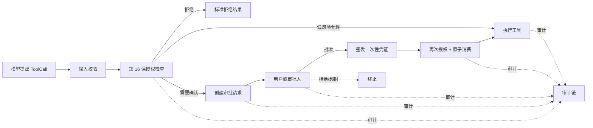
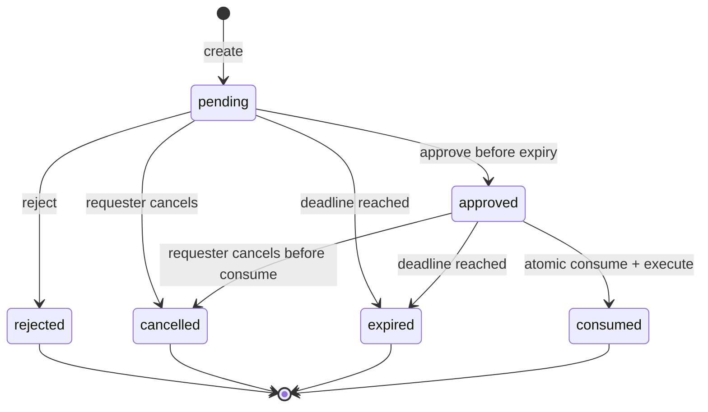
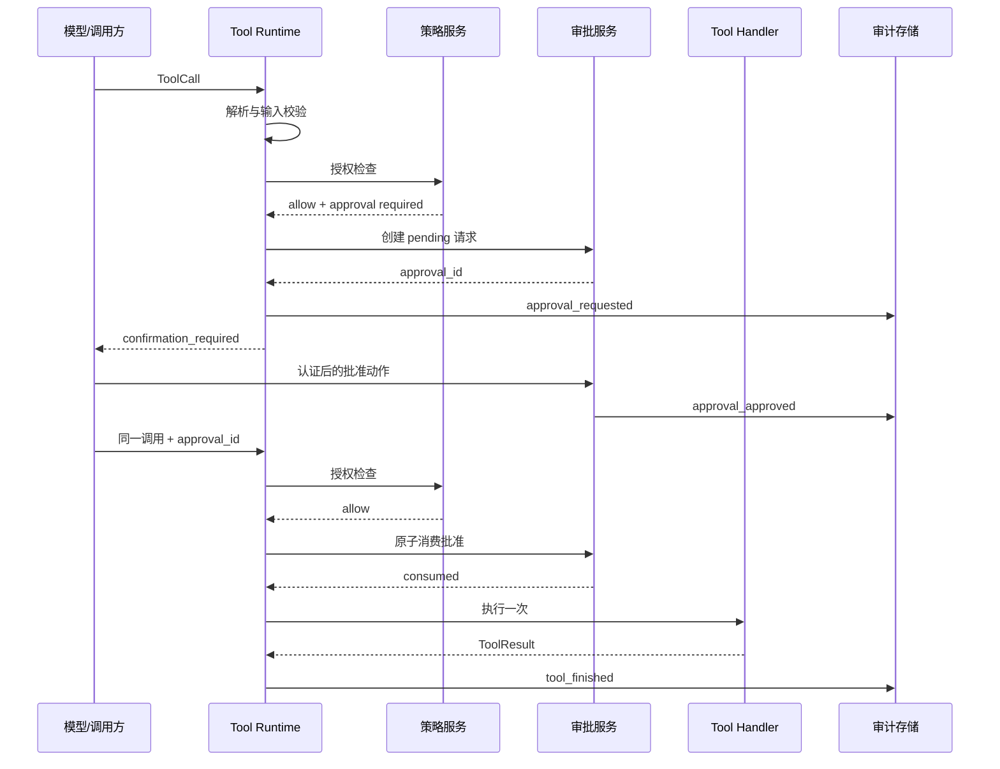

# 第 17 课：实现 Human-in-the-loop 审批与审计

> 所属章节：[第二章：Function Calling、Tool Runtime 与 MCP](./index.md)<br>
> 上一课：[第 16 课：建立权限模型与工具安全边界](./lesson-16-permission-security-boundary.md)<br>
> 下一课：[第 18 课：理解 MCP 协议并接入 MCP Client](./lesson-18-mcp-protocol-client.md)

## 一、你将完成什么

第 16 课已经回答了“当前主体是否有权对这个资源执行这个动作”。但有权限并不总意味着应该立刻执行：取消已付款订单、导出客户数据、删除文件、发起退款或修改生产配置，往往需要用户在看清影响后再做一次明确决定。

这一课为 `agent-platform` 增加持久化的 Human-in-the-loop（HITL）审批层与风险审计链。完成后，你会得到：

1. 一个把高风险 ToolCall 固化为审批请求、而不是传递 `confirmed=true` 的流程；
2. 包含 `pending`、`approved`、`rejected`、`expired`、`cancelled`、`consumed` 的显式状态机；
3. 绑定主体、调用、工具版本、参数摘要、租户和过期时间的一次性审批凭证；
4. 审批前与真正执行前的两次授权检查，避免“审批后权限已被回收”仍然执行；
5. 面对重试、并发消费、取消和未知结果时可解释的行为；
6. 独立于普通业务日志、可脱敏、可回放、可验证完整性的审计事件；
7. 状态机、并发、Runtime 集成和审计合同测试。

本课不实现人工审批页面、通知通道或组织级审批流编排。它们可以调用本课的服务接口。MCP Server 的远程接入留到第 18、19 课；即使工具来自 MCP，本课的本地审批与审计边界仍然有效。

## 二、确认不是授权，也不是模型的自述

在工具系统中，至少要分开下面四件事：

| 机制 | 它证明什么 | 不证明什么 |
| --- | --- | --- |
| 认证 | 请求来自哪个可信主体 | 主体能访问哪项资源 |
| 授权 | 主体当前能否执行目标动作 | 主体是否看清并同意这次风险 |
| 审批/确认 | 特定主体同意一份具体风险提案 | 主体拥有额外权限 |
| 审计 | 系统保留了可核查的事实 | 事实本身一定正确或允许执行 |

模型生成的 `approved`、`user_confirmed`、`reason`，甚至“用户已经说过可以”都只是输入文本，不能作为审批结论。审批结论必须来自经过认证的审批入口，并被服务端持久化。



确认放在授权之后的原因很重要：无权动作不能借“用户确认”获得授权，也不应产生可被用来枚举资源的审批请求。执行前再授权一次，是因为审批等待期间角色、租户、资源状态、额度或支持工单都可能改变。

## 三、先定义哪些工具需要审批

不要根据工具名字中是否出现 `delete` 这种字符串猜测风险。风险应由第 12 课 `ToolSpec` 中的声明、资源属性和运行时环境共同决定。

### 3.1 风险分级不是权限分级

| 等级 | 典型操作 | 默认处理 |
| --- | --- | --- |
| `low` | 查询自己的非敏感状态 | 授权通过后直接执行并记录摘要 |
| `medium` | 创建草稿、修改可撤销偏好 | 可直接执行，必要时显示可撤销记录 |
| `high` | 取消订单、覆盖文件、发送外部消息 | 明确用户确认，短有效期、一次消费 |
| `critical` | 退款、导出敏感数据、生产配置变更 | 审批、强认证、可能需要多人或职责分离 |

风险级别表达的是“本次执行前还要增加什么保护”，不是权限替代品。`refunds:write` 是资格；某笔退款是否需要本人确认、金额阈值或财务复核是风险策略。

```python
from enum import StrEnum
from pydantic import BaseModel, Field


class RiskLevel(StrEnum):
    LOW = "low"
    MEDIUM = "medium"
    HIGH = "high"
    CRITICAL = "critical"


class ApprovalPolicy(BaseModel):
    required: bool = False
    risk_level: RiskLevel = RiskLevel.LOW
    expires_in_seconds: int = Field(default=300, ge=30, le=3600)
    require_step_up_auth: bool = False
    required_approver_roles: tuple[str, ...] = ()
    allow_self_approval: bool = True


class ToolSpec(BaseModel):
    # 省略第 12 课已有字段
    name: str
    version: str
    approval: ApprovalPolicy = ApprovalPolicy()
```

`required=True` 适合静态高风险工具。更细的策略可在 Runtime 中根据已经加载的可信资源决定，例如退款金额超过 1,000 元、导出行数超过 100，或写入目标是生产环境时要求审批。模型传入的 `amount`、`environment` 不能直接用于这个判断，必须使用服务端可信数据。

### 3.2 审批提示应展示影响，而不是原始参数

审批页面或客户端需要让人理解将发生什么，但不能把不可信、未脱敏的大对象原样展示。审批请求应保存一个服务端构造的展示摘要：

```python
from dataclasses import dataclass
from typing import Any


@dataclass(frozen=True)
class ApprovalPreview:
    title: str
    summary: str
    resource_refs: tuple[str, ...]
    irreversible: bool
    fields_changed: tuple[str, ...] = ()


def build_refund_preview(order: "Order", refund_cents: int) -> ApprovalPreview:
    return ApprovalPreview(
        title="确认发起退款",
        summary=f"将为订单 {order.public_number} 发起 {refund_cents / 100:.2f} 元退款。",
        resource_refs=(f"order:{order.public_number}",),
        irreversible=False,
        fields_changed=("refund_status",),
    )
```

展示摘要应来自完成输入校验和资源加载后的领域对象。不要向审批人显示模型写的“这只是测试”作为风险说明，也不要把银行卡号、住址、访问令牌或完整文件内容复制到审批表单。

## 四、审批请求是一份不可变的执行提案

用户点击批准的对象必须是准确的一次调用，而不是“未来所有退款”或“这个工具都可以用”。创建审批请求时，把会影响执行语义的事实冻结下来。

### 4.1 必须绑定的事实

| 字段 | 为什么需要绑定 |
| --- | --- |
| `approval_id` | 审批记录与审计事件的稳定主键 |
| `request_id`、`call_id` | 与入口请求、工具调用和重试链关联 |
| `tenant_id`、`requester_id` | 防止跨租户或替换主体使用 |
| `tool_name`、`tool_version` | 防止批准旧行为却执行新版本工具 |
| `input_digest` | 防止批准参数 A 后执行参数 B |
| 资源摘要与风险策略版本 | 支持复盘当时的影响和规则 |
| `expires_at` | 让决定只在有限时间内有效 |
| `idempotency_key`（如适用） | 关联同一用户意图，不能单独当确认凭证 |

输入摘要必须采用**规范化后、服务端认可的参数**计算。直接对原始 JSON 字符串求哈希不可靠：对象字段顺序、空白、默认值表示差异都会导致同一语义有多个摘要。

```python
import hashlib
import json
from typing import Any


def canonical_json(value: Any) -> bytes:
    return json.dumps(
        value,
        ensure_ascii=True,
        sort_keys=True,
        separators=(",", ":"),
        allow_nan=False,
    ).encode("utf-8")


def digest_tool_input(validated_input: dict[str, Any]) -> str:
    return hashlib.sha256(canonical_json(validated_input)).hexdigest()
```

如果参数内含密码、令牌或高敏感文本，不应将它们完整持久化到审批表。可以保留受控加密原文供执行使用，同时对用于审计和展示的字段做白名单投影与掩码；摘要可覆盖完整的密文前语义，但不应把原文写入普通日志。

### 4.2 数据模型与状态

审批记录不是内存中的 `dict`。进程重启、用户隔天返回、多个 Web 实例和异步任务都要求它持久化，并具有可并发更新的版本或条件更新。

```python
from dataclasses import dataclass
from datetime import datetime
from enum import StrEnum


class ApprovalStatus(StrEnum):
    PENDING = "pending"
    APPROVED = "approved"
    REJECTED = "rejected"
    EXPIRED = "expired"
    CANCELLED = "cancelled"
    CONSUMED = "consumed"


@dataclass(frozen=True)
class ApprovalRequest:
    approval_id: str
    tenant_id: str
    requester_id: str
    request_id: str
    call_id: str
    tool_name: str
    tool_version: str
    input_digest: str
    policy_version: str
    preview: ApprovalPreview
    status: ApprovalStatus
    created_at: datetime
    expires_at: datetime
    decided_at: datetime | None = None
    decided_by: str | None = None
    decision_reason: str | None = None
    consumed_at: datetime | None = None
    row_version: int = 0
```

`decision_reason` 应是短的、受控的分类或可选人工说明，不能默认记录审批人输入的全部敏感内容。数据库表还应有 `tenant_id, status, expires_at` 与 `requester_id, created_at` 等查询索引；读取审批记录必须带租户条件。

## 五、状态机必须显式且可验证

审批系统最危险的错误通常不是“没有按钮”，而是允许已拒绝的请求复活、超时后仍执行，或让多个并发执行者重复消费同一批准。



`consumed` 表示批准已经被某次执行尝试原子占用，**不等价于工具一定成功**。工具执行超时或下游响应丢失时，结果可能未知；这时要结合第 15 课的幂等记录查询真实结果，而不是重置审批状态后再执行一遍。

### 5.1 允许的转换表

| 当前状态 | 命令 | 下一个状态 | 前提 |
| --- | --- | --- | --- |
| `pending` | `approve` | `approved` | 未过期、审批人合格、满足强认证 |
| `pending` | `reject` | `rejected` | 未过期、审批人合格 |
| `pending` | `cancel` | `cancelled` | 请求人或管理员，尚未执行 |
| `pending` | `expire` | `expired` | 当前时间到期 |
| `approved` | `consume` | `consumed` | 未过期、绑定事实匹配、再次授权成功 |
| `approved` | `cancel` | `cancelled` | 尚未被消费 |
| `approved` | `expire` | `expired` | 当前时间到期 |

`rejected`、`cancelled`、`expired`、`consumed` 都是终态。需要重新发起时，创建新的 `approval_id` 和新的审计事件；不要修改原记录为 `pending`，否则审计链和用户意图都会变得含混。

### 5.2 过期不能依赖后台定时任务

定时任务可以把历史 `pending` 标记成 `expired` 以便查询，但安全判断不能依赖它按时运行。任何读取、批准和消费操作都必须先比较服务端 UTC 时间与 `expires_at`，把过期记录视为不可用。

```python
from datetime import UTC, datetime


def is_expired(approval: ApprovalRequest, now: datetime) -> bool:
    return now.astimezone(UTC) >= approval.expires_at.astimezone(UTC)


def can_approve(approval: ApprovalRequest, now: datetime) -> bool:
    return approval.status is ApprovalStatus.PENDING and not is_expired(approval, now)
```

客户端倒计时只改善体验，不能作为安全时钟。服务端应使用可信 UTC 时间；针对时钟漂移、数据库时间和应用时间的差异要有监控与统一策略。

## 六、审批人、职责分离与强认证

简单的“用户确认”与“组织审批”共用同一状态机，但批准资格不同。

### 6.1 三种常见模式

| 模式 | 谁可以批准 | 适用例子 |
| --- | --- | --- |
| 自我确认 | 发起者本人 | 取消自己的订单、发送消息 |
| 角色审批 | 指定角色成员 | 财务审批退款、运维批准变更 |
| 双人复核 | 与发起者不同的两位合格主体 | 大额付款、密钥轮换 |

审批人身份必须来自审批入口的可信会话，而不是 `approve(approver_id="finance-admin")` 这类客户端参数。对于 `critical` 操作，批准时应检查近期强认证状态，例如 WebAuthn、企业 SSO 的重新验证或受控的二次验证声明。

```python
def may_approve(
    approval: ApprovalRequest,
    approver: "AuthorizationSubject",
    policy: ApprovalPolicy,
) -> bool:
    if approver.tenant_id != approval.tenant_id:
        return False
    if not policy.allow_self_approval and approver.actor_id == approval.requester_id:
        return False
    if policy.required_approver_roles:
        return bool(approver.roles.intersection(policy.required_approver_roles))
    return approver.actor_id == approval.requester_id
```

真实项目还要验证审批人账户未禁用、会话未撤销、工单或变更窗口有效，并以策略引擎取代上面的简化函数。不要把“审批角色”直接等同于所有执行权限：合格审批人可以同意，但实际执行仍以请求者的授权和工具运行时服务身份为准。

### 6.2 不要用链接本身当作权限

邮件或聊天中的审批链接应只定位一条审批请求，点击后仍要完成认证、租户检查和审批资格检查。链接中带有的随机 ID 不是可转发的万能凭证；敏感操作不要通过“打开链接即批准”执行。

## 七、批准凭证：绑定、短期、一次性

审批状态为 `approved` 后，Runtime 可以收到一个审批引用或服务端签发的短期凭证。无论形式如何，执行时都必须验证它指向的持久化记录，而不是信任模型携带的字符串。

```python
@dataclass(frozen=True)
class ApprovalBinding:
    approval_id: str
    tenant_id: str
    requester_id: str
    call_id: str
    tool_name: str
    tool_version: str
    input_digest: str


def matches_call(
    binding: ApprovalBinding,
    *,
    context: "ToolExecutionContext",
    call: "ToolCall",
    validated_input: dict[str, object],
) -> bool:
    return (
        binding.tenant_id == context.subject.tenant_id
        and binding.requester_id == context.subject.actor_id
        and binding.call_id == call.id
        and binding.tool_name == call.name
        and binding.tool_version == call.version
        and binding.input_digest == digest_tool_input(validated_input)
    )
```

不建议把全部审批事实放进长期可验证、无法撤销的 JWT。即使签名正确，它也无法自然反映审批被取消、用户被禁用或资源状态变化。若用签名 token 降低查询开销，也应采用短 TTL、`jti`、受众与密钥轮换，并在消费时回查审批记录的当前状态。

## 八、原子消费：解决重复点击与并发执行

“先查 `approved`，再把它设为 `consumed`”在两个并发请求下会导致双重执行。消费必须在数据库事务中以条件更新或行锁完成。

### 8.1 条件更新示例

以下伪 SQL 展示核心条件；实际参数必须使用预编译语句，并将 `now` 使用统一 UTC 时钟传入：

```sql
UPDATE approval_requests
SET status = 'consumed', consumed_at = :now, row_version = row_version + 1
WHERE approval_id = :approval_id
  AND tenant_id = :tenant_id
  AND requester_id = :requester_id
  AND call_id = :call_id
  AND tool_name = :tool_name
  AND tool_version = :tool_version
  AND input_digest = :input_digest
  AND status = 'approved'
  AND expires_at > :now;
```

只有受影响行数为 `1` 才可以进入 Handler。为 `0` 时不能盲目返回“缺少确认”，而要在受控读取后区分已拒绝、已取消、已过期、已被消费或绑定不匹配；对模型的外部错误仍保持稳定，细节只进入审计。

```python
class ApprovalStore:
    async def consume_if_approved(self, binding: ApprovalBinding, now: datetime) -> bool:
        """在同一数据库事务中执行上面的条件更新。"""
        ...


async def consume_approval_or_raise(
    store: ApprovalStore,
    binding: ApprovalBinding,
    now: datetime,
) -> None:
    consumed = await store.consume_if_approved(binding, now)
    if not consumed:
        raise ApprovalUnavailable("approval is not available for this invocation")
```

不要在 Handler 成功后才消费。那样并发请求在副作用发生前都认为自己持有批准。也不要在执行失败后自动把 `consumed` 改回 `approved`：失败可能是“未知结果”，恢复批准会给重复扣款或重复删除打开通道。

### 8.2 消费与幂等的关系

审批与幂等解决不同问题：

| 机制 | 防止什么 | 关键绑定 |
| --- | --- | --- |
| 审批消费 | 同一风险确认被多次执行 | 主体、调用、工具版本、参数摘要、期限 |
| 幂等键 | 同一业务意图因重试重复产生副作用 | 业务操作、租户、调用者、请求体摘要 |

高风险写工具通常两者都需要。正常路径是“原子消费批准 -> 调用带幂等键的业务操作 -> 记录结果”。进程在消费后崩溃时，通过幂等记录查询是否已经执行；不能因为审批已消费就假设业务失败。

## 九、把审批放回 Tool Runtime

第 14 至 16 课已经确定了 Runtime 的强制边界。本课只在授权成功后插入审批决策，并在真正执行前重新验证授权。



### 9.1 Runtime 的分支语义

```python
async def invoke(call: "ToolCall", context: "ToolExecutionContext") -> "ToolResult":
    spec = registry.resolve(call.name, call.version)
    validated_input = validate_input(spec, call.arguments)

    first_decision = await authorizer.decide(spec, validated_input, context)
    if not first_decision.allowed:
        await audit.record_denied(call, context, first_decision)
        return ToolResult.permission_denied()

    if first_decision.requires_approval:
        binding = approval_binding_for(spec, call, validated_input, context)
        if context.approval_id is None:
            request = await approvals.create_or_get_pending(binding, first_decision.preview)
            await audit.record_approval_requested(request)
            return ToolResult.confirmation_required(request.approval_id, request.expires_at)

        second_decision = await authorizer.decide(spec, validated_input, context)
        if not second_decision.allowed:
            await audit.record_denied(call, context, second_decision)
            return ToolResult.permission_denied()

        await approvals.consume_or_raise(context.approval_id, binding)

    return await execute_with_reliability(spec, validated_input, context)
```

这段代码省略了异常处理、输出 Schema 校验和第 15 课的取消与幂等细节。关键顺序不能改变：参数先验证，授权先于创建审批，第二次授权先于消费，消费先于副作用。对于并不需要审批的工具，仍然只有一次正常授权检查。

### 9.2 创建请求也要幂等

用户刷新页面或客户端重发同一 ToolCall，不应产生一排相同的待审批记录。可以为 `pending` 请求设置唯一键：

```text
tenant_id + requester_id + call_id + tool_name + tool_version + input_digest
```

冲突时返回仍未过期的既有 `pending` 请求；若它已是终态或参数发生变化，则创建一条新的请求。不要仅用 `tool_name` 去重，否则不同订单或不同参数会错误共享审批。

## 十、取消、拒绝、过期与未知结果

审批流程必须诚实地表达终止原因，不能把所有情况都写成“用户拒绝”。

| 情况 | 审批状态 | 是否调用 Handler | 对调用方的语义 |
| --- | --- | ---: | --- |
| 用户选择拒绝 | `rejected` | 否 | 明确取消该动作 |
| 请求人主动撤回 | `cancelled` | 否 | 调用已取消 |
| 等待到期 | `expired` | 否 | 需要重新确认 |
| 批准已被其他请求消费 | `consumed` | 当前请求否 | 查询业务幂等结果或返回不可重放 |
| 消费后下游超时 | `consumed` | 可能已调用 | 结果未知，查询幂等状态 |
| 二次授权失败 | 保持 `approved` 或按策略取消 | 否 | 权限/资源状态已变化 |

二次授权失败时是否把 `approved` 变为 `cancelled` 是产品与安全策略选择。高风险资源状态变化通常应取消它，避免资源恢复后旧批准意外生效；短期、一次性批准也可以保留到自然过期，但执行时必须持续重新授权。无论选择哪种，都应记录策略版本和理由。

不要把审批拒绝标成 `retryable=true`。重试网络请求不等于用户改主意；模型也不应通过生成另一套近似参数绕过拒绝。必要时为同一用户意图设置冷却窗口，并在产品层向用户展示明确的重新发起入口。

## 十一、审计链：记录可核查事实，而不是复制所有数据

普通应用日志用于排障，可能被采样、截断、覆盖或由多个服务随意写入。审计事件回答的是安全和合规问题，因此需要独立的结构、访问控制、保留策略和完整性保障。

### 11.1 最小审计事件

```python
from dataclasses import asdict, dataclass
from datetime import datetime
from typing import Mapping


@dataclass(frozen=True)
class AuditEvent:
    event_id: str
    occurred_at: datetime
    event_type: str
    tenant_id: str
    request_id: str
    call_id: str | None
    approval_id: str | None
    actor_id: str | None
    actor_type: str | None
    tool_name: str | None
    tool_version: str | None
    input_digest: str | None
    outcome: str
    policy_id: str | None
    policy_version: str | None
    reason_code: str | None
    metadata: Mapping[str, str]
    previous_hash: str | None = None
    event_hash: str | None = None
```

建议至少记录以下事件：

| 事件 | 何时写入 | 核心事实 |
| --- | --- | --- |
| `tool.authorization_denied` | 授权拒绝 | 规则、资源种类、稳定原因码 |
| `approval.requested` | 创建待审批 | 请求人、工具、风险、到期时间、参数摘要 |
| `approval.approved` | 合格审批人批准 | 审批人、强认证等级、策略版本 |
| `approval.rejected` / `cancelled` / `expired` | 终止 | 谁触发、终止原因、时间 |
| `approval.consumed` | 原子消费成功 | 消费调用与绑定摘要 |
| `tool.started` / `tool.finished` | 副作用尝试与结果 | 尝试序号、幂等键摘要、结果分类 |

审计写入最好采用 outbox 模式：在审批状态变更或业务命令的同一数据库事务中写出不可变 outbox 记录，由可靠投递器送往审计存储。直接在事务提交后异步打印日志，进程崩溃时会留下“状态已改变但没有审计”的缺口。

### 11.2 脱敏与最小化

审计需要可关联，不需要拥有所有原始数据。推荐做法：

- 记录 `input_digest`、字段名称、条目数量与受控资源摘要，而不是完整输入 JSON；
- 对邮箱、手机号、订单号等采用按租户加盐的不可逆标识或局部掩码；
- 不记录认证 Header、Cookie、访问令牌、密钥、完整文件、支付卡信息；
- 将审批备注设为长度限制和敏感词检测对象，必要时加密并限制少数审计员访问；
- 为 `metadata` 定义键白名单，拒绝 Handler 任意追加下游响应或异常堆栈。

脱敏不是把敏感字段叫作 `masked` 就结束。应针对每种工具维护审计字段白名单，并在测试中断言密钥和高敏感字段不可能出现在序列化事件中。

### 11.3 防篡改并不等于“写进数据库”

审计表只要允许普通业务服务执行 `UPDATE` 或 `DELETE`，就无法称为不可篡改。可分层采取：

1. 审计存储只允许追加，应用角色没有更新和删除权限；
2. 写入后转存到权限隔离、版本保留的对象存储或专用日志服务；
3. 将每个事件哈希连接到前一事件或批次根哈希，并把根锚定到独立系统；
4. 定期验证哈希链、事件序号和导出快照，发现缺口立即告警；
5. 把审计读取本身也写入审计事件，并按职责分离限制访问者。

哈希链能发现已保存记录被改写，但不能阻止有高权限的攻击者同时删掉一段尾部事件。因此它必须配合异地存储、最小权限和独立告警，而不能作为唯一保证。

```python
def hash_event(event: AuditEvent, previous_hash: str | None) -> str:
    payload = asdict(event) | {"previous_hash": previous_hash, "event_hash": None}
    return hashlib.sha256(canonical_json(payload)).hexdigest()
```

哈希输入必须包含稳定、规范化的字段，不能包含数据库自动序列化产生的不确定顺序。为高吞吐系统使用按租户或按时间窗口的 Merkle 批次也可以，但必须保留可验证的批次边界与锚定记录。

### 11.4 保留期限、删除请求与访问权

“永久保存”既增加隐私风险，也未必符合法规。为每类事件定义数据分类、保留期限、法务留置规则和到期删除方式。需要删除个人数据时，优先删除或轮换可关联的加密映射与密钥，保留不可逆的安全事件摘要；具体方案应由隐私、法务和安全团队共同确定。

审计访问只能提供最小视图。客服排障看到事件时间、状态和资源摘要即可，安全审计员才可能查看受控理由，任何导出都应再次授权并审计。

## 十二、与第 15 课可靠性机制协作

审批等待可能持续分钟，而单次工具调用的网络预算通常只有秒级。不要让 Runtime 在 HTTP 请求中阻塞等待人工点击；第一次调用应返回 `confirmation_required` 与审批引用，由任务或客户端在批准后重新提交。

### 12.1 重试规则

| 时点 | 是否可自动重试 | 原因 |
| --- | --- | --- |
| 创建审批请求网络超时 | 可用创建去重键重试 | 可能已创建，需先查询既有记录 |
| `pending` 等待用户 | 否 | 等待不是瞬时故障 |
| 原子消费返回竞争失败 | 否 | 必须查询状态和幂等结果 |
| 消费后执行前本地崩溃 | 不直接重试副作用 | 先查询幂等状态 |
| 已验证的下游瞬时失败 | 仅按工具重试策略 | 每次尝试仍进入 Runtime 授权边界 |

审批一经消费，可靠性执行器不能在每个重试尝试中再次消费同一个记录。应把“获得一次执行权”和“同一幂等意图的受控重试”关联起来：首次尝试消费批准，后续重试使用同一受控执行租约与幂等键，同时每次仍重新检查授权、截止时间与取消。若运行进程重启，恢复器先查询幂等状态，而不是凭空续用批准。

### 12.2 取消

用户在 `pending` 或未消费的 `approved` 阶段取消，可安全转换为 `cancelled`。如果已消费且 Handler 已开始，取消只能尽力传播给下游；对于不能保证回滚的副作用，应返回“执行状态待确认”，通过幂等查询或领域状态查询收敛，而不是声称“已经取消”。

## 十三、MCP 与异步任务的审批边界

远程 MCP Server 可能也提供确认弹窗或自己的权限模型，但它不能替代平台审批：平台需要知道是哪个本地用户、为哪次 ToolCall、在什么租户下批准了什么参数。

- 本地 Runtime 先完成授权与审批，再向 MCP Server 发起调用；
- 只下发范围最小、短期的下游凭证，不转发用户原始会话或全局密钥；
- 将远程请求 ID、Server 身份和传输层版本写入审计摘要；
- 远程调用超时后的结果仍归入第 15 课的“未知结果”，通过幂等或查询接口确认；
- 若 MCP Server 报告“需要确认”，将其视为额外限制而不是本地审批成功的替代证明。

对于后台任务，批准应绑定稳定的任务步骤 ID 与经过冻结的输入版本。任务恢复时必须重新检查审批、授权、任务归属和资源版本，不能因为 Checkpoint 里保存了 `approved=true` 就继续执行。

## 十四、测试：用状态和副作用证明边界

审批代码的测试不能只覆盖“点击批准后返回 200”。要断言每种状态迁移、每条拒绝路径和 Handler 调用次数。

### 14.1 状态机测试

```python
import pytest


@pytest.mark.parametrize(
    ("initial", "command", "expected"),
    [
        (ApprovalStatus.PENDING, "approve", ApprovalStatus.APPROVED),
        (ApprovalStatus.PENDING, "reject", ApprovalStatus.REJECTED),
        (ApprovalStatus.PENDING, "cancel", ApprovalStatus.CANCELLED),
        (ApprovalStatus.APPROVED, "consume", ApprovalStatus.CONSUMED),
    ],
)
def test_valid_transitions(initial: ApprovalStatus, command: str, expected: ApprovalStatus) -> None:
    approval = approval_factory(status=initial)
    assert transition(approval, command, now=NOW).status is expected


@pytest.mark.parametrize(
    ("initial", "command"),
    [
        (ApprovalStatus.REJECTED, "approve"),
        (ApprovalStatus.CONSUMED, "consume"),
        (ApprovalStatus.EXPIRED, "approve"),
        (ApprovalStatus.CANCELLED, "consume"),
    ],
)
def test_terminal_or_invalid_transitions_are_rejected(initial: ApprovalStatus, command: str) -> None:
    with pytest.raises(InvalidApprovalTransition):
        transition(approval_factory(status=initial), command, now=NOW)
```

还要覆盖边界时间：`expires_at == now` 必须过期；不同租户审批人、禁止自我审批、强认证不足、工具版本不同和参数摘要不同都必须拒绝。

### 14.2 并发消费测试

使用真实数据库事务或与生产等价的条件更新语义，同时发起两个消费同一 `approval_id` 的请求：

```python
async def test_only_one_concurrent_consumer_can_execute() -> None:
    approval = await create_approved_request()
    results = await asyncio.gather(
        runtime.invoke(call_for(approval), context_for(approval)),
        runtime.invoke(call_for(approval), context_for(approval)),
        return_exceptions=True,
    )

    assert handler.call_count == 1
    assert sum(result.is_success for result in results if hasattr(result, "is_success")) == 1
```

内存锁不能替代此测试，因为多进程、多副本和崩溃恢复下它不存在。生产使用 PostgreSQL 等数据库时，应在同类数据库中跑并发集成测试。

### 14.3 Runtime 与审计合同测试

至少覆盖下面的验收场景：

1. 未授权调用不会创建审批记录，也不会调用 Handler；
2. 高风险、已授权调用首次返回 `confirmation_required`，重复提交只得到同一待审批请求；
3. 批准后的参数、主体、租户、调用 ID 或工具版本任一变化都会拒绝且不执行；
4. 审批等待期间撤销权限或改变资源状态，二次授权拒绝且 Handler 调用次数为零；
5. 两个并发执行请求只有一个消费成功，另一个不产生副作用；
6. `rejected`、`expired`、`cancelled` 均不可被重放；
7. 消费后超时返回未知结果，查询幂等记录而非重新批准并执行；
8. 每个状态迁移与执行结果都有完整关联 ID 的审计事件；
9. 审计事件序列化后不含令牌、完整地址、密码、原始敏感参数或下游响应；
10. 修改或删除测试审计事件后，完整性校验能够发现哈希链或批次锚点不一致。

为审计事件维护版本化样本。数据字段、原因码、策略版本或事件类型变更时，更新合同并评估下游 SIEM、告警与合规报表的兼容性。

## 十五、常见错误与修正

### 15.1 用 `confirmed: true` 作为工具参数

这只是模型可以伪造的字符串或布尔值。改为由审批服务签发、Runtime 回查的持久化审批记录，并绑定本次调用事实。

### 15.2 批准后不再检查权限

审批可能持续几分钟，期间用户或资源状态都可能变化。执行前重新授权；确认从不扩大权限。

### 15.3 只绑定工具名，不绑定参数和版本

批准“退款 100 元”后可能被复用于“退款 10,000 元”，旧工具行为也可能与新版本不同。绑定规范化参数摘要、资源、调用 ID 与精确版本。

### 15.4 先读状态再更新为已消费

并发请求会同时看到 `approved`，导致重复副作用。使用带状态、期限和绑定事实的原子条件更新。

### 15.5 执行失败后恢复为 `approved`

超时和连接断开可能是未知结果。恢复批准会让同一操作再次执行；应该查询幂等记录或领域状态。

### 15.6 审批记录永久有效

旧批准会在权限、价格、资源状态改变后被意外重放。使用短过期时间，并在每次批准、读取和消费时由服务端检查。

### 15.7 以普通日志替代审计

普通日志会采样、泄露数据或被覆盖。审计事件必须结构化、最小化、受访问控制，并有追加与完整性保障。

### 15.8 将完整 ToolCall 和下游响应写进审计

这会把敏感数据复制到更广泛可读的系统。仅记录摘要、计数、允许字段和受控原因码；原文若确有必要，应单独加密和限权保存。

## 十六、练习

### 练习 1：实现订单取消确认

为 `cancel_order` 增加审批策略。要求：

1. 仅订单所有者可创建审批请求；
2. 审批摘要显示订单公开编号和取消影响，不显示完整地址；
3. 审批绑定订单 ID、`cancel_reason`、调用 ID、工具版本与五分钟期限；
4. 订单在批准后变为已发货时，二次授权拒绝；
5. 两个并发“确认取消”请求只触发一次取消命令。

### 练习 2：设计大额退款双人审批

为超过 1,000 元的退款设计流程：发起者不可自批，财务角色可批准，并要求近期强认证。思考如何扩展状态模型记录多位批准者、阈值和职责分离，同时保持每个批准决定不可变、可审计。

### 练习 3：审计字段白名单

为 `export_orders` 定义 `AuditEvent` 的字段投影函数。测试导出量、字段集合、租户和审批 ID 均被记录，但客户地址、手机号、支付令牌和完整查询条件永远不会出现在 JSON 序列化结果中。

## 十七、完成标准

完成本课后，检查以下条目：

- [ ] 高风险执行使用持久化审批请求，不信任模型参数中的确认结论；
- [ ] 审批绑定可信主体、租户、调用 ID、工具精确版本、规范化参数摘要、风险策略和过期时间；
- [ ] `pending`、`approved`、`rejected`、`expired`、`cancelled`、`consumed` 的状态转换明确且终态不可复活；
- [ ] 批准和消费都检查服务端时间，消费通过跨进程安全的原子条件更新完成；
- [ ] 审批前授权与执行前授权都存在，确认从不替代或扩大授权；
- [ ] 审批消费、幂等键、重试、取消和未知结果的边界有稳定语义；
- [ ] 审计事件包含关联 ID、主体、工具版本、策略与结果摘要，不复制敏感原文；
- [ ] 审计存储具有追加、访问控制、保留期限和完整性验证方案；
- [ ] 状态机、并发消费、权限回收、脱敏和审计回放均有自动化测试。

## 十八、小结

Human-in-the-loop 的目标不是给高风险工具加一个“确认按钮”，而是把某个具体、短期、可解释的执行提案交给可信的人决定。审批必须绑定主体、租户、调用、工具版本、规范化参数和期限，并用不可复活的状态机与原子消费避免重放和并发重复执行。

审批永远发生在授权之后，执行前还要重新授权；消费后的失败可能是未知结果，必须交给幂等和领域查询收敛。审计记录则要保留足够的关联和决策事实，同时通过脱敏、最小化、追加存储与完整性验证避免自身变成新的泄露面。

下一课将把这套本地 Tool Runtime 接入 MCP：理解远程能力发现、连接生命周期与传输错误，并保持本章已经建立的校验、授权、审批和审计边界不被远程工具绕过。
