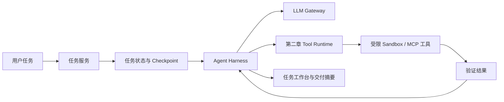

# 第三章：Agent Loop、State、Harness 与 Codebase Agent

> 建议课时：23 个核心课时 + 1 个选修课时 
> 项目里程碑：M3 · Codebase Agent

## 章节定位

第二章让 `agent-platform` 能够安全、可靠地执行一次 ToolCall；第三章让它能够围绕一个明确任务持续观察、决策、调用工具、检查结果、暂停并恢复。课程主线从“受控工具运行时”推进为“可恢复、可验证的 Codebase Agent”。

本章不追求无限自主性，也不把 Agent Loop 写成只要模型持续调用工具的 `while True`。任务目标、状态迁移、步数与成本预算、Checkpoint、取消、审批和 Sandbox 都属于平台明确控制的边界。模型负责提出下一步，平台负责决定是否允许、如何执行及何时结束。

## 前置条件

开始本章前，应已完成：

1. 第一章的 LLM Gateway、结构化输出与流式响应；
2. 第二章的 Tool Schema、Registry、Runtime、权限、审批、Trace 与 MCP 接入；
3. Python 异步编程、Git 基础、测试和命令行的基本使用能力。

## 学习目标

完成本章后，你应该能够：

1. 解释一次 ToolCall、Agent Loop、任务编排与多 Agent 的职责边界。
2. 为 Agent 任务定义显式状态机、终止条件、预算和错误语义。
3. 持久化任务、消息、步骤和工具结果，并通过 Checkpoint 实现可恢复执行。
4. 设计计划、观察、执行、验证与重规划的受控循环。
5. 在受限 Sandbox 中执行代码、命令和测试，避免宿主机与密钥暴露。
6. 实现可替换模型、工具、状态存储和策略的 Agent Harness。
7. 构建能检索代码、提出修改、生成补丁、运行验证并产出交付摘要的 Codebase Agent。
8. 处理审批、取消、超时、并发、重复投递、重启和未知结果。
9. 通过任务工作台、Trace、回放和验收场景验证长程任务行为。

## 项目主线

本章继续扩展 `agent-platform`，完成一个面向受控代码仓库任务的最小 Codebase Agent。用户提交“解释模块行为”“定位测试失败”或“提出并验证小范围修复”后，系统将任务拆分为多个步骤，在预算内调用第二章提供的工具，并保留足以恢复和审计的状态。

最终 Agent 必须把“建议”“已执行”“已验证”“等待审批”“失败且可恢复”明确区分。它不能把模型的补丁文本当成已修改文件，也不能把失败测试包装成修复成功。

## 课程目录

| 课次 | 主题 | 建议课时 | 主要工程增量 |
| ---: | --- | ---: | --- |
| 1 | [理解 Agent Loop 与终止边界](./lesson-01-agent-loop-boundaries.md) | 1 | Loop 职责、回合模型、停止条件与预算边界 |
| 2 | [定义 Agent 任务模型与输入约束](./lesson-02-agent-task-model.md) | 1 | 任务目标、输入约束、授权范围、完成标准与任务不变量 |
| 3 | [设计任务状态机与迁移规则](./lesson-03-task-state-machine.md) | 1 | 状态集合、迁移校验、失败、取消与终态语义 |
| 4 | [设计计划、观察与执行契约](./lesson-04-plan-observe-act.md) | 1 | 计划步骤、依赖、观察证据、执行结果与回合契约 |
| 5 | [实现任务持久化与事件记录](./lesson-05-task-persistence-events.md) | 1 | 任务、步骤、消息、工具结果与事件的持久化模型 |
| 6 | [实现 Checkpoint 与重启恢复](./lesson-06-checkpoint-recovery.md) | 1 | 一致性快照、租约、幂等恢复与未知结果处理 |
| 7 | [实现动态重规划与步骤依赖](./lesson-07-replanning-dependencies.md) | 1 | 计划修订、依赖更新、失效步骤与重规划边界 |
| 8 | [实现预算、重复检测与收敛终止](./lesson-08-budget-convergence.md) | 1 | 预算扣减、重复行为检测、无进展识别与安全终止 |
| 9 | [建立 Sandbox 文件与工作区边界](./lesson-09-sandbox-workspace-boundary.md) | 1 | 工作区隔离、路径解析、读写范围与产物管理 |
| 10 | [限制 Sandbox 命令、进程与资源](./lesson-10-sandbox-command-resource-boundary.md) | 1 | 命令策略、进程控制、CPU、内存、磁盘与时间限制 |
| 11 | [隔离网络与密钥并管理 Sandbox 生命周期](./lesson-11-sandbox-network-lifecycle.md) | 1 | Docker 或等价隔离、网络策略、密钥保护、环境回收与审计 |
| 12 | [搭建 Agent Harness 核心接口](./lesson-12-harness-core-interfaces.md) | 1 | 模型、工具、状态、策略与执行环境的可替换接口 |
| 13 | [实现 Harness 事件、Hook 与生命周期](./lesson-13-harness-events-lifecycle.md) | 1 | Run、Step、Event、Hook、暂停、取消与恢复边界 |
| 14 | [理解图编排原理与执行语义](./lesson-14-orchestration-principles.md) | 1 | 图、节点、边、共享状态、条件分支、循环与 Interrupt |
| 15 | [使用 LangGraph 接入 Agent Harness](./lesson-15-langgraph-harness-integration.md) | 1 | 状态图、Tool Node、Interrupt、Checkpoint 与框架解耦 |
| 16 | [实现代码库探索与证据收集](./lesson-16-codebase-exploration-evidence.md) | 1 | 仓库地图、受限检索、文件读取、证据引用与上下文预算 |
| 17 | [制定变更计划并生成补丁](./lesson-17-change-plan-patch-generation.md) | 1 | 影响范围、变更计划、补丁格式与生成结果校验 |
| 18 | [受控应用补丁并处理冲突](./lesson-18-controlled-patch-application.md) | 1 | 授权校验、补丁应用、冲突处理、文件边界与应用状态 |
| 19 | [实现验证流程与交付摘要](./lesson-19-validation-delivery.md) | 1 | 测试执行、差异审查、验证证据、风险与交付状态 |
| 20 | [建立任务工作台、Trace 与回放](./lesson-20-task-workbench-trace-replay.md) | 1 | 任务视图、Timeline、完整 Trace、失败复现与 Replay |
| 21 | [实现审批、取消、恢复与人工接管](./lesson-21-human-recovery-takeover.md) | 1 | HITL 中断、取消语义、恢复入口、人工修正与继续执行 |
| 22 | [完成 Codebase Agent 端到端联调](./lesson-22-codebase-agent-integration.md) | 1 | 理解任务、受限修改、失败恢复与工作台联调 |
| 23 | [完成 M3 Codebase Agent 验收](./lesson-23-m3-codebase-agent-acceptance.md) | 1 | 端到端场景、故障演练、回归测试与里程碑交付 |
| 24（选修） | [开展 AI Coding Agent 进阶工作坊](./lesson-24-ai-coding-agent-workshop.md) | 1 | 成熟产品对照、项目指令、Worktree、团队规范与选型 |

## 课程分组

| 阶段 | 课次 | 要解决的问题 | 阶段产物 |
| --- | --- | --- | --- |
| Loop、任务与状态 | 1-4 | Agent 如何开始、继续、结束，并用明确契约表达回合事实 | 有终止边界的任务状态机与回合契约 |
| 持久化与恢复 | 5-6 | 如何保存事实、创建 Checkpoint 并在重启后继续 | 可恢复的任务服务 |
| 重规划与收敛 | 7-8 | 如何修订计划，并在预算与重复检测约束下收敛 | 受预算约束的 Agent Loop |
| Sandbox | 9-11 | 如何隔离文件、命令、资源、网络和密钥 | 可回收、可审计的隔离执行环境 |
| Agent Harness | 12-13 | 如何组织可替换的运行接口与生命周期 | Harness 核心骨架与事件链 |
| 编排 | 14-15 | 如何理解图执行语义并接入 LangGraph | 与业务解耦的状态图实现 |
| Codebase Agent | 16-19 | 如何基于代码证据分析、生成并应用补丁、验证交付 | 可审查的代码任务执行链 |
| 工作台与人工恢复 | 20-21 | 如何观测、回放和人工接管长程任务 | 工作台、Trace Replay 与恢复入口 |
| 联调与验收 | 22-23 | 如何完成联调并证明 M3 可用 | Codebase Agent 与 M3 验收报告 |
| 进阶工作坊（选修） | 24 | 如何对照成熟 Coding Agent 改进工程工作流 | 产品对照与团队使用规范 |

## 单课内容边界

本章严格按照“一节课对应一个课时”编写。每节课只解决课程目录中标明的一个核心工程问题，并遵守以下约束：

1. 概念课以建立判断标准和职责边界为目标，不提前展开后续实现。
2. 实现课只完成一个主要工程增量，配套代码、测试和练习围绕该增量展开。
3. 状态模型、持久化、恢复、预算、Sandbox、Harness 和业务 Agent 分别落在对应课次，不在前置课程重复实现。
4. 对后续内容只说明接口和依赖，不提供会占用当前课时的完整实现。
5. 单课同时出现两个可以独立编码、测试和验收的主题时，应继续拆分或重新分配。

## 关键设计原则

1. **任务状态优先于对话历史。** 对话是模型上下文的一部分，任务状态才是可恢复执行的事实来源。
2. **每一步都有预算。** 回合数、总时间、Token、工具次数、Sandbox 资源和并发都由平台限制。
3. **Checkpoint 只在一致边界提交。** 不保存半个工具调用或未确定副作用的“看似完成”状态。
4. **恢复不是重跑。** 恢复时先检查租约、幂等键、审批状态和下游结果，再决定继续、查询或终止。
5. **Sandbox 是隔离边界。** 模型不能选择宿主路径、网络目标、环境变量或命令解释器。
6. **证据与结论分离。** Codebase Agent 的结论应引用文件、行号、命令输出或测试结果，不能仅依赖模型自述。
7. **修改与验证分离。** 生成补丁、应用补丁、运行测试、声明交付是四个可观察状态。
8. **人工接管是正常路径。** 高风险操作、预算耗尽、冲突、未知结果和重复失败应进入清晰的人工恢复流程。

## M3 交付内容

- 任务、步骤、事件、预算与状态机的数据模型
- Checkpoint、租约、重启恢复和取消机制
- 计划/观察/执行/验证/重规划的受控 Agent Loop
- 受限代码执行 Sandbox 和可审计的命令工具
- 可替换模型、工具、存储和策略的 Agent Harness
- 具备探索、补丁、测试和交付摘要能力的 Codebase Agent
- 任务工作台、Timeline、恢复入口和完整 Trace
- 覆盖正常、审批、超时、断连、重启与未知结果的自动化验收场景

## M3 验收标准

- 单个任务不会无限循环，且总步数、总时间、模型与工具预算均可观察、可限制。
- 任意 Checkpoint 后的进程重启不会重复已确认的写操作或消费过的审批。
- 不可信任务文本无法指定宿主机路径、任意 shell 命令、网络地址或密钥环境。
- Codebase Agent 的分析结论和变更摘要可追溯到受控的代码证据与验证结果。
- 补丁只有在实际应用并完成指定验证后才能标记为“已交付”。
- 任务取消、审批拒绝、预算耗尽、Sandbox 失败与远程工具断连都能进入可解释终态或可恢复状态。
- 从任务工作台可关联用户请求、每个模型回合、ToolCall、Sandbox 命令、审批和最终产物。

## 最终产物

本章完成后，`agent-platform` 将从一个可安全调用工具的 Runtime 演进为可管理长程代码任务的 Agent 系统。第四章会为它补充 Context、Memory 与 Codebase RAG，使 Agent 能在更大规模的知识和代码上下文中保持证据质量。
