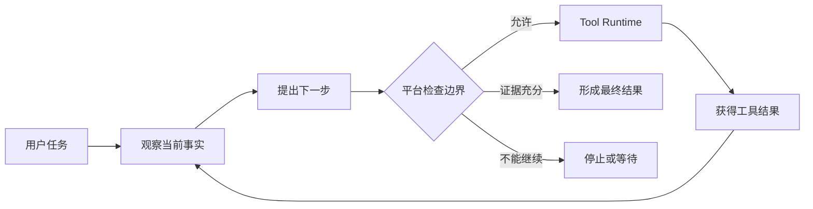

# 第 1 课：理解 Agent Loop 与终止边界

> 章节导航：[第三章：Agent Loop、State、Harness 与 Codebase Agent](./index.md)  
> 前置章节：[第二章：Function Calling、Tool Runtime 与 MCP](../chapter-02-tool-runtime-mcp/)  
> 下一课：[第 2 课：定义 Agent 任务模型与输入约束](./lesson-02-agent-task-model.md)

## 一、你将完成什么

第二章已经让 `agent-platform` 能够安全地执行一次 ToolCall。但真实代码任务经常无法在一次模型调用和一次工具调用内完成。

例如，“解释登录请求从 API 入口到权限校验的完整调用链”通常需要先搜索入口，再读取实现、追踪依赖、核对配置，最后根据证据形成结论。每次工具结果都可能改变下一步，这正是 Agent Loop 要解决的问题。

完成本课后，你应该能够：

1. 解释为什么长程任务需要 Agent Loop；
2. 区分普通脚本、固定 Workflow、单轮 Tool Calling 与 Agent Loop；
3. 理解 ReAct 与 Plan-and-Execute 两种基本思路；
4. 划清模型、Loop Controller 与 Tool Runtime 的职责；
5. 识别 Agent 必须停止、等待或交给人工处理的情况。


## 二、本课内容边界

本课只回答两个问题：

1. 什么任务需要 Agent Loop？
2. Agent Loop 在什么情况下必须停止？

本课不会实现：

- Agent 任务与步骤数据模型；
- 完整任务状态枚举与迁移规则；
- 任务、消息和事件持久化；
- Checkpoint 与重启恢复；
- 结构化回合协议；
- 步数、Token、时间和工具调用的预算算法；
- 可运行的 Loop Controller；
- 重复行为检测和终止测试。

这些内容分别留给第 2–7 课。当前只建立共同语言和设计边界，避免还没有任务模型与状态机时，就直接写一个失控的循环。

## 三、为什么一次 Tool Calling 不够

第二章第 1 课实现的是一个受限回合：模型提出工具调用，应用执行工具，再让模型生成最终回答。

这适合路径明确的任务：

```text
用户：查询订单 A-1024 的状态。

模型：调用 get_order。
系统：返回订单状态。
模型：生成最终回答。
```

代码库任务通常没有这么确定。假设用户提出：

```text
请解释登录请求从 API 入口到权限校验的完整调用链，
并给出对应的文件引用。
```

模型开始时可能不知道：

- 登录入口位于哪个文件；
- 项目使用中间件、装饰器还是独立授权服务；
- 权限规则来自代码、配置还是远程服务；
- 哪些测试能够证明当前理解正确。

它需要边执行边获得事实：

```text
搜索登录路由
-> 读取入口文件
-> 发现 authenticate() 调用
-> 搜索函数定义
-> 阅读权限策略
-> 核对测试或配置
-> 汇总带引用的结论
```

此时，后一步依赖前一步的结果。继续调用不是简单重试，而是基于新观察作出新决策。




Agent Loop 的价值，是允许系统根据运行中获得的证据调整下一步；它不是让模型不受限制地连续调用工具。

## 四、先判断是否真的需要 Agent

Agent 提高了灵活性，也增加了延迟、成本和不确定性。步骤能够预先确定时，普通代码或固定 Workflow 通常更合适。


| 方案              | 适用条件             | 典型例子           |
| --------------- | ---------------- | -------------- |
| 普通脚本            | 输入、步骤和分支都确定      | 批量格式化文件、生成固定报表 |
| 固定 Workflow     | 步骤已知，只有有限分支或人工节点 | 创建变更单、审批、执行、通知 |
| 单轮 Tool Calling | 只需选择少量工具，调用深度有限  | 查询订单后解释状态      |
| Agent Loop      | 下一步依赖运行中取得的证据    | 探索陌生代码库、定位测试失败 |
| Multi-Agent     | 子任务可隔离，确实需要分工或并行 | 大型迁移中的多模块调查    |


### 4.1 三个选型问题

面对一个新需求，先回答：

1. **步骤能否提前完整写出？** 能写出时优先使用脚本或 Workflow。
2. **工具结果是否会改变下一步？** 不会改变时通常不需要 Agent Loop。
3. **灵活决策的收益是否值得承担额外风险？** 如果收益很小，应保持简单。

以 Codebase Agent 为例：

- “对明确目录运行格式化命令”是普通脚本；
- “对指定补丁依次运行 lint、测试和差异检查”是固定 Workflow；
- “探索未知调用链并决定下一步读取哪些文件”适合 Agent Loop；
- “同时调查多个相互独立的服务”才可能进一步考虑 Multi-Agent。

不要根据任务描述是否“复杂”来判断。关键是下一步是否必须依赖运行中取得的新证据。

## 五、Agent Loop 的基本过程

不同框架会使用不同名称，但一个可治理的 Agent Loop 通常包含五类动作：

```text
observe -> plan -> act -> observe -> finalize
```


| 阶段           | 主要问题        | 结果             |
| ------------ | ----------- | -------------- |
| `observe`    | 当前已知什么？     | 任务目标、约束和已有事实   |
| `plan`       | 下一步应该做什么？   | 工具调用、补充信息或结束提案 |
| `act`        | 这个动作能否执行？   | 经过平台校验的执行结果    |
| 再次 `observe` | 新结果改变了什么？   | 更新后的事实与待解决问题   |
| `finalize`   | 是否已经满足完成条件？ | 最终结果或明确停止原因    |


这不是一个完全由模型控制的流程。平台可以在任何外部调用前，因为取消、权限、审批或预算原因拒绝继续；工具执行后也可能直接进入失败或人工处理，而不是再次询问模型。

观察是当前回合需要的事实视图，不等于把所有历史重新发送给模型。它至少应包含目标、约束、已确认结果、可用工具和剩余边界。如何保存和装配这些事实由第 2–5 课及第四章处理。

模型提出的动作只是候选，不是授权。平台必须检查工具、参数、权限、审批和执行范围。模型说“任务完成”也只是结束提案；代码任务仍需区分补丁建议、实际应用、差异检查和测试验证。第 2 课会定义正式完成标准。

## 六、ReAct 与 Plan-and-Execute


### 6.1 ReAct

ReAct 是“观察 -> 动作 -> 新观察”的循环，适合路径不确定的探索任务。它容易局部试错、重复搜索或在错误假设上持续消耗资源。

### 6.2 Plan-and-Execute

Plan-and-Execute 先生成显式计划，再执行、检查和修订。它更容易展示进度和人工介入，但初始计划不能被当成事实，陌生仓库中的路径和命令仍需验证。

### 6.3 组合使用

Codebase Agent 可以先保持“定位入口 -> 追踪依赖 -> 核对证据”的粗粒度计划，再根据每次搜索结果选择具体文件。第三章采用这种组合思路，具体回合契约和重规划机制留到第 4 课和第 7 课。

## 七、控制权必须属于平台

模型擅长提出候选动作，但它不是进程调度器、权限系统或事实数据库。


| 组件              | 负责什么                   | 不负责什么               |
| --------------- | ---------------------- | ------------------- |
| 模型              | 提出工具调用、补充信息请求或最终内容     | 授予权限、自行扩大预算、确认执行成功  |
| Loop Controller | 装配观察、检查决策、决定继续或停止      | 绕过 Runtime 直接调用业务实现 |
| Tool Runtime    | Schema 校验、授权、审批、执行和审计  | 判断长程任务目标是否完成        |
| Task Store      | 保存任务、步骤、事件和 Checkpoint | 根据自然语言选择下一动作        |
| Sandbox         | 隔离文件、命令、网络和资源          | 相信模型指定的任意宿主路径       |


Loop Controller 接到模型提案后，至少需要判断：

- 决策类型是否允许；
- 工具是否对当前任务可见；
- 参数是否满足 Tool Schema；
- 当前身份和资源作用域是否允许；
- 是否需要人工审批；
- 是否仍在任务边界内；
- 任务是否已经取消或结束。

第二章的 Tool Runtime 已经负责单次工具执行边界。Agent 不能因为需要连续决策，就获得一条绕过 Runtime 的快捷路径。

## 八、理解终止边界

Agent Loop 必须回答“为什么不再继续”。停止不只有成功和报错两种情况。


| 类型    | 典型情况                | 系统应该如何表达     |
| ----- | ------------------- | ------------ |
| 成功完成  | 目标满足且证据充分           | 完成，并保留交付结果   |
| 等待条件  | 缺少用户输入或等待审批         | 暂停，记录等待原因    |
| 主动取消  | 用户或上层任务要求停止         | 取消，不再开始新动作   |
| 边界耗尽  | 步数、时间、Token 或工具次数不足 | 安全停止，不能伪装完成  |
| 策略拒绝  | 权限、作用域或安全策略不允许      | 拒绝，并记录策略结果   |
| 执行失败  | 工具或依赖明确失败           | 根据任务策略失败或转人工 |
| 结果未知  | 写操作可能发生但响应丢失        | 立即停止，不自动重复写入 |
| 重复不收敛 | 持续产生相同动作且没有新证据      | 停止或转人工检查     |


### 8.1 成功边界

成功不能由模型单方面声明。平台要根据任务完成条件和执行证据判断。例如：

- 代码理解任务需要足够的文件证据和引用；
- 修改任务需要确认补丁已经实际应用；
- 修复任务需要区分测试已通过和测试尚未运行；
- 权限不足时只能报告受阻，不能补全猜测。


### 8.2 等待边界

缺少仓库、分支、目标文件或必要确认时，Agent 应请求补充信息。高风险工具需要审批时，应保存当前进度并进入等待，而不是让网络请求一直阻塞。

等待不是成功，也不一定是失败。后续状态机必须把它表达为可恢复状态。

### 8.3 安全停止边界

出现以下情况时，Loop 不应继续请求模型尝试“想办法绕过”：

- 用户已经取消任务；
- 当前动作被权限或安全策略拒绝；
- 总体执行边界已经耗尽；
- 写操作结果未知；
- 多次行动没有产生新证据；
- 继续执行需要超出用户授权范围。

本课只识别这些停止类型。第 3 课会定义正式任务状态，第 8 课会实现预算扣减、重复行为检测和安全终止。

## 九、一次 Codebase Agent 回合示例

以下示例只展示职责流转，不是正式实现：

```text
任务目标：解释登录请求如何完成权限校验，并提供文件引用。

观察：尚未找到登录入口，可使用 search_code 和 read_file。
模型提案：调用 search_code，查询 “login”。
平台检查：工具可见、参数合法、只读操作、仍可继续。
Runtime 执行：返回三个匹配文件和 ToolCall Trace。

观察：三个文件中 auth/routes.py 定义了 POST /login。
模型提案：读取 auth/routes.py。
平台检查：路径位于授权工作区，允许读取。
Runtime 执行：返回文件内容和引用位置。

观察：路由调用 auth_service.authenticate()，仍缺少权限策略证据。
模型提案：继续搜索 authenticate 定义。
```

如果此时用户取消，平台应停止；如果路径越过工作区，Runtime 应拒绝；如果执行边界耗尽，任务应以明确原因结束。模型不能自行改变这些结果。

## 十、常见错误


| 错误                         | 为什么不对                   |
| -------------------------- | ----------------------- |
| 把连续 Tool Calling 等同于 Agent | 没有状态、边界和停止原因，仍是容易失控的循环  |
| 直接使用无限循环                   | 把终止权交给概率模型，无法证明一定停止     |
| 所有复杂任务都使用 Agent            | 固定步骤用 Workflow 更容易测试和审计 |
| 模型说完成就标记成功                 | 补丁建议和测试建议都不是执行证据        |
| 在 Agent 层绕过 Tool Runtime   | Agent 选择下一步，不拥有额外执行权限   |
| 把等待、取消和未知结果都记为失败           | 不同原因需要不同恢复策略，混淆会导致错误重跑  |


## 十一、课堂练习


### 练习一：选择执行模型

判断下列任务应优先使用普通脚本、固定 Workflow、单轮 Tool Calling 还是 Agent Loop，并说明理由：

1. 每晚把固定目录中的 JSON 文件转换为 Parquet； 优先使用： 普通脚本
2. 查询用户提供的订单号并解释当前状态； 优先使用： 单轮 Tool Calling
3. 创建生产变更单，等待审批后执行并发送通知； 优先使用： 固定 Workflow
4. 在陌生仓库中定位缓存失效原因，并引用相关代码； 优先使用： Agent Loop
5. 对一个已知补丁依次运行 lint、单元测试和 diff 检查。 优先使用： 固定 Workflow


### 练习二：判断是否应该停止

阅读下面的情况，判断 Agent 应继续、等待、成功完成还是安全停止：

1. 搜索没有结果，但还有一个用户允许的查询方式尚未尝试；
2. 修改补丁已生成，但用户要求的测试还未运行；
3. 高风险写操作正在等待人工审批；
4. 写工具超时，无法确认下游是否已经提交；
5. 连续三次使用相同参数搜索，结果没有变化；
6. 已找到完整调用链，并且所有结论都有文件引用。


## 十二、完成标准

完成本课后，你应该能够：

- 解释单轮 Tool Calling 为什么无法覆盖长程代码任务；
- 根据步骤确定性和运行中证据选择合适的执行模型；
- 描述 `observe -> plan -> act -> observe -> finalize`；
- 解释 ReAct 与 Plan-and-Execute 的特点和组合方式；
- 区分模型提案、平台决策和 Runtime 执行；
- 识别成功、等待、取消、边界耗尽、拒绝和结果未知；
- 说明为什么模型不能自行授予权限、扩大边界或声明执行成功。


## 十三、本课小结

Agent Loop 适合“下一步依赖运行中证据”的任务，而不是所有看起来复杂的任务。

模型负责提出下一步，Loop Controller 负责决定是否继续，Tool Runtime 负责受控执行。循环必须有成功、等待和安全停止边界，不能依赖模型自行结束，也不能把预算耗尽、权限拒绝或未知结果包装成完成。

下一课会定义 Agent 任务模型，把用户目标、输入、约束、允许范围和完成标准整理成 Loop 可以可靠消费的任务契约。