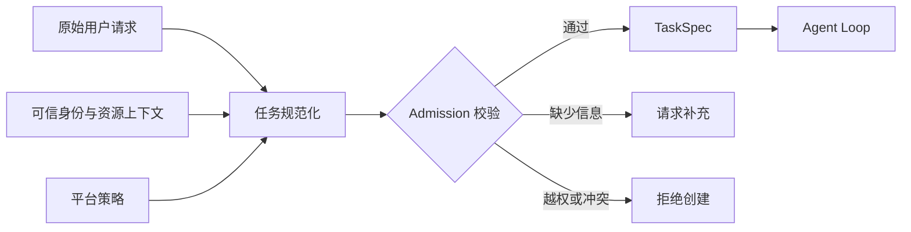

# 第 2 课：定义 Agent 任务模型与输入约束

> 章节导航：[第三章：Agent Loop、State、Harness 与 Codebase Agent](./index.md)  
> 上一课：[第 1 课：理解 Agent Loop 与终止边界](./lesson-01-agent-loop-boundaries.md)  
> 下一课：[第 3 课：设计任务状态机与迁移规则](./lesson-03-task-state-machine.md)

## 一、你将完成什么

第 1 课确定了 Agent Loop 的职责和停止边界，但 Loop 还不能直接消费一句自然语言请求。

例如，用户说“帮我修一下登录问题”，系统仍不知道：

- 要处理哪个仓库和版本；
- “登录问题”具体指什么现象；
- 只允许分析，还是允许修改和运行测试；
- 哪些目录可以读取或写入；
- 什么证据可以证明任务已经完成。

本课会把用户请求规范化为不可变、可校验的 `TaskSpec`。完成后，你应该能够：

1. 区分原始请求、任务契约和执行状态；
2. 表达任务目标、输入、约束、授权范围和完成标准；
3. 区分用户请求的能力与平台实际授予的能力；
4. 在进入 Agent Loop 前拒绝不完整、冲突或越权的任务；
5. 用确定性测试验证任务契约。

## 二、本课内容边界

本课只完成“任务创建契约”，不实现任务执行过程。

本课不会定义：

- `created`、`running`、`paused` 等任务状态；
- 计划步骤、步骤依赖和执行结果；
- 任务、事件和消息的持久化；
- Checkpoint、租约和重启恢复；
- 步数、Token、时间和工具次数的预算扣减；
- Sandbox 的路径解析和命令执行。

这些内容留给后续课程。本课的唯一工程增量，是让一个任务在启动前具有明确、可测试的输入边界。

## 三、从自然语言到任务契约

自然语言适合表达意图，不适合单独承担执行契约。

```text
请检查支付模块，必要时改一下，然后把相关测试跑过。
```

这句话存在多处不确定：

| 表述 | 未确定的问题 |
| --- | --- |
| “支付模块” | 对应哪个仓库、目录和版本？ |
| “检查” | 要解释行为、定位缺陷，还是审查风险？ |
| “必要时改一下” | 谁授权修改，最多能改哪些文件？ |
| “测试跑过” | 运行哪些测试，怎样记录未验证项？ |

正确做法是保留用户原文，同时生成平台能够校验的任务契约：



`TaskSpec` 不是模型对请求的自由摘要，而是用户请求、可信上下文和平台策略共同约束后的结果。

## 四、任务契约的五个部分

| 部分 | 要回答的问题 | 示例 |
| --- | --- | --- |
| 目标 | 最终要解决什么问题？ | 解释登录鉴权调用链 |
| 输入 | 基于哪些稳定对象工作？ | 仓库 `gateway`、提交 `a13f...` |
| 约束 | 用户明确要求或禁止什么？ | 不修改迁移文件，不访问网络 |
| 授权范围 | 平台实际允许哪些动作？ | 读取仓库，只能写入 `src/auth/` |
| 完成标准 | 怎样判断可以交付？ | 引用入口、策略和测试文件 |

这五部分必须一致。目标要求修复代码，但授权范围只有读取权限时，系统不能创建一个注定无法完成的修改任务；它应请求重新授权，或把目标收窄为分析与建议。

### 4.1 区分任务类型

本章先支持三类 Codebase Agent 任务：

| 类型 | 结果边界 | 典型目标 |
| --- | --- | --- |
| `explain` | 生成分析报告，不修改代码 | 解释认证调用链并提供引用 |
| `investigate` | 定位原因并给出建议，不默认修改 | 分析测试失败原因 |
| `change` | 在授权范围内修改并验证 | 修复空值判断并运行指定测试 |

任务类型不决定具体步骤，只限定结果语义。`explain` 任务不能因为模型认为“顺手修复更好”就写入文件。

### 4.2 完成条件必须可观察

“让登录模块更健壮”无法验收。更合适的完成条件是：

```text
- refresh token 缺失时响应从 500 变为 401；
- 现有登录成功路径保持不变；
- auth 单元测试已运行并记录结果。
```

完成条件描述结果，不预先规定搜索或修改步骤。步骤模型留到第 4 课。

## 五、输入必须引用稳定对象

代码任务至少需要保存：

- `workspace_id`：平台分配的工作区标识，不是宿主机路径；
- `repository_id`：仓库的稳定标识；
- `revision`：分支、标签或提交哈希；
- `request_text`：未经改写的用户原始要求；
- `context_refs`：Issue、失败日志或需求文档等受控引用。

`revision` 很重要。任务创建后仓库可能继续变化；没有版本引用，恢复、回放和文件证据都无法确认面对的是不是同一份代码。

文件内容、命令输出和检索结果属于执行时观察，不应在任务创建时全部塞进 `TaskSpec`。

## 六、请求范围不等于授权范围

用户可以请求动作，但请求本身不能授予权限。

```text
requested capabilities  用户希望执行什么
        ∩
actor permissions       当前身份拥有什么权限
        ∩
platform policy         平台允许任务做什么
        =
effective scope         本任务实际可用范围
```

有效范围需要表达：

- 是否允许读取代码；
- 是否允许生成或应用补丁；
- 是否允许运行命令；
- 可读、可写的逻辑路径；
- 是否允许访问网络。

本课只记录授权结果。第 9–11 课仍要在 Sandbox 与 Tool Runtime 中逐次执行路径、命令和网络校验。`TaskSpec` 不能代替真正的安全边界。

## 七、定义不可变的 TaskSpec

在 `apps/api/app/agents/contracts.py` 中定义任务契约：

```python
from enum import StrEnum

from pydantic import BaseModel, ConfigDict, Field, model_validator


class TaskKind(StrEnum):
    EXPLAIN = "explain"
    INVESTIGATE = "investigate"
    CHANGE = "change"


class TaskCapability(StrEnum):
    READ_CODE = "read_code"
    PROPOSE_PATCH = "propose_patch"
    APPLY_PATCH = "apply_patch"
    RUN_COMMAND = "run_command"
    ACCESS_NETWORK = "access_network"


class RepositoryRef(BaseModel):
    model_config = ConfigDict(frozen=True, extra="forbid")

    workspace_id: str = Field(min_length=1, max_length=100)
    repository_id: str = Field(min_length=1, max_length=100)
    revision: str = Field(min_length=1, max_length=200)


class CompletionContract(BaseModel):
    model_config = ConfigDict(frozen=True, extra="forbid")

    acceptance_criteria: tuple[str, ...]
    required_evidence: frozenset[str] = frozenset()
    required_artifacts: frozenset[str] = frozenset()

    @model_validator(mode="after")
    def require_criteria(self) -> "CompletionContract":
        if not self.acceptance_criteria:
            raise ValueError("at least one acceptance criterion is required")
        return self


class EffectiveTaskScope(BaseModel):
    model_config = ConfigDict(frozen=True, extra="forbid")

    capabilities: frozenset[TaskCapability]
    readable_paths: tuple[str, ...] = ()
    writable_paths: tuple[str, ...] = ()


class TaskSpec(BaseModel):
    model_config = ConfigDict(frozen=True, extra="forbid")

    task_id: str
    kind: TaskKind
    objective: str = Field(min_length=10, max_length=2000)
    repository: RepositoryRef
    request_text: str = Field(min_length=1, max_length=10_000)
    context_refs: tuple[str, ...] = ()
    user_constraints: tuple[str, ...] = ()
    scope: EffectiveTaskScope
    completion: CompletionContract

    @model_validator(mode="after")
    def validate_invariants(self) -> "TaskSpec":
        capabilities = self.scope.capabilities

        if TaskCapability.APPLY_PATCH in capabilities:
            if TaskCapability.PROPOSE_PATCH not in capabilities:
                raise ValueError("apply_patch requires propose_patch")
            if not self.scope.writable_paths:
                raise ValueError("apply_patch requires writable_paths")

        if self.kind is not TaskKind.CHANGE and (
            TaskCapability.APPLY_PATCH in capabilities
        ):
            raise ValueError("only change tasks may apply patches")

        if self.scope.writable_paths and (
            TaskCapability.APPLY_PATCH not in capabilities
        ):
            raise ValueError("writable_paths require apply_patch")

        return self
```

这里有三个关键取舍：

1. `frozen=True`：运行中不能悄悄改变目标或授权；扩大范围必须重新 Admission。
2. `extra="forbid"`：字段拼错时立即失败，避免约束被静默忽略。
3. `EffectiveTaskScope`：只能由可信服务生成，不能直接采用模型输出。

路径暂时使用逻辑相对路径。真实路径解析、符号链接和越界检查留到第 9 课。

## 八、在创建任务前完成 Admission

API 请求和内部 `TaskSpec` 应分开。用户提交目标和期望能力，服务端负责解析资源并计算有效范围：

```python
def admit_task(request, actor, policy) -> TaskSpec:
    repository = policy.resolve_repository(actor, request.repository_id)
    scope = policy.authorize_scope(
        actor=actor,
        repository=repository,
        requested_capabilities=request.requested_capabilities,
        requested_writable_paths=request.requested_writable_paths,
    )
    return TaskSpec(
        task_id=policy.new_task_id(),
        kind=request.kind,
        objective=request.objective.strip(),
        repository=policy.pin_revision(repository, request.revision),
        request_text=request.request_text,
        user_constraints=tuple(request.user_constraints),
        scope=scope,
        completion=request.completion,
    )
```

`authorize_scope()` 不能复制 `requested_capabilities`，而要根据身份和策略返回权限交集。若权限交集使目标无法完成，应拒绝创建或请求用户收窄目标。

任务创建有三种结果：

| 结果 | 适用情况 | 后续动作 |
| --- | --- | --- |
| 接受 | 输入完整，目标与授权一致 | 创建 `TaskSpec` |
| 请求补充 | 缺少仓库、复现条件或完成标准 | 不启动 Loop |
| 拒绝 | 资源不可访问、请求越权或违反策略 | 记录拒绝原因 |

这是任务创建的 Admission 结果，不是第 3 课要定义的运行状态。

## 九、任务不变量

以下事实不能被模型或后续计划改变：

- 任务 ID、发起身份、仓库和版本可追溯；
- `explain`、`investigate` 任务不能应用补丁；
- 写能力必须有明确的可写范围；
- 有效能力不能超过身份权限和平台策略；
- 至少存在一条可观察的验收条件；
- 用户禁止项不能被后续计划覆盖；
- 扩大目标、范围或权限必须重新 Admission。

模型可以建议“还需要检查另一个仓库”，但这只是范围变更提案，不能直接执行。

## 十、编写合同测试

在 `apps/api/tests/agents/test_task_contracts.py` 中测试关键不变量：

```python
import pytest
from pydantic import ValidationError


def test_read_only_explain_task_is_valid(make_task) -> None:
    task = make_task(kind="explain", capabilities={"read_code"})
    assert task.kind == "explain"


def test_explain_task_cannot_apply_patch(make_task) -> None:
    with pytest.raises(ValidationError, match="only change tasks"):
        make_task(
            kind="explain",
            capabilities={"propose_patch", "apply_patch"},
            writable_paths=("src/auth/",),
        )


def test_patch_requires_writable_paths(make_task) -> None:
    with pytest.raises(ValidationError, match="writable_paths"):
        make_task(
            kind="change",
            capabilities={"propose_patch", "apply_patch"},
        )


def test_completion_requires_criteria() -> None:
    with pytest.raises(ValidationError, match="acceptance criterion"):
        CompletionContract(acceptance_criteria=())
```

再为 Admission Service 添加一条测试：只读身份请求 `apply_patch` 时，服务必须拒绝或明确降级，不能把请求能力原样写入 `scope`。

| 测试 | 本课验证 | 后续课程验证 |
| --- | --- | --- |
| Schema 测试 | 字段类型、长度、未知字段 | 数据库持久化 |
| 不变量测试 | 类型、能力和路径范围一致 | 状态迁移 |
| Admission 测试 | 请求不会变成隐式授权 | Runtime 逐次授权 |
| 完成契约测试 | 存在可观察标准 | Agent 是否取得充分证据 |

## 十一、常见错误

| 错误 | 正确处理 |
| --- | --- |
| 改写目标后丢弃用户原文 | 同时保存 `request_text` 和结构化目标 |
| 把任务、计划和状态放进一个对象 | 分别表达目标边界、执行方案和当前进度 |
| 让模型填写有效权限 | 从可信身份、资源和平台策略计算 |
| 用宿主机绝对路径标识工作区 | 使用工作区 ID 与逻辑相对路径 |
| 把“尽量修好”当完成标准 | 明确预期行为、证据和验证结果 |
| 为了完成目标自动扩大范围 | 请求补充、重新 Admission 或拒绝 |

## 十二、课堂练习

将下面的请求整理为 `TaskSpec`，并列出缺失信息：

```text
看看订单取消为什么偶尔报错，能修就修一下，别动数据库迁移。
```

回答以下问题：

1. 应先创建为 `investigate` 还是 `change`？
2. 还需要哪个仓库、版本和复现证据？
3. “别动数据库迁移”应保存在哪里？
4. “能修就修”是否已经构成写入授权？
5. 怎样写出两条可观察的验收条件？

建议先以 `investigate` 创建只读任务。若确实需要修改，再根据用户身份和平台策略显式创建或升级为 `change` 任务。禁止修改迁移文件既是用户约束，也应反映在有效可写范围中。

## 十三、完成标准

完成本课后，你应该能够：

- 用目标、输入、约束、授权范围和完成标准描述任务；
- 区分 `explain`、`investigate` 和 `change` 的结果边界；
- 使用工作区、仓库和版本引用稳定输入；
- 区分请求能力和平台授予的有效能力；
- 使用不可变 `TaskSpec` 保存任务创建事实；
- 在 Loop 启动前识别缺少信息、权限冲突和不可验收目标；
- 编写不依赖模型的任务合同与 Admission 测试。

## 十四、本课小结

Agent 任务不是一段 Prompt，而是一份可校验的执行契约。它固定任务要解决什么、基于什么输入、必须遵守哪些约束、实际获得哪些权限，以及什么证据可以支持完成。

用户请求只表达期望，不能直接授予能力；模型可以提出范围变更，但不能修改任务不变量。只有通过 Admission 的 `TaskSpec` 才能进入 Agent Loop。

下一课会在这份稳定任务契约之上设计任务状态机，明确任务如何进入规划、运行、等待、失败、取消或完成，以及哪些状态迁移必须被拒绝。
