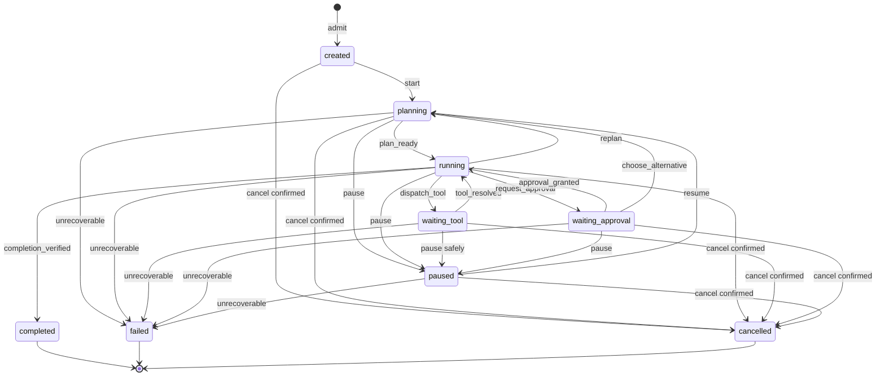

# 第 3 课：设计任务状态机与迁移规则

> 章节导航：[第三章：Agent Loop、State、Harness 与 Codebase Agent](./index.md)  
> 上一课：[第 2 课：定义 Agent 任务模型与输入约束](./lesson-02-agent-task-model.md)  
> 下一课：[第 4 课：设计计划、观察与执行契约](./lesson-04-plan-observe-act.md)

## 一、你将完成什么

第 2 课使用不可变的 `TaskSpec` 固定了任务目标、输入、约束、有效授权范围和完成标准。但任务进入 Agent Loop 后，还需要回答一组持续变化的问题：它是否已经开始规划、是否正在执行、是否在等待工具或审批、能否恢复，以及最终为什么结束。

这些事实不能靠聊天记录、日志文本或几个互不约束的布尔值表达。本课会为 `agent-platform` 设计任务级状态机，并实现统一的迁移入口。

完成本课后，你应该能够：

1. 区分不可变任务契约与可变运行状态；
2. 设计任务状态集合，并识别活动态、等待态、暂停态和终态；
3. 使用“当前状态 + 命令 + 守卫条件”定义迁移规则；
4. 正确表达完成、失败、取消和可恢复暂停；
5. 用纯函数实现迁移校验，并通过测试拒绝非法跳转。

## 二、本课内容边界

本课只解决一个核心问题：**任务在运行期间可以处于什么状态，以及平台允许它如何改变状态。**

本课会完成：

- 任务级状态集合；
- 合法迁移图与迁移表；
- 完成、失败、取消和暂停语义；
- 统一迁移函数与守卫条件；
- 状态机合同测试。

本课不会展开：

- 计划步骤、观察证据和执行结果的数据结构；
- 任务、步骤、消息、工具结果和事件的数据库设计；
- 乐观锁、事务、租约和并发写入；
- Checkpoint 与进程重启后的恢复算法；
- 预算扣减、重复行为检测和收敛终止。

这些主题分别属于第 4–8 课。本课的状态对象暂时保存在内存中；第 5 课会把状态迁移和事件作为一致事实持久化。

## 三、为什么任务需要显式状态机

先看一种常见实现：

```python
task.is_running = True
task.waiting_approval = True
task.has_error = True
task.is_done = False
```

这组字段无法回答任务到底处于什么状态。它可能同时表示“仍在运行”“正在等待”和“已经出错”，不同代码路径还可能以不同顺序修改字段。

另一个常见问题是让任意模块直接赋值：

```python
task.status = request.status
```

这样会允许客户端或模型把任务从 `completed` 篡改为 `running`，或者在没有任何验证证据时直接标记为 `completed`。状态值虽然有枚举，系统却仍然没有状态机。

一个有效的任务状态机至少包含三部分：

```text
有限状态集合
+ 明确的迁移命令
+ 不依赖模型判断的守卫条件
```

因此，模型只能提出“继续执行”“需要审批”或“可以完成”等候选决策。真正的状态迁移必须由平台执行。

## 四、区分 TaskSpec 与 TaskRuntimeState

`TaskSpec` 和运行状态的变化频率、可信来源与用途都不同。

| 对象 | 回答的问题 | 是否可变 | 可信来源 |
| --- | --- | --- | --- |
| `TaskSpec` | 要完成什么、允许做什么、如何验收 | 创建后不可变 | Admission Service |
| `TaskRuntimeState` | 当前执行到哪里、是否在等待、为何结束 | 只能通过合法迁移改变 | Task Controller |
| Plan / Step | 准备采取什么动作、动作结果是什么 | 按回合演进 | Planner 与受控执行器 |

不要为了方便把目标、计划、当前步骤和任务状态都放回一个可任意修改的 `dict`。任务运行时可以从 `planning` 进入 `running`，但不能借此修改 `TaskSpec.scope`；如果需要扩大目标或权限，必须重新走第 2 课的 Admission。

可以先把运行状态定义在 `apps/api/app/agents/state_machine.py`：

```python
from dataclasses import dataclass
from enum import StrEnum


class TaskStatus(StrEnum):
    CREATED = "created"
    PLANNING = "planning"
    RUNNING = "running"
    WAITING_TOOL = "waiting_tool"
    WAITING_APPROVAL = "waiting_approval"
    PAUSED = "paused"
    COMPLETED = "completed"
    FAILED = "failed"
    CANCELLED = "cancelled"


@dataclass(frozen=True)
class TaskRuntimeState:
    task_id: str
    status: TaskStatus = TaskStatus.CREATED
    cancel_requested: bool = False
    status_reason: str | None = None
    end_reason: str | None = None
```

`frozen=True` 并不代表任务状态永远不变，而是禁止业务代码原地修改对象。每次合法迁移都会产生一个新状态，从而让所有改变都经过同一个入口。

## 五、设计状态集合

状态数量不是越多越好。只有当某个状态会改变“系统接下来允许做什么”或“操作人员应该如何处理”时，才值得成为任务级状态。

| 状态 | 类型 | 含义 | 平台接下来可以做什么 |
| --- | --- | --- | --- |
| `created` | 初始态 | 任务已通过 Admission，尚未启动 | 开始规划或取消 |
| `planning` | 活动态 | 正在形成或修订执行方案 | 开始执行、暂停、失败或取消 |
| `running` | 活动态 | Controller 正在处理当前回合 | 重规划、发起工具、等待审批、完成或停止 |
| `waiting_tool` | 等待态 | 工具调用已发出，等待受控结果 | 接收结果、暂停、失败或取消 |
| `waiting_approval` | 等待态 | 候选动作需要人工决定 | 获准后继续、拒绝后重规划或停止 |
| `paused` | 可恢复态 | 平台有意停止推进，保留继续入口 | 重新规划、失败或取消 |
| `completed` | 终态 | 完成标准已由平台验证 | 不允许继续迁移 |
| `failed` | 终态 | 当前任务无法在既定契约内继续 | 不允许原任务复活 |
| `cancelled` | 终态 | 取消已传播，执行已到安全静止点 | 不允许继续迁移 |

### 5.1 为什么保留 `waiting_tool`

本地同步工具可能很快返回，但远程 MCP、Sandbox 命令或异步任务可能持续较长时间。`waiting_tool` 让系统明确知道：调用已经发出，下一步不是再次调用，而是等待、查询或处理结果。

它不表示工具一定成功。工具返回失败同样会先结束等待，再由 Controller 决定重试、重规划、暂停或终止任务。

### 5.2 为什么没有任务级 `tool_failed`

工具失败是一次执行尝试的结果，不一定是整个任务的状态。例如搜索命令参数错误后，Agent 可能修正参数继续执行；一个镜像源不可用时，也可能切换到允许的替代方案。

如果把每种步骤结果都提升为任务状态，状态数量会迅速膨胀，任务状态与步骤状态也会混在一起。第 4 课会为步骤和执行结果定义独立契约。本课只在确定任务无法继续时进入 `failed`。

### 5.3 为什么 `paused` 不等于 `failed`

`paused` 表示恢复条件明确存在，例如：

- 用户主动暂停；
- 缺少必要输入，等待补充；
- 外部依赖暂时不可用；
- 工具结果未知，需要人工确认；
- 平台准备进行受控维护或迁移。

`failed` 表示当前任务已经结束。若要再次尝试，应创建新的运行尝试或执行显式的重开流程，不能简单把旧记录改回 `running`。

## 六、绘制任务状态图

先用状态图表达允许的主路径：



图中没有画出的跳转默认禁止。例如：

- `created -> completed`：没有执行和验证过程；
- `waiting_approval -> waiting_tool`：尚未获得批准就发出了工具调用；
- `paused -> running`：恢复前没有重新检查任务与环境；
- `failed -> running`：终态被原地复活；
- `completed -> cancelled`：已经完成的历史事实被后来的命令改写。

状态图表达整体关系，迁移表则用于实现与评审。

## 七、用命令定义迁移规则

不要暴露 `set_status(task_id, status)`。调用方应该表达意图，由状态机决定目标状态。

```python
class TaskCommand(StrEnum):
    START = "start"
    PLAN_READY = "plan_ready"
    REPLAN = "replan"
    DISPATCH_TOOL = "dispatch_tool"
    TOOL_RESOLVED = "tool_resolved"
    REQUEST_APPROVAL = "request_approval"
    APPROVAL_GRANTED = "approval_granted"
    PAUSE = "pause"
    RESUME = "resume"
    COMPLETE = "complete"
    FAIL = "fail"
    CONFIRM_CANCEL = "confirm_cancel"
```

核心迁移表如下：

| 当前状态 | 命令 | 目标状态 | 关键前提 |
| --- | --- | --- | --- |
| `created` | `start` | `planning` | 任务仍可启动 |
| `planning` | `plan_ready` | `running` | 存在可执行的下一步 |
| `running` | `replan` | `planning` | 记录重规划原因 |
| `running` | `dispatch_tool` | `waiting_tool` | 调用已通过 Runtime 并成功发出 |
| `waiting_tool` | `tool_resolved` | `running` | 获得成功、失败或未知结果之一 |
| `running` | `request_approval` | `waiting_approval` | 审批请求已经创建 |
| `waiting_approval` | `approval_granted` | `running` | 批准与当前动作绑定且仍有效 |
| `waiting_approval` | `replan` | `planning` | 拒绝后存在契约内替代方案 |
| 活动态或等待态 | `pause` | `paused` | 已到达可恢复的安全边界 |
| `paused` | `resume` | `planning` | 恢复条件已满足并重新检查环境 |
| `running` | `complete` | `completed` | 完成标准已验证且无未决副作用 |
| 非终态 | `fail` | `failed` | 已确认无法在当前契约内继续 |
| 非终态 | `confirm_cancel` | `cancelled` | 已收到取消请求且执行处于静止点 |

审批拒绝没有唯一的目标状态。如果存在风险更低的替代方案，Controller 可以记录拒绝结果后执行 `replan`；如果拒绝意味着任务无法满足完成标准，则执行 `fail`。状态机负责约束路径，业务策略负责选择合法路径。

## 八、为关键迁移设置守卫条件

仅检查“边是否存在”还不够。某些迁移必须同时满足运行事实。

### 8.1 完成不是模型的一句话

模型输出“任务已经完成”只能形成完成提案。平台至少要确认：

- `TaskSpec.completion.acceptance_criteria` 已逐项检查；
- 必需证据和产物已经存在；
- 没有未决工具调用或未知副作用；
- 对变更任务，补丁确实应用且要求的验证已经执行；
- 最终结果没有把“建议执行”描述成“已经执行”。

本课暂时用 `completion_verified` 表示检查结果。证据结构会在第 4 课和第 19 课逐步完善。

### 8.2 取消请求不等于取消完成

取消是一个过程，而不只是一个状态值：

```text
收到取消请求
-> 阻止发起新动作
-> 向模型、工具或 Sandbox 传播取消
-> 等待执行停止或确认真实结果
-> 进入 cancelled
```

如果写操作已经发出但结果未知，平台不能立刻声称任务已取消。此时应保留 `cancel_requested=True`，停止发起新动作，并进入受控查询或 `paused` 恢复路径。只有没有未决执行时，才能确认 `cancelled`。

### 8.3 失败必须带结构化原因

`failed` 不能只保存一段异常堆栈。至少要有稳定原因码，例如：

| 原因码 | 含义 |
| --- | --- |
| `completion_unreachable` | 在当前目标与权限范围内无法完成 |
| `approval_rejected` | 审批被拒绝且不存在可接受替代方案 |
| `unrecoverable_tool_error` | 工具错误无法重试或重规划 |
| `policy_violation` | 候选动作违反任务或平台边界 |
| `internal_error` | 平台内部错误导致本次任务终止 |

预算耗尽和重复行为将在第 8 课定义自己的终止策略，本课不提前实现判断算法。

## 九、实现统一迁移函数

先把状态图编码为显式规则：

```python
from dataclasses import replace


class InvalidTaskTransition(ValueError):
    pass


TRANSITIONS: dict[tuple[TaskStatus, TaskCommand], TaskStatus] = {
    (TaskStatus.CREATED, TaskCommand.START): TaskStatus.PLANNING,
    (TaskStatus.PLANNING, TaskCommand.PLAN_READY): TaskStatus.RUNNING,
    (TaskStatus.RUNNING, TaskCommand.REPLAN): TaskStatus.PLANNING,
    (TaskStatus.RUNNING, TaskCommand.DISPATCH_TOOL): TaskStatus.WAITING_TOOL,
    (TaskStatus.WAITING_TOOL, TaskCommand.TOOL_RESOLVED): TaskStatus.RUNNING,
    (TaskStatus.RUNNING, TaskCommand.REQUEST_APPROVAL): TaskStatus.WAITING_APPROVAL,
    (
        TaskStatus.WAITING_APPROVAL,
        TaskCommand.APPROVAL_GRANTED,
    ): TaskStatus.RUNNING,
    (TaskStatus.WAITING_APPROVAL, TaskCommand.REPLAN): TaskStatus.PLANNING,
    (TaskStatus.PLANNING, TaskCommand.PAUSE): TaskStatus.PAUSED,
    (TaskStatus.RUNNING, TaskCommand.PAUSE): TaskStatus.PAUSED,
    (TaskStatus.WAITING_TOOL, TaskCommand.PAUSE): TaskStatus.PAUSED,
    (TaskStatus.WAITING_APPROVAL, TaskCommand.PAUSE): TaskStatus.PAUSED,
    (TaskStatus.PAUSED, TaskCommand.RESUME): TaskStatus.PLANNING,
    (TaskStatus.RUNNING, TaskCommand.COMPLETE): TaskStatus.COMPLETED,
}

for status in (
    TaskStatus.PLANNING,
    TaskStatus.RUNNING,
    TaskStatus.WAITING_TOOL,
    TaskStatus.WAITING_APPROVAL,
    TaskStatus.PAUSED,
):
    TRANSITIONS[(status, TaskCommand.FAIL)] = TaskStatus.FAILED

for status in (
    TaskStatus.CREATED,
    TaskStatus.PLANNING,
    TaskStatus.RUNNING,
    TaskStatus.WAITING_TOOL,
    TaskStatus.WAITING_APPROVAL,
    TaskStatus.PAUSED,
):
    TRANSITIONS[(status, TaskCommand.CONFIRM_CANCEL)] = TaskStatus.CANCELLED
```

再定义迁移所需的可信事实：

```python
@dataclass(frozen=True)
class TransitionFacts:
    reason: str | None = None
    completion_verified: bool = False
    execution_quiescent: bool = True


TERMINAL_STATUSES = frozenset(
    {TaskStatus.COMPLETED, TaskStatus.FAILED, TaskStatus.CANCELLED}
)


def request_cancellation(state: TaskRuntimeState) -> TaskRuntimeState:
    if state.status in TERMINAL_STATUSES:
        return state
    return replace(state, cancel_requested=True)


def transition(
    state: TaskRuntimeState,
    command: TaskCommand,
    facts: TransitionFacts = TransitionFacts(),
) -> TaskRuntimeState:
    if state.status in TERMINAL_STATUSES:
        raise InvalidTaskTransition(
            f"terminal task cannot transition from {state.status}"
        )

    cancellation_commands = {
        TaskCommand.TOOL_RESOLVED,
        TaskCommand.PAUSE,
        TaskCommand.FAIL,
        TaskCommand.CONFIRM_CANCEL,
    }
    if state.cancel_requested and command not in cancellation_commands:
        raise InvalidTaskTransition(
            f"cannot {command} after cancellation was requested"
        )

    target = TRANSITIONS.get((state.status, command))
    if target is None:
        raise InvalidTaskTransition(
            f"cannot {command} from {state.status}"
        )

    if command is TaskCommand.COMPLETE and not facts.completion_verified:
        raise InvalidTaskTransition("completion evidence is not verified")

    if command is TaskCommand.PAUSE and not facts.execution_quiescent:
        raise InvalidTaskTransition("execution is not quiescent")

    if command is TaskCommand.CONFIRM_CANCEL:
        if not state.cancel_requested:
            raise InvalidTaskTransition("cancellation was not requested")
        if not facts.execution_quiescent:
            raise InvalidTaskTransition("execution is not quiescent")

    if target is TaskStatus.FAILED and not facts.reason:
        raise InvalidTaskTransition("failed task requires a reason")

    end_reason = facts.reason if target in TERMINAL_STATUSES else None
    return replace(
        state,
        status=target,
        status_reason=facts.reason,
        end_reason=end_reason,
    )
```

这段实现有几个重要性质：

1. 调用方提交命令，不能直接选择目标状态；
2. 未列入 `TRANSITIONS` 的跳转默认拒绝；
3. 终态没有出边；
4. 收到取消请求后不能再发起新的工作；
5. 完成、失败和取消具有额外守卫条件；
6. 迁移函数没有数据库、网络或模型调用，容易进行穷举测试。

真实系统中的审批有效性、完成证据和执行静止状态，必须由可信组件计算后传入，不能接受客户端或模型直接提交 `True`。第 5 课持久化时，还要在数据库事务中再次检查当前状态，不能把这段内存函数当成并发控制。

## 十、理解四种结束与中断语义

任务“没有继续运行”可能有完全不同的含义。

| 结果 | 是否终态 | 是否表示目标达成 | 后续处理 |
| --- | --- | --- | --- |
| `completed` | 是 | 是，且已验证 | 展示结果与证据 |
| `failed` | 是 | 否 | 展示原因，必要时创建新尝试 |
| `cancelled` | 是 | 否 | 展示取消范围与未决副作用 |
| `paused` | 否 | 否 | 满足恢复条件后重新规划 |

### 10.1 完成

完成是业务断言，不是循环自然退出。`completed` 必须绑定 `TaskSpec` 中的完成标准和可信验证结果。

### 10.2 失败

一次模型超时、工具失败或审批拒绝不一定立刻终止任务。只有 Controller 确认无法在当前契约内恢复、替代或重规划时，才进入 `failed`。

### 10.3 取消

取消表达“不要再继续这个任务”。它不保证回滚已经发生的副作用，也不应覆盖此前已完成的工具事实。交付摘要必须说明取消发生前已经执行了什么。

### 10.4 暂停

暂停保留原任务身份和恢复入口，但恢复不是简单设置为 `running`。平台需要重新检查权限、输入版本、审批、工具结果和执行环境，因此本课统一从 `paused` 回到 `planning`。

## 十一、编写状态机合同测试

在 `apps/api/tests/agents/test_task_state_machine.py` 中先覆盖主路径和禁止路径：

```python
import pytest


def test_task_can_complete_only_after_verified_running_state() -> None:
    state = TaskRuntimeState(task_id="task-1")
    state = transition(state, TaskCommand.START)
    state = transition(state, TaskCommand.PLAN_READY)
    state = transition(
        state,
        TaskCommand.COMPLETE,
        TransitionFacts(
            reason="acceptance_criteria_satisfied",
            completion_verified=True,
        ),
    )

    assert state.status is TaskStatus.COMPLETED
    assert state.end_reason == "acceptance_criteria_satisfied"


def test_created_task_cannot_skip_planning() -> None:
    state = TaskRuntimeState(task_id="task-1")

    with pytest.raises(InvalidTaskTransition, match="cannot plan_ready"):
        transition(state, TaskCommand.PLAN_READY)


def test_model_completion_claim_is_not_enough() -> None:
    state = TaskRuntimeState(task_id="task-1", status=TaskStatus.RUNNING)

    with pytest.raises(InvalidTaskTransition, match="evidence"):
        transition(state, TaskCommand.COMPLETE)


def test_terminal_task_cannot_be_resumed() -> None:
    state = TaskRuntimeState(
        task_id="task-1",
        status=TaskStatus.FAILED,
        end_reason="completion_unreachable",
    )

    with pytest.raises(InvalidTaskTransition, match="terminal"):
        transition(state, TaskCommand.START)


def test_cancel_waits_until_execution_is_quiescent() -> None:
    state = TaskRuntimeState(
        task_id="task-1",
        status=TaskStatus.WAITING_TOOL,
    )
    state = request_cancellation(state)

    with pytest.raises(InvalidTaskTransition, match="not quiescent"):
        transition(
            state,
            TaskCommand.CONFIRM_CANCEL,
            TransitionFacts(execution_quiescent=False),
        )

    cancelled = transition(
        state,
        TaskCommand.CONFIRM_CANCEL,
        TransitionFacts(
            reason="cancelled_by_user",
            execution_quiescent=True,
        ),
    )
    assert cancelled.status is TaskStatus.CANCELLED
```

还应补充表驱动测试，覆盖迁移表的每条边，并验证以下不变量：

- 所有终态都没有出边；
- 非法命令不会改变原状态；
- `failed` 必须有原因码；
- 未验证完成条件时不能进入 `completed`；
- 未收到取消请求或执行尚未静止时不能进入 `cancelled`；
- 收到取消请求后不能继续规划、执行或发起工具；
- 存在未决执行时不能假装任务已经安全暂停；
- 审批未通过时不能从 `waiting_approval` 直接进入 `waiting_tool`；
- `paused` 只能通过重新规划恢复。

状态机测试不需要调用模型。只要一个边界可以由确定性代码验证，就不应把测试结果交给 LLM 判断。

## 十二、串联一次任务生命周期

以“定位订单取消偶发失败”为例，一条正常调查路径可以是：

```text
created
-> planning
-> running
-> waiting_tool      搜索代码
-> running           收到搜索结果
-> waiting_tool      运行只读测试
-> running           收到失败证据
-> planning          根据新证据重规划
-> running
-> completed         验收条件与证据已验证
```

如果任务后来需要应用补丁，而当前只读 `TaskSpec` 没有写权限，状态机不能通过“进入另一个状态”扩大授权。Controller 应暂停或失败，并要求重新 Admission。

需要审批的变更路径可能是：

```text
running
-> waiting_approval
-> running           批准有效
-> waiting_tool      受控发出工具调用
-> running           取得确定结果
```

如果审批被拒绝，存在只读替代方案时回到 `planning`；不存在替代方案时，以 `approval_rejected` 进入 `failed`。两种结果都不能绕过审批直接进入 `waiting_tool`。

## 十三、常见错误

| 错误 | 正确处理 |
| --- | --- |
| 有 `status` 枚举就认为有状态机 | 集中定义迁移命令、允许边和守卫条件 |
| 允许 API 或模型直接设置目标状态 | 调用方表达命令，平台计算目标状态 |
| 用多个布尔值组合运行状态 | 使用互斥的任务状态，额外信号单独建模 |
| 把一次工具失败直接变成任务失败 | 先记录步骤结果，再决定重试、重规划或终止 |
| 把 `paused`、`failed` 和 `cancelled` 混成 `stopped` | 分别表达可恢复、异常终止和用户取消 |
| 模型说完成就写入 `completed` | 根据完成契约和可信证据执行守卫检查 |
| 收到取消请求就立即标记 `cancelled` | 先传播取消并确认执行到达安全静止点 |
| 让终态直接回到 `running` | 创建新尝试或使用后续定义的显式恢复流程 |
| 在状态对象中塞入全部步骤详情 | 任务状态与计划、步骤、事件分别建模 |

## 十四、课堂练习

### 练习一：补全迁移测试

为 `TRANSITIONS` 编写参数化测试，至少覆盖：

1. `created -> planning -> running`；
2. `running -> waiting_tool -> running`；
3. `running -> waiting_approval -> running`；
4. `waiting_approval -> planning`；
5. `paused -> planning`；
6. 三种终态没有出边。

### 练习二：判断状态

分别判断以下场景应停留或进入什么状态，并说明理由：

1. 模型声称修复完成，但测试还没有运行；
2. 用户点击取消时，远程写工具已经发出且结果未知；
3. 审批被拒绝，但任务仍可提供只读调查报告；
4. Sandbox 暂时不可用，平台允许稍后恢复；
5. 当前权限不足以完成用户要求，且用户不允许收窄目标。

参考判断：

- 场景 1 仍为 `running`，不能通过完成守卫；
- 场景 2 保留取消请求，进入查询或可恢复暂停路径，不能虚假确认取消；
- 场景 3 回到 `planning`，选择契约内替代方案；
- 场景 4 进入 `paused`；
- 场景 5 以明确原因进入 `failed`，或在进入 Loop 前由 Admission 拒绝。

### 练习三：评审一个错误接口

评审下面的 API，并给出替代设计：

```http
PATCH /tasks/task-1
Content-Type: application/json

{"status": "completed"}
```

替代接口应该表达动作，例如提交完成提案、请求取消或恢复任务；服务端加载当前状态、执行授权和守卫检查，再决定是否合法迁移。客户端不应拥有任意指定状态的能力。

## 十五、完成标准

完成本课后，你应该能够：

- 明确区分 `TaskSpec`、任务运行状态与后续步骤契约；
- 解释每个任务状态存在的原因和允许的后续动作；
- 用状态图和迁移表表达相同规则；
- 通过命令而不是直接赋值改变状态；
- 正确区分完成、失败、取消和暂停；
- 为完成与取消实现可信守卫条件；
- 使用纯函数和合同测试拒绝非法迁移；
- 说明状态机与后续持久化、Checkpoint 的边界。

## 十六、本课小结

任务状态机是 Agent Loop 的控制骨架。它不负责决定下一步要读取哪个文件，也不保存完整计划和工具结果；它负责保证任务只能沿着平台允许的路径推进。

第 2 课的 `TaskSpec` 固定“任务是什么”，本课的 `TaskRuntimeState` 表达“任务现在在哪里”。模型可以提出候选动作，但只有平台能够在验证当前状态、迁移命令和守卫条件后改变运行事实。

下一课会在这套任务级状态机之上定义计划、观察和执行契约，让每个回合都能明确表达：当前依据了什么事实、准备采取什么动作，以及执行后得到了什么结果。
