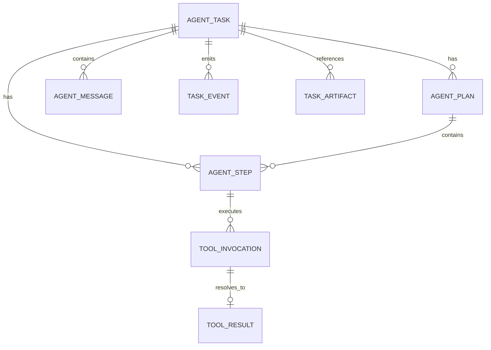

# 第 5 课：实现任务持久化与事件记录

> 章节导航：[第三章：Agent Loop、State、Harness 与 Codebase Agent](./index.md)  
> 上一课：[第 4 课：设计计划、观察与执行契约](./lesson-04-plan-observe-act.md)  
> 下一课：[第 6 课：实现 Checkpoint 与重启恢复](./lesson-06-checkpoint-recovery.md)

## 一、你将完成什么

第 3 课定义了任务状态机，第 4 课又把一次回合拆成 `Observation`、`Plan`、`Action` 和 `ExecutionResult`。但这些对象目前只存在于进程内存中：服务一旦退出，平台就无法判断任务停在哪个状态、哪个动作已经发出，以及某条工具结果属于哪一步。

本课把前两课形成的运行事实写入持久化存储，并建立一条可按顺序查询的任务事件流。完成本课后，你应该能够：

1. 区分任务当前状态、领域记录、事件记录和普通应用日志；
2. 设计任务、计划步骤、消息、工具调用、工具结果与事件的关系模型；
3. 在同一个数据库事务中更新当前状态并追加对应事件；
4. 使用任务版本号和事件序号拒绝并发覆盖与乱序写入；
5. 通过引用保存大结果，并为敏感内容设置脱敏与保留边界；
6. 用 Repository 合同测试证明任务事实可以被稳定写入和查询。

## 二、本课内容边界

本课只解决一个核心问题：**Agent Loop 产生的事实，如何被一致、可查询、可审计地保存下来。**

本课会完成：

- 持久化对象及其主外键关系；
- 当前状态表与追加式事件表的分工；
- 任务创建、状态迁移、动作发出和结果提交的事务边界；
- 乐观锁、任务内事件序号与重复提交保护；
- 大结果引用、敏感数据和事件 Schema 演进原则；
- Repository 接口及关键合同测试。

本课不会展开：

- 从哪个一致边界创建 Checkpoint；
- Worker 租约、心跳、抢占与进程重启恢复；
- 未知工具结果的恢复查询与补偿流程；
- 动态重规划和步骤依赖更新算法；
- Kafka、消息队列、CDC 或跨服务事件投递；
- 任务工作台、完整 Trace 和 Replay UI。

第 6 课会在本课的数据基础上实现 Checkpoint 与恢复；第 7 课处理重规划；第 20 课再把事件用于工作台和回放。

## 三、为什么数据库记录不能只剩一行任务 JSON

最容易实现的方案是把整个 Agent 运行状态塞进一个 JSON 字段：

```python
task.state = {
    "status": "running",
    "plan": current_plan,
    "messages": messages,
    "last_tool_result": tool_result,
}
session.commit()
```

它看起来很灵活，却会很快产生四类问题：

1. **历史被覆盖。** 新状态会覆盖旧计划和旧结果，无法解释任务为何走到当前状态；
2. **并发更新丢失。** 两个 Worker 同时读取同一份 JSON，后提交者会覆盖先提交者的修改；
3. **对象关系不清。** 无法可靠回答某条消息、某个动作和某次工具结果分别属于哪个步骤；
4. **数据无限增长。** Prompt、工具输出和文件内容持续追加，最终把任务行变成不可控的大对象。

另一种极端是只写文本日志：

```text
task task-1 started
tool search_code called
tool finished
```

日志适合运维检索，却不能作为业务事实来源。它通常没有数据库事务、外键、唯一约束和稳定 Schema，也不适合由任务 API 直接查询。

本课采用一套更稳妥的最小方案：

```text
关系型当前状态 + 关系型领域记录 + 追加式任务事件
```

- 当前状态回答“任务现在是什么状态”；
- 领域记录回答“有哪些步骤、消息、动作和结果”；
- 事件流回答“这些事实按什么顺序发生、由什么命令导致”。

这不是完整 Event Sourcing。当前状态仍由关系表直接读取，不需要每次从全部历史事件重建；事件表用于审计、通知、调试和后续回放。

## 四、定义持久化对象

### 4.1 Task：任务契约与当前状态

任务表保存两个层次的信息：

- 第 2 课创建的不可变任务契约引用；
- 第 3 课受状态机控制的当前运行状态。

不要把完整 `TaskSpec` 的每个字段都复制成事件，也不要允许普通更新接口修改目标和授权范围。可以保存一个规范化 JSON 快照及其哈希，使后续执行始终绑定创建时的契约。

### 4.2 Plan 与 Step：计划版本和工作单元

计划不是覆盖更新的单例。每次形成新计划都创建新的 `plan_id`，并保存它基于哪个 `observation_version`。计划内的步骤单独存储，便于更新步骤状态和查询依赖。

第 7 课会讨论计划修订。本课只要求旧计划和旧步骤不被新计划覆盖。

### 4.3 Message：参与模型上下文的消息

消息用于保存用户输入、模型输出和平台注入的受控上下文。消息不是任务状态，也不是事件表的替代品。

建议至少保留：

- `role` 和 `message_type`；
- 创建顺序；
- 内容或内容引用；
- 产生该消息的模型调用、动作或工具结果引用；
- 可见性与脱敏级别。

工具返回的大段 stdout 不应直接复制到消息表。消息可以保存面向模型的摘要，并通过 `content_ref` 指向原始结果。

### 4.4 ToolInvocation 与 ToolResult：动作和执行事实

一次工具动作至少要区分“已接受准备发送”和“执行器返回结果”。因此不要只保存一个 `tool_calls` 表并反复改写 `status`，而应让调用和结果各自具有稳定身份：

```text
Action(action_id)
  -> ToolInvocation(invocation_id, action_id)
  -> ToolResult(result_id, invocation_id)
```

一个调用最终最多有一个权威结果；重试则创建新的 attempt 或新的 invocation 记录，不能用后一次输出覆盖前一次失败。

### 4.5 TaskEvent：任务内的不可变事实通知

事件记录状态变化和关键领域事实，例如：

- `task.created`
- `task.status_changed`
- `plan.created`
- `step.status_changed`
- `action.accepted`
- `tool.dispatched`
- `tool.resolved`
- `message.appended`
- `task.cancel_requested`

事件名使用已经发生的事实，不使用 `start_task`、`run_tool` 这类命令式名称。命令表达意图，事件表达已经提交的结果。

## 五、关系模型与关键约束

最小关系可以表示为：



建议的关键字段如下：

| 表 | 关键字段 | 关键约束 |
| --- | --- | --- |
| `agent_tasks` | `task_id`、`spec_json`、`status`、`version`、`observation_version` | `task_id` 主键；`version >= 0` |
| `agent_plans` | `plan_id`、`task_id`、`observation_version`、`created_at` | 计划创建后不覆盖 |
| `agent_steps` | `step_id`、`task_id`、`plan_id`、`status`、`position` | `(plan_id, position)` 唯一 |
| `agent_messages` | `message_id`、`task_id`、`ordinal`、`role`、`content_ref` | `(task_id, ordinal)` 唯一 |
| `tool_invocations` | `invocation_id`、`task_id`、`step_id`、`action_id`、`attempt` | `(action_id, attempt)` 唯一 |
| `tool_results` | `result_id`、`invocation_id`、`result_kind`、`output_ref` | `invocation_id` 唯一 |
| `task_events` | `event_id`、`task_id`、`sequence`、`event_type`、`payload` | `(task_id, sequence)` 唯一 |
| `task_artifacts` | `artifact_id`、`task_id`、`uri`、`sha256`、`media_type` | 内容地址与访问范围可校验 |

其中有三条约束尤其重要：

1. `agent_tasks.version` 用于并发写入控制；
2. `task_events.sequence` 表达单个任务内的确定顺序；
3. `tool_results.invocation_id` 唯一，阻止同一调用被两个不同结果同时“确认”。

为简化本课实现，规定每个改变任务聚合的事务只追加一条主事件，并同时把 `agent_tasks.version` 加一，因此提交后有 `event.sequence == task.version`。如果生产系统要求一个事务追加多条事件，就应在任务行增加独立的 `next_event_sequence`，在同一原子更新中预留连续序号；不能让多个写入者通过 `MAX(sequence) + 1` 竞争计算下一值。

时间戳只用于展示和跨系统分析，不能替代任务内顺序。两条记录可能具有相同毫秒时间，数据库时钟与应用时钟也可能存在偏差。

## 六、实现 SQLAlchemy 持久化模型

下面的示例放在 `apps/api/app/agents/persistence/models.py`。为控制课时，只展开任务、步骤、工具结果和事件四个核心模型；计划、消息与产物遵循相同原则补充。

```python
from datetime import datetime
from typing import Any

from sqlalchemy import (
    CheckConstraint,
    DateTime,
    ForeignKey,
    Integer,
    JSON,
    String,
    Text,
    UniqueConstraint,
    func,
)
from sqlalchemy.orm import DeclarativeBase, Mapped, mapped_column


class Base(DeclarativeBase):
    pass


class AgentTaskRow(Base):
    __tablename__ = "agent_tasks"
    __table_args__ = (
        CheckConstraint("version >= 0", name="ck_agent_task_version"),
        CheckConstraint(
            "observation_version >= 0",
            name="ck_agent_task_observation_version",
        ),
    )

    task_id: Mapped[str] = mapped_column(String(64), primary_key=True)
    tenant_id: Mapped[str] = mapped_column(String(64), index=True)
    spec_json: Mapped[dict[str, Any]] = mapped_column(JSON)
    spec_hash: Mapped[str] = mapped_column(String(64))
    status: Mapped[str] = mapped_column(String(32), index=True)
    status_reason: Mapped[str | None] = mapped_column(String(128))
    end_reason: Mapped[str | None] = mapped_column(String(128))
    cancel_requested: Mapped[bool] = mapped_column(default=False)
    version: Mapped[int] = mapped_column(Integer, default=0)
    observation_version: Mapped[int] = mapped_column(Integer, default=0)
    created_at: Mapped[datetime] = mapped_column(
        DateTime(timezone=True), server_default=func.now()
    )
    updated_at: Mapped[datetime] = mapped_column(
        DateTime(timezone=True),
        server_default=func.now(),
        onupdate=func.now(),
    )


class AgentStepRow(Base):
    __tablename__ = "agent_steps"
    __table_args__ = (
        UniqueConstraint("plan_id", "position", name="uq_step_position"),
    )

    step_id: Mapped[str] = mapped_column(String(64), primary_key=True)
    task_id: Mapped[str] = mapped_column(
        ForeignKey("agent_tasks.task_id"), index=True
    )
    plan_id: Mapped[str] = mapped_column(String(64), index=True)
    position: Mapped[int] = mapped_column(Integer)
    objective: Mapped[str] = mapped_column(Text)
    depends_on: Mapped[list[str]] = mapped_column(JSON, default=list)
    status: Mapped[str] = mapped_column(String(32))
    version: Mapped[int] = mapped_column(Integer, default=0)


class ToolResultRow(Base):
    __tablename__ = "tool_results"
    __table_args__ = (
        UniqueConstraint(
            "invocation_id", name="uq_tool_result_invocation"
        ),
    )

    result_id: Mapped[str] = mapped_column(String(64), primary_key=True)
    task_id: Mapped[str] = mapped_column(
        ForeignKey("agent_tasks.task_id"), index=True
    )
    invocation_id: Mapped[str] = mapped_column(String(64), index=True)
    action_id: Mapped[str] = mapped_column(String(64), index=True)
    result_kind: Mapped[str] = mapped_column(String(32))
    output_ref: Mapped[str | None] = mapped_column(String(512))
    error_code: Mapped[str | None] = mapped_column(String(128))
    output_preview: Mapped[str | None] = mapped_column(Text)
    created_at: Mapped[datetime] = mapped_column(
        DateTime(timezone=True), server_default=func.now()
    )


class TaskEventRow(Base):
    __tablename__ = "task_events"
    __table_args__ = (
        UniqueConstraint(
            "task_id", "sequence", name="uq_task_event_sequence"
        ),
    )

    event_id: Mapped[str] = mapped_column(String(64), primary_key=True)
    task_id: Mapped[str] = mapped_column(
        ForeignKey("agent_tasks.task_id"), index=True
    )
    sequence: Mapped[int] = mapped_column(Integer)
    event_type: Mapped[str] = mapped_column(String(64), index=True)
    schema_version: Mapped[int] = mapped_column(Integer, default=1)
    payload: Mapped[dict[str, Any]] = mapped_column(JSON)
    actor_type: Mapped[str] = mapped_column(String(32))
    actor_id: Mapped[str | None] = mapped_column(String(128))
    correlation_id: Mapped[str] = mapped_column(String(64), index=True)
    causation_id: Mapped[str | None] = mapped_column(String(64))
    created_at: Mapped[datetime] = mapped_column(
        DateTime(timezone=True), server_default=func.now()
    )
```

生产环境使用 PostgreSQL 时，可以把通用 `JSON` 替换为 `JSONB` 并为明确的查询路径添加索引。但不要在不知道查询模式时给所有 JSON 字段建立大量索引。

### 6.1 不要把枚举约束只留在 Python

应用层可以使用 `TaskStatus`、`StepStatus` 和 `ResultKind`，数据库也应通过枚举、`CHECK` 约束或受控迁移限制非法值。否则离线脚本或旧版本服务可能写入 Python 代码从未定义的状态。

### 6.2 不要把任意异常写入状态原因

`status_reason` 和 `error_code` 保存稳定原因码；异常消息与堆栈进入受访问控制的 Trace。这样 API、指标和恢复逻辑不会依赖易变、可能含敏感信息的错误文本。

## 七、设计事件信封

事件 `payload` 只保存该事件特有的数据，跨事件都需要的元数据放在信封字段中：

```json
{
  "event_id": "evt-01J...",
  "task_id": "task-01J...",
  "sequence": 12,
  "event_type": "task.status_changed",
  "schema_version": 1,
  "actor_type": "controller",
  "actor_id": "worker-3",
  "correlation_id": "req-01J...",
  "causation_id": "cmd-01J...",
  "payload": {
    "from_status": "running",
    "to_status": "waiting_tool",
    "reason": "tool_dispatched",
    "task_version": 7
  },
  "created_at": "2026-08-19T08:30:00Z"
}
```

这些字段分别回答：

| 字段 | 回答的问题 |
| --- | --- |
| `event_id` | 这条事件的稳定身份是什么 |
| `task_id` | 事件属于哪个任务 |
| `sequence` | 它在该任务内排第几 |
| `event_type` | 已经发生了什么事实 |
| `schema_version` | 如何解释当前 payload |
| `actor_type / actor_id` | 哪个可信主体提交了事实 |
| `correlation_id` | 它属于哪次入口请求或 Trace |
| `causation_id` | 哪条命令、动作或事件直接导致了它 |

不要把整个任务快照重复放进每一条事件。事件只保存变化所需的最小数据，并通过 `task_version` 指向提交后的当前状态版本。

## 八、把状态更新与事件追加放进同一事务

最危险的实现是先更新任务，再异步“尽量”写事件：

```python
await repository.update_status(task_id, "waiting_tool")
await event_bus.publish("task.status_changed", payload)
```

如果进程在两行之间退出，任务已经变成 `waiting_tool`，事件却不存在。反过来先发事件再更新，也可能让消费者看到从未提交的状态。

本课要求数据库内的当前状态、领域记录和任务事件在一个事务里提交：

```text
BEGIN
  检查 task.version
  写入或更新领域记录
  更新 agent_tasks 当前状态与 version
  追加 task_events
COMMIT
```

外部消息代理不属于这个数据库事务。未来需要向 Kafka 或其他服务发布时，应增加 Transactional Outbox，由投递器在提交后可靠转发；不要在持有数据库事务时调用远程消息系统。

## 九、用 Repository 封装一致写入

Repository 不只是把 ORM 的 `add()` 换个名字。它应提供与领域事务一致的方法，阻止调用方分别写任务和事件。

先定义输入命令与冲突错误：

```python
from dataclasses import dataclass
from typing import Any


class TaskNotFound(LookupError):
    pass


class ConcurrentTaskUpdate(RuntimeError):
    pass


@dataclass(frozen=True)
class PersistedEvent:
    event_type: str
    payload: dict[str, Any]
    actor_type: str
    actor_id: str | None
    correlation_id: str
    causation_id: str | None = None
```

再实现一个状态迁移写入方法。下面代码假设调用方已经通过第 3 课的纯函数 `transition()` 计算出合法的新状态；Repository 仍会检查数据库中的当前状态和版本，防止校验后数据已被其他 Worker 修改。

```python
from sqlalchemy import select, update
from sqlalchemy.ext.asyncio import AsyncSession


class SqlAlchemyTaskRepository:
    def __init__(self, session: AsyncSession) -> None:
        self._session = session

    async def transition_task(
        self,
        *,
        task_id: str,
        expected_version: int,
        expected_status: str,
        new_status: str,
        reason: str | None,
        event: PersistedEvent,
    ) -> AgentTaskRow:
        next_version = expected_version + 1

        statement = (
            update(AgentTaskRow)
            .where(
                AgentTaskRow.task_id == task_id,
                AgentTaskRow.version == expected_version,
                AgentTaskRow.status == expected_status,
            )
            .values(
                status=new_status,
                status_reason=reason,
                version=next_version,
            )
            .returning(AgentTaskRow)
        )
        task = (await self._session.execute(statement)).scalar_one_or_none()
        if task is None:
            exists = await self._session.scalar(
                select(AgentTaskRow.task_id).where(
                    AgentTaskRow.task_id == task_id
                )
            )
            if exists is None:
                raise TaskNotFound(task_id)
            raise ConcurrentTaskUpdate(
                f"task {task_id} changed after version {expected_version}"
            )

        self._session.add(
            TaskEventRow(
                event_id=new_id("evt"),
                task_id=task_id,
                sequence=next_version,
                event_type=event.event_type,
                schema_version=1,
                payload={
                    **event.payload,
                    "from_status": expected_status,
                    "to_status": new_status,
                    "task_version": next_version,
                },
                actor_type=event.actor_type,
                actor_id=event.actor_id,
                correlation_id=event.correlation_id,
                causation_id=event.causation_id,
            )
        )
        await self._session.flush()
        return task
```

服务层控制事务：

```python
async def handle_task_command(session, task_id, command, facts, context):
    async with session.begin():
        repository = SqlAlchemyTaskRepository(session)
        current = await repository.get_task(task_id)

        next_state = transition(
            current.to_runtime_state(),
            command,
            facts,
        )

        return await repository.transition_task(
            task_id=task_id,
            expected_version=current.version,
            expected_status=current.status,
            new_status=next_state.status.value,
            reason=next_state.status_reason,
            event=PersistedEvent(
                event_type="task.status_changed",
                payload={"command": command.value},
                actor_type=context.actor_type,
                actor_id=context.actor_id,
                correlation_id=context.correlation_id,
                causation_id=context.command_id,
            ),
        )
```

这里没有使用 `SELECT ... FOR UPDATE` 长时间锁住任务。乐观锁适合冲突较少、每次事务很短的任务控制写入；冲突发生后，调用方重新读取事实并决定是否还能执行原命令，不能盲目覆盖。

## 十、提交工具结果时保持幂等

工具执行完成后，平台通常需要同时完成四件事：

1. 插入权威 `ToolResult`；
2. 更新对应步骤状态；
3. 推进任务与观察版本；
4. 追加 `tool.resolved` 事件。

这四项也应位于同一个事务。对重复回调，使用稳定的 `invocation_id` 和唯一约束识别同一结果：

```python
async def record_tool_result(
    session: AsyncSession,
    *,
    invocation: ToolInvocationRow,
    result: ExecutionResult,
    expected_task_version: int,
) -> ToolResultRow:
    existing = await session.scalar(
        select(ToolResultRow).where(
            ToolResultRow.invocation_id == invocation.invocation_id
        )
    )
    if existing is not None:
        if (
            existing.result_kind != result.kind
            or existing.output_ref != result.output_ref
            or existing.error_code != result.error_code
        ):
            raise ConflictingToolResult(invocation.invocation_id)
        return existing

    row = ToolResultRow(
        result_id=new_id("result"),
        task_id=invocation.task_id,
        invocation_id=invocation.invocation_id,
        action_id=invocation.action_id,
        result_kind=result.kind.value,
        output_ref=result.output_ref,
        error_code=result.error_code,
        output_preview=None,
    )
    session.add(row)
    await advance_step_task_and_append_event(
        session,
        invocation=invocation,
        result=result,
        expected_task_version=expected_task_version,
    )
    await session.flush()
    return row
```

重复提交相同事实可以返回已有记录；重复提交不同事实必须报警并停止自动推进。不能因为第二次回调“看起来更新”就覆盖第一次已经提交的权威结果。

### 10.1 结果未知仍然是需要保存的事实

`ExecutionResult(kind=UNKNOWN)` 不是空结果。它应该形成权威记录和事件，阻止 Controller 重复发出可能有副作用的动作：

```text
tool.resolved(result_kind=unknown)
-> 当前步骤 blocked 或保留 running 语义
-> 任务进入 paused / 查询分支
-> 第 6 课恢复时先确认外部结果
```

不要删除 invocation，也不要把它改回 `pending`。那会让恢复流程误以为动作从未发出。

## 十一、区分事件、消息、日志与 Trace

这四类记录经常被混用：

| 记录 | 主要用途 | 是否业务事实 | 是否可变 | 典型内容 |
| --- | --- | ---: | ---: | --- |
| Task Event | 时间线、审计、通知、回放 | 是 | 追加后不可改 | 状态迁移、动作发出、结果提交 |
| Message | 组装模型上下文、展示对话 | 部分是 | 通常追加 | 用户输入、模型输出、工具摘要 |
| Log | 运维排障与服务健康 | 否 | 按保留策略删除 | SQL 耗时、异常堆栈、重试详情 |
| Trace / Span | 跨组件调用链与性能 | 否 | 按采样保留 | HTTP、模型、工具、数据库 Span |

一条状态迁移可以同时产生事件、日志和 Trace，但三者不能互相替代：

- 事件保存在业务数据库，要求事务一致；
- 日志可发送到日志平台，不承诺与业务事务一致；
- Trace 使用 `trace_id` 或 `correlation_id` 关联，不保存任务的唯一权威状态。

## 十二、处理大对象、敏感数据与保留策略

Agent 任务很容易产生大段代码、命令输出、补丁、模型原文和二进制产物。默认把它们放进事件 payload 会导致数据库膨胀、查询变慢和敏感信息扩散。

建议分层保存：

```text
任务/事件表
  保存：稳定 ID、状态、摘要、哈希、大小、内容引用

受控对象存储或 Artifact Store
  保存：完整工具输出、补丁、测试报告、文件快照

Trace/日志系统
  保存：受采样和保留策略约束的调试信息
```

一个结果引用至少包含或可解析出：

- 存储对象 ID，而不是用户可任意填写的 URL；
- 内容类型与字节大小；
- 内容哈希；
- 租户与任务作用域；
- 加密、访问权限和过期策略。

持久化前必须处理以下内容：

- API Key、Cookie、Authorization Header 和环境密钥；
- 用户隐私数据与仓库中的凭据；
- 未经授权的完整 Prompt、模型原文和文件内容；
- 异常堆栈中的连接串、路径和请求头；
- 工具输出中的终端控制字符和超长行。

事件表是审计数据，不等于永久保存。不同数据类型应设置明确保留期，并支持按租户和任务执行合规删除；需要长期留存的审计摘要与原始敏感内容可以采用不同期限。

## 十三、让事件 Schema 可以演进

事件一旦被后续工作台、恢复器或指标任务读取，就形成了数据契约。不要直接修改旧事件的含义。

可以遵循以下规则：

1. 新增可选字段时保持旧读者可用；
2. 字段含义变化时提升 `schema_version`；
3. 不复用旧事件名表达新事实；
4. 读模型显式支持已知版本，未知版本进入告警或隔离队列；
5. 使用 upcaster 在读取时转换旧 payload，不批量伪造历史事件；
6. 测试中保留至少一个旧版本事件样本。

例如，`tool.resolved.v1` 只有 `result_kind`，后续增加 `side_effects_confirmed` 时，可以保持它为可选字段；如果 `unknown` 的业务定义发生变化，则应引入新版本并明确转换规则。

## 十四、编写持久化合同测试

本课的核心不是测试 ORM 能否执行 `INSERT`，而是测试跨记录不变量。建议使用与生产相同的数据库方言运行集成测试；SQLite 可以用于快速测试，但不能替代 PostgreSQL 的并发、JSONB 和事务语义验证。

### 14.1 状态与事件原子提交

```python
async def test_transition_and_event_commit_together(session) -> None:
    task = await create_running_task(session, version=3)

    async with session.begin():
        await repository(session).transition_task(
            task_id=task.task_id,
            expected_version=3,
            expected_status="running",
            new_status="waiting_tool",
            reason="tool_dispatched",
            event=make_event("task.status_changed"),
        )

    saved = await load_task(session, task.task_id)
    events = await list_events(session, task.task_id)

    assert saved.status == "waiting_tool"
    assert saved.version == 4
    assert events[-1].sequence == 4
    assert events[-1].payload["to_status"] == "waiting_tool"
```

再注入一次事件写入失败，断言事务回滚后任务仍是 `running`、版本仍为 3。只有同时验证成功和失败路径，才能证明原子性。

### 14.2 并发写入只能成功一个

```python
async def test_stale_task_version_is_rejected(session_factory) -> None:
    await create_running_task_with_factory(session_factory, version=5)

    first = session_factory()
    second = session_factory()
    first_task = await repository(first).get_task("task-1")
    second_task = await repository(second).get_task("task-1")

    await transition_and_commit(first, first_task, "waiting_tool")

    with pytest.raises(ConcurrentTaskUpdate):
        await transition_and_commit(second, second_task, "planning")
```

测试不能只断言抛出异常，还应确认数据库中没有多出乱序事件，也没有第二次状态覆盖。

### 14.3 重复工具结果不会产生两份事实

至少覆盖：

- 同一 `invocation_id` 重复提交相同结果，返回已有记录；
- 同一 `invocation_id` 提交不同结果，抛出冲突；
- 重复回调不会再次推进步骤、任务版本和事件序号；
- `UNKNOWN` 结果不会被当成“没有执行”；
- 大输出只保存 `output_ref` 和受限摘要；
- 不同租户不能通过 `task_id` 或 `output_ref` 越权查询。

## 十五、串联一次持久化时间线

以“搜索鉴权入口并读取实现”为例，数据库中的事实可以按以下顺序出现：

```text
seq=1  task.created
       agent_tasks.status = created, version = 1

seq=2  task.status_changed(created -> planning)
       agent_tasks.status = planning, version = 2

seq=3  plan.created(plan=p1, based_on_observation=0)
       agent_plans + agent_steps 已写入

seq=4  task.status_changed(planning -> running)
       agent_tasks.status = running, version = 4

seq=5  action.accepted(action=a1, step=s1)
       tool_invocations.status = accepted

seq=6  tool.dispatched(invocation=i1)
       agent_tasks.status = waiting_tool

seq=7  tool.resolved(invocation=i1, result=succeeded)
       tool_results.output_ref = artifact://result/r1
       agent_steps.status = succeeded
       agent_tasks.status = running
       observation_version = 1
```

`sequence` 代表任务事实的顺序，不要求每个事件都只更新一个表。一次 `tool.resolved` 事务可以同时写结果、推进步骤、更新任务投影和观察版本。

如果进程在 `tool.dispatched` 后退出，事件流仍然明确说明调用已经发出而尚未取得权威结果。第 6 课会使用这条边界决定恢复时应该等待、查询还是人工确认，而不是直接重发工具。

## 十六、常见错误

| 错误 | 正确处理 |
| --- | --- |
| 把整个任务状态存成一个持续覆盖的 JSON | 分离当前投影、领域记录和追加式事件 |
| 只写日志，不保存业务事件 | 事件进入事务数据库，日志用于运维 |
| 状态提交后再“尽量”追加事件 | 状态、结果与事件在同一数据库事务提交 |
| 使用时间戳决定任务内顺序 | 使用单调递增的任务事件序号 |
| 让多个 Worker 直接覆盖 `status` | 使用任务版本与乐观锁拒绝过期写入 |
| 重复回调覆盖已有工具结果 | 通过 invocation 唯一约束实现幂等或冲突检测 |
| 把完整 stdout 放入任务行和每条事件 | 大对象进入 Artifact Store，数据库保存引用与摘要 |
| 事件名使用命令式动词 | 命令表达意图，事件使用已经发生的事实 |
| 修改旧事件 payload 的含义 | 使用 `schema_version` 和显式转换规则 |
| 把 Event 当作 Checkpoint | 本课保存历史事实，第 6 课定义一致恢复快照 |
| 在数据库事务中调用消息代理 | 先提交数据库，跨系统发布使用 Outbox |
| 默认永久保存 Prompt、代码和工具输出 | 实施脱敏、授权、分层存储和保留期限 |

## 十七、课堂练习

### 练习一：设计任务表关系

为“运行测试并生成修复建议”画出 `Task`、`Plan`、`Step`、`ToolInvocation`、`ToolResult` 和 `TaskEvent` 的关系，并标注：

1. 哪些记录只追加；
2. 哪些记录需要版本号；
3. 哪些字段应使用引用而不是直接保存内容；
4. 哪些唯一约束用于阻止重复事实。

### 练习二：划分事务边界

判断以下写入是否必须在同一事务，并说明原因：

1. 任务从 `running` 进入 `waiting_tool`，同时记录 `tool.dispatched`；
2. 保存完整测试日志到对象存储，再在数据库保存 `output_ref`；
3. 写入 `ToolResult`、更新步骤状态并追加 `tool.resolved`；
4. 数据库提交任务事件，再向 Kafka 发布通知。

参考判断：

- 场景 1 和 3 必须在同一数据库事务；
- 场景 2 需要先得到稳定对象引用，再提交数据库，失败时清理孤立对象或由生命周期任务回收；
- 场景 4 不能依赖跨系统双写，应使用 Transactional Outbox。

### 练习三：评审错误 Repository

指出下面实现至少五个问题：

```python
async def save_task(task_id: str, state: dict) -> None:
    await db.execute(
        "UPDATE tasks SET state = :state WHERE id = :id",
        {"id": task_id, "state": state},
    )
    logger.info("task updated: %s", state)
```

应至少识别：没有状态机守卫、没有版本检查、历史被覆盖、没有事件、日志可能泄露敏感内容、没有明确事务、没有租户作用域、没有区分大对象引用，以及无法防止终态被改写。

### 练习四：补全合同测试

实现以下测试：

- 事件插入失败时任务更新回滚；
- 两个并发状态命令只有一个提交成功；
- 重复工具回调不会产生第二条权威结果；
- 事件序号严格递增且不存在空洞是否由你的分配策略明确说明；
- `UNKNOWN` 结果能够被查询，并阻止同一动作自动重发；
- 脱敏测试样本不会在事件、日志和 API 响应中出现密钥。

## 十八、完成标准

完成本课后，你应该能够：

- 用关系模型保存任务、步骤、消息、工具结果和事件；
- 解释为什么当前状态与追加式事件需要同时存在；
- 在同一事务中提交状态变化、领域记录与事件；
- 使用任务版本拒绝过期状态更新；
- 使用任务事件序号表达稳定顺序；
- 对重复工具结果实现幂等返回或冲突拒绝；
- 让大输出通过受控引用关联，而不是复制进任务状态；
- 区分事件、消息、日志、Trace 和 Checkpoint；
- 通过回滚、并发、重复回调和租户隔离测试证明持久化契约成立。

## 十九、本课小结

Agent 任务的持久化不是“把内存字典存进数据库”，而是建立一套可验证的事实模型：

```text
Task 当前投影
  + Plan / Step / Message / ToolResult 领域记录
  + TaskEvent 追加式时间线
  + Artifact 内容引用
```

当前投影让 API 快速回答任务现在在哪里，领域记录保存可查询的执行对象，事件流解释状态如何形成。它们通过同一数据库事务、任务版本、事件序号和唯一约束保持一致。

下一课会在这些持久化事实之上定义 Checkpoint、一致边界、Worker 租约和恢复决策，回答“进程在任意时刻退出后，平台如何安全继续，而不是把已经发生的动作再做一遍”。
