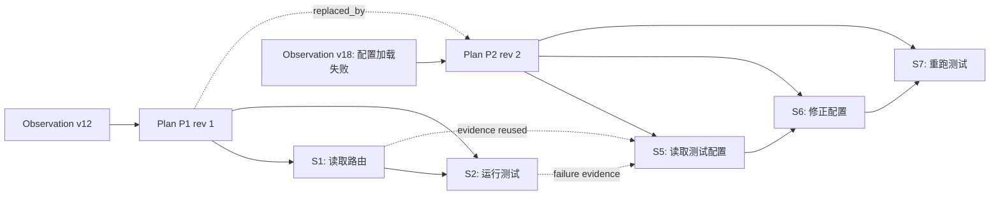

# 第 7 课：实现动态重规划与步骤依赖

> 章节导航：[第三章：Agent Loop、State、Harness 与 Codebase Agent](./index.md)  
> 上一课：[第 6 课：实现 Checkpoint 与重启恢复](./lesson-06-checkpoint-recovery.md)  
> 下一课：[第 8 课：实现预算、重复检测与收敛终止](./lesson-08-budget-convergence.md)

## 一、你将完成什么

第 4 课已经让 Planner 产出带步骤和依赖的 `Plan`，第 5 课将计划和步骤持久化，第 6 课又保证了进程重启后不会丢失或重复执行已确认的事实。但真实任务会不断获得新证据：搜索结果可能表明原定文件不存在，测试失败可能缩小问题范围，用户补充的约束也可能让原来的下一步不再合适。

此时，正确行为既不是坚持执行一份已过时的计划，也不是就地修改旧计划并假装历史从未发生。本课为 `agent-platform` 增加受控的计划修订和依赖图机制。完成后，你应该能够：

1. 区分“继续当前计划”“同一步内处理失败”和“创建新计划版本”；
2. 用不可覆盖的计划谱系保留旧步骤、已确认结果和重规划原因；
3. 用显式依赖边表达前置条件、数据引用与可并行的工作单元；
4. 在接受新计划前校验任务版本、观察版本、步骤引用和有向无环图；
5. 让已完成证据被后续计划复用，让未开始的过时步骤被安全失效；
6. 在租约、fencing token、Checkpoint 和未决工具调用约束下提交重规划；
7. 通过合同测试证明旧计划不能在新计划生效后继续派发动作。

## 二、本课内容边界

本课只解决一个核心问题：**当可信的新观察改变了执行前提时，平台如何保留历史、修订计划，并只调度仍满足依赖的步骤。**

本课会完成：

- 重规划触发条件、输入快照与决策边界；
- 计划版本、父子谱系、活动计划指针和步骤替代关系；
- 显式依赖表、依赖类型、图校验与就绪步骤计算；
- 旧步骤的保留、失效、阻塞和新步骤的创建规则；
- 原子接受计划修订、事件记录与 Checkpoint 更新；
- 防止过期 Planner、过期计划和迟到 Worker 派发动作；
- 重规划与恢复、审批、取消和未知工具结果的协作；
- 依赖图和计划版本的合同测试。

本课不会展开：

- Token、工具次数、时间和费用如何作为重规划许可条件；
- 无进展、重复行为和收敛终止算法；
- Sandbox 中如何取消已经启动的进程、回滚文件或隔离网络；
- 多 Agent 之间如何分配图节点；
- 长期记忆、向量检索和大规模代码上下文装配；
- 人工接管工作台的完整交互界面。

第 8 课会为每次重新观察、规划和工具调用加入预算与收敛边界。第 9 至 11 课才定义 Sandbox 的文件、进程和网络副作用；第 21 课再完整展开人工接管。今天的目标不是让 Agent “随时改主意”，而是让每次改计划都有可验证的事实、清晰的影响范围和安全的提交边界。

## 三、重规划不是修改一份正在执行的待办清单

设想一个“定位登录测试失败并提出小范围修复”的任务。初始计划如下：

```text
P1
  S1 读取路由入口
  S2 运行 login 单测              依赖 S1
  S3 修改 token 校验              依赖 S2 成功
  S4 运行回归测试                 依赖 S3 成功
```

`S2` 的受控执行结果显示测试在配置加载阶段就退出，根本没有进入 token 校验。此时把 `S3.objective` 原地改成“检查测试配置”，会同时造成三类错误：

1. 审计记录无法解释为什么原本要修改 token；
2. 已绑定 `S3` 的审批、Action 或恢复游标可能指向了不同的工作含义；
3. 迟到的 Worker 仍可能使用旧计划中的 `S3` 派发修改动作。

正确的处理是生成 `P2`，明确它基于哪一份观察、替代了哪个计划，以及旧图中的哪些步骤仍然有效：

```text
P1（保留）
  S1 succeeded，结果仍可引用
  S2 failed，失败结果成为新证据
  S3 superseded，尚未执行，不再派发
  S4 superseded，尚未执行，不再派发

P2（活动计划，based_on_observation=18）
  S5 读取测试配置与 fixture
  S6 修正失配配置                依赖 S5 成功
  S7 重跑 login 单测              依赖 S6 成功
  S8 评估是否还需要 token 检查    依赖 S7 完成
```

重规划是一个受控领域命令：输入是当前任务契约、可信观察、活动计划、步骤状态和未决调用；输出是一个**候选计划版本**。Planner 可以提出候选，但只有 Controller 校验前提、图结构、授权和并发版本后，候选才成为新的活动计划。

### 3.1 先分类，再决定是否重规划

并非每个工具失败或每条模型建议都值得创建新计划。建议先使用以下决策表：

| 发生的事实 | 默认处理 | 是否创建新计划版本 |
| --- | --- | ---: |
| 只读搜索结果补充了预期文件位置，原步骤目标仍成立 | 继续当前步骤，记录新观察 | 否 |
| 同一步工具超时，但工具契约允许安全重试 | 在原步骤中创建新的调用 attempt | 否 |
| 失败证明前置假设不成立，后续步骤语义已变化 | 提出重规划 | 是 |
| 一个依赖步骤成功，解锁后继步骤 | 计算新的 `ready` 步骤 | 否 |
| 用户只是补充不改变 TaskSpec 的事实 | 形成新观察后判断影响 | 视影响而定 |
| 用户改变目标、授权范围、完成标准或受保护资源 | 暂停并创建新任务或受控规格修订 | 不以普通重规划处理 |
| `tool.dispatched` 但结果未知 | 先按第 6 课协议恢复和对账 | 否 |
| 取消已请求或审批已失效 | 停止提出和接受新计划 | 否 |

“模型说这个方案看起来更好”不是充分的重规划触发器。模型偏好可以是候选的 `rationale`，但 Controller 必须能指出一条已确认的证据、失败分类或可信用户输入，说明原计划的哪一项前提已改变。

### 3.2 任务契约不是计划的一部分

Plan 可以修订，`TaskSpec` 不应被普通重规划修改。若用户把“只解释测试失败”改为“直接修改生产仓库并发布”，这不是 `P1 -> P2`，因为目标、权限和完成标准发生了实质变化。平台应创建一个新的任务，或者走单独、可审计的 TaskSpec 修订流程；不能让 Planner 通过重规划绕过第 2 课的输入约束和第二章的授权边界。

## 四、把计划建模为有谱系的不可变图

一份计划的步骤定义和依赖定义在接受后不再就地改写。步骤的运行状态可以随执行演进，但“该计划当时打算做什么、为什么依赖、基于什么观察”必须保持可回放。



这里有三个不同的概念，不能混为一谈：

| 对象 | 稳定身份 | 是否可修改 | 表达的含义 |
| --- | --- | ---: | --- |
| `Plan` | `plan_id` | 否 | 某次被接受的步骤图和规划依据 |
| `PlanStep` 定义 | `step_id` | 否 | 一个具体工作单元的目标、预期证据和依赖语义 |
| Step 运行状态 | `step_id + version` | 受控更新 | 该工作单元是否待执行、执行中、完成、失败或失效 |
| `StepRelation` | `relation_id` | 否 | 旧步骤与新步骤之间保留、替代或派生的关系 |

同一个业务意图可能跨计划延续，但不应复用同一个 `step_id`。例如，`P1.S3` 是“修改 token 校验”，`P2.S6` 是“修正测试配置”，二者显然不是同一步；即使两个计划都包含“运行 login 测试”，新计划也要创建新步骤，并通过 `derived_from_step_id` 或 `reuses_evidence_from` 明确复用关系。这样每次 Action 都能绑定唯一的计划版本和步骤定义。

### 4.1 计划生命周期

计划本身建议采用如下生命周期：

```text
draft -> active -> superseded
     \-> rejected
```

- `draft`：Planner 提出，尚未改变任务可执行状态；
- `active`：通过全部校验，`agent_tasks.active_plan_id` 指向它；
- `superseded`：被后续活动计划替代，保留供审计、恢复和回放；
- `rejected`：候选不满足当前观察、图校验、授权或并发前提，保留拒绝原因。

`active` 不是“所有步骤均未执行”。它只说明新动作必须从这份计划图中选择；前一份计划已经确认的结果仍然属于任务事实，并可被新计划引用。

### 4.2 计划替换的最小不变量

接受 `P2` 时应保证：

1. `P2.task_id` 与任务一致，且 `parent_plan_id` 指向当前活动计划；
2. `P2.based_on_observation_version` 等于当前可用于规划的观察版本；
3. 任务同一时刻最多有一个 `active` 计划；
4. `P1` 的定义、事件、工具调用和已确认结果不被删除；
5. `P1` 中尚未派发的过时步骤不会再变为 `running`；
6. 所有 `P2` 依赖的步骤都属于 `P2`，跨计划证据使用引用表达；
7. 任务版本、租约和 fencing token 在接受时仍然有效。

“所有依赖都必须属于 `P2`”避免了一个隐蔽错误：把 `P1.S1` 直接放进 `P2.S6.depends_on`。这会让新计划的就绪计算依赖旧计划中可能已经失效的执行状态。若 `P2.S6` 需要 `S1` 的结果，应把结果的 `artifact_id` 或 `evidence_ref` 写入新步骤的输入，而不是把旧图的边接到新图。

## 五、明确步骤依赖语义

第 4 课的 `depends_on: tuple[str, ...]` 适合表达最小示例；进入持久化和重规划后，JSON 数组不再足以回答“为什么依赖、前置步骤失败后能否继续、后继步骤使用了什么输出”。本课把依赖提升为显式关系记录。

### 5.1 三种依赖类型

推荐先支持少量、定义明确的依赖类型：

| 依赖类型 | 前置条件 | 常见用途 | 前置失败时 |
| --- | --- | --- | --- |
| `requires_success` | 上游必须 `succeeded` 且证据可用 | 先读取目标文件，再修改它 | 下游 `blocked` 或触发重规划 |
| `requires_completion` | 上游进入任一已确认终态 | 先尝试诊断，再选择修复或报告 | 可以继续，但需读取结果分类 |
| `consumes_artifact` | 上游成功并产出指定 Artifact | 编译产物交给部署检查 | 下游不可就绪 |

不要把“列表展示顺序”当作依赖。`position` 只用于稳定展示和同一就绪集合内的确定排序；两个步骤没有边，就应允许 Controller 按资源、审批和后续预算策略选择其中之一。第 8 课会为这种选择加入预算和重复检测约束。

`requires_completion` 也不是“失败可以忽略”。它只表示后继步骤的职责是处理上游结果，例如收集错误日志后决定是否请求输入；Controller 仍应将失败摘要加入 Observation，不能把它伪装成成功。

### 5.2 有向无环图是接受条件，不是事后检查

每个活动计划都是一个有向无环图（DAG）。如果有如下关系：

```text
S1 -> S2 -> S3 -> S1
```

那么没有任何步骤可以先满足所有前置条件。等待直到超时不能修复这个建模错误；Controller 必须在计划仍为 `draft` 时拒绝它。

图校验至少覆盖：

1. 所有 `step_id` 在计划内唯一；
2. 每条边的两端均属于同一计划，且不能自指；
3. `dependency_type` 是平台支持的值；
4. `consumes_artifact` 指明预期产物类型或稳定名称；
5. 图无环，且步骤数与拓扑遍历数相同；
6. 计划拥有至少一个根步骤，除非它是明确的“等待外部输入”计划；
7. 每个步骤的目标、工具能力和预期证据均仍在任务授权范围内。

依赖图的结构校验不替代第二章的 Tool Runtime 授权。它只能证明 `S6` 在逻辑上依赖 `S5`，不能证明 Agent 有权执行 `S6` 想调用的工具。

## 六、扩展持久化模型

第 5 课中 `agent_steps.depends_on` 的 JSON 字段可以在过渡期保留供旧数据读取，但新建计划不应继续以它作为权威关系。下面示例在 `apps/api/app/agents/replanning/models.py` 中补充计划谱系、依赖和替代关系；真实项目应通过受控迁移把旧 JSON 转成边表。

```python
from datetime import datetime
from typing import Any

from sqlalchemy import (
    CheckConstraint,
    DateTime,
    ForeignKey,
    Integer,
    JSON,
    String,
    Text,
    UniqueConstraint,
    func,
)
from sqlalchemy.orm import Mapped, mapped_column

from app.agents.persistence.models import Base


class AgentPlanRow(Base):
    __tablename__ = "agent_plans"
    __table_args__ = (
        UniqueConstraint("task_id", "revision", name="uq_plan_revision"),
        CheckConstraint("revision > 0", name="ck_plan_revision_positive"),
        CheckConstraint(
            "based_on_observation_version >= 0",
            name="ck_plan_observation_version",
        ),
    )

    plan_id: Mapped[str] = mapped_column(String(64), primary_key=True)
    task_id: Mapped[str] = mapped_column(
        ForeignKey("agent_tasks.task_id"), index=True
    )
    parent_plan_id: Mapped[str | None] = mapped_column(
        ForeignKey("agent_plans.plan_id"), index=True
    )
    revision: Mapped[int] = mapped_column(Integer)
    status: Mapped[str] = mapped_column(String(32), index=True)
    based_on_observation_version: Mapped[int] = mapped_column(Integer)
    trigger_kind: Mapped[str] = mapped_column(String(64))
    trigger_evidence_refs: Mapped[list[str]] = mapped_column(JSON, default=list)
    rationale: Mapped[str | None] = mapped_column(Text)
    graph_hash: Mapped[str] = mapped_column(String(64))
    created_at: Mapped[datetime] = mapped_column(
        DateTime(timezone=True), server_default=func.now()
    )
    accepted_at: Mapped[datetime | None] = mapped_column(
        DateTime(timezone=True)
    )


class PlanStepDependencyRow(Base):
    __tablename__ = "plan_step_dependencies"
    __table_args__ = (
        UniqueConstraint(
            "plan_id",
            "predecessor_step_id",
            "successor_step_id",
            "dependency_type",
            name="uq_plan_step_dependency",
        ),
        CheckConstraint(
            "predecessor_step_id <> successor_step_id",
            name="ck_dependency_not_self",
        ),
    )

    dependency_id: Mapped[str] = mapped_column(String(64), primary_key=True)
    plan_id: Mapped[str] = mapped_column(
        ForeignKey("agent_plans.plan_id"), index=True
    )
    predecessor_step_id: Mapped[str] = mapped_column(
        ForeignKey("agent_steps.step_id"), index=True
    )
    successor_step_id: Mapped[str] = mapped_column(
        ForeignKey("agent_steps.step_id"), index=True
    )
    dependency_type: Mapped[str] = mapped_column(String(32))
    artifact_selector: Mapped[dict[str, Any] | None] = mapped_column(JSON)


class StepRelationRow(Base):
    __tablename__ = "step_relations"
    __table_args__ = (
        UniqueConstraint(
            "from_step_id", "to_step_id", "relation_type",
            name="uq_step_relation",
        ),
    )

    relation_id: Mapped[str] = mapped_column(String(64), primary_key=True)
    task_id: Mapped[str] = mapped_column(
        ForeignKey("agent_tasks.task_id"), index=True
    )
    from_step_id: Mapped[str] = mapped_column(
        ForeignKey("agent_steps.step_id"), index=True
    )
    to_step_id: Mapped[str] = mapped_column(
        ForeignKey("agent_steps.step_id"), index=True
    )
    relation_type: Mapped[str] = mapped_column(String(32))
    reason_code: Mapped[str] = mapped_column(String(64))
    evidence_refs: Mapped[list[str]] = mapped_column(JSON, default=list)
    created_at: Mapped[datetime] = mapped_column(
        DateTime(timezone=True), server_default=func.now()
    )
```

还需要给 `agent_tasks` 增加 `active_plan_id`。它不是计划内容的副本，而是当前调度器唯一可选择动作的计划身份：

```sql
ALTER TABLE agent_tasks
ADD COLUMN active_plan_id VARCHAR(64) NULL;

CREATE INDEX ix_agent_tasks_active_plan
ON agent_tasks (active_plan_id);
```

数据库很难只用普通外键表达“前驱与后继步骤必须属于 `plan_id`”这一复合约束。不要因此放弃数据库约束：主键、唯一约束、非自环约束和外键仍然需要；其余跨行图不变量由单一 Repository 在事务内校验。若使用 PostgreSQL，可进一步用复合 `(plan_id, step_id)` 键和复合外键增强保护，但仍应保留应用层验证，避免导入和迁移路径绕过语义检查。

### 6.1 计算图哈希

`graph_hash` 不是安全签名，而是发现候选图在校验或传输过程中发生变化的完整性标记。它应由规范化的计划定义计算：稳定排序后的步骤 ID、目标摘要、依赖边、依赖类型、预期证据和结构版本均参与哈希；运行状态、时间戳、模型自然语言解释和数据库主键生成时间不参与。

```text
canonical_plan_definition
  -> stable JSON serialization
  -> SHA-256
  -> graph_hash
```

接受时重新计算并比较 `graph_hash`，能防止“校验的是 A 图，落库的是 B 图”。它不能替代任务版本比较，也不能证明模型输出可信。

## 七、先校验候选图，再让它接触数据库

Planner 输出的计划只是提案。Controller 应先将它转为内部、不可变的候选对象，并以纯函数完成图校验与就绪计算。这样大部分复杂逻辑能在不连接数据库、不调用模型或工具的情况下测试。

```python
from collections import defaultdict, deque
from dataclasses import dataclass
from enum import StrEnum


class DependencyType(StrEnum):
    REQUIRES_SUCCESS = "requires_success"
    REQUIRES_COMPLETION = "requires_completion"
    CONSUMES_ARTIFACT = "consumes_artifact"


class InvalidPlanGraph(ValueError):
    pass


@dataclass(frozen=True)
class DraftStep:
    step_id: str
    objective: str
    expected_evidence: tuple[str, ...]


@dataclass(frozen=True)
class DraftDependency:
    predecessor_step_id: str
    successor_step_id: str
    dependency_type: DependencyType
    artifact_selector: tuple[tuple[str, str], ...] = ()


@dataclass(frozen=True)
class PlanCandidate:
    task_id: str
    parent_plan_id: str | None
    based_on_observation_version: int
    trigger_kind: str
    trigger_evidence_refs: tuple[str, ...]
    steps: tuple[DraftStep, ...]
    dependencies: tuple[DraftDependency, ...]


def validate_plan_graph(candidate: PlanCandidate) -> tuple[str, ...]:
    step_ids = {step.step_id for step in candidate.steps}
    if not step_ids or len(step_ids) != len(candidate.steps):
        raise InvalidPlanGraph("steps must be non-empty and unique")

    incoming: dict[str, int] = {step_id: 0 for step_id in step_ids}
    outgoing: dict[str, list[str]] = defaultdict(list)

    for edge in candidate.dependencies:
        if edge.predecessor_step_id == edge.successor_step_id:
            raise InvalidPlanGraph("a step cannot depend on itself")
        if (
            edge.predecessor_step_id not in step_ids
            or edge.successor_step_id not in step_ids
        ):
            raise InvalidPlanGraph("dependency references another plan")
        if (
            edge.dependency_type is DependencyType.CONSUMES_ARTIFACT
            and not edge.artifact_selector
        ):
            raise InvalidPlanGraph("artifact dependency needs a selector")

        outgoing[edge.predecessor_step_id].append(
            edge.successor_step_id
        )
        incoming[edge.successor_step_id] += 1

    ready = deque(sorted(
        step_id for step_id, degree in incoming.items() if degree == 0
    ))
    order: list[str] = []
    while ready:
        step_id = ready.popleft()
        order.append(step_id)
        for successor in sorted(outgoing[step_id]):
            incoming[successor] -= 1
            if incoming[successor] == 0:
                ready.append(successor)

    if len(order) != len(step_ids):
        raise InvalidPlanGraph("dependency graph contains a cycle")
    return tuple(order)
```

生产实现还应检查目标是否为空、每个拟用工具是否在任务允许能力集中、引用的 Artifact 是否属于同一任务与租户，以及 Planner 所声称的触发证据是否真的存在。上述 `validate_plan_graph()` 专注图结构，不应悄悄承担授权、数据库读取或状态迁移职责。

### 7.1 就绪不等于立刻执行

一份合法 DAG 可能同时有多个可执行步骤。就绪计算只给 Controller 一组候选；它不派发工具调用，也不跳过审批、租约和步骤状态条件。

```python
TERMINAL_STEP_STATUSES = {"succeeded", "failed", "blocked", "skipped", "superseded"}


def dependency_is_satisfied(
    *,
    dependency_type: DependencyType,
    predecessor_status: str,
    artifact_available: bool,
) -> bool:
    if dependency_type is DependencyType.REQUIRES_SUCCESS:
        return predecessor_status == "succeeded"
    if dependency_type is DependencyType.REQUIRES_COMPLETION:
        return predecessor_status in TERMINAL_STEP_STATUSES
    if dependency_type is DependencyType.CONSUMES_ARTIFACT:
        return predecessor_status == "succeeded" and artifact_available
    raise AssertionError(f"unsupported dependency type: {dependency_type}")


def ready_step_ids(snapshot) -> tuple[str, ...]:
    candidates: list[str] = []
    for step in snapshot.steps_for_active_plan:
        if step.status not in {"pending", "ready"}:
            continue
        edges = snapshot.incoming_dependencies(step.step_id)
        if all(
            dependency_is_satisfied(
                dependency_type=edge.dependency_type,
                predecessor_status=snapshot.step_status(
                    edge.predecessor_step_id
                ),
                artifact_available=snapshot.artifact_matches(edge),
            )
            for edge in edges
        ):
            candidates.append(step.step_id)
    return tuple(sorted(candidates, key=snapshot.display_position))
```

`pending -> ready` 可以作为一次短事务中的派生状态更新，也可以让查询时动态计算后再条件领取。无论选哪种实现，只有活动计划中的步骤、且其所有依赖在当前数据库事实下满足时，才可被置为 `running`。

## 八、定义重规划的影响矩阵

接受新计划前，Controller 必须逐一分类旧计划中的步骤和未决调用。不能只执行 `UPDATE agent_plans SET status = 'superseded'` 后任由旧步骤留在可调度状态。

| 旧步骤或调用事实 | 处理方式 | 原因 |
| --- | --- | --- |
| 步骤已 `succeeded`，证据仍相关 | 保留状态和结果；由新步骤显式引用证据 | 已确认事实不能被新计划抹掉 |
| 步骤 `pending` / `ready`，且目标不再需要 | 标记 `superseded`，写入原因和替代关系 | 尚未产生副作用，可以停止派发 |
| 步骤 `failed`，失败本身是重规划依据 | 保留 `failed` 和错误证据 | 新计划需要能解释为什么改变方向 |
| 步骤 `blocked`，新计划绕开该前提 | 保留 `blocked`；必要时关联替代步骤 | 阻塞是事实，不是可删除的待办 |
| Action 已 accepted，尚未 `tool.dispatched` | 撤销待发送动作，步骤再按上表处理 | 还没有外部发出事实 |
| Action 已 `tool.dispatched`，无权威结果 | 先进入恢复和对账，不接受会绕开的计划 | 不得遗失未知副作用 |
| 步骤 `running`，且本地 Worker 仍持有租约 | 先停止产生新动作并落到一致边界 | 不能从正在执行的内存状态中“跳走” |
| 已通过的审批绑定旧 Action | 使其只对旧 Action 有效，绝不迁移给新 Action | 审批绑定具体风险、参数和上下文 |

对于“已 accepted、尚未发出”的 Action，撤销本身也必须是事实：例如追加 `action.revoked(reason=plan_superseded)`，并在同一事务把调用标成 `voided`。若原有数据模型还没有 `voided`，应新增该调用生命周期状态，而不是删除记录或把它重新挂到新步骤。

### 8.1 失败传播与失效传播不同

当一个 `requires_success` 前驱失败时，后继步骤不能变为 `ready`。但是否把所有后继都永久标记为 `blocked`，取决于任务语义：

- 若后继必须使用前驱产物，例如“编译成功后部署”，可以标记为 `blocked(upstream_failed)`；
- 若后继是诊断或报告步骤，应使用 `requires_completion`，让它读取失败结果后继续；
- 若失败说明整张图的假设已变化，Controller 应保持未开始步骤不可执行，提出新计划，而不是递归修改整张旧图。

因此，依赖传播是控制器的受控状态变更，不是简单的“失败就把整棵树都改成 failed”。`failed` 只属于真正执行过且得到明确失败结果的步骤；没有执行的后继应是 `blocked`、`superseded` 或仍为 `pending`，具体取决于已确认事实。

## 九、原子接受计划修订

重规划会同时改变多份权威事实：新计划和新步骤、依赖边、旧步骤的可调度性、任务活动计划指针、事件和恢复游标。因此它必须在一个数据库事务中提交，并使用第 6 课的 lease 与 fencing token 限制推进权。

### 9.1 接受前置条件

在事务开始时加载一个受控快照，并验证：

1. 当前 Worker 持有未过期租约和正确的 `fencing_token`；
2. `task.version` 等于 Planner 读取快照时的版本；
3. `task.active_plan_id` 等于候选的 `parent_plan_id`；
4. 当前 Observation 版本与候选 `based_on_observation_version` 一致；
5. 任务未终态、未取消、未因审批或未知副作用暂停；
6. 没有已发出但尚未对账的 ToolInvocation；
7. 候选图、触发证据、权限范围和替代关系已通过校验。

任一条件不满足，就拒绝候选并重新读取事实；不能把旧候选“稍作修改”后直接写入。尤其是 `task.version` 冲突时，另一个 Worker 可能已经接受了新计划或记录了关键工具结果，原候选的前提已经不可信。

### 9.2 Repository 事务骨架

下面示例省略 ID、哈希和 ORM 映射细节，重点是更新顺序和条件。它放在 `apps/api/app/agents/replanning/repository.py`：

```python
class StaleReplanProposal(RuntimeError):
    pass


class UnsettledInvocation(RuntimeError):
    pass


class SqlAlchemyReplanningRepository:
    def __init__(self, session) -> None:
        self._session = session

    async def accept_replan(
        self,
        *,
        task_id: str,
        expected_task_version: int,
        parent_plan_id: str | None,
        lease,
        candidate: PlanCandidate,
        impact,
        event,
    ) -> str:
        snapshot = await self.load_replan_snapshot(task_id=task_id)
        self._assert_acceptance_preconditions(
            snapshot=snapshot,
            expected_task_version=expected_task_version,
            parent_plan_id=parent_plan_id,
            lease=lease,
            candidate=candidate,
        )
        if snapshot.has_dispatched_invocation_without_result:
            raise UnsettledInvocation(task_id)

        plan_id = new_id("plan")
        plan = AgentPlanRow(
            plan_id=plan_id,
            task_id=task_id,
            parent_plan_id=parent_plan_id,
            revision=snapshot.next_plan_revision,
            status="active",
            based_on_observation_version=candidate.based_on_observation_version,
            trigger_kind=candidate.trigger_kind,
            trigger_evidence_refs=list(candidate.trigger_evidence_refs),
            rationale=None,
            graph_hash=hash_candidate(candidate),
        )
        self._session.add(plan)
        await self.insert_steps_and_dependencies(plan_id, candidate)
        await self.apply_old_plan_impact(impact=impact, lease=lease)

        next_version = expected_task_version + 1
        changed = await self.conditionally_activate_plan(
            task_id=task_id,
            old_plan_id=parent_plan_id,
            new_plan_id=plan_id,
            expected_task_version=expected_task_version,
            next_version=next_version,
            lease=lease,
        )
        if not changed:
            raise StaleReplanProposal(task_id)

        if parent_plan_id is not None:
            await self.mark_plan_superseded(parent_plan_id, replacement=plan_id)

        await self.append_event(
            task_id=task_id,
            sequence=next_version,
            event_type="plan.replanned",
            payload={
                "from_plan_id": parent_plan_id,
                "to_plan_id": plan_id,
                "trigger_kind": candidate.trigger_kind,
                "trigger_evidence_refs": list(candidate.trigger_evidence_refs),
                "task_version": next_version,
            },
            event=event,
        )
        await self.append_checkpoint_for_active_plan(
            task_id=task_id,
            task_version=next_version,
            plan_id=plan_id,
            lease=lease,
        )
        return plan_id
```

服务层必须用一个 `session.begin()` 包住这个方法。若插入依赖边、更新旧步骤、条件激活新计划、事件追加或 Checkpoint 创建的任一步失败，事务全部回滚，外部世界仍只看见旧计划为活动计划。

### 9.3 计划激活必须是条件写入

核心条件应同时检查任务版本、活动计划、租约与 fence。以 PostgreSQL 为例：

```sql
UPDATE agent_tasks AS task
SET active_plan_id = :new_plan_id,
    version = :next_version,
    status = 'planning'
FROM task_leases AS lease
WHERE task.task_id = :task_id
  AND task.version = :expected_task_version
  AND task.active_plan_id IS NOT DISTINCT FROM :old_plan_id
  AND lease.task_id = task.task_id
  AND lease.owner_id = :owner_id
  AND lease.fencing_token = :fencing_token
  AND lease.lease_expires_at >= CURRENT_TIMESTAMP
  AND task.cancel_requested = FALSE
RETURNING task.task_id;
```

返回零行的原因需要由 Repository 再读取后分类为“任务不存在”“版本已改变”“计划已改变”“租约失效”或“已取消”。调用方不能把零行一律当成可重试：若任务已取消或另一个计划已接受，原候选应直接丢弃。

状态回到 `planning` 的目的不是重新执行整份计划，而是让第 4 课的 Controller 在已接受的 `P2` 与最新事实下重新装配 Observation，并从其就绪集合中选择下一条受控命令。

## 十、只从活动计划条件领取步骤

即使旧计划已经 `superseded`，一个慢 Worker 仍可能持有它在内存中算出的 `ready` 结果。调度时必须再次在数据库中确认该步骤属于当前活动计划，而不是只相信 Planner 的内存。

```sql
UPDATE agent_steps AS step
SET status = 'running',
    version = step.version + 1
FROM agent_tasks AS task
JOIN task_leases AS lease ON lease.task_id = task.task_id
WHERE step.step_id = :step_id
  AND step.task_id = :task_id
  AND step.plan_id = task.active_plan_id
  AND step.status IN ('pending', 'ready')
  AND task.version = :expected_task_version
  AND task.cancel_requested = FALSE
  AND lease.owner_id = :owner_id
  AND lease.fencing_token = :fencing_token
  AND lease.lease_expires_at >= CURRENT_TIMESTAMP
  AND NOT EXISTS (
      SELECT 1
      FROM plan_step_dependencies AS dep
      JOIN agent_steps AS predecessor
        ON predecessor.step_id = dep.predecessor_step_id
      WHERE dep.plan_id = step.plan_id
        AND dep.successor_step_id = step.step_id
        AND (
          (dep.dependency_type = 'requires_success'
             AND predecessor.status <> 'succeeded')
          OR
          (dep.dependency_type = 'requires_completion'
             AND predecessor.status NOT IN (
               'succeeded', 'failed', 'blocked', 'skipped', 'superseded'
             ))
        )
  )
RETURNING step.step_id, step.version;
```

对 `consumes_artifact`，还应在 `NOT EXISTS` 子查询中检查指定 Artifact 已由正确的前驱、任务和租户产生，且未超过访问或保留期限。示例为突出控制流省略了这部分 join；不能把 Artifact 标识直接拼进 SQL。

领取步骤成功后，仍要按第 4 至 6 课的协议创建受控 `Action`、`ToolInvocation`、事件和 Checkpoint，最后才可能发出工具调用。计划切换不提供绕过持久化、授权或恢复协议的捷径。

## 十一、实现受控重规划服务

重规划服务应组织读取、分类、提案、校验和接受，但不应把模型自然语言直接写进数据库。下面骨架刻意将副作用放在边缘，便于对纯决策进行测试：

```python
from enum import StrEnum


class ReplanDecision(StrEnum):
    CONTINUE_CURRENT_PLAN = "continue_current_plan"
    RETRY_CURRENT_STEP = "retry_current_step"
    PROPOSE_REVISION = "propose_revision"
    AWAIT_RECOVERY = "await_recovery"
    PAUSE = "pause"


def decide_replanning(snapshot) -> ReplanDecision:
    if snapshot.task.is_terminal or snapshot.task.cancel_requested:
        return ReplanDecision.PAUSE
    if snapshot.has_dispatched_invocation_without_result:
        return ReplanDecision.AWAIT_RECOVERY
    if snapshot.current_step_retry_is_safe:
        return ReplanDecision.RETRY_CURRENT_STEP
    if snapshot.material_plan_assumption_invalidated:
        return ReplanDecision.PROPOSE_REVISION
    return ReplanDecision.CONTINUE_CURRENT_PLAN


class ReplanningService:
    def __init__(self, repository, planner, clock) -> None:
        self._repository = repository
        self._planner = planner
        self._clock = clock

    async def evaluate(self, *, task_id: str, lease, context) -> None:
        snapshot = await self._repository.load_replan_snapshot(task_id=task_id)
        decision = decide_replanning(snapshot)

        if decision is ReplanDecision.AWAIT_RECOVERY:
            await self._repository.request_reconciliation(
                task_id=task_id, lease=lease
            )
            return
        if decision is not ReplanDecision.PROPOSE_REVISION:
            return

        proposal = await self._planner.propose_revision(
            task_spec=snapshot.task.spec_for_planner(),
            observation=snapshot.current_observation,
            active_plan=snapshot.active_plan_for_planner(),
            preserved_evidence=snapshot.reusable_evidence(),
        )
        candidate = normalize_candidate(proposal, snapshot)
        validate_plan_graph(candidate)
        impact = classify_old_plan_impact(snapshot, candidate)

        async with self._repository.transaction():
            await self._repository.accept_replan(
                task_id=task_id,
                expected_task_version=snapshot.task.version,
                parent_plan_id=snapshot.task.active_plan_id,
                lease=lease,
                candidate=candidate,
                impact=impact,
                event=context.persisted_event(),
            )
```

Planner 输入应是受控摘要，而非全部事件、任意工具原文或旧模型的 chain-of-thought。至少包含：任务目标和授权范围的摘要、当前 Observation 版本、当前计划的步骤定义和状态、可信结果摘要、可以复用的 Artifact 引用、触发证据以及仍不可执行的边界。这样模型有足够信息提出替代步骤，同时不会把不可信文本升级为控制指令。

### 11.1 何时观察版本足以触发修订

每个 Plan 已经绑定 `based_on_observation_version`。并不意味着 `observation_version` 一增加就必须创建新计划：工具成功、日志追加和消息保存都可能形成新观察，却不改变原计划假设。

建议由 Controller 生成一个结构化的 `PlanAssumptionCheck`：

```json
{
  "active_plan_id": "plan-01J...",
  "observation_version": 18,
  "invalidated_assumptions": [
    {
      "assumption_id": "target-token-validator-is-reached",
      "evidence_ref": "artifact://tool-result/test-01J...",
      "reason_code": "test_exits_during_config_load"
    }
  ],
  "material": true
}
```

只有可信适配器写入的结果、经过校验的用户输入或平台状态变化能进入这一结构。模型可以建议要检查哪些假设，但不能自行声称某个假设已经失效。`material=false` 时应继续当前计划或只更新下一步上下文，避免每一轮都产生无意义的计划版本。

## 十二、与恢复、审批、取消并发协作

重规划必须服从第 6 课的恢复协议，而不是覆盖它。

### 12.1 未决外部调用优先于计划修改

若旧计划某步骤已留下 `tool.dispatched` 且没有权威结果，系统首先面对的是“外部副作用是否发生”的问题，而不是“新计划是否更好”。正确顺序是：

```text
取得租约与 fence
  -> 验证 Checkpoint
  -> 按幂等键查询 / 等待 / 人工对账未决调用
  -> 提交已确认结果或 paused(unknown_side_effect)
  -> 形成新的 Observation
  -> 再判断是否需要重规划
```

不得为方便切换计划而删除 Invocation、把步骤改回 `pending`，或把同一个幂等键绑定给 `P2` 的新步骤。即使 `P1` 随后被替代，那次调用仍属于 `P1` 的不可变历史。

### 12.2 审批与取消不会迁移

审批是对特定 `Action`、参数摘要、资源范围和风险级别的允许。`P1.S3` 的“应用补丁”审批绝不自动适用于 `P2.S6`，即使工具名称相同。新 Action 必须按第二章的策略重新做权限和审批判定。

取消请求一旦被提交，Controller 不再接受候选计划，也不再将步骤置为 `running`。它可以完成必要的恢复查询、写入取消相关事实，并让已开始的 Sandbox 操作按后续章节的取消协议结束；但不能把“为了清理而重规划”包装成继续任务。

### 12.3 过期提案自然失效

两个 Worker 或两个模型请求可能根据同一 Observation 同时提出 `P2a` 和 `P2b`。二者都可以通过图校验，但只有第一个满足 `expected_task_version + parent_plan_id` 的条件写入能激活。另一个提案在条件更新返回零行后成为过期草稿，应记录为 `rejected(stale_parent)` 或只保留在短期 Trace 中，取决于审计策略；它绝不能覆盖已激活的计划。

这也解释了为什么图哈希、任务版本、活动计划指针和 fence 必须同时存在：图哈希发现内容漂移，任务版本拒绝事实漂移，活动计划指针拒绝错误父计划，fence 拒绝迟到 Worker。

## 十三、为重规划写合同测试

重规划测试的重点不是“模型最终给出一个新计划”，而是验证旧事实、依赖和并发边界不会被破坏。建议至少覆盖以下场景。

### 13.1 图校验拒绝环与跨计划引用

```python
def test_cycle_is_rejected_before_any_persistence() -> None:
    candidate = PlanCandidate(
        task_id="task-1",
        parent_plan_id="plan-1",
        based_on_observation_version=8,
        trigger_kind="assumption_invalidated",
        trigger_evidence_refs=("artifact://test-8",),
        steps=(
            DraftStep("s1", "读取配置", ()),
            DraftStep("s2", "运行测试", ()),
        ),
        dependencies=(
            DraftDependency("s1", "s2", DependencyType.REQUIRES_SUCCESS),
            DraftDependency("s2", "s1", DependencyType.REQUIRES_SUCCESS),
        ),
    )

    with pytest.raises(InvalidPlanGraph, match="cycle"):
        validate_plan_graph(candidate)
```

再增加一条 `DraftDependency("old-plan-step", "s1", ...)`，断言在 Repository 写入前因“引用另一计划”失败。不要通过创建跨计划边后再靠查询过滤来掩盖错误。

### 13.2 接受新计划保持旧历史并失效旧待办

```python
async def test_replan_preserves_results_and_supersedes_unstarted_steps(session):
    task, old_plan = await make_active_plan(
        session,
        steps={"s1": "succeeded", "s2": "failed", "s3": "ready"},
    )
    evidence = await add_result_artifact(session, step_id="s2")
    lease = await acquire_lease(session, task.task_id, fence=12)

    async with session.begin():
        plan_id = await replanning(session).accept_replan(
            task_id=task.task_id,
            expected_task_version=task.version,
            parent_plan_id=old_plan.plan_id,
            lease=lease,
            candidate=configuration_fix_candidate(evidence),
            impact=impact_for(old_plan),
            event=test_event(),
        )

    assert (await get_plan(session, old_plan.plan_id)).status == "superseded"
    assert (await get_step(session, "s1")).status == "succeeded"
    assert (await get_step(session, "s2")).status == "failed"
    assert (await get_step(session, "s3")).status == "superseded"
    assert (await get_task(session, task.task_id)).active_plan_id == plan_id
    assert await result_artifact_exists(session, evidence)
```

事务内故意令 `append_checkpoint_for_active_plan()` 抛出错误，断言 `old_plan` 仍是 `active`、`s3` 仍是原状态、没有 `plan.replanned` 事件。只有失败路径也保持原子性，才能证明调度器不会见到半份新计划。

### 13.3 旧计划无法在切换后领取步骤

准备一个 Worker A 在内存中持有旧步骤 `s3`，Worker B 成功激活新计划。A 用旧 `expected_task_version` 和旧 fence 执行步骤领取 SQL，应返回零行。断言：

- `s3` 没有进入 `running`；
- 没有新的 `Action`、`ToolInvocation` 或 `tool.dispatched` 事件；
- B 的活动计划和 Checkpoint 仍指向新 `plan_id`；
- A 若继续尝试写入，会因 version 或 fence 条件失败。

这条测试比只检查 `agent_plans.status` 更重要，因为真正的风险来自迟到的调度请求。

### 13.4 依赖满足规则可解释

至少测试：

1. `requires_success` 的前驱为 `succeeded` 时，下游出现在 ready 集合；
2. 前驱为 `failed` 时，下游不出现，并可被标记 `blocked(upstream_failed)`；
3. `requires_completion` 的前驱失败时，下游仍可就绪；
4. `consumes_artifact` 的前驱成功但产物不匹配时，下游不就绪；
5. `superseded` 步骤永远不在 active plan 的 ready 集合；
6. 同一就绪集合在相同快照下返回稳定排序，便于测试和回放。

### 13.5 恢复优先于重规划

构造一条 `tool.dispatched` 但无结果的写操作，并让 Planner 提出一个看似合理的新计划。`decide_replanning()` 必须返回 `AWAIT_RECOVERY`；fake Planner 不应被调用，数据库也不应新增计划、依赖边或 `plan.replanned` 事件。只有结果被确认或任务因未知副作用暂停后，才能改变后续控制流。

## 十四、串联一次重规划时间线

继续使用“定位登录测试失败”的例子。下面省略不参与控制判断的消息和 Trace：

```text
seq=20  plan.created(plan=P1, based_on_observation=12)
        task.active_plan_id = P1
        Checkpoint v20: active_plan(P1)

seq=21  step.succeeded(step=S1, artifact=route-source)
        S2 满足 requires_success，成为 ready

seq=22  tool.dispatched(invocation=I2, step=S2)
        task.status = waiting_tool
        Checkpoint v22: awaiting_tool_result(I2)

seq=23  tool.resolved(invocation=I2, result=failed,
                      evidence=config-load-error)
        step.status = failed
        Observation v18 写入可信失败分类

Controller 检查 P1 的假设：token 校验可达
        -> evidence=config-load-error 证明假设失效
        -> 提出 P2 草稿
        -> 校验 P2 DAG 与授权范围
        -> 将 P1.S3、P1.S4 分类为 superseded

seq=24  plan.replanned(from=P1, to=P2,
                        trigger=assumption_invalidated)
        P1.status = superseded
        task.active_plan_id = P2
        task.status = planning
        Checkpoint v24: active_plan(P2)

seq=25  step.ready(step=P2.S5)
        Controller 条件领取 P2.S5，并创建新的 Action
```

若 Worker 在 `seq=24` 后重启，第 6 课的恢复器读取 `Checkpoint v24`，发现当前没有未决调用，重新进入受控的 `planning`。它不会从 P1 选择 `S3`，因为 `active_plan_id=P2`，也不会重新执行 I2，因为 I2 已有权威结果。

## 十五、常见错误

| 错误 | 正确处理 |
| --- | --- |
| 直接修改旧 `PlanStep.objective` 和依赖数组 | 创建新计划和新步骤，通过谱系与关系表保留历史 |
| 每次工具失败都生成全新计划 | 先区分可安全重试、局部失败、依赖阻塞和假设失效 |
| 新计划直接依赖旧计划步骤 ID | 在新步骤中引用已确认 Artifact 或证据，不跨计划连边 |
| 用 `position` 表达执行前置条件 | 用显式依赖边；`position` 只用于展示与稳定排序 |
| 先激活新计划，再异步失效旧步骤 | 在同一事务内写新图、旧步骤影响、活动指针、事件和 Checkpoint |
| 只在 Planner 侧检查 DAG | Controller 在接受前校验，Repository 在写入边前再次验证 |
| `tool.dispatched` 未返回就把旧步骤标为 superseded | 先查询或对账；未知副作用只能等待或暂停 |
| 复用旧计划的 Action、审批或幂等键 | 新步骤创建新 Action；审批和幂等键只绑定原业务调用 |
| 旧计划标为 `superseded` 就认为不会执行 | 领取步骤时条件检查 `step.plan_id == task.active_plan_id`、版本与 fence |
| 前驱失败就把所有后继标为 `failed` | 依据依赖类型决定 blocked、继续诊断或提出重规划 |
| 模型自述“原计划无效”就接受重规划 | 要求可信 Observation、失败分类或受控用户输入提供触发证据 |
| 将用户的范围变更当作普通重规划 | 创建新任务或走受控 TaskSpec 修订，重新授权与审批 |

## 十六、课堂练习

### 练习一：判断是否应该重规划

对下列场景分别选择“继续当前计划”“在原步骤重试”“创建计划修订”“先恢复/暂停”，并说明依据：

1. `search_code` 返回空结果，但该工具 Schema 说明本次索引尚未完成；
2. `read_file` 返回路径不存在，且该路径是后续三个修改步骤的唯一输入；
3. 只读测试命令因短暂网络错误超时，且工具支持无副作用重试；
4. 已向外部缺陷系统发出创建工单请求，响应在网络断开前丢失；
5. 用户要求把“分析失败原因”改成“直接合并到受保护分支”；
6. 编译失败，但下一步的职责正是收集编译错误并生成报告。

参考判断：1 应继续观察或等待索引；2 通常需要计划修订；3 应在原步骤内受控重试；4 必须先恢复对账；5 不是普通重规划；6 使用 `requires_completion` 后可以继续该报告步骤。

### 练习二：设计依赖图

为“修复一个单元测试中的配置路径错误”设计一份计划，至少包含：读取测试、读取配置、修改配置、运行目标测试、运行相关回归测试。要求：

1. 标出每条边的依赖类型；
2. 说明读取测试和读取配置能否并行；
3. 说明回归测试为何不能仅依赖“修改步骤已完成”；
4. 为任一前驱失败写出下游应 `blocked`、继续还是触发重规划的理由；
5. 给出至少一个应作为 Artifact 引用、而不应跨计划依赖旧步骤的例子。

### 练习三：评审错误的重规划实现

指出下面代码至少五个问题，并给出修正方向：

```python
async def replan(task_id: str, new_steps: list[dict]) -> None:
    task = await db.get(Task, task_id)
    task.plan["steps"] = new_steps
    task.status = "running"
    await db.commit()

    for step in new_steps:
        if not step["depends_on"]:
            await runtime.execute(step["tool"], step["args"])
```

至少应指出：覆盖历史计划；没有 Observation、任务版本、活动计划或租约检查；依赖关系未校验且可能有环；跳过授权、审批、Action 与 Invocation；没有处理已发出工具调用；状态迁移没有通过状态机；新计划、事件和 Checkpoint 不原子；直接执行忽略步骤领取条件；不保留旧步骤、失败证据和替代原因。

### 练习四：补齐并发测试矩阵

为以下竞争场景写出前置事实、预期返回和关键断言：

1. 两个 Worker 根据同一 Observation 接受不同的计划草稿；
2. Worker A 已算出旧计划的 `ready` 步骤，Worker B 刚激活新计划；
3. 重规划事务在写入新步骤后、更新 `active_plan_id` 前发生数据库错误；
4. 有一条等待审批的旧 Action，Planner 在新计划中提出相似但参数不同的 Action；
5. 重启后发现旧计划调用已 `dispatched`，同时有一份未接受的重规划草稿；
6. 前驱步骤成功但其产物访问范围不再满足后继步骤的租户约束。

答案应同时覆盖任务版本、活动计划指针、步骤状态、Invocation 数量、事件序号、Checkpoint、审批身份和外部调用次数，而不只检查 HTTP 返回码。

## 十七、完成标准

完成本课后，你应该能够：

- 解释为什么重规划是创建新计划版本，而不是覆盖旧 JSON；
- 用 `parent_plan_id`、修订号、触发证据和图哈希记录计划谱系；
- 将步骤前置条件表达为显式、可校验的依赖边；
- 在接受候选计划前拒绝环、跨计划依赖、自依赖和无效 Artifact 选择器；
- 让已确认结果保留为事实，让未开始的过时步骤进入可解释的 `superseded`；
- 区分 `failed`、`blocked`、`skipped` 和 `superseded`，不伪造执行结果；
- 在同一事务内提交新计划、依赖、旧图影响、活动计划指针、事件和 Checkpoint；
- 使用版本、活动计划指针、租约和 fencing token 阻止过期提案及旧步骤派发；
- 在未决外部副作用、取消或过期审批存在时拒绝绕过恢复与授权的重规划；
- 用图、原子性、并发领取和恢复优先级测试证明计划修订可控。

## 十八、本课小结

动态重规划不是让模型随意替换待办事项，而是一条受控的事实演进链：

```text
可信的新 Observation
  -> 明确哪个计划假设失效
  -> Planner 提出版本化 DAG 候选
  -> Controller 校验图、授权、版本、调用与影响范围
  -> 事务提交新计划 + 旧步骤分类 + Event + Checkpoint
  -> 仅从活动计划中条件领取满足依赖的下一步骤
```

计划谱系保留“当时为什么这样做”，依赖图定义“什么条件下可以继续”，旧步骤分类防止过期待办复活，版本、租约和 fence 则防止并发 Worker 把历史计划重新变成现实。下一课会在这套受控循环上加入预算、重复检测和无进展识别，回答另一个同样重要的问题：即使计划可以修订，平台又该在何时停止继续尝试。
