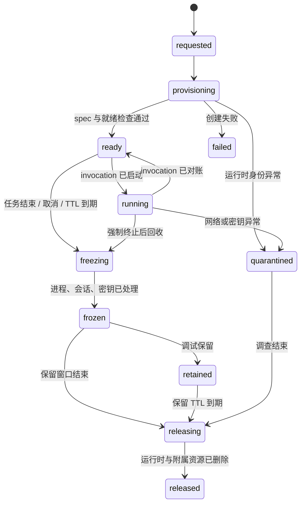
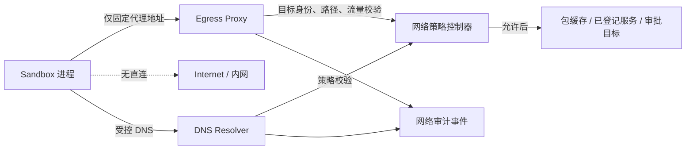

# 第 11 课：隔离网络与密钥并管理 Sandbox 生命周期

> 章节导航：[第三章：Agent Loop、State、Harness 与 Codebase Agent](./index.md)  
> 上一课：[第 10 课：限制 Sandbox 命令、进程与资源](./lesson-10-sandbox-command-resource-boundary.md)  
> 下一课：[第 12 课：搭建 Agent Harness 核心接口](./lesson-12-harness-core-interfaces.md)

## 一、你将完成什么

第 9 课限制了文件，第 10 课限制了命令、进程和资源。但只要进程能自由访问网络，仍可把源码、日志、环境变量或测试产物上传到外部；只要它继承宿主环境，就可能拿到云凭证、包仓库令牌或数据库密码。反过来，完全断网又会让少数确有必要的依赖下载、内部 API 查询或经过审批的发布任务无法进行。

本课把 Sandbox 视为一项短生命周期、默认无网络、默认无密钥的运行能力。完成后，你应该能够：

1. 区分 Sandbox、工作区、命令 invocation、网络会话和密钥租约这五种生命周期；
2. 以默认拒绝的出口策略替代“容器里能 `curl` 就可以”；
3. 使用受控代理、DNS 策略、目标身份校验和请求级审计，而不是仅按域名字符串放行；
4. 让网络授权与任务、命令模板、审批、预算和工作区 generation 绑定；
5. 使用最小、短时、可撤销的密钥投递，避免把长期密钥写入镜像、环境、日志或工作区；
6. 用镜像摘要、运行时规格和启动证明建立 Sandbox 的可信身份；
7. 实现创建、就绪、运行、冻结、释放、保留和销毁的显式状态机；
8. 在控制器或运行时崩溃后对账网络会话、密钥租约和 Sandbox，而不是盲目重建或删除；
9. 用合同测试证明不可信任务不能直连网络、越权解析 DNS、窃取密钥或复用过期 Sandbox。

## 二、本课内容边界

本课只解决一个核心问题：**平台如何为每个受控命令提供最小、短时、可审计的网络和密钥能力，并把隔离环境安全地创建、回收和恢复。**

本课会完成：

- Sandbox 身份、运行时规格、镜像可信性与状态机；
- 默认拒绝的网络模型、受控 egress 代理和 DNS 解析策略；
- 目标身份、端口、方法、路径、流量和会话限额；
- 最小密钥能力、短期凭证、投递通道、轮换和销毁；
- 镜像、挂载、用户身份、环境和运行时元数据的启动约束；
- 创建、就绪检查、冻结、保留、回收、销毁与垃圾收集；
- 审计事件、运行时对账、崩溃恢复和未知外部副作用；
- 面向网络、密钥、镜像、生命周期和恢复的合同测试。

本课不会展开：

- Docker、Kubernetes、Firecracker、gVisor 或任一云厂商的完整部署教程；
- TLS 终止、企业证书颁发机构、服务网格和全局零信任网络的完整实现；
- KMS/Vault 的加密算法、高可用与权限管理内部实现；
- SBOM、漏洞治理和软件供应链的完整流水线；
- 多租户集群调度、节点自动扩缩与跨地域流量计费；
- Agent Harness 的接口抽象、Hook 编排或 Codebase Agent 的业务流程。

第 9 课定义的 `WorkspaceRef`、目录能力和写入 fence，第 10 课定义的 `CommandTemplate`、`ProcessInvocation`、资源限额和进程树回收，仍然是本课的前提。本课不允许模型自行选择容器镜像、网络模式、DNS 服务器、代理地址或密钥名称；这些都由控制面根据已授权的命令能力生成。

## 三、为什么“容器隔离”并不等于安全边界

下面的原型常被误认为已经使用了 Sandbox：

```python
async def run_in_container(command: str, workspace: str) -> str:
    process = await asyncio.create_subprocess_exec(
        "docker",
        "run",
        "--rm",
        "-v",
        f"{workspace}:/work",
        "-e",
        f"GITHUB_TOKEN={os.environ['GITHUB_TOKEN']}",
        "python:3.12",
        "sh",
        "-c",
        command,
        stdout=asyncio.subprocess.PIPE,
    )
    output, _ = await process.communicate()
    return output.decode()
```

它仍然把关键权限交给了不可信输入或宿主默认值：

1. 默认网络通常允许任意出口，任务可上传源码、日志和令牌；
2. `sh -c` 重新引入第 10 课已经禁止的 Shell 解释；
3. 宿主工作区被直接挂载，容器逃逸或错误配置会扩大影响范围；
4. 长期 `GITHUB_TOKEN` 以环境变量形式进入进程、`/proc`、错误报告和子进程；
5. `python:3.12` 是可变标签，今天和明天可能对应不同镜像；
6. 继承 Docker daemon、DNS、代理和 registry 配置会隐式扩大能力；
7. `--rm` 只删除容器对象，不保证卷、网络会话、日志、子进程和密钥租约已对账；
8. 无法把网络请求、密钥使用和文件变化关联到同一个 `invocation_id`；
9. 控制器崩溃后，不知道容器是否仍在运行、是否仍持有凭证或已经产生外部副作用；
10. “容器启动成功”被误当成“策略、镜像、挂载、网络和密钥全部符合要求”。

安全执行链应当是：

```text
Task + CommandRequest + WorkspaceRef
  -> Policy 计算可用网络与密钥能力
  -> Controller 创建不可变 SandboxSpec
  -> Runtime 验证镜像、隔离规格、挂载和身份
  -> Sandbox 仅接入受控 DNS / egress proxy
  -> Secret Broker 按短期 lease 投递最小凭证
  -> Adapter 启动已登记的 argv 与进程组
  -> 网络、密钥、资源与文件事件回流 Controller
  -> 冻结、对账、销毁或保留 Sandbox
```

核心保证是：**模型可以表达“我需要访问某项已登记服务”，但不能自己选择去哪、怎么连、拿什么凭证、运行在哪个镜像，或让环境无限存活。**

## 四、先分清五种身份与生命周期

### 4.1 不要把所有东西叫作“容器”

一次任务运行至少会涉及下列对象：

| 对象 | 主要职责 | 典型生命周期 | 不能替代什么 |
| --- | --- | --- | --- |
| `WorkspaceRef` | 文件快照、目录能力、写入 fence | 可跨多个运行实例 | 不是进程或网络身份 |
| `Sandbox` | 隔离内核、挂载、网络命名空间和运行时资源 | 短时，可重建 | 不是任务长期身份 |
| `ProcessInvocation` | 一次受控命令及其进程树 | 命令开始到已对账 | 不是整个 Sandbox |
| `NetworkSession` | 一次或一组授权的出口连接 | 短于等于 invocation | 不是“允许联网”布尔值 |
| `SecretLease` | 某项最小凭证的有效使用权 | 明确 TTL，可撤销 | 不是环境变量字符串 |

一个任务可以在同一 `WorkspaceRef` 上依次运行多个 Sandbox；一个 Sandbox 也可以承载同一任务的多个只读 invocation，但第一版推荐一 Sandbox 一任务、或至少一 Sandbox 一租约，以降低隔离推理复杂度。无论采用哪种复用策略，都不能让“物理容器 ID”成为任务、工作区或密钥授权的长期身份。

### 4.2 SandboxRef 是控制面身份

`SandboxRef` 必须稳定、不可猜测，并可与实际运行时句柄解耦：

```python
from dataclasses import dataclass
from enum import StrEnum


class SandboxState(StrEnum):
    REQUESTED = "requested"
    PROVISIONING = "provisioning"
    READY = "ready"
    RUNNING = "running"
    FREEZING = "freezing"
    FROZEN = "frozen"
    RELEASING = "releasing"
    RELEASED = "released"
    RETAINED = "retained"
    QUARANTINED = "quarantined"
    FAILED = "failed"


@dataclass(frozen=True)
class SandboxRef:
    sandbox_id: str
    task_id: str
    tenant_id: str
    workspace_id: str
    workspace_generation: int
    sandbox_generation: int
    policy_version: int
    runtime_class: str
```

其中 `sandbox_generation` 在同一逻辑 Sandbox 被安全重建时递增。运行时可以额外拥有容器 ID、pod UID、微虚拟机实例 ID 或 cgroup 路径，但这些属于 Adapter 内部实现，不能作为模型参数或长期 Checkpoint 的唯一事实。

### 4.3 生命周期状态机

一份显式状态机让“等待运行”“已冻结”“正在删除”和“被隔离调查”不会混为一谈：



`ready` 表示隔离基础设施已满足启动条件，**不**表示允许任意命令运行；每个 invocation 仍需要经过第 10 课的命令、资源和预算准入。`frozen` 表示业务副作用已停止、证据仍可读取，`released` 才表示运行时资源与授权句柄都已失效。

### 4.4 状态迁移必须有前置事实

| 迁移 | 前置条件 | 必须写入的事实 |
| --- | --- | --- |
| `requested -> provisioning` | 任务、工作区、策略与预算有效 | `sandbox.requested`、spec 摘要 |
| `provisioning -> ready` | 镜像、挂载、身份、网络默认策略和运行时限制已验证 | 镜像 digest、runtime handle 摘要、attestation |
| `ready -> running` | invocation 已准入，所需网络/密钥 lease 仍有效 | `invocation_id`、有效期、fence |
| `running -> ready` | 进程退出，网络会话关闭，密钥使用已记录 | invocation 结果与资源对账 |
| `* -> freezing` | 任务终止、取消、TTL 或策略撤销 | 停止原因、冻结 deadline |
| `freezing -> frozen` | 进程树、会话、secret mount 均已撤销或标为未知 | 最终 manifest、会话摘要 |
| `releasing -> released` | 运行时、临时卷、网络对象和 lease 引用均不可用 | 删除确认或 tombstone |

写入状态不能替代运行时动作。比如先标记 `released` 再异步删除容器会产生一段“控制面说已消失，实际仍能联网”的危险窗口。应先发起回收、持续对账，确认所有资源失效后才提交 `released`。

## 五、网络默认拒绝：把“联网”拆成可验证能力

### 5.1 网络模式不是一个布尔值

`allow_network: true` 无法表达目标、端口、协议、数据量和授权原因。第一版可以从以下四种模式开始：

```python
class NetworkMode(StrEnum):
    NONE = "none"
    PACKAGE_PROXY = "package_proxy"
    SERVICE_PROXY = "service_proxy"
    APPROVED_EGRESS = "approved_egress"
```

| 模式 | 可达对象 | 常见用途 | 默认风险 |
| --- | --- | --- | --- |
| `none` | 无 DNS、无入口、无出口 | 测试、构建、静态分析 | 最低 |
| `package_proxy` | 内部依赖镜像/缓存 | 锁定依赖的受控安装 | 中低 |
| `service_proxy` | 已登记的内部服务别名 | 查询只读内部 API | 中 |
| `approved_egress` | 审批后代理可达的固定目的地 | 一次性外部集成 | 高 |

所有模式都应禁止直接访问宿主网络、云元数据地址、私有网络探测、任意代理配置和入站端口暴露。`approved_egress` 不是“临时全网通”，而是给特定 `NetworkGrant` 的最窄例外。

### 5.2 默认拒绝的网络拓扑

推荐拓扑将不可信进程与外部网络隔开：



在 `none` 模式下，Sandbox 最好没有默认路由，DNS 请求也应失败或仅解析必要的本地代理占位符。仅依赖进程内环境变量例如 `HTTP_PROXY` 不足够，因为程序可以自行清除变量、使用原始 socket 或尝试连接其他地址。网络命名空间、运行时网络策略或等价机制必须在执行面强制默认拒绝。

### 5.3 网络授权模型

网络请求需要比“域名在白名单”更完整的上下文：

```python
from dataclasses import dataclass
from datetime import datetime
from typing import FrozenSet


@dataclass(frozen=True)
class NetworkGrant:
    grant_id: str
    task_id: str
    invocation_id: str
    sandbox_id: str
    sandbox_generation: int
    template_id: str
    policy_version: int
    mode: NetworkMode
    service_id: str | None
    allowed_methods: FrozenSet[str]
    allowed_paths: tuple[str, ...]
    allowed_ports: FrozenSet[int]
    max_requests: int
    max_bytes_sent: int
    max_bytes_received: int
    expires_at: datetime
    approval_id: str | None = None
```

`NetworkGrant` 由 Controller 创建，模型只可以提出结构化意图，例如“下载 lockfile 中缺失的包”或“调用 `issue-tracker.read` 服务查询工单”。Grant 必须绑定到 invocation 和 Sandbox generation，不能因为同一任务以前拿到过网络能力，就允许后续任意命令复用。

### 5.4 准入顺序

在启动命令前，按下面顺序判断：

```text
CommandTemplate 是否声明该网络用途
  -> TaskSpec 是否允许该风险级别
  -> Workspace / Sandbox / task fence 是否仍有效
  -> 目标 service_id 或包源是否为已登记对象
  -> 是否需要且已获得未消费的审批
  -> 网络、请求数和流量预算能否预留
  -> 创建短时 NetworkGrant 与代理凭证
  -> 启动 invocation
```

不应先创建一个“能联网的 Sandbox”，再在命令发出后尝试审计。能力存在的时间越短，错误配置、任务恢复和控制面故障造成的暴露窗口越小。

## 六、DNS、目标身份与代理：域名白名单不够

### 6.1 DNS 是授权链的一部分

允许 `api.example.com` 不等于允许连接解析出的任意 IP。攻击者可能利用 DNS rebinding、CNAME 跳转、私有地址解析或环境中的恶意 DNS 设置绕过策略。策略至少要明确：

1. Sandbox 只能使用平台指定的 resolver，不能传递自定义 `--dns` 或 `resolv.conf`；
2. resolver 对请求的服务名、CNAME 链和结果地址做策略判断；
3. 拒绝 loopback、link-local、RFC1918 私网、云元数据和其他保留地址，除非对应已登记内部服务；
4. 记录解析时的 grant、名称、记录类型、答案摘要和 TTL；
5. 代理在真正建立连接时再次验证目标，不信任客户端自己解析出的 IP；
6. 请求被重试、重定向或地址变化时，重新应用授权，而非沿用第一次判断。

为避免信息泄露，未授权名称的 DNS 响应也不应把内部服务拓扑暴露给 Sandbox。对 `none` 模式而言，最简单安全的实现是无可用 resolver。

### 6.2 用服务身份代替自由 URL

模型不应直接传入：

```json
{"url": "https://anything.example/path?token=..."}
```

更安全的意图是：

```json
{
  "service_id": "issue-tracker.read",
  "operation": "get_issue",
  "issue_key": "ENG-431"
}
```

服务目录由平台管理：

| 字段 | 作用 |
| --- | --- |
| `service_id` | 稳定的授权对象，如 `package-mirror.pypi` |
| `endpoint_set` | 经审核的 DNS 名称、端口、TLS 名称和地址策略 |
| `allowed_operations` | 允许的方法、固定或结构化路径、请求体 schema |
| `auth_profile` | 调用该服务所需的最小密钥类型 |
| `risk` | 决定审批、TTL、流量和审计级别 |
| `egress_profile` | 可使用的代理、重定向、重试和限速策略 |
| `owner` | 服务责任人和策略变更来源 |

这样可以把“调用一个业务服务”与“获取任意 HTTP 出口”分开。对于包安装，应将目标表达为内部包缓存和锁文件中固定的包集合，而不是开放 `pypi.org` 后让构建脚本自行下载任意依赖。

### 6.3 代理必须验证请求，而非只转发流量

受控 egress proxy 的最小职责包括：

- 验证 mTLS、签名令牌或不可伪造的 `NetworkGrant`，并绑定 sandbox generation；
- 根据 `service_id` 解析可信 endpoint，拒绝客户端指定任意 IP 或 `Host`；
- 校验协议、端口、HTTP 方法、规范化后的路径、重定向和请求体大小；
- 限制连接数、请求数、上传/下载字节数、空闲时间和总会话时长；
- 对 TLS SNI、证书链和目标身份做校验，不能只比较字符串 Host；
- 记录结果元数据，不把完整授权头、Cookie、请求体或响应体默认写进审计日志；
- 在 grant 过期、撤销、任务取消或 Sandbox generation 变化时立即拒绝新请求并断开会话。

对任意 TCP 协议，路径和方法不可见，因此风险更高。第一版应优先只支持受控 HTTP(S) 服务，其他协议通过单独、明确、经审批的 adapter 提供，不能把“需要 Git SSH”简单实现成开放端口 22。

### 6.4 HTTP 重定向和代理绕过

以下请求看似访问了白名单域名，却会离开授权边界：

```text
GET https://packages.internal.example/bootstrap
302 Location: http://169.254.169.254/latest/meta-data/
```

代理必须对每一跳应用相同的服务身份与地址策略。默认拒绝跨服务、跨协议、降级到 HTTP、重定向到私网或携带授权头的跨域跳转。客户端设置的 `HTTP_PROXY`、`HTTPS_PROXY`、`NO_PROXY`、PAC 文件和自定义 DNS 都应由运行时清理或固定，不能成为绕过控制面的通道。

### 6.5 网络预算与资源预算不同

第 10 课限制一个进程使用多少 CPU、内存和输出；网络还需要独立计量：

| 维度 | 示例 | 超限默认处理 |
| --- | --- | --- |
| 连接数 | 同时最多 4 个 | 拒绝新连接 |
| 请求数 | 单 invocation 最多 20 次 | 拒绝后续请求 |
| 上传字节 | 最多 256 KiB | 终止请求并审计 |
| 下载字节 | 最多 20 MiB | 截断/终止并记录 |
| 会话时长 | 不超过 invocation wall time | 关闭连接 |
| 空闲时长 | 30 秒 | 回收会话 |
| 域名/服务数 | 一个固定 `service_id` | 拒绝跨服务 |

网络消耗既需要在代理实时强制，也应回写到第 8 课的任务预算账本。不要将下载体直接拼进模型上下文；应保存受限产物引用、大小、内容摘要和经过审查的预览。

## 七、密钥不是环境变量：最小、短时、可撤销

### 7.1 密钥能力模型

密钥的核心不是“将某个字符串放进进程”，而是让特定 invocation 在特定时间以特定方式调用已授权服务。建模时至少区分：

| 概念 | 含义 | 示例 |
| --- | --- | --- |
| `SecretReference` | 控制面中的逻辑引用 | `secret://issue-tracker/reader` |
| `SecretPolicy` | 谁可在什么条件下请求它 | 仅 `issue-tracker.read@2` 可用 |
| `SecretLease` | 一个可撤销、带 TTL 的使用权 | 60 秒、只读 scope |
| `SecretMaterial` | 真实令牌、证书或动态凭证 | 不写入任务状态 |
| `CredentialHandle` | Sandbox 可见的受限使用句柄 | Unix socket / 短时文件 descriptor |

`SecretReference` 可以被审计和写入 Checkpoint；`SecretMaterial` 绝不能进入任务事件、命令参数、模型上下文、普通日志、异常栈、工作区或数据库快照。

### 7.2 按服务签发的动态凭证优先

优先级从高到低如下：

1. 代理代持身份：Sandbox 不获得令牌，只向代理证明自己的 `NetworkGrant`；
2. 服务签发的短期、最小 scope 凭证：仅能读取一个项目或运行一次操作；
3. 只读、可轮换的临时文件/内存挂载凭证：明确 TTL，禁止复制到工作区；
4. 长期静态环境变量：仅作为迁移期例外，必须审批、隔离并尽快消除。

例如调用内部 issue tracker 的只读接口时，最好的方案是 Sandbox 只拿到代理签发的 invocation 身份，代理再以服务账号完成上游鉴权。这样命令进程、子进程和工具输出中都没有可被复制的长期 API token。

### 7.3 SecretLease 定义

```python
from dataclasses import dataclass
from datetime import datetime
from typing import FrozenSet


@dataclass(frozen=True)
class SecretLease:
    lease_id: str
    secret_ref: str
    task_id: str
    invocation_id: str
    sandbox_id: str
    sandbox_generation: int
    audience: str
    scopes: FrozenSet[str]
    issued_at: datetime
    expires_at: datetime
    renewable: bool
    delivery_mode: str
    approval_id: str | None = None
```

`audience` 必须是具体服务或代理，不应是“任意互联网服务”。`scopes` 应与 `CommandTemplate` 的风险和 `NetworkGrant.service_id` 相交，而不是由模型声明。一个用于读取 issue 的 lease 不应兼具写入仓库、发布包或访问其他租户的权限。

### 7.4 投递方式与限制

| 投递方式 | 适用场景 | 关键限制 |
| --- | --- | --- |
| 代理代持 | HTTP API、包缓存、数据库查询 | Sandbox 不直接读取 secret material |
| 短期内存文件 | 仅支持文件凭证的旧工具 | 只读、非工作区路径、最小权限、销毁确认 |
| 本地 Unix socket | 签名、令牌交换或凭证代理 | socket 只在 Sandbox 私有命名空间中可见 |
| 受控环境变量 | 迁移期的单进程兼容 | 不继承、不可打印、不可进入子进程除非显式允许 |

避免把密钥放在 `/work`、`checkout/`、`scratch/`、`outputs/` 或共享临时目录中。若不得不使用文件，应把它放在运行时创建的私有内存挂载中，使用随机文件名、严格 owner 和模式，启动后立刻关闭控制面可读副本，并在进程退出或 lease 失效后由运行时擦除/卸载。

### 7.5 环境变量为什么是最后选择

环境变量会经由许多路径泄露：子进程继承、调试输出、崩溃转储、语言运行时诊断、`/proc/<pid>/environ`、测试失败报告、模型工具回显和无意的 `env` 命令。因此即使使用环境变量，也必须：

1. 从空环境构建，只有已登记的变量允许进入；
2. 让 `CommandTemplate` 声明确切变量名与单进程可见范围；
3. 禁止命令模板执行 `env`、shell profile 或将环境写入文件；
4. 日志脱敏器按变量名和实际值的摘要双重处理；
5. lease 到期、取消、任务迁移和 Sandbox 冻结时撤销；
6. 不把它写入 `CommandRequest`、事件 payload、错误对象或 Checkpoint。

“日志已经打码”不能挽救一个已被子进程、网络请求或工作区文件复制出去的长期密钥。真正的边界是最小凭证、短期有效、受限投递与执行面阻断。

### 7.6 密钥使用的审计语义

审计的目标是回答“何时、谁、为哪个已授权调用使用了哪类凭证”，而不是记录凭证本身：

```json
{
  "event_type": "secret.lease_used",
  "task_id": "task_01J...",
  "invocation_id": "inv_01J...",
  "lease_id": "sl_01J...",
  "secret_ref": "secret://issue-tracker/reader",
  "audience": "issue-tracker.read",
  "scope_hash": "sha256:...",
  "result": "authorized",
  "occurred_at": "2026-08-19T10:14:05Z"
}
```

不要记录 token、Authorization header、Cookie、私钥、证书正文、完整请求体或可逆的密钥编码。必要时可记录 Secret Broker 的版本、凭证序列号/版本和撤销结果，但这些值也应经过最小化处理。

## 八、可信启动：镜像、挂载、身份与运行时规格

### 8.1 运行时类别不是部署细节

不同任务风险需要不同隔离强度。控制面应选择已登记的 `runtime_class`，例如：

| runtime class | 隔离方式示例 | 适用任务 | 不变量 |
| --- | --- | --- | --- |
| `build-restricted` | 受限容器/namespace | 本地测试、格式检查 | 无网络、无密钥、只读根文件系统 |
| `service-read` | 强隔离容器或微虚拟机 | 读取内部服务 | 仅代理网络、短时身份 |
| `external-approved` | 更强隔离、独立网络策略 | 已审批外部集成 | 每次调用独立 sandbox 与人工审批 |

容器、微虚拟机或远程执行器只是 Adapter 的实现选择。课程代码应面对统一的 `SandboxSpec` 和 attestation，而不是在业务 Controller 中散落 `docker run` 参数。

### 8.2 镜像必须使用不可变身份

下面的标签不是可审计策略：

```text
python:3.12
node:latest
my-company/agent-runner:stable
```

应在策略中记录镜像 registry、repository 和 manifest digest，并在启动前和运行时两次校验：

```python
@dataclass(frozen=True)
class ImageIdentity:
    registry: str
    repository: str
    manifest_digest: str
    policy_version: int
    sbom_ref: str | None
    signature_ref: str | None
```

生产中还应验证签名、SBOM、构建来源和漏洞策略；本课至少要求 Adapter 拒绝未登记 digest、可变标签、运行时报告的 digest 不匹配，以及将镜像身份写入 Sandbox attestation。镜像更新必须通过新策略版本发布；不要在恢复旧任务时静默把一个旧模板换到新镜像。

### 8.3 不可变 SandboxSpec

```python
@dataclass(frozen=True)
class SandboxSpec:
    sandbox: SandboxRef
    image: ImageIdentity
    workspace_mounts: tuple[str, ...]
    command_profile: str
    network_mode: NetworkMode
    resource_profile: str
    run_as_user: str
    read_only_rootfs: bool
    allow_privilege_escalation: bool
    allowed_capabilities: tuple[str, ...]
    environment_profile: str
    expires_at: datetime
```

`workspace_mounts` 在真实实现中应是结构化只读/读写挂载描述，而不是宿主路径字符串。默认值应尽量收紧：非 root 用户、只读根文件系统、无特权、无额外 Linux capability、无宿主 PID/IPC/网络命名空间、无 Docker socket、无云元数据路由、无未登记设备和挂载。

### 8.4 挂载与用户身份

第 9 课已经定义逻辑目录与文件能力。本课的运行时只能把它们映射成最小物理挂载：

| 逻辑对象 | 挂载策略 | 目的 |
| --- | --- | --- |
| `inputs/` | 只读快照 | 稳定证据和输入 |
| `checkout/` | 按任务授权读写 | 候选代码变更 |
| `scratch/` | 独立临时卷、大小受限 | 临时文件与工具缓存 |
| `outputs/` | 大小受限、发布前对账 | 候选产物 |
| 密钥投递区 | 私有内存挂载或 socket | 不能被工作区工具访问 |

不要把 `/var/run/docker.sock`、宿主根目录、用户 home、SSH 配置、云 SDK 配置、全局包缓存或裸设备挂进 Sandbox。即使命令本身没有提权能力，一次错误挂载也足以让容器获得宿主控制面权限。

### 8.5 启动 attestation

运行时在返回 `ready` 前应提交一个可验证、已脱敏的启动证明：

```python
@dataclass(frozen=True)
class SandboxAttestation:
    sandbox_id: str
    sandbox_generation: int
    runtime_handle: str
    image_digest: str
    runtime_class: str
    network_enforced: bool
    network_mode: NetworkMode
    read_only_rootfs: bool
    run_as_user: str
    resource_profile: str
    created_at: datetime
```

Controller 要比对 attestation 与 `SandboxSpec`。缺少 `network_enforced=True`、镜像 digest 不一致、rootfs 可写、用户身份错误或 runtime handle 无法按 `sandbox_id` 查询时，应进入 `quarantined` 或 `failed`，不能继续启动命令。

## 九、创建、复用、冻结与销毁

### 9.1 创建不是一个 RPC 成功就结束

推荐的创建流程如下：

```text
校验 TaskSpec、workspace lease、policy version、runtime class 和预算
  -> 创建 sandbox.requested（带 idempotency key）
  -> 为 SandboxSpec 预留运行时容量与 TTL
  -> Adapter 创建隔离实例、最小挂载和默认拒绝网络
  -> 验证镜像 digest、用户身份、资源 profile 和网络策略
  -> 写入 attestation 与 sandbox.ready
  -> 才允许 Controller 启动 invocation
```

创建请求必须是幂等的：相同 `task_id + workspace_generation + sandbox_purpose + attempt` 应返回同一个未释放的 Sandbox 或明确的已有结果，而不是因网络重试创建多个带密钥能力的运行实例。

### 9.2 复用的边界

Sandbox 复用能降低启动成本，却容易造成残留状态和权限穿透。第一版建议遵守：

- 不跨租户复用；
- 不跨任务复用；
- 不跨 workspace generation 复用；
- 带任何密钥、外部 egress 或未知副作用的 invocation 结束后立即冻结；
- 只有无网络、无密钥、只读、同一任务 lease 的短序列命令才允许复用；
- 每次 invocation 前后都重置进程、临时目录、环境、网络会话与资源计量。

“容器还活着，所以顺手继续用”不是复用策略。若无法证明环境已回到基线，应销毁并新建。

### 9.3 冻结先于回收

任务完成、失败、取消、预算耗尽、TTL 到期或策略撤销时，先进入 `freezing`：

1. 拒绝新的 invocation、NetworkGrant 和 SecretLease；
2. 使现有网络 grant 失效，关闭代理会话；
3. 按第 10 课终止进程组、等待 reaping，记录超时升级；
4. 撤销或卸载密钥投递；
5. 采集受限日志、资源摘要、文件 manifest、网络摘要和 attestation；
6. 对账未决 invocation、网络会话和 secret lease；
7. 确认没有存活进程、可用 socket、可用 grant 后提交 `frozen`。

冻结期间允许平台的最小恢复动作，例如查询运行时、关闭会话、卸载挂载、收集日志和保存 Checkpoint；不允许模型再执行“清理命令”、重新连接服务、重新领取密钥或写入工作区。

### 9.4 保留与销毁是不同决策

| 状态 | 允许行为 | 典型保留时间 |
| --- | --- | --- |
| `frozen` | 只读审计、产物发布前复核、运行时对账 | 短暂固定窗口 |
| `retained` | 受额外授权的调试审查 | 有明确 TTL |
| `releasing` | 平台回收器删除运行时与临时资源 | 直到确认完成 |
| `released` | 只保留不可变审计与产物引用 | 无物理 Sandbox |

保留调试环境也不应保留网络和密钥。进入 `retained` 前应先完成冻结，因此调试者看到的是证据和快照，不是一个仍可运行、仍有访问权的现场环境。

### 9.5 垃圾收集与孤儿资源

控制器崩溃、网络分区或运行时 API 超时会产生孤儿 Sandbox。回收器应以运行时标签和控制面记录双向对账：

```text
列出运行时带 agent.sandbox_id 标签的实例
  -> 控制面存在且 state=running：检查租约、心跳与 TTL
  -> 控制面存在但 state=released：隔离后删除，写 orphan_reaped
  -> 运行时存在、控制面不存在：进入 quarantine，确认归属后删除
  -> 控制面记录存在、运行时不存在：补写 runtime_missing，走恢复决策
```

不要按容器创建时间盲目批量删除，也不要让每个 Worker 自己清理“看起来没用”的 Sandbox。回收动作必须可归因、幂等、带保留规则，并避免删除仍属其他任务的资源。

## 十、事件、审计与对账

### 10.1 最小事件序列

Sandbox、网络和密钥事件与命令事件共同组成一次可恢复事实链：

```text
sandbox.requested
sandbox.provisioning
sandbox.attested
sandbox.ready
network.granted | network.denied
secret.lease_issued | secret.lease_denied
command.running
network.session_opened | network.request_denied
secret.lease_used | secret.lease_revoked
command.exited
sandbox.freezing
sandbox.frozen
sandbox.releasing
sandbox.released | sandbox.retained | sandbox.quarantined
```

所有事件至少关联 `task_id`、`sandbox_id`、`sandbox_generation`、`workspace_id`、工作区 generation、policy version、task fence 和 trace ID；命令相关事件再关联 `invocation_id`。事件 payload 保留摘要和外部对象引用，不能包含宿主路径、runtime 原始配置、密钥正文或任意网络响应。

### 10.2 网络审计记录什么

推荐记录：

| 字段 | 示例 | 为什么需要 |
| --- | --- | --- |
| `grant_id` | `ng_01J...` | 关联授权事实 |
| `service_id` | `package-mirror.pypi` | 避免日志只剩域名 |
| `operation` | `download_locked_wheel` | 业务层可解释性 |
| `method/path_template` | `GET /simple/{package}/` | 审计请求边界 |
| `destination_identity` | TLS 名称与 endpoint 版本摘要 | 验证实际目的地 |
| `status_class` | `2xx`、`4xx`、`denied` | 结果与排障 |
| `bytes_sent/received` | 整数 | 预算和异常检测 |
| `decision_reason` | `grant_expired` | 拒绝可解释性 |

不要默认记录完整 query、请求体或响应体。必要的业务标识应采用路径模板、哈希或明确白名单字段，避免把用户数据、访问令牌或代码内容复制到中央审计系统。

### 10.3 SandboxSummary 是命令结果的基础事实

第 10 课的 `CommandResult` 可以追加环境与网络摘要，而不是直接暴露底层细节：

```python
@dataclass(frozen=True)
class SandboxSummary:
    sandbox_id: str
    sandbox_generation: int
    image_digest: str
    runtime_class: str
    network_mode: NetworkMode
    network_requests: int
    network_bytes_received: int
    secret_lease_ids: tuple[str, ...]
    state_at_completion: SandboxState
    attestation_id: str
```

对模型可见的结果只需要解释“网络未授权”“包缓存下载成功”“密钥租约已撤销”“Sandbox 已冻结”等受控结论，以及引用经过大小限制的证据。模型不需要看到代理地址、完整 DNS 记录、容器 ID 或 secret lease 的可用句柄。

## 十一、崩溃恢复与未知外部副作用

### 11.1 四类不确定窗口

| 窗口 | 已知事实 | 恢复原则 |
| --- | --- | --- |
| 创建已请求、未拿到运行时句柄 | 可能未创建或创建中 | 按幂等键查询，确认未创建后才能重试 |
| Sandbox 已启动、attestation 未提交 | 可能正在运行但未完成校验 | 按不可伪造标签查询；不能直接启用 |
| 网络/密钥 grant 已签发、命令未记录 running | 可能已有外部请求或凭证暴露 | 立即撤销、查询代理记录、必要时暂停 |
| 命令退出、冻结未完成 | 进程可能已停，资源或外部会话未知 | 对账进程、会话、lease、manifest 后补记 |

恢复器的第一职责是降低仍在扩大副作用的风险：撤销过期或悬空的 grant，停止孤儿进程，冻结 Sandbox。它不应为了“恢复进度”而优先重建网络和重发带副作用的请求。

### 11.2 恢复决策树

```text
读取 Checkpoint、SandboxRef、invocation 与 lease
  -> 已 released 且结果完整：返回已有结果
  -> 运行时找到匹配 generation、attestation 合法、lease 有效：重新接管
  -> 运行时找到实例但镜像/策略/身份不一致：quarantine 并暂停
  -> 找到未关闭网络会话或未撤销密钥：先 revoke / freeze，再审计
  -> 进程已退出、会话/lease/manifest 可对账：补写结果并冻结
  -> 无法证明外部请求是否已经发出：unknown_external_side_effect，暂停
  -> 能证明从未启动且 grant 未使用：释放预留，按策略重试
```

`unknown_external_side_effect` 与“命令失败”不同。它意味着无法判断请求是否已写入外部系统、凭证是否被使用、或 Sandbox 是否曾运行在错误策略下。此时任务需要冻结受影响工作区，展示最后已知事件、代理/Secret Broker 查询结果、运行时 attestation 和人工可选动作，而不是自动重试。

### 11.3 Checkpoint 保存引用和版本，不保存可用能力

```json
{
  "sandbox_id": "sb_01J...",
  "sandbox_generation": 2,
  "workspace_id": "ws_01J...",
  "workspace_generation": 4,
  "image_digest": "sha256:...",
  "policy_version": 11,
  "runtime_class": "service-read",
  "invocation_id": "inv_01J...",
  "network_grant_id": "ng_01J...",
  "network_grant_expires_at": "2026-08-19T10:15:00Z",
  "secret_lease_ids": ["sl_01J..."],
  "state": "running",
  "attestation_id": "att_01J..."
}
```

Checkpoint 不保存代理 bearer token、客户端证书、密钥文件路径、容器 IP、宿主挂载路径、裸容器 ID 或 DNS 缓存。恢复时应重新从可信控制面查询这些短时能力是否仍有效；不能从序列化状态复活一份过期的访问权。

## 十二、合同测试

测试必须同时覆盖控制面决策与执行面强制。一个单元测试只断言 `NetworkGrant` 没被创建，无法证明运行时没有默认网络路由；一个集成测试只观察“请求失败”，也无法证明失败原因来自策略而不是偶然 DNS 故障。

### 12.1 默认无网络

```python
async def test_restricted_sandbox_has_no_direct_egress(runtime, controller, task):
    sandbox = await controller.prepare_sandbox(
        task=task,
        command_template="python.pytest.targeted@3",
    )

    probe = await runtime.run_network_probe(
        sandbox_id=sandbox.sandbox_id,
        host="198.51.100.10",
        port=443,
    )

    assert sandbox.network_mode == NetworkMode.NONE
    assert probe.connected is False
    assert await runtime.has_default_external_route(sandbox.sandbox_id) is False
```

使用文档保留地址做探测，避免测试依赖真实第三方服务。另应在真实运行时集成环境中验证 namespace、网络策略或等价隔离机制，而不是只使用 fake Adapter。

### 12.2 代理只接受已授权服务

```python
async def test_proxy_rejects_cross_service_redirect(proxy, grant):
    response = await proxy.request(
        grant=grant,
        method="GET",
        service_id="package-mirror.pypi",
        path="/bootstrap",
        simulated_redirect="http://169.254.169.254/latest/meta-data/",
    )

    assert response.decision == "denied"
    assert response.reason == "redirect_destination_not_allowed"
    assert proxy.upstream_request_count == 0
```

还应覆盖：直接 IP、私网地址、伪造 `Host`、未允许端口、CNAME 指向私网、过期 grant、已取消任务、错误 sandbox generation、超额字节数和跨服务重定向。

### 12.3 密钥不会进入工作区或普通环境

```python
async def test_secret_is_proxy_held_not_workspace_visible(controller, runtime, task):
    result = await controller.execute_service_read(task, issue_key="ENG-431")

    assert result.status == "succeeded"
    assert await runtime.workspace_contains(task.workspace_id, "issue-token") is False
    assert "ISSUE_TRACKER_TOKEN" not in runtime.last_process_environment
    assert runtime.last_proxy_auth_used is True
```

另应扫描受控日志、命令输出、异常事件、产物清单与 Checkpoint，验证不包含测试密钥的原文或编码变体。测试密钥应为专用假值，禁止在测试记录中使用真实凭证。

### 12.4 镜像和启动规格不可被降级

```python
async def test_runtime_rejects_mutable_image_and_privileged_spec(adapter, spec):
    unsafe = replace(
        spec,
        image=ImageIdentity(
            registry="registry.example",
            repository="agent-runner",
            manifest_digest="latest",
            policy_version=spec.image.policy_version,
            sbom_ref=None,
            signature_ref=None,
        ),
        allow_privilege_escalation=True,
    )

    with pytest.raises(PolicyViolation):
        await adapter.provision(unsafe)
```

覆盖点还包括：digest 与 attestation 不匹配、root 用户、可写根文件系统、额外挂载、Docker socket、未登记 capability、错误 runtime class 和缺少网络强制证明。

### 12.5 冻结会撤销网络和密钥

```python
async def test_freeze_revokes_live_grants_before_sandbox_is_retained(
    controller, proxy, secret_broker, running_sandbox
):
    await controller.freeze(running_sandbox.sandbox_id, reason="task_cancelled")

    assert await proxy.all_sessions_closed(running_sandbox.sandbox_id)
    assert await secret_broker.all_leases_revoked(running_sandbox.sandbox_id)
    assert await controller.state_of(running_sandbox.sandbox_id) == SandboxState.FROZEN
```

这个测试需要刻意构造一个存活连接和一个有效 SecretLease。仅检查 Docker/运行时返回停止成功不足以证明代理和密钥 Broker 已经撤权。

### 12.6 恢复不能重放未知外部写入

```python
async def test_recovery_pauses_when_external_write_cannot_be_reconciled(
    store, proxy, recovery
):
    sandbox = await store.create_running_sandbox("sb-1")
    await proxy.record_unconfirmed_request(sandbox.sandbox_id, operation="create_ticket")

    outcome = await recovery.reconcile_sandbox(sandbox.sandbox_id)

    assert outcome.status == "paused"
    assert outcome.reason == "unknown_external_side_effect"
    assert proxy.retry_count == 0
```

还应测试：控制器崩溃后可重新接管一个 attestation 合法的 Sandbox；过期 grant 不能因恢复而续期；控制面写 `released` 但运行时仍有实例时进入 quarantine 并由回收器处理；旧 sandbox generation 不能影响新的同任务 Sandbox。

## 十三、一次完整的运行时间线

以“根据锁文件从内部包缓存安装依赖后运行指定单测”为例：

```text
v01  Planner 请求 python.pytest.targeted@3，声明 package_proxy 需求
v02  Controller 校验模板、锁文件、工作区 generation、任务授权和预算
v03  Controller 创建 build-restricted SandboxSpec：镜像 digest、非 root、只读根、受限挂载
v04  Adapter 创建默认拒绝网络的 Sandbox，并回传 attestation
v05  Controller 写 sandbox.ready，为 package-mirror.pypi 签发一次短时 NetworkGrant
v06  Adapter 启动固定 argv；进程只能通过 egress proxy 访问内部包缓存
v07  Proxy 校验服务身份、路径、流量和 grant，记录下载摘要
v08  测试运行结束；CommandResult 记录资源、网络摘要和工作区 manifest
v09  Controller 使 grant 失效，关闭会话，撤销任何 SecretLease
v10  Sandbox 进入 freezing，运行时确认无存活进程和网络会话
v11  写 sandbox.frozen，保留短暂证据窗口；回收器随后销毁运行时实例
v12  写 sandbox.released，任务只保留不可变事件、产物与摘要引用
```

若控制器在 v07 后崩溃，恢复器先阻止新网络请求，再查询代理中 grant 的使用记录和运行时 attestation；它可能接管、对账后冻结，或因无法确认外部副作用而暂停，但不能直接从 v01 重跑安装与测试。

## 十四、常见错误

| 错误 | 正确处理 |
| --- | --- |
| “容器默认就隔离网络” | 明确配置并验证默认拒绝的执行面策略 |
| `allow_network: true` | 使用绑定 invocation 的 `NetworkGrant` 和服务身份 |
| 只按域名白名单放行 | 同时控制 DNS、地址、TLS、端口、路径、重定向与流量 |
| 让客户端自由设置代理和 DNS | 固定运行时网络出口，只允许平台 resolver/代理 |
| 用长期 API token 解锁所有外部调用 | 优先代理代持或短期、最小 scope 的凭证 |
| 将密钥写入环境、工作区或 Checkpoint | 使用私有投递通道，只持久化引用和 lease 摘要 |
| 用 `latest` 或稳定标签作为镜像身份 | 使用已审核的 manifest digest 与启动 attestation |
| 把宿主目录或 Docker socket 挂给 Sandbox | 只挂载逻辑工作区的最小受限视图 |
| 把 `--rm` 当作完整回收 | 冻结、撤权、对账后再确认 `released` |
| 跨任务复用仍带网络/密钥的容器 | 按租户、任务、generation 与风险严格隔离 |
| 只在应用层拒绝 HTTP 请求 | 在网络命名空间/运行时层默认阻断直连 |
| 控制器重启后直接重建并重发请求 | 先查询 runtime、代理、Secret Broker，未知时暂停 |
| 为调试保留一个仍能联网的 Sandbox | 先冻结并撤销能力，保留只读证据 |
| 审计日志记录完整 URL、header 与响应 | 记录服务身份、路径模板、摘要和计量 |

## 十五、课堂练习

### 练习一：为命令模板设计网络能力

分别为以下命令设计 `NetworkMode`、`service_id`、请求/流量上限和审批规则：

1. 运行仓库中已经安装依赖的单元测试；
2. 根据 lockfile 从内部包缓存补齐 Python wheel；
3. 读取内部 issue tracker 中一个工单；
4. 将构建产物发布到外部对象存储。

说明哪些情况应当默认拒绝，哪些需要独立的 `CommandTemplate`，以及为什么不能让第 4 项复用第 2 项的 NetworkGrant。

### 练习二：评审 DNS 与重定向实现

指出下面实现至少八个问题，并给出每项的防护位置：

```python
async def fetch(url: str) -> bytes:
    host = urlparse(url).hostname
    if host.endswith(".example.com"):
        return await http_client.get(url, follow_redirects=True)
    raise PermissionError("host denied")
```

至少考虑：用户控制 URL、子域名混淆、直接 IP、DNS rebinding、私网/元数据地址、端口、协议、重定向、TLS 身份、请求体/流量、代理绕过、grant 绑定与审计。

### 练习三：设计 SecretLease

为“只读查询一个项目的 issue tracker”设计一份 `SecretLease`。列出：

- `audience` 和最小 scope；
- 适合的投递方式；
- 何时签发、多久过期、是否可续期；
- 任务取消、Sandbox 冻结、代理拒绝和控制器崩溃时的撤销动作；
- 哪些信息可以进事件和 Checkpoint，哪些绝不能出现。

### 练习四：补齐 Sandbox 回收决策

为每种情况选择 `reattach`、`freeze_then_reconcile`、`release`、`quarantine` 或 `pause`，并说明理由：

1. 控制器重启后，运行时实例存在、镜像 digest 和 attestation 全部匹配；
2. 控制面记录为 `released`，但运行时仍有同标签 Sandbox；
3. Sandbox 中命令已退出，但代理有一个未确认的外部写请求；
4. `SecretLease` 已过期，进程仍在运行且尝试续用凭证；
5. Sandbox 镜像 digest 与原 Checkpoint 不一致；
6. 任务取消时所有进程已经退出、会话和 lease 均已确认撤销。

## 十六、完成标准

完成本课后，你应该能够：

- 说明 `WorkspaceRef`、`SandboxRef`、`ProcessInvocation`、`NetworkSession` 和 `SecretLease` 的独立身份与生命周期；
- 让普通命令运行在没有默认路由、没有默认 DNS、没有默认密钥的 Sandbox 中；
- 以 `NetworkGrant`、服务目录和受控代理提供最小网络例外，而不是开放任意互联网；
- 在 DNS、连接、TLS、端口、方法、路径、重定向、流量和会话层执行一致授权；
- 用代理代持或短期最小凭证替代长期环境变量，并在冻结时可靠撤销；
- 用镜像 digest、最小挂载、非 root 身份、只读根和运行时 attestation 验证启动规格；
- 实现 `requested -> ready -> running -> freezing -> frozen -> released` 的可审计生命周期；
- 区分证据保留与运行权限保留，调试 Sandbox 也不能继续访问网络和密钥；
- 在重启后查询运行时、代理和 Secret Broker，对未知外部副作用暂停而非自动重试；
- 用默认拒绝、代理绕过、密钥泄露、镜像降级、冻结撤权、孤儿回收和恢复场景证明边界成立。

## 十七、本课小结

Sandbox 的网络与生命周期治理可以浓缩为五个问题：

```text
身份：哪个任务、哪个 generation、哪个 invocation 正在申请能力？
目的：它只能访问哪项已登记服务，以什么方法和数据量访问？
凭证：是否有最小、短期、可撤销且不落盘的授权方式？
环境：镜像、挂载、用户、资源和网络是否与不可变 spec 一致？
结束：进程、连接、密钥、卷和运行时实例能否按顺序冻结、对账并回收？
```

默认拒绝网络让普通测试和构建无法自然变成数据出口；服务身份和受控代理将“调用业务能力”从“获取任意 URL”中分离；短期密钥 lease 缩小凭证泄露的影响面；镜像 attestation 和显式 Sandbox 状态机则让每个运行环境都能被证明、冻结、恢复或销毁。

至此，第 9 至 11 课共同构成了 Sandbox 的文件、进程资源、网络密钥与生命周期边界。第 12 课将把任务状态、模型、工具、策略和这些 Sandbox 能力收敛为可替换的 Agent Harness 核心接口。
