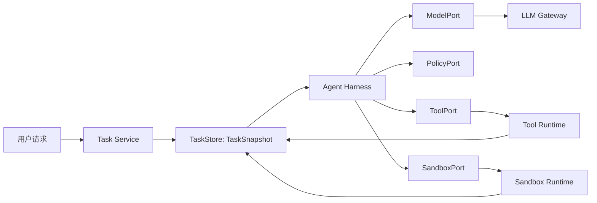

# 第 12 课：搭建 Agent Harness 核心接口

> 章节导航：[第三章：Agent Loop、State、Harness 与 Codebase Agent](./index.md)  
> 上一课：[第 11 课：隔离网络与密钥并管理 Sandbox 生命周期](./lesson-11-sandbox-network-lifecycle.md)  
> 下一课：[第 13 课：实现 Harness 事件、Hook 与生命周期](./lesson-13-harness-events-lifecycle.md)

## 一、你将完成什么

前 11 课已经分别定义了任务、计划、预算、Checkpoint、文件边界、命令边界及 Sandbox 生命周期。若这些能力散落在 API Handler、Prompt 拼接函数和一个 `while True` 循环里，系统仍会是难以替换、难以测试的耦合体：换模型要改状态机；测试计划决策必须启动容器；策略可以被工具调用绕过；恢复逻辑又不得不理解每个 SDK 的异常。

本课建立 Agent Harness 的核心接口。Harness 是任务运行的控制面：它把“任务如何向前推进”的业务规则放在中心，将模型、工具运行时、状态存储、策略和 Sandbox 放在明确边界之后。完成后，你应该能够：

1. 区分 Agent Harness、Agent Loop、Tool Runtime、Sandbox、Workflow Engine 的职责；
2. 使用端口与适配器隔离领域决策和外部 SDK；
3. 为任务快照、模型提案、受控动作、授权结果、执行结果和恢复状态定义稳定类型；
4. 将模型、工具、存储、策略、时钟、能力目录和 Sandbox 表达为可替换接口；
5. 让模型只能提出结构化候选动作，策略与 Harness 才能编译出可执行能力；
6. 让每项副作用绑定任务版本、fencing token、预算预留、工作区 generation 与幂等键；
7. 在 Adapter 超时、断连或未知结果时保留“不知道是否已发生”的事实；
8. 使用 Fake Adapter 与合同测试验证核心编排，而非在单元测试中连接真实模型和容器；
9. 通过唯一 Composition Root 组装生产 Adapter，避免 Service Locator 和调用点绕过策略；
10. 为下一课的 Event、Hook、取消、暂停和恢复生命周期准备清晰的扩展位置。

## 二、本课内容边界

本课只解决一个核心问题：**平台怎样以一组小而稳定的接口，组织 Agent 的决策与受控执行，使模型、工具、状态、策略和 Sandbox 都可以替换而不改变任务语义。**

本课会完成：

- Harness 的职责边界、分层结构与一次推进的控制流；
- 核心领域对象、值对象、结果联合类型和不可变引用；
- `ModelPort`、`ToolPort`、`TaskStore`、`PolicyPort`、`SandboxPort` 等端口契约；
- 从模型候选动作到平台 `ExecutionGrant` 的授权编译过程；
- 任务快照、预算、工作区、Sandbox、命令和外部副作用之间的关联字段；
- Adapter 的职责、错误归一化、幂等键和未知结果语义；
- 依赖装配、测试替身、端口合同测试和渐进式迁移路径；
- 一次“分析并运行指定测试”的完整 Harness 推进时间线。

本课不会展开：

- Event 日志的完整结构、Hook 优先级、监听器隔离、取消传播和 Run 生命周期；这些属于第 13 课；
- 状态图、条件边、循环节点、Interrupt 或图编排框架；这些属于第 14、15 课；
- Codebase Agent 的检索、证据引用、补丁、冲突和验证业务策略；这些从第 16 课开始；
- 任一 LLM SDK、ORM、Docker/Kubernetes/LangGraph 的完整接入教程；
- 多 Agent 委派、Skill 目录或跨团队调度；这些在第五章处理。

本课消费前面课程已经建立的事实：第 2 课的 `TaskSpec` 与完成标准，第 3 课的状态迁移，第 5、6 课的持久化和恢复，第 8 课的预算与收敛，第 9 至 11 课的工作区、命令、网络、密钥及 Sandbox 边界。Harness 不重写这些规则，只给它们安排唯一、可测试的调用位置。

## 三、为什么一个 `while True` 不能成为 Harness

许多原型从下面的函数开始：

```python
async def run_agent(user_prompt: str) -> str:
    messages = [{"role": "user", "content": user_prompt}]
    while True:
        response = await client.chat.completions.create(
            model="gpt-4.1",
            messages=messages,
            tools=ALL_TOOLS,
        )
        messages.append(response.choices[0].message)

        if not response.choices[0].message.tool_calls:
            return response.choices[0].message.content

        for call in response.choices[0].message.tool_calls:
            result = await run_tool(call.function.name, call.function.arguments)
            messages.append(tool_message(call.id, result))
```

它能演示一次工具调用，却没有平台边界：

1. 模型 SDK 消息格式、任务状态、工具目录和控制循环耦合在同一个函数；
2. `ALL_TOOLS` 通常包含当前任务无权使用的能力，甚至包含写入或联网能力；
3. 模型返回文本、非法 JSON、未知工具或多个 ToolCall 时，没有统一的业务语义；
4. `run_tool()` 没有任务版本、预算预留、工作区 lease、Sandbox generation 或幂等键；
5. 网络超时后无法区分“工具未收到”“已经完成”与“仍在执行”；
6. 任务重启只能把完整对话重新发给模型，不能从已确认状态恢复；
7. 单元测试必须 mock 供应商 SDK、工具函数和全局配置，测试焦点被外部细节淹没；
8. 更换模型供应商、工具协议或远端执行器会牵动领域代码；
9. 调用点可轻易跳过审批、策略、审计和资源限制；
10. `while True` 只知道“有无工具调用”，不知道任务是否完成、暂停、取消、预算耗尽或需要人工处理。

正确的执行链应当是：

```text
可信任务快照 + Checkpoint
  -> Harness 读取可推进状态与预算
  -> Context Builder 形成受限模型输入
  -> ModelPort 返回结构化候选提案
  -> Harness 校验提案的语法、谱系和任务不变量
  -> PolicyPort 产出允许 / 拒绝 / 等待审批 / 暂停的决定
  -> Harness 将允许决定编译为一次受控 Action
  -> ToolPort / SandboxPort 执行已授权能力
  -> Adapter 返回归一化结果或未知状态
  -> Harness 提交新的任务事实，交由下一次推进继续
```

核心保证是：**模型可以建议下一步，Adapter 可以完成外部交互，但只有 Harness 能把一个已持久化任务推进到下一个可信状态。**

## 四、Harness 到底是什么

### 4.1 它是控制面，不是另一个工具

Harness 是任务运行的应用层核心。它接收一个已经存在的任务引用，读取可信快照，根据状态和策略推进一次或多次受控步骤，并提交可恢复结果。它不等于模型客户端、工具注册表、任务数据库或容器运行时。

| 组件 | 主要问题 | Harness 是否替代它 |
| --- | --- | ---: |
| LLM Gateway | 怎样请求模型、处理供应商协议、计量 Token | 否，经 `ModelPort` 使用 |
| Tool Runtime | 怎样校验并执行单个 ToolCall | 否，经 `ToolPort` 申请受控调用 |
| Task Service / Store | 怎样保存任务、计划、步骤、Checkpoint 与版本 | 否，经 `TaskStore` 读取和提交事实 |
| Policy Engine | 谁可做什么、是否需要审批、额度是否充足 | 否，Harness 必须调用它 |
| Sandbox Runtime | 怎样运行隔离进程、网络和密钥 | 否，经 `SandboxPort` 请求能力 |
| Workflow / Graph Engine | 怎样表示复杂图、分支、并行和 Interrupt | 不是本课范围 |
| Agent Harness | 任务在何种事实下允许作出何种下一步 | 是，本课的核心 |

Harness 也不应成为无边界的“万能服务”。它不保存 ORM 实体，不拼供应商 HTTP 请求，不解析容器日志，不在内存私藏任务真相，也不把任意字符串变成命令。每一项外部责任通过端口进入。

### 4.2 它运行在任务事实之上

Harness 的输入不是一条自由文本，而是可验证的任务身份与快照。用户请求在创建任务时已被解析为目标、授权范围、完成标准和预算；模型上下文只是快照的一个受控投影。



图中返回 `TaskStore` 的箭头代表提交新事实，而不是让 Adapter 自行修改任务状态。Sandbox Adapter 可以报告“进程已退出，结果未知”，却不能直接把任务写成 `completed`；完成标准仍由 Harness 与任务状态规则判断。

### 4.3 一次推进优于无限占用 Worker

第一版建议将公共入口设计为 `advance(task_id)`：读取一个稳定快照，最多推进一个可恢复边界，然后返回明确的 `AdvanceResult`。长期 Runner 可以反复调用它，但每次调用之间都可以释放 Worker、重做租约判断、创建 Checkpoint，或交给后续图引擎调度。

```text
advance(task-42)
  -> 读取 version=18 的 TaskSnapshot
  -> 选择一个已就绪步骤
  -> 获取一项模型提案或执行一项已批准动作
  -> 提交 version=19 的事实
  -> 返回 progressed / waiting / terminal / recovery_required
```

这不是要求“一次只调用一个工具”。一个受控 `Action` 可以是 Tool Runtime 定义的原子操作，也可以是第 10、11 课定义的一次受限命令 invocation。关键在于：跨越外部副作用和持久化写入之间的边界必须可恢复，不能被无限循环隐藏。

## 五、先划分职责，再定义接口

### 5.1 三层结构

推荐采用 Ports and Adapters 的三层组织方式：

```text
agent_platform/
├── domain/                 纯业务类型、状态规则、值对象、错误语义
│   ├── task.py
│   ├── action.py
│   ├── policy.py
│   └── harness_types.py
├── application/            Harness 用例和端口定义
│   ├── harness.py
│   ├── ports.py
│   ├── context_builder.py
│   └── composition.py
├── adapters/               外部系统实现
│   ├── llm_gateway.py
│   ├── tool_runtime.py
│   ├── postgres_task_store.py
│   ├── sandbox_runtime.py
│   └── policy_service.py
└── tests/
    ├── unit/
    ├── contract/
    └── integration/
```

依赖方向只允许从外向内：`adapters -> application -> domain`。领域层可以使用标准库类型；应用层可以依赖领域类型和端口协议；Adapter 可以依赖供应商 SDK、ORM、HTTP 客户端或容器 API。反向导入会让模型 SDK、数据库异常或 Docker 对象渗入任务规则，最终失去替换价值。

### 5.2 领域核心只表达业务事实

领域对象不应该携带 `OpenAIClient`、SQLAlchemy Session、HTTP Response 或容器 ID。它只描述平台关心的事实：任务是否可运行、模型提案了什么、策略是否批准、某项 Action 是已确认、被拒绝还是结果未知。

```python
from dataclasses import dataclass
from enum import StrEnum


class ActionStatus(StrEnum):
    PROPOSED = "proposed"
    AUTHORIZED = "authorized"
    DISPATCHED = "dispatched"
    SUCCEEDED = "succeeded"
    FAILED = "failed"
    REJECTED = "rejected"
    UNKNOWN = "unknown"


class AdvanceKind(StrEnum):
    PROGRESSED = "progressed"
    WAITING = "waiting"
    TERMINAL = "terminal"
    RECOVERY_REQUIRED = "recovery_required"


@dataclass(frozen=True)
class AdvanceResult:
    kind: AdvanceKind
    task_id: str
    task_version: int
    reason: str
    action_id: str | None = None
```

`ActionStatus.UNKNOWN` 不是 Adapter 的技术错误，而是重要领域事实：平台无法证明外部系统有没有收到或完成请求。它阻止系统把“网络异常”误写为“工具失败，可安全重试”。

### 5.3 端口只接受和返回平台语言

接口参数和返回值必须使用业务类型，而不是供应商对象。下面是坏的端口：

```python
# 错误：Harness 现在依赖某个模型 SDK 和其消息格式。
class ModelClient(Protocol):
    async def create(self, request: ProviderChatRequest) -> ProviderChatResponse: ...
```

正确方向是：

```python
class ModelPort(Protocol):
    async def propose(self, request: "ModelRequest") -> "ModelProposal": ...
```

`ModelGatewayAdapter` 在边界外将 `ModelRequest` 映射成供应商请求，并将响应归一化为 `ModelProposal`。替换模型、切换 API 或使用测试 Fake 时，不需要修改 Harness 的控制逻辑。

## 六、定义跨端口的核心对象

### 6.1 任务快照是唯一输入事实

第 5、6 课说明状态库和 Checkpoint 才是恢复事实来源。本课为 Harness 规定一个只读投影：`TaskSnapshot`。它不是数据库表镜像，而是推进决策需要的最小、版本化视图。

```python
from dataclasses import dataclass
from datetime import datetime
from typing import Mapping


@dataclass(frozen=True)
class TaskSnapshot:
    task_id: str
    tenant_id: str
    version: int
    fencing_token: int
    status: str
    objective: str
    completion_criteria: tuple[str, ...]
    authorized_capability_ids: tuple[str, ...]
    ready_step_ids: tuple[str, ...]
    active_action_id: str | None
    checkpoint_id: str | None
    workspace_id: str | None
    workspace_generation: int | None
    sandbox_id: str | None
    sandbox_generation: int | None
    policy_version: int
    budget_remaining: Mapping[str, int]
    context_refs: tuple[str, ...]
    resume_after: datetime | None
```

约束如下：

1. `version` 用于乐观并发控制；提交时必须匹配预期版本；
2. `fencing_token` 用于拒绝失去任务 lease 的旧 Worker；它不能由模型生成；
3. 工作区和 Sandbox 只保存稳定引用与 generation，不保存宿主路径、容器 IP、token 或密钥文件位置；
4. `budget_remaining` 是可信账本投影，模型提示中的“还剩多少预算”只能从这里派生；
5. `context_refs` 是经过授权的证据或消息引用，不意味着可以读取任意历史记录；
6. `active_action_id` 非空时，新的外部动作通常必须先走恢复查询，不能直接再派发一个动作。

若 Adapter 需要更多字段，应先判断它是否真属于核心事实。运行时 pod 名称、HTTP 重试计数、供应商请求 ID 等大多属于 Adapter 元数据，必要时可作为审计引用保存，但不应膨胀每次 Harness 调用的输入。

### 6.2 模型请求是受限上下文，不是完整数据库导出

模型需要问题、计划、观察与可选能力，却不应得到内部策略、其他租户数据、密钥、宿主路径或完整调试日志。先通过 Context Builder 构造边界对象：

```python
@dataclass(frozen=True)
class ModelCapability:
    capability_id: str
    display_name: str
    input_schema: Mapping[str, object]
    risk: str
    requires_approval: bool


@dataclass(frozen=True)
class ModelRequest:
    request_id: str
    task_id: str
    task_version: int
    instruction: str
    objective: str
    plan_summary: str
    observations: tuple[str, ...]
    capabilities: tuple[ModelCapability, ...]
    remaining_budget_hint: Mapping[str, int]
    response_schema_version: int
```

`remaining_budget_hint` 可以展示相对空间，却不是授权依据；实际扣减仍由第 8 课的预算服务决定。`capabilities` 也是展示目录，模型选择某项能力不等于已经获得执行权。

### 6.3 模型只返回提案

模型输出应受 schema 约束，并显式区分“给出结论”“请求观察”“请求执行”“请求重规划”和“请求人工处理”。不要把自由文本里出现的 `tool_name` 当作动作。

```python
class ProposalKind(StrEnum):
    ANSWER = "answer"
    ACTION = "action"
    REPLAN = "replan"
    NEEDS_HUMAN = "needs_human"


@dataclass(frozen=True)
class ActionIntent:
    capability_id: str
    arguments: Mapping[str, object]
    rationale: str
    expected_observation: str


@dataclass(frozen=True)
class ModelProposal:
    proposal_id: str
    kind: ProposalKind
    summary: str
    action: ActionIntent | None = None
    final_answer: str | None = None
    plan_revision: Mapping[str, object] | None = None
    provider_request_ref: str | None = None
```

有效性规则示例：`ACTION` 必须有 `action`，`ANSWER` 必须有 `final_answer`，两者不能同时作为成功结论；`capability_id` 必须来自快照允许目录；参数必须是 JSON 数据，不能包含对象句柄或未经声明的二进制内容。格式无效时，Harness 保存可解释的“模型输出无效”观察，按策略决定要求修正还是暂停，不能把原始文本交给工具。

### 6.4 授权后的 Action 才能离开核心

模型的 `ActionIntent` 是不可信输入。`PolicyPort` 通过后，Harness 生成带全量关联事实的 `AuthorizedAction`。这是 ToolPort 与 SandboxPort 接受的最低前提。

```python
@dataclass(frozen=True)
class ExecutionGrant:
    grant_id: str
    task_id: str
    tenant_id: str
    task_version: int
    fencing_token: int
    capability_id: str
    policy_version: int
    workspace_id: str | None
    workspace_generation: int | None
    sandbox_id: str | None
    sandbox_generation: int | None
    budget_reservation_id: str
    idempotency_key: str
    expires_at: datetime


@dataclass(frozen=True)
class AuthorizedAction:
    action_id: str
    proposal_id: str
    intent: ActionIntent
    grant: ExecutionGrant
```

`ExecutionGrant` 不是通用 bearer token。它绑定一项能力、一个任务版本、一个租约代次和一个短有效期。Adapter 收到不匹配的 `workspace_generation`、`sandbox_generation` 或过期 grant 都必须拒绝。第 11 课的网络授权和密钥 lease 也只能基于此 grant 再次收窄，不能由模型直接传入。

### 6.5 统一外部结果，而不是统一错误文本

Harness 不应把各系统异常字符串散落在分支判断中。端口返回统一结果类别，并保留诊断引用。

```python
class OutcomeKind(StrEnum):
    SUCCEEDED = "succeeded"
    REJECTED = "rejected"
    FAILED = "failed"
    UNKNOWN = "unknown"


@dataclass(frozen=True)
class ActionOutcome:
    action_id: str
    kind: OutcomeKind
    summary: str
    observation_refs: tuple[str, ...]
    usage: Mapping[str, int]
    retryable: bool
    external_effects_known: bool
    adapter_reference: str | None = None
```

| 情况 | `OutcomeKind` | 能否自动重试 |
| --- | --- | --- |
| 参数不符合已登记 schema，尚未派发 | `rejected` | 只能用新的合法提案 |
| Sandbox 明确拒绝过期 grant，未启动进程 | `rejected` | 可重新授权后再尝试 |
| 受限测试以退出码 1 结束，结果完整 | `failed` | 由计划策略决定，不是网络重试 |
| 模型供应商明确未接收请求 | `failed` | 可能，但应受模型预算与退避控制 |
| 调用超时，远端是否收到请求无法证明 | `unknown` | 不可直接重试，先对账 |
| 外部写服务返回已完成且幂等键匹配 | `succeeded` | 不需要重试 |

`retryable=True` 只表示技术上存在重试条件，不代表 Harness 会立刻重发。还必须检查任务状态、预算、幂等性、外部副作用类别和第 6 课的恢复协议。

## 七、核心端口：让每个外部责任只有一个入口

### 7.1 ModelPort：产生候选，不执行业务动作

```python
from typing import Protocol


class ModelPort(Protocol):
    async def propose(self, request: ModelRequest) -> ModelProposal:
        """在给定受限上下文下生成结构化候选提案。"""
```

端口不应接受 `api_key`、裸 Prompt 模板、所有历史消息或工具函数对象。Adapter 在内部调用第一章 LLM Gateway，负责供应商协议、结构化输出校验、限流、重试和 Token 计量；返回时必须给出 `proposal_id`、请求引用和符合核心 schema 的结果。

模型调用也会消耗配额。第一版可在 Harness 调用 `ModelPort` 前预留模型预算，并用 `request_id` 作为供应商幂等键（若供应商支持）。缺少可证明幂等性的模型请求在控制器崩溃后同样要按成本策略处理，不能假设“再问一次完全等价”。

### 7.2 ToolPort：执行已授权的逻辑能力

```python
class ToolPort(Protocol):
    async def invoke(self, action: AuthorizedAction) -> ActionOutcome:
        """仅执行 grant 中声明的 capability，并返回归一化结果。"""

    async def reconcile(self, action: AuthorizedAction) -> ActionOutcome:
        """查询已派发动作的最终状态；不能隐式重新执行。"""
```

`ToolPort` 是第二章 Tool Runtime 的应用层入口。它可路由到文件工具、受控检索、MCP 服务或命令模板，却不应把“工具名 + 未验证 JSON”作为公共接口。所有调用必须通过 `AuthorizedAction`，因此 Runtime 能验证 capability、参数、租户、任务、预算、审批、lease 和幂等键。

`reconcile()` 的含义是查询，不是重试。它可能向远端查询幂等键、向执行器查询 invocation 状态或返回仍未知。若能力不支持安全对账，Policy 应将其分类为高风险，并在网络失败后进入人工恢复。

### 7.3 SandboxPort：处理环境能力，不接受模型文本

并非每个 ToolCall 都需要 Sandbox。纯任务状态变更、只读数据库查询或审批查询可以经 Tool Runtime 完成；受限命令、代码检索、补丁和文件操作必须经 Sandbox Adapter。Harness 只依赖如下抽象：

```python
@dataclass(frozen=True)
class SandboxRequirement:
    runtime_class: str
    command_template_id: str
    require_workspace_write: bool
    network_mode: str


@dataclass(frozen=True)
class SandboxHandle:
    sandbox_id: str
    sandbox_generation: int
    workspace_id: str
    workspace_generation: int
    attestation_ref: str


class SandboxPort(Protocol):
    async def ensure_ready(
        self,
        grant: ExecutionGrant,
        requirement: SandboxRequirement,
    ) -> SandboxHandle: ...

    async def execute(
        self,
        handle: SandboxHandle,
        action: AuthorizedAction,
    ) -> ActionOutcome: ...

    async def reconcile(
        self,
        handle: SandboxHandle,
        action: AuthorizedAction,
    ) -> ActionOutcome: ...

    async def freeze(self, sandbox_id: str, reason: str) -> None: ...
```

`SandboxRequirement` 必须来自能力目录或 Policy 编译结果，不允许由 `ActionIntent.arguments` 任意指定镜像、网络模式、挂载、环境变量或 shell 命令。Adapter 在内部接入第 9 至 11 课的工作区、命令、网络和密钥控制；Harness 只读取其稳定摘要。

对于简单实现，`ToolRuntimeAdapter.invoke()` 可以内部调用 `SandboxPort`。对于更清晰的分离，Harness 根据能力元数据决定走 `ToolPort` 还是 `SandboxPort`，但规则必须集中在 `CapabilityCatalog`，不能分散在模型 Prompt 或 UI 中。

### 7.4 TaskStore：保存事实，拒绝陈旧写入

`TaskStore` 不应暴露“任意更新任务 JSON”。Harness 必须用带版本与 fencing token 的操作提交明确事实。

```python
@dataclass(frozen=True)
class TaskMutation:
    expected_version: int
    fencing_token: int
    action_id: str | None
    next_status: str | None
    checkpoint: Mapping[str, object] | None
    summary: str


class TaskStore(Protocol):
    async def load(self, task_id: str) -> TaskSnapshot: ...

    async def reserve_model_turn(
        self,
        task_id: str,
        expected_version: int,
        fencing_token: int,
        request_id: str,
    ) -> TaskSnapshot: ...

    async def record_proposal(
        self,
        snapshot: TaskSnapshot,
        proposal: ModelProposal,
    ) -> TaskSnapshot: ...

    async def create_authorized_action(
        self,
        snapshot: TaskSnapshot,
        action: AuthorizedAction,
    ) -> TaskSnapshot: ...

    async def settle_action(
        self,
        snapshot: TaskSnapshot,
        outcome: ActionOutcome,
        mutation: TaskMutation,
    ) -> TaskSnapshot: ...

    async def mark_recovery_required(
        self,
        snapshot: TaskSnapshot,
        action_id: str,
        reason: str,
    ) -> TaskSnapshot: ...
```

表结构、事务和 Event Outbox 留在 Store Adapter。接口名称表达业务原子性：例如 `settle_action()` 应在同一事务结算预算、记录结果引用、更新步骤状态和写入 Checkpoint，避免“工具已成功但任务仍显示执行中”的可恢复性裂缝。第 13 课会把这些提交后的事实扩展为可订阅事件与 Hook，而不是让 Hook 直接修改数据库。

### 7.5 PolicyPort：编译能力，不返回布尔值

`allow: bool` 无法说明为何允许、是否需要审批、分配了多少预算、使用哪个工作区 generation，或等待时如何恢复。Policy 应返回显式决定：

```python
class PolicyDecisionKind(StrEnum):
    ALLOW = "allow"
    DENY = "deny"
    WAIT_FOR_APPROVAL = "wait_for_approval"
    PAUSE = "pause"


@dataclass(frozen=True)
class PolicyDecision:
    kind: PolicyDecisionKind
    reason_code: str
    reason: str
    grant: ExecutionGrant | None = None
    approval_request_id: str | None = None


class PolicyPort(Protocol):
    async def authorize(
        self,
        snapshot: TaskSnapshot,
        intent: ActionIntent,
    ) -> PolicyDecision: ...

    async def can_finalize(
        self,
        snapshot: TaskSnapshot,
        proposal: ModelProposal,
    ) -> PolicyDecision: ...
```

`ALLOW` 必须带新的 `ExecutionGrant`；没有 grant 的 allow 是无效结果。`WAIT_FOR_APPROVAL` 只创建审批请求引用，不得偷偷启动高风险动作；恢复后必须查询同一审批请求的状态，不能让模型重新表述相似动作绕过审批。`can_finalize()` 则避免模型直接把“我已修复”写成任务完成，必须校验第 2 课完成标准与可信观察是否匹配。

### 7.6 支撑端口：时钟、身份、上下文和目录

不要让核心代码隐式调用 `datetime.now()`、随机 UUID、环境变量或全局单例。少量稳定支撑端口足够：

```python
class Clock(Protocol):
    def now(self) -> datetime: ...


class IdGenerator(Protocol):
    def new(self, prefix: str) -> str: ...


class ContextBuilder(Protocol):
    async def build(self, snapshot: TaskSnapshot) -> ModelRequest: ...


class CapabilityCatalog(Protocol):
    def sandbox_requirement(self, capability_id: str) -> SandboxRequirement | None: ...

    def is_known(self, capability_id: str) -> bool: ...
```

`Clock` 让 TTL、预算窗口与重试测试可控；`IdGenerator` 让测试可断言幂等键；`ContextBuilder` 集中处理上下文裁剪和脱敏；`CapabilityCatalog` 避免模型、Policy、Tool Runtime 各自维护一份工具名称列表。它们是依赖注入对象，不应变成可随意访问的 Service Locator。

## 八、从提案到执行：Harness 的最小控制流

### 8.1 先检查任务是否可推进

Harness 的入口先读取快照，再检查状态和活动动作。以下优先级沿用第 3、6、8 课的规则：

```text
任务不存在 / 租约不匹配              -> 拒绝，不调用模型
任务已终态                            -> 返回 terminal
取消、审批、预算或计划依赖正在等待    -> 返回 waiting
存在 active_action 且结果未确认        -> 走 reconcile，不产生新 Action
存在已授权但未执行 Action              -> 按恢复协议继续或查询
其余可运行状态                        -> 可请求下一次模型提案
```

这项判断必须放在 Harness，而不是 API 层。HTTP 请求、定时恢复器、队列 Worker、人工“继续任务”按钮和后续图引擎都要遵循同一规则。

### 8.2 提案之前先预留模型预算

模型调用也会消耗配额。简化的推进入口如下：

```python
class AgentHarness:
    def __init__(
        self,
        *,
        store: TaskStore,
        model: ModelPort,
        policy: PolicyPort,
        tools: ToolPort,
        sandbox: SandboxPort,
        context_builder: ContextBuilder,
        catalog: CapabilityCatalog,
        ids: IdGenerator,
    ) -> None:
        self._store = store
        self._model = model
        self._policy = policy
        self._tools = tools
        self._sandbox = sandbox
        self._context_builder = context_builder
        self._catalog = catalog
        self._ids = ids

    async def advance(self, task_id: str) -> AdvanceResult:
        snapshot = await self._store.load(task_id)
        gate = await self._continue_or_reconcile(snapshot)
        if gate is not None:
            return gate

        request_id = self._ids.new("modelreq")
        reserved = await self._store.reserve_model_turn(
            task_id=snapshot.task_id,
            expected_version=snapshot.version,
            fencing_token=snapshot.fencing_token,
            request_id=request_id,
        )
        request = await self._context_builder.build(reserved)
        proposal = await self._model.propose(request)
        recorded = await self._store.record_proposal(reserved, proposal)
        return await self._apply_proposal(recorded, proposal)
```

这段代码省略错误归一化和状态细节，但刻意展示四个边界：

1. 每一步总是从 `TaskStore` 的可信快照开始；
2. 存在未确认 Action 时优先对账，而不是请求新模型回合；
3. 调用模型前原子预留模型预算，并用 `request_id` 建立请求谱系；
4. 模型提案先写入任务事实，后续授权和执行都能引用同一个 `proposal_id`。

`record_proposal()` 若因版本冲突失败，不能把同一提案悄悄用于新快照。Harness 应重新读取并判断任务是否已被另一 Worker 推进；模型输出可能基于已过时的计划、预算或工作区 generation。

### 8.3 对提案做业务校验

模型 schema 校验通过不代表业务正确。Harness 至少应检查：

```python
def validate_proposal(snapshot: TaskSnapshot, proposal: ModelProposal) -> None:
    if proposal.kind is ProposalKind.ACTION:
        if proposal.action is None:
            raise ValueError("action proposal missing action intent")
        if not snapshot.active_action_id and not proposal.action.rationale:
            raise ValueError("action proposal missing rationale")
        if proposal.action.capability_id not in snapshot.authorized_capability_ids:
            raise PermissionError("capability is outside task scope")
    elif proposal.kind is ProposalKind.ANSWER:
        if not proposal.final_answer:
            raise ValueError("answer proposal missing final answer")
    elif proposal.kind is ProposalKind.REPLAN and proposal.plan_revision is None:
        raise ValueError("replan proposal missing revision")
```

真实实现不宜依赖裸 `ValueError` 或 `PermissionError`；应使用可序列化的领域错误代码，例如 `proposal.invalid_shape`、`proposal.capability_out_of_scope`。任务工作台和恢复策略据此区分“要求模型修正”与“任务权限被收窄”。

### 8.4 授权与执行必须分两次持久化

工具执行不是数据库事务的一部分。正确顺序是先保存“已授权且尚未执行”，再调用外部 Adapter；否则进程在调用途中崩溃时，没有事实能告诉恢复器应查询什么。

```python
async def _apply_action(
    self,
    snapshot: TaskSnapshot,
    proposal: ModelProposal,
) -> AdvanceResult:
    assert proposal.action is not None
    validate_proposal(snapshot, proposal)

    decision = await self._policy.authorize(snapshot, proposal.action)
    if decision.kind is PolicyDecisionKind.DENY:
        return await self._record_denial(snapshot, proposal, decision)
    if decision.kind is PolicyDecisionKind.WAIT_FOR_APPROVAL:
        return await self._record_waiting(snapshot, proposal, decision)
    if decision.kind is PolicyDecisionKind.PAUSE:
        return await self._record_pause(snapshot, proposal, decision)
    if decision.grant is None:
        raise RuntimeError("allow decision missing execution grant")

    action = AuthorizedAction(
        action_id=self._ids.new("act"),
        proposal_id=proposal.proposal_id,
        intent=proposal.action,
        grant=decision.grant,
    )
    dispatched = await self._store.create_authorized_action(snapshot, action)
    outcome = await self._invoke(dispatched, action)
    return await self._settle(dispatched, outcome)
```

这里的 `dispatched` 表示“任务事实已保存，可以派发”，不表示外部执行器一定已收到请求。生产实现通常还会持久化发起阶段或 Outbox，确保崩溃恢复能区分“从未尝试调用”和“调用开始后连接丢失”。第 13 课会为这类状态变化增加事件与 Hook；本课先保证核心接口存在。

### 8.5 选择正确的执行端口

Harness 不应根据字符串前缀判断“这是 shell 工具”。能力目录定义执行需要：

```python
async def _invoke(
    self,
    snapshot: TaskSnapshot,
    action: AuthorizedAction,
) -> ActionOutcome:
    requirement = self._catalog.sandbox_requirement(action.intent.capability_id)
    if requirement is None:
        return await self._tools.invoke(action)

    handle = await self._sandbox.ensure_ready(action.grant, requirement)
    return await self._sandbox.execute(handle, action)
```

无论走哪个端口，`AuthorizedAction` 都不能被重建或剥离 grant。因此一个“读取文件”能力和一个“运行定向测试”能力保持同样的身份、预算、策略和恢复语义，只是 Adapter 不同。

### 8.6 结果结算不等于宣布完成

`ActionOutcome.succeeded` 只表示这项 Action 已确认成功。例如 `read_file` 成功不等于修复任务完成，`apply_patch` 成功也不等于验证已通过。Harness 结算时应：

```text
结果已确认
  -> 结算预算，保存证据引用和状态变化
  -> 更新计划步骤或观察
  -> 重新判断完成标准、收敛和下一可运行步骤
  -> 若不满足，下一次 advance 才请求新提案

结果被拒绝或明确失败
  -> 保存原因、资源消耗和可信观察
  -> 由计划/收敛规则决定重规划、暂停或结束

结果未知
  -> 冻结该 Action 的后续派发
  -> 提交 recovery_required / unknown_side_effect
  -> 仅允许 reconcile 或人工处理
```

模型不能通过成功文本覆盖可信结果；Harness 也不能因“某条命令退出码为 0”跳过第 2 课完成标准。

## 九、策略如何成为执行能力

### 9.1 能力目录、任务范围与临时 grant 是三层约束

一个安全 Action 至少同时满足三层限制：

| 层次 | 回答的问题 | 典型内容 |
| --- | --- | --- |
| 能力目录 | 平台整体存在什么能力 | `code.read_file@2`、`python.pytest.targeted@3` |
| 任务范围 | 当前任务被允许使用什么 | 只读分析、指定目录、禁止外部发布 |
| 执行 grant | 这一次实际可执行什么 | 参数、租约、预算、工作区与 Sandbox generation |

模型最多看到前两层的受限投影。真正离开 Harness 的是第三层 `ExecutionGrant`。这使“工具已注册”不等于“这个用户、这个任务、这个时刻可执行”，也避免用户在 Prompt 中把自己说成管理员。

### 9.2 Policy 的输入必须完整

若 Policy 只接收 `tool_name` 和参数，便无法正确判断任务谱系。实际授权至少依赖：

```text
TaskSnapshot
  + 当前状态和可运行步骤
  + tenant / user / request identity
  + capability_id 与规范化参数
  + 预算可用量和已有预留
  + 审批状态和风险等级
  + workspace / sandbox generation
  + policy_version 与当前时间
  -> PolicyDecision + ExecutionGrant
```

`PolicyPort` 可以在内部调用审批、预算、能力目录和身份服务，但 Harness 不应自己复制“哪些路径可以写”“哪些服务可联网”的规则。策略演进时，旧 Checkpoint 记录的 `policy_version` 帮助恢复器判断是否重新授权或暂停，而非悄悄套用新规则。

### 9.3 拒绝是正常业务结果

拒绝不应抛成 500，也不应重新 Prompt 模型“请不要这样做”后立即尝试。Harness 把拒绝原因压缩为可公开的受控观察，例如“当前任务不允许修改 `checkout/config/`，请改为只读诊断或请求审批”，同时保留完整内部策略原因供审计。

不要把策略表达式、其他租户资源名称、密钥引用或基础设施拓扑原样放回模型上下文。模型需要知道下一步可行的边界，不需要知道如何绕过边界。

### 9.4 不能用 Prompt 代替 Policy

```python
# 错误：Prompt 不是安全策略。
system_prompt = """
你只能使用安全工具；禁止访问网络；不要运行 shell 命令。
"""
response = await model.complete(system_prompt + user_input)
await run_tool_from_response(response)
```

Prompt 是模型行为引导，不能成为安全决策。即使模型遵守文本指令，工具 Adapter 仍必须验证 `ExecutionGrant`；即使模型被注入、输出错误参数或供应商异常，Policy 与 Sandbox 仍必须在执行面拒绝越权操作。

## 十、Adapter 设计：替换实现，保持语义

### 10.1 Model Adapter 负责协议转换

模型 Adapter 的职责包括：

- 将 `ModelRequest` 转换为供应商消息、结构化输出 schema 与能力展示格式；
- 使用第一章 Gateway 的模型路由、超时、重试、限流和敏感字段脱敏；
- 解析供应商输出为 `ModelProposal`，拒绝非法或不完整结构；
- 将供应商 request ID、模型版本、token usage 存为受控引用；
- 将供应商异常映射为稳定错误，例如 `model.unavailable` 或 `model.response_invalid`。

它不负责决定任务是否终态、工具是否授权、完成标准是否满足，或直接执行提案中的动作。

```python
class GatewayModelAdapter(ModelPort):
    def __init__(self, gateway: "LLMGateway", mapper: "ProviderMapper") -> None:
        self._gateway = gateway
        self._mapper = mapper

    async def propose(self, request: ModelRequest) -> ModelProposal:
        provider_request = self._mapper.to_provider_request(request)
        provider_response = await self._gateway.complete(provider_request)
        return self._mapper.to_proposal(request, provider_response)
```

`LLMGateway` 与 `ProviderMapper` 仅存在于 Adapter 包，不能反向导入 Domain 或 Harness。

### 10.2 Tool Adapter 不能重新解释权限

Tool Runtime Adapter 的职责是把 `AuthorizedAction` 映射到第二章受控 ToolCall：检查 grant、构造固定输入、传递 invocation identity，并将运行结果转为 `ActionOutcome`。它可以做防御性二次校验，却不能把被拒绝调用改成允许，也不能因模型参数“看起来合理”扩大 `ExecutionGrant`。

```python
class RuntimeToolAdapter(ToolPort):
    def __init__(self, runtime: "ToolRuntime") -> None:
        self._runtime = runtime

    async def invoke(self, action: AuthorizedAction) -> ActionOutcome:
        call = make_runtime_call(
            capability_id=action.intent.capability_id,
            arguments=action.intent.arguments,
            invocation_id=action.action_id,
            grant_id=action.grant.grant_id,
            idempotency_key=action.grant.idempotency_key,
        )
        result = await self._runtime.execute(call)
        return normalize_runtime_result(action.action_id, result)
```

`action_id`、`grant_id` 和 `idempotency_key` 不是模型提供的参数；它们来自 Harness 保存的授权事实。

### 10.3 Store Adapter 负责事务，不决定业务状态

数据库 Adapter 负责乐观锁、fencing token、事务、Outbox 与数据序列化。例如：

```text
UPDATE tasks
SET version = version + 1, checkpoint = :checkpoint
WHERE task_id = :task_id
  AND version = :expected_version
  AND fencing_token = :fencing_token
```

若影响行数为 0，Adapter 返回 `ConcurrencyConflict`；Harness 重新加载快照并评估，不应覆盖别的 Worker 推进。Adapter 不应把“收到 succeeded Outcome”擅自转换为 `completed`，因为完成标准仍属于领域规则。

### 10.4 Sandbox Adapter 负责执行面证明

Sandbox Adapter 的职责来自第 9 至 11 课：验证不可变 `SandboxSpec`、工作区与 lease generation、命令模板、资源、网络 grant、密钥 lease、attestation 和回收状态。它返回 `ActionOutcome` 与摘要引用，不能让宿主路径、容器 ID、代理 token 或原始密钥穿过端口。

若运行时 API 在创建进程后断连，Adapter 必须返回 `UNKNOWN` 并保留 `reconcile()` 可使用的引用；不能捕获异常后简单重试 `execute()`。

### 10.5 Adapter 错误必须归一化

| Adapter 内部事实 | 对 Harness 的归一化语义 |
| --- | --- |
| 供应商 429，明确未受理 | `failed`，`retryable=True` |
| 供应商连接超时，是否受理未知 | `unknown`，`external_effects_known=False` |
| Tool Runtime 参数校验失败，未执行 | `rejected` |
| Sandbox 已验证的命令退出码非零 | `failed`，结果完整 |
| Sandbox Attestation 不匹配 | `rejected` 或 `unknown`，按是否曾启动决定 |
| 数据库乐观锁冲突 | 端口异常 `ConcurrencyConflict`，Harness 重新读取 |
| 网络会话异常且远端写入未知 | `unknown`，不自动重发 |

错误消息可以有内部诊断详情，但返回 Harness 的 `summary` 应为稳定、可脱敏、可分类的语义。重试、暂停、工作台展示和测试不应依赖供应商文案。

## 十一、恢复与幂等：接口需要表达“不确定”

### 11.1 任务状态、Harness 进程和外部执行不是同一个时钟

一次 Action 至少可能有以下状态：

```text
TaskStore:        action 已授权 / 已派发 / 等待结果
Harness Worker:   已发出 RPC / 正在等待 / 已崩溃
Tool Runtime:     未收到 / 已接受 / 执行中 / 已完成
Sandbox Runtime:  未创建 / ready / running / frozen / released
```

它们不会原子同步。Harness 接口必须承认这件事，尤其在“RPC 超时”时。只有 `TaskStore` 中先有 Action 及其幂等身份，恢复器才知道该向哪个端口的 `reconcile()` 询问。

### 11.2 三个必要标识

每项外部 Action 至少使用三种不同标识：

| 标识 | 用途 | 是否可重用 |
| --- | --- | ---: |
| `action_id` | 任务谱系中的一次业务动作 | 否 |
| `grant_id` | 一次策略授权及其约束 | 否，过期即失效 |
| `idempotency_key` | 外部执行请求的去重身份 | 同一 Action 恢复时复用 |

不可用 `task_id` 代替幂等键。一个任务包含多个读取、测试、补丁和发布动作；若共享一个键，远端可能将不同请求当作重复。也不要在每次重试时生成新键，否则外部服务无法识别同一 Action 的恢复请求。

### 11.3 恢复入口先对账再推进

当 `active_action_id` 存在时，`advance()` 不应调用模型，而应选择端口的 `reconcile()`：

```python
async def _continue_or_reconcile(
    self,
    snapshot: TaskSnapshot,
) -> AdvanceResult | None:
    if snapshot.status in {"completed", "failed", "cancelled"}:
        return AdvanceResult(
            kind=AdvanceKind.TERMINAL,
            task_id=snapshot.task_id,
            task_version=snapshot.version,
            reason="task_already_terminal",
        )
    if snapshot.active_action_id is None:
        return None

    action = await self._load_active_action(snapshot)
    outcome = await self._reconcile_action(snapshot, action)
    if outcome.kind is OutcomeKind.UNKNOWN:
        paused = await self._store.mark_recovery_required(
            snapshot, action.action_id, "external_result_unknown"
        )
        return AdvanceResult(
            kind=AdvanceKind.RECOVERY_REQUIRED,
            task_id=paused.task_id,
            task_version=paused.version,
            action_id=action.action_id,
            reason="external_result_unknown",
        )
    return await self._settle(snapshot, outcome)
```

`_load_active_action()` 是 `TaskStore` 的另一个受限读取方法，示例为突出逻辑而省略。它返回保存的 `AuthorizedAction`，不是让模型重新生成 intent。对账可能得出成功、失败、仍运行、明确未开始或未知；只有“明确未开始”且 Policy 仍授权时，才可按同一个 `idempotency_key` 安全继续派发。

### 11.4 Checkpoint 保存引用，不保存活能力

Harness Checkpoint 可以保存：

```json
{
  "active_action_id": "act_01J...",
  "grant_id": "grant_01J...",
  "idempotency_key_ref": "idem://act_01J...",
  "workspace_id": "ws_01J...",
  "workspace_generation": 6,
  "sandbox_id": "sb_01J...",
  "sandbox_generation": 2,
  "policy_version": 14,
  "model_request_id": "modelreq_01J..."
}
```

它不能保存 API key、SecretLease 原文、网络 token、容器 IP、真实挂载路径、供应商会话 cookie 或可复用代理凭证。恢复时从可信控制面检查 grant 是否有效、Sandbox 是否可接管、密钥是否已经撤销；不能从旧 Checkpoint 复活过期权限。

## 十二、依赖装配：只有 Composition Root 知道真实实现

### 12.1 禁止业务层自行创建 Adapter

```python
# 错误：Harness 内部决定供应商、数据库和运行时实现。
class AgentHarness:
    def __init__(self) -> None:
        self.client = ProviderSdk(os.environ["API_KEY"])
        self.db = PostgresConnection(os.environ["DATABASE_URL"])
        self.runtime = DockerRuntime()
```

正确做法是由程序启动处 Composition Root 装配依赖：

```python
@dataclass(frozen=True)
class HarnessDependencies:
    store: TaskStore
    model: ModelPort
    policy: PolicyPort
    tools: ToolPort
    sandbox: SandboxPort
    context_builder: ContextBuilder
    catalog: CapabilityCatalog
    ids: IdGenerator


def build_harness(deps: HarnessDependencies) -> AgentHarness:
    return AgentHarness(
        store=deps.store,
        model=deps.model,
        policy=deps.policy,
        tools=deps.tools,
        sandbox=deps.sandbox,
        context_builder=deps.context_builder,
        catalog=deps.catalog,
        ids=deps.ids,
    )
```

生产启动代码读取配置、创建连接池、选择模型路由和 Sandbox Runtime，再构造 `HarnessDependencies`。Harness 不读取环境变量，测试也不需要设置它们。

### 12.2 不要用 Service Locator 伪装依赖注入

```python
# 错误：依赖集合隐藏在全局容器中。
async def advance(task_id: str) -> AdvanceResult:
    model = container.get("model")
    store = container.get("store")
    return await AgentHarness(store, model).advance(task_id)
```

问题在于依赖集合无法从构造函数看出，运行时才会失败，测试又依赖全局容器状态。核心 Harness 应使用显式构造参数；若框架提供 DI 容器，也只应在 Composition Root 使用它组装对象，而不应让 Domain 或 Application 层主动查询容器。

### 12.3 配置和策略也要分开

环境配置决定“连接哪个数据库、采用哪个模型路由、Sandbox Adapter 的地址”；策略决定“这个任务是否能使用某项能力、在何种预算和租约下执行”。不要把 `ALLOW_NETWORK=true`、`MODEL=...` 等部署配置当作任务授权，也不要让任务 Policy 直接读取全局环境变量。

## 十三、测试策略：核心测试用 Fake，边界测试用合同

### 13.1 Harness 单元测试不应启动真实外部系统

Harness 大多数行为可用内存 Fake 验证。Fake 要模拟接口语义，而不是只返回 `None`：记录 `AuthorizedAction`、验证 grant、预置结果、支持 `reconcile()`，并能模拟并发冲突。

```python
class FakeModel(ModelPort):
    def __init__(self, proposal: ModelProposal) -> None:
        self.proposal = proposal
        self.requests: list[ModelRequest] = []

    async def propose(self, request: ModelRequest) -> ModelProposal:
        self.requests.append(request)
        return self.proposal


class RecordingTool(ToolPort):
    def __init__(self, outcome: ActionOutcome) -> None:
        self.outcome = outcome
        self.actions: list[AuthorizedAction] = []

    async def invoke(self, action: AuthorizedAction) -> ActionOutcome:
        self.actions.append(action)
        return self.outcome

    async def reconcile(self, action: AuthorizedAction) -> ActionOutcome:
        return self.outcome
```

Fake 不应为让测试通过而跳过 `grant_id`、`idempotency_key` 或 capability 校验；否则核心测试无法发现 Harness 把未授权对象送进端口。

### 13.2 策略拒绝必须阻断执行

```python
async def test_denied_action_never_reaches_tool(harness, denied_policy, tool):
    result = await harness.advance("task-1")

    assert result.kind is AdvanceKind.PROGRESSED
    assert result.reason == "policy_denied"
    assert tool.actions == []
    assert denied_policy.calls[0].intent.capability_id == "code.apply_patch@1"
```

这验证的是控制流：模型可提出高风险动作，但没有 `ALLOW + ExecutionGrant` 时，`ToolPort.invoke()` 与 `SandboxPort.execute()` 必须完全不被调用。

### 13.3 授权 Action 必须保留全部绑定字段

```python
async def test_authorized_action_carries_task_and_environment_fences(harness, tool):
    await harness.advance("task-1")

    [action] = tool.actions
    assert action.grant.task_id == "task-1"
    assert action.grant.task_version == 8
    assert action.grant.fencing_token == 12
    assert action.grant.workspace_generation == 4
    assert action.grant.sandbox_generation == 2
    assert action.grant.idempotency_key
```

不要只断言工具名称与参数。安全边界常在“任务已重启、旧 Sandbox 仍存活”时失效，只有验证 generation 和 fencing token 才能发现遗漏。

### 13.4 未知结果不能触发新模型回合

```python
async def test_unknown_active_action_pauses_instead_of_asking_model(
    harness, model, store
):
    await store.seed_active_action("task-1", status="dispatched")
    store.reconcile_outcome = ActionOutcome(
        action_id="act-1",
        kind=OutcomeKind.UNKNOWN,
        summary="runtime response lost",
        observation_refs=(),
        usage={},
        retryable=False,
        external_effects_known=False,
    )

    result = await harness.advance("task-1")

    assert result.kind is AdvanceKind.RECOVERY_REQUIRED
    assert model.requests == []
    assert await store.status_of("task-1") == "recovery_required"
```

这防止系统在可能存在外部副作用时继续规划、再次写入或用新对话掩盖旧动作。

### 13.5 Store 合同测试

所有 `TaskStore` Adapter 都应通过相同合同：

1. 预期版本不匹配时拒绝写入且不部分结算预算；
2. fencing token 过期时拒绝旧 Worker 提交；
3. 同一 `action_id` 重复结算幂等，结果不一致时明确报错；
4. `create_authorized_action()` 后崩溃恢复可读取完整 grant 与幂等键；
5. 保存的 Checkpoint 不含密钥、宿主路径或可用网络 token；
6. `active_action_id` 未清除前，不允许另一个外部 Action 进入派发状态；
7. 事务失败后任务版本、预算预留和 Action 状态保持一致。

可以用同一套 pytest contract suite 测试内存实现和 PostgreSQL 实现，防止开发 Fake 与生产语义分叉。

### 13.6 Model、Tool 和 Sandbox 的合同测试

| 端口 | 必测合同 |
| --- | --- |
| `ModelPort` | 非法供应商输出不会变成有效提案；请求引用和用量可追溯；敏感字段不回流 |
| `ToolPort` | 无 grant、过期 grant、错误 task/version/generation 一律拒绝且不执行 |
| `ToolPort.reconcile` | 只查询、不隐式再次 invoke；未知结果如实返回 |
| `SandboxPort.ensure_ready` | 只接受目录产生的 requirement；验证 workspace 与 Sandbox attestation |
| `SandboxPort.execute` | 不接受模型提供的 shell、镜像、网络或 secret 参数 |
| `SandboxPort.reconcile` | 将“仍在运行”“已退出”“找不到实例”映射为稳定语义 |
| `PolicyPort` | `ALLOW` 必带完整 grant；审批等待不执行；任务范围外 capability 必拒绝 |

合同测试不能只 mock 方法是否被调用。对 Sandbox Adapter，还需在真实隔离环境验证第 9 至 11 课的文件、进程、网络、密钥和生命周期强制边界。

## 十四、渐进式落地路径

### 14.1 不要一次重写所有 Loop

已有原型可按以下顺序迁移：

```text
1. 将现有任务状态和工具结果整理为 TaskSnapshot
2. 提取 ModelPort，保留原模型客户端作为第一个 Adapter
3. 提取 ToolPort，将原 run_tool 包在 RuntimeToolAdapter 后面
4. 在调用 ToolPort 前引入 PolicyPort 和 ExecutionGrant
5. 将真实容器/命令移动到 SandboxPort，禁止业务代码直连
6. 用 TaskStore 替换内存 messages，保存 proposal 和 action 谱系
7. 将 while 循环改为可重复调用的 advance(task_id)
8. 补齐 Fake 与端口合同测试，再引入事件、Hook 和图编排
```

每一步都应保留端到端回归场景。先包住原工具函数后，不能因“适配完成”而放松文件或命令策略；新 Adapter 必须调用第二章 Runtime 和第 9 至 11 课 Sandbox 边界。

### 14.2 兼容层必须是短期的

```python
class LegacyToolAdapter(ToolPort):
    async def invoke(self, action: AuthorizedAction) -> ActionOutcome:
        checked_request = translate_to_legacy_request(action)
        legacy_result = await legacy_run_tool(checked_request)
        return normalize_legacy_result(action.action_id, legacy_result)
```

兼容层仍必须验证 grant，并有删除计划。若 `legacy_run_tool()` 接受任意命令、宿主路径或未校验网络地址，它只能用于明确只读、低风险的过渡场景；不能通过 `legacy=true` 开关绕开所有新边界。

### 14.3 先做最小能力闭环

第一个闭环不需要支持所有工具。选择只读、无网络、可明确验证的能力，例如“读取已授权文件并归纳测试失败输出”：

```text
TaskSnapshot
  -> ModelPort 提议 code.read_file@2
  -> PolicyPort 生成只读 grant
  -> ToolPort 调用 FileGateway
  -> ActionOutcome 保存 ArtifactRef
  -> 下一次 advance 基于证据继续
```

当闭环的版本、预算、租约、拒绝、未知结果和恢复都正确后，再接入 Sandbox 命令、工作区写入和高风险发布。先打通真实边界，比先抽象十几个空接口更重要。

## 十五、一次完整的推进时间线

场景：任务“定位 `tests/test_login.py::test_invalid_token` 的失败原因，允许只读代码检索和运行该指定测试，不允许联网或修改文件”。

```text
v41  Worker 调用 advance(task-42)，TaskStore 返回 version=41、无 active Action 的快照
v42  Harness 发现任务可运行，原子预留一次模型回合，得到 modelreq-7
v43  ContextBuilder 仅放入任务目标、已授权文件证据、测试能力和预算提示
v44  ModelPort 返回 ActionIntent: python.pytest.targeted@3(test_path=...)
v45  Harness 校验 capability 在任务范围内，记录 proposal-9
v46  PolicyPort 校验路径、预算、只读工作区、命令模板和 network_mode=none
v47  Policy 返回 grant-6；Harness 创建 act-11 与固定 idempotency key
v48  CapabilityCatalog 要求 Sandbox；SandboxPort 验证 attestation 并启动固定 argv
v49  Sandbox 返回明确的 failed Outcome：测试退出 1，附带受控输出 ArtifactRef
v50  Harness 原子结算预算、保存失败观察、清除 active Action，任务变为 version=50
v51  advance 返回 progressed；Runner 之后可再次调用 advance(task-42)
v52  新模型回合读取 v50 的失败证据，提议只读读取配置文件，而不是宣称已修复
```

若 v48 后 Worker 崩溃，`act-11` 和 `grant-6` 已在 Store 中。恢复 Worker 从 `active_action_id` 识别出未确认执行，调用 `SandboxPort.reconcile()`。若确认命令已退出，走 v49、v50；若仍在运行，返回等待；若运行时状态丢失，任务进入 `recovery_required`，而不是重新运行测试。

## 十六、常见错误

| 错误 | 正确处理 |
| --- | --- |
| 把 Harness 等同于一次模型 API 调用 | Harness 管理任务推进、授权、执行与恢复边界 |
| 让模型 ToolCall 直接进入 Runtime | 先转为 `ActionIntent`，再由 Policy 生成 `ExecutionGrant` |
| 用 `allow: bool` 表示策略结果 | 返回带原因、审批状态和完整 grant 的显式决定 |
| 在 Harness 内部 new 模型客户端、数据库或 Docker | 在 Composition Root 注入端口实现 |
| 端口返回供应商 SDK 对象 | 在 Adapter 边界归一化为平台类型 |
| 只用 task_id 作为外部请求幂等键 | 每个 Action 使用独立的 `idempotency_key` |
| 超时后标为失败并立刻重试 | 标为 `unknown`，先通过 `reconcile()` 查询 |
| 只保存最终回答，不保存 proposal 与 action 谱系 | 保存提案、授权、执行和结果引用，支持恢复与审计 |
| 任务存在 active Action 时仍请求新模型 | 先对账 active Action，阻止并行副作用 |
| 在 Prompt 中列出“禁止写文件”就省略 Policy | Prompt 只引导模型，执行面仍需策略和 Sandbox 强制 |
| Fake Adapter 永远成功 | 模拟拒绝、失败、未知、版本冲突和恢复查询 |
| 把事件总线和 Hook 塞进每个端口 | 本课先稳定核心调用，第 13 课再统一扩展点 |
| 让兼容层接受任意旧接口 | 兼容 Adapter 同样验证 grant，并限制迁移范围与期限 |

## 十七、课堂练习

### 练习一：拆分一个耦合 Loop

审查下面代码，将每项职责归入 `ModelPort`、`ToolPort`、`TaskStore`、`PolicyPort`、`SandboxPort`、Harness 或“应删除”。说明至少八个问题。

```python
async def solve(task_id: str, prompt: str) -> str:
    task = db.tasks[task_id]
    response = await vendor.chat(prompt, tools=ALL_TOOLS)
    if response.tool:
        if task.user.is_admin or response.tool.name != "delete_repo":
            output = await subprocess_shell(response.tool.arguments["command"])
            task.logs.append(output)
    task.status = "completed"
    db.save(task)
    return response.text
```

特别考虑：用户输入、模型能力目录、Shell、租约、预算、完成标准、持久化顺序、未知结果、审计与测试替换。

### 练习二：为三种能力选择端口与 grant

为以下能力填写 `capability_id`、是否需要 Sandbox、`ExecutionGrant` 必须绑定的字段、是否支持 `reconcile()`，并说明理由：

1. 读取 `checkout/src/auth.py`；
2. 运行已登记的定向 pytest 模板；
3. 使用审批后的外部发布服务创建 release。

说明为什么第三项在网络超时后不能简单沿用第一项恢复策略。

### 练习三：评审不完整的 Policy 接口

指出下面接口至少六项缺失的授权上下文，并重写它：

```python
class Policy:
    async def allow(self, tool_name: str, args: dict) -> bool: ...
```

至少考虑任务版本、租约、租户、预算、任务能力范围、审批、工作区/Sandbox generation、策略版本、幂等键、过期时间和拒绝原因。

### 练习四：设计未知结果的测试

为“Sandbox Runtime 在收到 `execute` 后断开连接，无法确认命令是否启动”编写测试计划。至少包含：

- Store 在断连前后应保存的 Action 事实；
- `SandboxPort.reconcile()` 的两种可确认结果和一种未知结果；
- Harness 在每种结果下的 `AdvanceKind`；
- 如何证明 Harness 没有发起第二次 `execute()`；
- 如何验证新的模型回合被阻止。

## 十八、完成标准

完成本课后，你应该能够：

- 清楚区分 Harness、LLM Gateway、Tool Runtime、TaskStore、Policy Engine、Sandbox Runtime 与图编排器的职责；
- 使用 `TaskSnapshot` 作为 Harness 可信输入，不以对话历史或内存变量作为任务事实来源；
- 让模型通过 `ModelPort` 返回结构化 `ModelProposal`，而非直接运行工具；
- 将每个模型 Action 经 `PolicyPort` 编译为带任务版本、fencing token、预算、工作区和 Sandbox generation 的 `ExecutionGrant`；
- 只让 `AuthorizedAction` 进入 `ToolPort` 或 `SandboxPort`，拒绝裸工具名、任意 shell、镜像、网络和密钥参数；
- 用 `ActionOutcome` 区分成功、拒绝、明确失败与结果未知，未知时先对账而不自动重试；
- 在 `TaskStore` 中原子保存授权、结果、预算结算和 Checkpoint，并拒绝陈旧 Worker 写入；
- 用显式依赖注入与 Composition Root 组装生产实现，避免全局 Service Locator；
- 用 Fake 验证核心控制流，并为 Store、Model、Tool、Sandbox 和 Policy 编写端口合同测试；
- 让一个只读或受限命令能力完成“提案 -> 授权 -> 执行 -> 结算 -> 可恢复下一步”的端到端闭环。

## 十九、本课小结

Agent Harness 的价值不在于多建一层抽象，而在于把决定权放在正确位置：

```text
模型负责提出候选
Harness 负责推进任务
Policy 负责授权并收窄能力
Tool / Sandbox Adapter 负责执行并如实报告
TaskStore 负责保存可恢复事实
```

这一分工让模型、存储、工具协议和 Sandbox 实现都能替换，同时不改变任务状态、预算、审批和恢复语义。模型不能把一句“请执行”变成外部副作用，Adapter 也不能自行宣布任务完成；两者都必须围绕已保存的 `AuthorizedAction` 工作。

下一课将在这个核心之上补齐 Run、Step、Event、Hook、暂停、取消与恢复生命周期，使 Harness 的状态变化能够被工作台、审计、预算和人工接管以一致方式观察和扩展。
