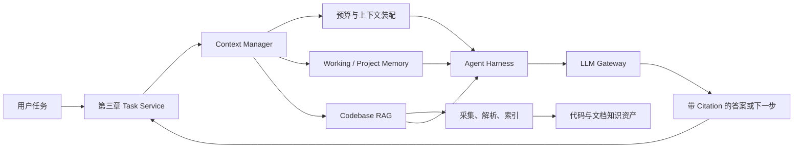

# 第四章：Context Engineering、Memory 与 Codebase RAG

> 建议课时：14 课时 
> 项目里程碑：M4 · Context Manager & Codebase RAG

## 章节定位

第三章让 `agent-platform` 能在受控状态、预算与 Sandbox 边界内完成代码任务；但一个任务能否得出可靠结论，仍取决于模型在当前回合看到了什么。将整个仓库、完整对话和所有历史记忆直接放入 Prompt，既会超出上下文与成本预算，也会让无关信息淹没真正的证据。

第四章为平台建立可治理的 Context Manager 与 Codebase RAG：先定义每次模型调用的上下文预算和来源，再把代码、文档与项目知识转为可版本化、可检索、可引用的知识资产，最后把检索结果安全地接入第三章的 Agent Loop。目标不是“搜到几段文本”，而是在正确权限和预算内，让每个结论都能回溯到具体证据。

## 前置条件

开始本章前，应已完成：

1. 第一章的 Prompt 管理、Structured Output、模型能力矩阵与调用观测；
2. 第二章的 Tool Runtime、权限、审批、审计与 MCP 接入；
3. 第三章的任务状态、Checkpoint、Sandbox、Agent Harness 与 Codebase Agent；
4. Python、SQL、Git、测试和基础信息检索概念。

## 学习目标

完成本章后，你应该能够：

1. 区分 Prompt、任务状态、Working Memory、Long-term Memory 与检索知识库的职责。
2. 为模型调用建立输入、输出与检索上下文的显式 Token 和成本预算。
3. 记录每段上下文的来源、版本、权限、时效和注入原因，避免不可解释的拼接。
4. 为代码、文档和项目资产实现可增量更新的采集、解析、切分与索引流水线。
5. 使用关键词、向量、结构信号和重排序构建 Hybrid Search，而不是只依赖单一向量检索。
6. 在检索前和返回前执行租户、仓库、分支、文档级权限过滤，避免跨边界泄露。
7. 用 Citation、Context Packing、拒答与证据覆盖规则，让回答可审计且不夸大检索结果。
8. 用离线数据集、指标和回归集评估检索质量，并把结果接入 Agent 任务的可观察链路。
9. 完成能服务 Codebase Agent 的 Context Manager & Codebase RAG，并通过 M4 验收。

## 项目主线

本章继续扩展 `agent-platform`。当用户提交代码分析、故障定位或变更任务时，任务服务将可信的租户、仓库、分支、角色与任务状态传给 Context Manager；Context Manager 在预算和策略内选择对话片段、工作记忆、项目记忆和检索证据，并把带 Citation 的上下文交给 Agent Harness。

模型只接收通过策略筛选、压缩且可追溯的上下文。检索到的片段是证据候选，不是事实保证；检索为空、证据冲突、权限不足或预算耗尽时，系统应返回可解释状态，而不是让模型补全猜测。

## 课程目录

| 课次 | 主题 | 建议课时 | 主要工程增量 |
| ---: | --- | ---: | --- |
| 1 | [建立 Context Engineering 与预算边界](./lesson-01-context-engineering-budget.md) | 1 | 上下文分类、Token 预算、预留输出与降级策略 |
| 2 | [实现上下文装配与来源追踪](./lesson-02-context-assembly-provenance.md) | 1 | Context Item、优先级、来源、版本和注入 Trace |
| 3 | [管理 Working Memory 与任务上下文](./lesson-03-working-memory-task-state.md) | 1 | 会话摘要、任务事实、失效规则与 Checkpoint 衔接 |
| 4 | [建立项目记忆与长期记忆治理](./lesson-04-project-memory-governance.md) | 1 | 记忆写入契约、范围、时效、冲突、删除与审批 |
| 5 | [构建 Codebase Ingestion 与切分流水线](./lesson-05-codebase-ingestion-chunking.md) | 2 | 仓库快照、解析、结构化 Chunk、增量索引与版本关联 |
| 6 | [实现 Hybrid Search 与权限过滤](./lesson-06-hybrid-retrieval-permission.md) | 2 | 关键词、向量、结构检索、融合排序与访问控制 |
| 7 | [实现 Rerank、Citation 与 Context Packing](./lesson-07-rerank-citation-context-packing.md) | 2 | 重排序、去重、多样性、引用绑定与提示词装配 |
| 8 | [建立检索质量评测与回归集](./lesson-08-retrieval-evaluation-regression.md) | 1 | 标注集、Recall、MRR、NDCG、覆盖率与线上观测 |
| 9 | [把 RAG 接入受控 Agent Loop](./lesson-09-rag-in-agent-loop.md) | 1 | 检索时机、查询改写、证据门槛、重规划与失败语义 |
| 10 | [完成 M4 Context & RAG 验收](./lesson-10-m4-context-rag-acceptance.md) | 2 | 端到端场景、权限隔离、索引更新、质量回归与交付 |

## 课程分组

| 阶段 | 课次 | 要解决的问题 | 阶段产物 |
| --- | --- | --- | --- |
| 上下文基础 | 1-2 | 什么信息能进入模型调用，如何控制其来源与成本 | Context Budget 与可追溯装配器 |
| 记忆治理 | 3-4 | 当前任务事实如何保留，长期记忆如何安全沉淀 | Working Memory 与项目记忆策略 |
| 知识检索 | 5-7 | 代码与文档如何被索引、检索、筛选和引用 | Codebase RAG 与 Citation Context |
| Agent 集成 | 8-10 | 如何证明检索有用，并让 Agent 正确使用证据 | 评测闭环、RAG Agent 与 M4 验收 |

## 关键设计原则

1. **上下文是受预算约束的输入，不是无限历史。** 每次调用必须为系统指令、任务状态、工具结果、检索证据和输出预留分别设上限。
2. **任务状态不是记忆。** 状态记录任务事实与执行进度；记忆是可检索、会过期、可被纠正的辅助信息。
3. **每段文本都要有来源。** 上下文片段必须能追溯到请求、任务、记忆记录或知识资产的稳定版本。
4. **先授权，后检索。** 不把无权限的内容召回后再交给模型“自行忽略”；权限必须在召回边界生效。
5. **Chunk 保留结构和版本。** 代码片段需关联仓库、提交、路径、符号、行范围和内容哈希，不能只有失去位置的文本。
6. **检索与答案分离。** Top-K 是候选证据，最终回答仍要检查覆盖、冲突、时效与引用完整性。
7. **记忆写入需要治理。** 不因模型一次总结就永久保存；写入应有主体、范围、置信度、TTL、审核与删除路径。
8. **评测驱动检索演进。** 嵌入模型、切分策略、融合权重和重排序变更都必须经过固定数据集和回归门槛。
9. **RAG 不绕过 Agent 边界。** 查询、索引、重建和记忆写入都要受第三章的预算、权限、审批、Trace 与 Checkpoint 控制。

## M4 交付内容

- 可配置、可观测的 Context Budget 与上下文装配器
- 带来源、版本、优先级和失效信息的 Context Item 协议
- Working Memory、项目记忆及其写入、查询、纠错、过期和删除流程
- 面向代码与文档的采集、解析、结构化切分、增量索引与回收机制
- 带权限过滤的 Hybrid Search、Rerank 与 Context Packing 服务
- 面向回答与 Agent 行为的 Citation、证据覆盖和拒答策略
- 可重复运行的检索评测数据集、质量指标、回归门槛和观测面板
- 与 Codebase Agent 集成的检索 Trace、失败语义与 M4 验收报告

## M4 验收标准

- 任一模型调用的上下文来源、Token 用量、裁剪原因和输出预留均可观察，且不会无上限增长。
- 任务状态、短期工作记忆与长期项目记忆在数据模型、生命周期和写入权限上明确分离。
- 索引条目可定位至正确的仓库、提交、文件、符号与行范围；代码更新后旧版本不会被静默混用。
- 跨租户、跨仓库、无分支权限或已删除文档的内容不会进入召回结果或模型上下文。
- 回答或交付摘要中的代码结论能绑定到 Citation；证据不足、冲突或检索失败时会明确说明限制。
- 检索质量指标和回归集可重复运行，切分、嵌入、融合或重排序变更不会绕过质量门槛。
- Codebase Agent 能在预算内使用 RAG 完成分析任务，并在索引延迟、空结果、权限拒绝与过期记忆场景中保持可解释行为。

## 最终产物

本章完成后，`agent-platform` 将具备面向任务的上下文管理、可治理记忆与可追溯的 Codebase RAG。第五章将在这一证据与隔离基础上引入 Multi-Agent、Subagent 与 Skill，让协作过程仍能控制上下文、权限和结果质量。
