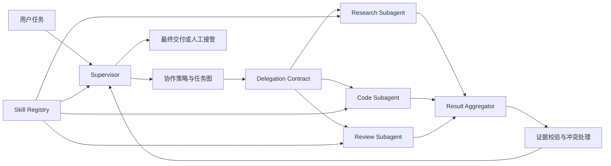

# 第五章：Multi-Agent、Subagent 与 Skill

> 建议课时：12 课时 
> 项目里程碑：M5 · Agent Collaboration

## 章节定位

第四章让 `agent-platform` 能在预算、权限和证据边界内为单个 Agent 装配可靠上下文。第五章进一步处理复杂任务的协作问题：当一个任务包含多个可并行或需要不同能力边界的子问题时，如何把它们交给 Subagent，同时保持目标、上下文、权限、预算、结果和责任归属清晰。

本章不把 Multi-Agent 当成默认架构。单 Agent、确定性 Workflow 或普通函数能完成的任务，不应仅为“智能感”增加协作者。只有当任务确实需要上下文隔离、能力专门化、并行探索或独立验证时，平台才创建 Subagent；所有委托都必须经过结构化契约、受控生命周期和可验证的结果聚合。

## 前置条件

开始本章前，应已完成：

1. 第一章的 LLM Gateway、Prompt、Structured Output 与调用观测；
2. 第二章的 Tool Runtime、权限、审批、审计与 MCP；
3. 第三章的 Agent Loop、任务状态、Checkpoint、Sandbox 与 Agent Harness；
4. 第四章的 Context Manager、Memory、Codebase RAG、Citation 与检索评测；
5. Python 异步编程、任务队列、测试与基础分布式系统概念。

## 学习目标

完成本章后，你应该能够：

1. 判断何时使用单 Agent、固定 Workflow、并行工具调用或 Multi-Agent 协作。
2. 解释 Supervisor、Worker、Reviewer、Router 与 Peer 等协作模式的适用边界。
3. 用 Task Delegation Contract 明确子任务目标、输入、产物、权限、预算和完成标准。
4. 为 Subagent 建立上下文隔离、最小能力授权和不可向下扩大的安全边界。
5. 管理 Subagent 的创建、运行、暂停、取消、超时、恢复和重复投递。
6. 在依赖约束与全局预算内执行并行委托，并避免失控的递归派生。
7. 聚合带证据的子任务结果，识别缺失、冲突、重复与无法验证的结论。
8. 定义、注册、版本化和安全加载可复用 Skill，使能力沉淀为显式工程资产。
9. 解释 MCP 与 A2A 的职责差异，以及跨 Agent 委托所需的能力发现、任务状态和身份边界。
10. 使用同一任务集比较单 Agent 与 Multi-Agent 的效果、成本和延迟。
11. 通过协作工作台与端到端验收，证明协作过程可观察、可恢复、可审计。

## 项目主线

本章继续扩展 `agent-platform`，完成一个受控的 Agent Collaboration Runtime。用户任务先进入 Supervisor；Supervisor 根据任务类型和协作策略决定直接执行、进入固定 Workflow，或创建有限数量的 Subagent。每个 Subagent 只接收完成当前子任务所需的上下文、工具和预算，并通过结构化结果协议返回结论、证据、产物和未解决问题。

Supervisor 负责协作控制，不是拥有无限权限的“总模型”。它必须遵守第三章的任务状态和预算边界、第四章的上下文与证据规则，以及第二章的工具权限与审批策略。Subagent 返回“完成”只代表提交了结果，只有聚合与验证通过后，父任务才能接受该结果。

## 课程目录

| 课次 | 主题 | 建议课时 | 主要工程增量 |
| ---: | --- | ---: | --- |
| 1 | [判断何时使用 Multi-Agent](./lesson-01-multi-agent-decision-boundaries.md) | 1 | 单 Agent、Workflow、并行调用与协作系统的选择矩阵 |
| 2 | [设计 Supervisor 与协作模式](./lesson-02-supervisor-collaboration-patterns.md) | 1 | Supervisor、Worker、Reviewer、Router 与任务图边界 |
| 3 | [定义 Task Delegation Contract](./lesson-03-task-delegation-contract.md) | 1 | 目标、输入、产物、证据、预算、权限与失败契约 |
| 4 | [实现 Subagent 上下文与能力隔离](./lesson-04-subagent-context-capability-isolation.md) | 1 | 最小上下文、工具白名单、权限收窄与身份派生 |
| 5 | [管理 Subagent 生命周期与恢复](./lesson-05-subagent-lifecycle-recovery.md) | 1 | 创建、租约、暂停、取消、超时、Checkpoint 与幂等 |
| 6 | [实现并行委托与受控调度](./lesson-06-parallel-delegation-scheduling.md) | 1 | 任务依赖、并发上限、全局预算、背压与递归限制 |
| 7 | [聚合子任务结果与证据](./lesson-07-result-evidence-aggregation.md) | 1 | Result Contract、合并、去重、排序、Citation 与接受规则 |
| 8 | [处理冲突、部分成功与写入隔离](./lesson-08-conflict-partial-success-isolation.md) | 1 | 冲突仲裁、不完整结果、并行写操作与人工升级 |
| 9 | [定义 Skill 契约与注册中心](./lesson-09-skill-contract-registry.md) | 1 | 输入输出、依赖、Prompt、质量标准、权限与 Registry |
| 10 | [实现 Skill 匹配、执行与生命周期](./lesson-10-skill-matching-lifecycle.md) | 1 | 发现、匹配、组合、执行、评估、版本兼容与下线 |
| 11 | [理解 A2A 协作与互操作边界](./lesson-11-a2a-interoperability-boundaries.md) | 1 | MCP 对比、Agent Card、任务生命周期、身份与结果回传 |
| 12 | [完成 M5 Agent Collaboration 验收](./lesson-12-m5-agent-collaboration-acceptance.md) | 1 | 协作工作台、单 Agent 对照、故障演练与里程碑交付 |

## 课程分组

| 阶段 | 课次 | 要解决的问题 | 阶段产物 |
| --- | --- | --- | --- |
| 协作决策 | 1-2 | 何时需要多个 Agent，应选择哪种协作拓扑 | 协作选择矩阵与 Supervisor 骨架 |
| 委托运行时 | 3-6 | 子任务如何表达、隔离、调度和恢复 | Delegation Contract 与 Subagent Runtime |
| 结果治理 | 7-8 | 如何接受可信结果并处理冲突与部分成功 | Result Aggregator 与冲突仲裁流程 |
| Skill 与互操作 | 9-11 | 能力如何沉淀复用，跨 Agent 协作边界是什么 | Skill 系统与 A2A 边界说明 |
| 运营与验收 | 12 | 如何用同一任务集证明协作确实产生价值 | 协作工作台与 M5 验收报告 |

## 关键设计原则

1. **Multi-Agent 是有成本的架构选择。** 只有上下文隔离、能力专门化、并行探索或独立验证带来的收益大于协调成本时才拆分。
2. **委托必须是结构化契约。** 不把一段模糊自然语言直接当作完整子任务；目标、输入、约束、产物和接受标准必须显式记录。
3. **权限只能收窄，不能放大。** Subagent 的工具、数据和环境权限必须是父任务权限的子集，任务文本不能自行声明更高权限。
4. **上下文按需派生。** 子任务只接收必要事实、证据与记忆，不默认继承完整对话、全部 Prompt 或其他 Subagent 的私有上下文。
5. **全局预算由父任务控制。** Subagent 的步数、Token、成本、工具次数、并发和派生深度都从父任务预算中分配。
6. **并行不等于无序。** 任务图应明确依赖、取消传播、失败策略和结果提交边界，避免重复工作与竞态覆盖。
7. **结果需要验证后接受。** 子任务状态、模型自述和实际产物分离；证据、测试和 Citation 不完整时不能静默合并。
8. **冲突是正常状态。** 多个 Agent 结论不一致时保留各自证据，使用确定性规则、Reviewer 或人工决策解决，而不是让 Supervisor 随机选择。
9. **Skill 是受治理的能力包。** Skill 需要稳定身份、版本、依赖、权限声明、输入输出契约、测试与来源，不只是可复制的 Prompt。
10. **协作链必须可追踪。** 父子任务、模型回合、工具调用、Skill 版本、预算消耗、审批和产物都应关联到同一 Trace。

## M5 交付内容

- 单 Agent、Workflow 与 Multi-Agent 的选择策略和协作模式配置
- Supervisor、至少两个 Specialist Subagent、任务图与有限派生深度的协作控制器
- 结构化 Task Delegation Contract 与 Result Contract
- Subagent 上下文隔离、能力收窄、预算分配和身份派生机制
- 支持取消、超时、重试、租约、Checkpoint 和幂等的 Subagent Runtime
- 带依赖、并发、背压和失败传播规则的受控调度器
- 带证据、Citation、冲突、缺失和接受状态的 Result Aggregator
- 支持注册、发现、匹配、执行、评估、版本兼容、下线和安全加载的 Skill 系统
- MCP 与 A2A 职责、Agent Card、任务生命周期和委托身份的边界说明
- 协作任务图、Timeline、预算视图、人工接管入口与完整 Trace
- 覆盖正常协作、冲突、超时、越权、递归派生和恢复的 M5 验收报告

## M5 验收标准

- 平台能解释为什么选择单 Agent、Workflow 或 Multi-Agent，简单任务不会无条件派生 Subagent。
- 单 Agent 与 Multi-Agent 使用同一任务集完成成功率、成本和延迟对比，协作收益能够量化说明。
- 每次委托都包含目标、输入、范围、完成标准、预算、权限和关联父任务，且可持久化与回放。
- Subagent 无法读取未委托的上下文、调用未授权工具、提升身份权限或突破 Sandbox 边界。
- 父任务总预算、并发数和派生深度可限制；取消、超时和预算耗尽能正确传播到子任务。
- 进程重启或消息重复投递不会重复接受同一结果，也不会重复执行已确认的高风险副作用。
- 聚合结果能够区分已验证结论、候选结论、冲突、缺失和失败，并保留各自证据来源。
- 部分子任务失败时仍能输出可解释的部分结果，并明确缺失范围、失败原因和后续处理方式。
- 并行写操作发生资源冲突时不会静默覆盖，必须进入隔离、合并、仲裁或人工处理流程。
- Skill 的版本、依赖、权限声明和测试结果可追溯；不可信 Skill 不能绕过 Runtime 与审批策略。
- 协作工作台可关联父子任务、模型回合、工具调用、预算、审批、Skill 版本和最终产物。

## 范围边界

A2A 的业务价值、MCP 与 A2A 的职责差异、Agent Card、任务生命周期、委托身份和结果回传属于核心理解内容。跨框架协议实现、跨组织 Agent 市场、开放网络中的动态信任协商和大规模分布式 Agent 集群属于进阶专题，不作为本章结业前置条件。

## 最终产物

本章完成后，`agent-platform` 将从单 Agent 任务平台演进为具备安全委托、受控并行、证据聚合和 Skill 复用能力的协作系统。第六章会为这些单 Agent 与多 Agent 行为建立系统化 Eval，使模型、Prompt、工具、检索、Skill 和协作策略的变更都能被量化验证。
